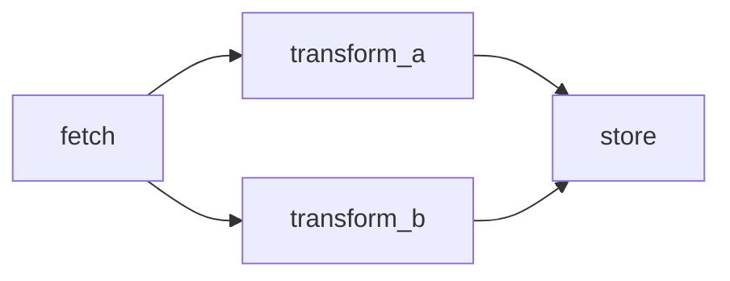

<a href="https://graflow.ai"></a>

# Graflow

**Stop wrestling graph composition. Start writing Pythonic agent pipelines. Compose tasks with `>>` and `|`.**

Graflow is a Python-based agent orchestration framework with a **workflow-first, defined-by-run** approach focused on simplicity and developer experience. Compose tasks — from ETL jobs to multi-agent LLM pipelines — using plain Python functions and two intuitive operators.

[](https://graflow.ai/)
[](https://opensource.org/licenses/Apache-2.0)
[](https://www.python.org/downloads/)
[](https://pypi.org/project/graflow/)
[](https://github.com/GraflowAI/graflow/actions)
[](https://github.com/GraflowAI/graflow-examples/blob/main/notebooks/hands_on_guide.ipynb)
<a href="https://x.com/GraflowAI"></a>

---

## Why Graflow?

Most agent frameworks make you think in **framework concepts** — state machines, conditional edges, graph builders, node factories. Graflow lets you think in **Python**. Define tasks, connect them with `>>` and `|`, and run.

```bash
uv add graflow   # or: pip install graflow
```

```python
from graflow import task, workflow

@task
def fetch():
    return {"users": 1200}

@task
def validate(users: int):        # auto-resolved from upstream channel
    assert users > 0
    return users

@task
def notify(users: int):
    print(f"Pipeline done: {users} users processed")

with workflow("my_pipeline") as ctx:
    fetch >> validate >> notify   # that's it
    ctx.execute("fetch")
```

3 decorators, 1 operator, zero boilerplate.

**Try hands-on in the browser** — no install required: [](https://colab.research.google.com/github/GraflowAI/graflow-examples/blob/main/notebooks/hands_on_guide.ipynb)

## Before / After

Tired of writing `add_conditional_edges`, builder patterns, and explicit state objects? Here's the same agent loop in LangGraph vs. Graflow.

> **Define-and-compile vs. define-by-run.** LangGraph makes you *declare* every edge and conditional transition **before** execution — the graph is frozen at `compile()` time, and all possible routes must be known upfront. Graflow is **define-by-run** (the same paradigm PyTorch uses vs. TensorFlow 1.x): the graph shape is whatever the Python code does at runtime. Control flow is just `if`/`return`/`context.next_task()` — no separate routing DSL, no `END` sentinels, no conditional-edge registry. You debug workflows with `pdb`, not with a graph inspector.

<table>
<tr><th>LangGraph (conditional routing)</th><th>Graflow</th></tr>
<tr>
<td>

```python
from langgraph.graph import StateGraph, END

builder = StateGraph(State)
builder.add_node("agent", agent_node)
builder.add_node("tool", tool_node)
builder.add_conditional_edges(
    "agent",
    should_continue,
    {"continue": "tool", "end": END},
)
builder.add_edge("tool", "agent")
builder.set_entry_point("agent")
graph = builder.compile()
result = graph.invoke({"input": "hello"})
```

</td>
<td>

```python
from graflow import task, workflow

with workflow("agent_loop") as ctx:
    @task(inject_context=True)
    def agent(context):
        out = call_llm(context.get_channel().get("input"))
        if not should_continue(out):
            context.terminate_workflow("done")
        return out

    @task
    def tool(out: str):
        return run_tool(out)

    agent >> tool >> agent      # loop
    ctx.execute("agent")
```

</td>
</tr>
</table>

## Key Features

| Feature | What it does |
|---|---|
| **`>>` and `\|` operators** | Chain tasks sequentially or run them in parallel — no graph builder API |
| **Auto data flow** | Task parameters are automatically resolved from upstream channels |
| **Fan-out / Fan-in** | `fetch >> (transform_a \| transform_b) >> store` — diamond patterns in one line |
| **Dynamic tasks** | Add tasks at runtime via `ctx.next_task()` / `ctx.next_iteration()` — true defined-by-run |
| **Distributed execution** | Swap to Redis-backed queues with one config change; add workers with `python -m graflow.worker.main` |
| **Checkpoint & resume** | Pause long-running workflows, resume from exact state |
| **Human-in-the-loop** | Approvals, text input, selections mid-workflow — with Slack/webhook notifications |
| **LLM agents** | Plug in LiteLLM, Pydantic AI, or Google ADK agents and inject them into tasks |
| **Tracing** | Langfuse integration for observability across distributed workflows |

## Workflow Patterns

```
Linear pipeline:   a >> b >> c >> d
Fan-out:           source >> (proc_a | proc_b | proc_c)
Fan-in:            (input_a | input_b) >> aggregate
Diamond:           fetch >> (transform_a | transform_b) >> store
Multi-stage:       (load_a | load_b) >> validate >> (proc_a | proc_b) >> store
```

A diamond workflow visualized:



## Real-World Snippets

### ETL Pipeline

```python
with workflow("etl") as ctx:
    @task
    def extract():
        return db.query("SELECT * FROM raw_events")

    @task
    def validate(events: list):
        return [e for e in events if e["timestamp"]]

    @task
    def load(events: list):
        warehouse.bulk_insert(events)

    extract >> validate >> load
    ctx.execute("extract")
```

### Parallel Enrichment

```python
with workflow("enrich") as ctx:
    fetch_data >> (enrich_demographics | enrich_geo | enrich_behavioral) >> merge_and_store
    ctx.execute("fetch_data")
```

### Multi-Agent LLM Workflow

Register LLM agents once, then inject them directly into tasks with `inject_llm_agent="<name>"` — no manual lookup, no boilerplate.

```python
from graflow import task, workflow
from graflow.llm.agents.base import LLMAgent

with workflow("research") as ctx:
    # Register agents once; factories receive the ExecutionContext
    ctx.register_llm_agent("researcher", lambda _: build_researcher_agent())
    ctx.register_llm_agent("analyst",    lambda _: build_analyst_agent())

    @task(inject_llm_agent="researcher")
    def research(agent: LLMAgent):
        return agent.run("Summarize recent ML papers")["output"]

    @task(inject_llm_agent="analyst")
    def analyze(agent: LLMAgent, research: str):   # `research` auto-resolved from channel
        return agent.run(f"Analyze: {research}")["output"]

    @task
    def publish(analyze: str):
        send_report(analyze)

    research >> analyze >> publish
    ctx.execute("research")
```

### Dynamic Workflows: `next_task` and `next_iteration`

Graflow is **defined-by-run** — tasks can spawn new tasks or loop themselves based on runtime data.

**`next_task`** — conditionally add a downstream task at runtime:

```python
from graflow import task, workflow
from graflow.core.task import TaskWrapper

with workflow("router") as ctx:
    @task(id="classify", inject_context=True)
    def classify(context, value: int = 150):
        if value > 100:
            context.next_task(TaskWrapper("high", lambda: print(f"high-value: {value * 2}")))
        else:
            context.next_task(TaskWrapper("low",  lambda: print(f"low-value: {value + 10}")))

    ctx.execute("classify")
```

**`next_task(..., goto=True)`** — branch to a task and **skip** the statically-declared successors:

```python
with workflow("pipeline") as ctx:
    @task(id="validate", inject_context=True)
    def validate(context, record: dict):
        if not record.get("ok"):
            # Jump to error handler and SKIP process/publish below
            context.next_task(error_handler, goto=True)
            return
        # Fall through: process >> publish will run normally

    @task
    def process(): ...

    @task
    def publish(): ...

    @task
    def error_handler():
        print("recovery path")

    validate >> process >> publish
    ctx.execute("validate", value={"ok": False})
```

Semantics at a glance:

| Call                               | New task? | Runs static successors? |
|------------------------------------|-----------|-------------------------|
| `next_task(new_task)`              | creates   | ✅ yes (normal fan-out)  |
| `next_task(existing_task)`         | —         | ❌ no (auto-goto)        |
| `next_task(task, goto=True)`       | either    | ❌ no (explicit goto)    |

Use `goto=True` for **error recovery**, **early exits**, or **replacing the rest of the pipeline** with a different branch — it's the Graflow equivalent of a conditional edge pointing at `END` and then jumping elsewhere, in one line.

**`next_iteration`** — loop the current task with new data until a convergence condition:

```python
with workflow("optimize") as ctx:
    @task(id="optimizer", inject_context=True, max_cycles=20)
    def optimize(context, data=None):
        params = data or {"iteration": 0, "accuracy": 0.5}
        params = {"iteration": params["iteration"] + 1,
                  "accuracy": min(params["accuracy"] + 0.15, 0.95)}
        print(f"Iter {params['iteration']}: accuracy={params['accuracy']:.2f}")

        if params["accuracy"] >= 0.9:
            return params            # converged → workflow ends
        context.next_iteration(params)  # loop with new data

    ctx.execute("optimizer")
```

Use `next_task` for **branching**, `next_iteration` for **cycles** — both respect checkpointing, retries, and tracing.

## Run Tasks in Docker

Need environment isolation, pinned Python versions, or GPU runtimes? Tag a task with `handler="<name>"` and register a `DockerTaskHandler` bound to that name — the same workflow code now runs each task inside a container.

Each handler is bound to **one image**, so pick a container per task by registering multiple handlers under distinct names:

```python
from graflow import task, workflow
from graflow.core.context import ExecutionContext
from graflow.core.engine import WorkflowEngine
from graflow.core.handlers.docker import DockerTaskHandler

with workflow("docker_pipeline") as wf:
    @task
    def local_step():
        return "ran on host"

    @task(handler="py311")                 # -> python:3.11-slim
    def etl_step():
        import sys
        return f"etl on python {sys.version_info[:2]}"

    @task(handler="pytorch_gpu")           # -> pytorch/pytorch:latest
    def train_step():
        import torch
        return f"cuda available: {torch.cuda.is_available()}"

    local_step >> etl_step >> train_step

    engine = WorkflowEngine()
    # Register one handler per image; task's `handler=` picks which one
    engine.register_handler("py311",       DockerTaskHandler(image="python:3.11-slim"))
    engine.register_handler("pytorch_gpu", DockerTaskHandler(image="pytorch/pytorch:latest"))
    engine.execute(ExecutionContext.create(wf.graph))
```

Mix and match freely: CPU vs. GPU, Python 3.10 vs. 3.12, custom-built images with pre-installed dependencies — it's all just "register a handler, tag the task."

> 💡 **Custom handlers.** `docker` is just one built-in handler. You can implement your own `TaskHandler` for Kubernetes Jobs, AWS Lambda, Modal, Ray, SSH-to-remote-host, or any other execution backend — same workflow code, custom runtime. See the [Task Handlers guide](https://graflow.ai/docs/tutorial/advanced/task-handlers) for the handler interface and full examples.

## Scale to Distributed

The same workflow code runs locally or across a Redis-backed worker pool — just change the backend.

```python
from graflow.core.context import create_execution_context
from graflow.queue.factory import QueueBackend

context = create_execution_context(
    queue_backend=QueueBackend.REDIS,
    channel_backend="redis",
)
```

```bash
# Start workers in separate terminals
python -m graflow.worker.main --worker-id worker-1
python -m graflow.worker.main --worker-id worker-2
```

## Documentation

- [Product Documentation](https://graflow.ai) — Guides, API reference, architecture
- [Examples](./examples/) — Production-ready examples organized by complexity
- [CHANGELOG](./CHANGELOG.md)

<a href="https://www.youtube.com/watch?v=OkJlpmdCCAg"></a>

## Contributing

Contributions are welcome — see [CONTRIBUTING.md](./CONTRIBUTING.md) for setup, development workflow, and PR guidelines.

**Ways to contribute:**

- 🐛 **Report bugs** or request features via [GitHub Issues](https://github.com/GraflowAI/graflow/issues)
- 🔌 **Add a new backend** (queue / channel / handler) — follow the factory pattern in `graflow/queue/` and `graflow/channels/`
- 📚 **Contribute an example** to `examples/` — especially real-world agent/LLM workflows
- 📖 **Improve the docs** at [graflow.ai](https://github.com/GraflowAI/graflow-site)
- 💬 **Discuss** on [r/GraflowAI](https://github.com/GraflowAI/graflow/discussions)

## License

This project is licensed under the Apache License 2.0 — see the [LICENSE](./LICENSE) file for details.
