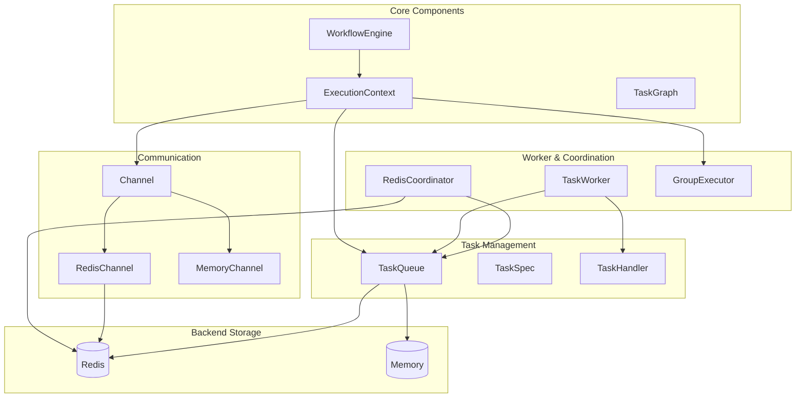
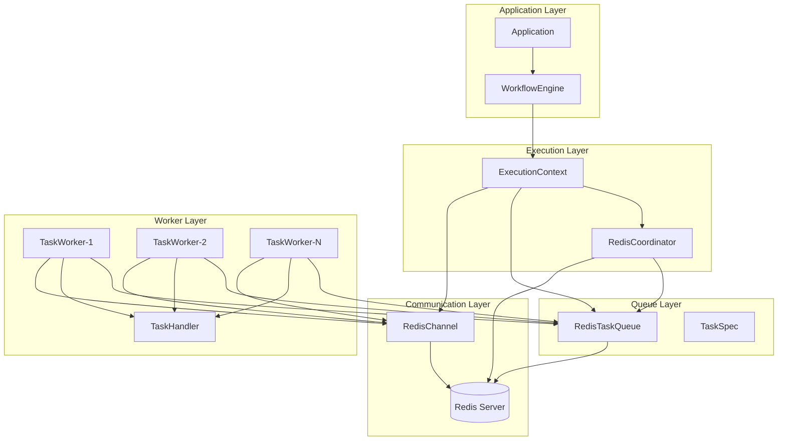
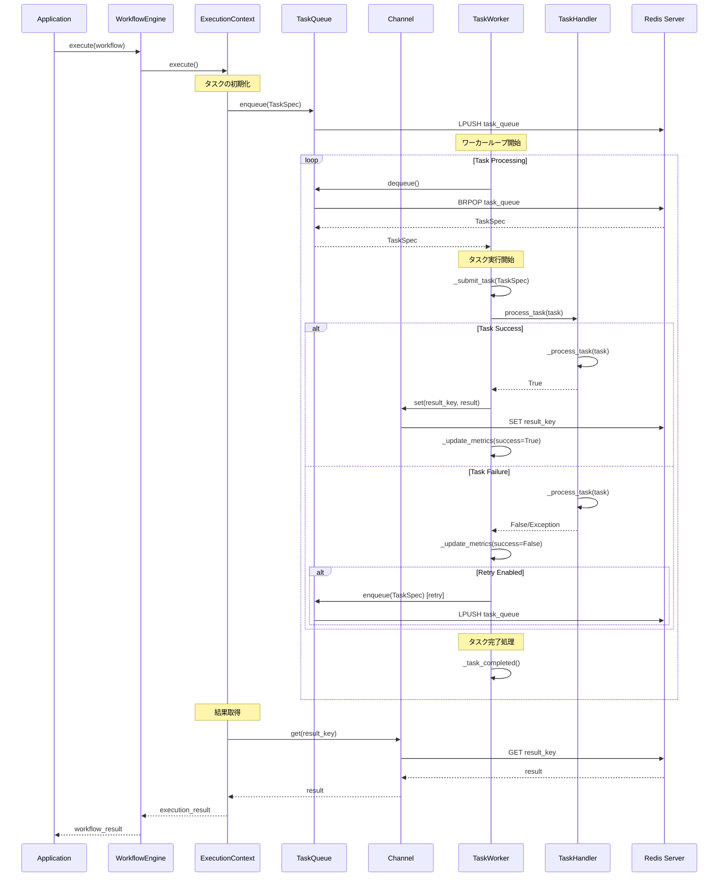
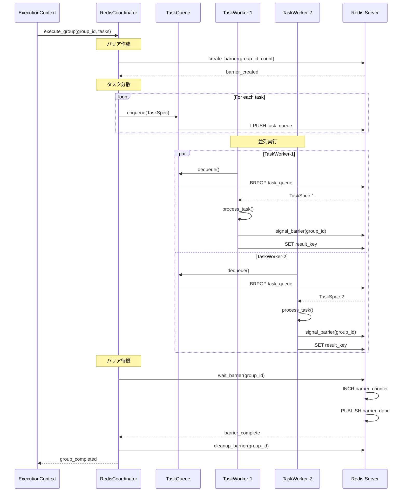
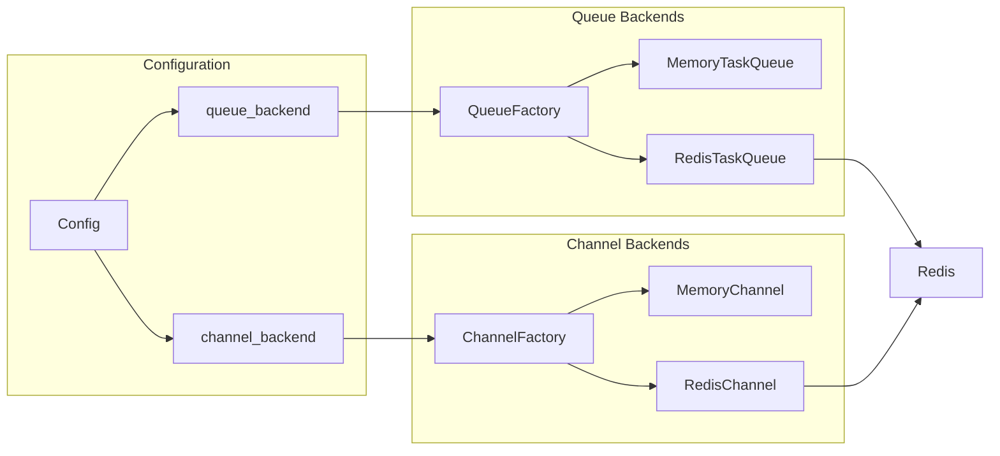
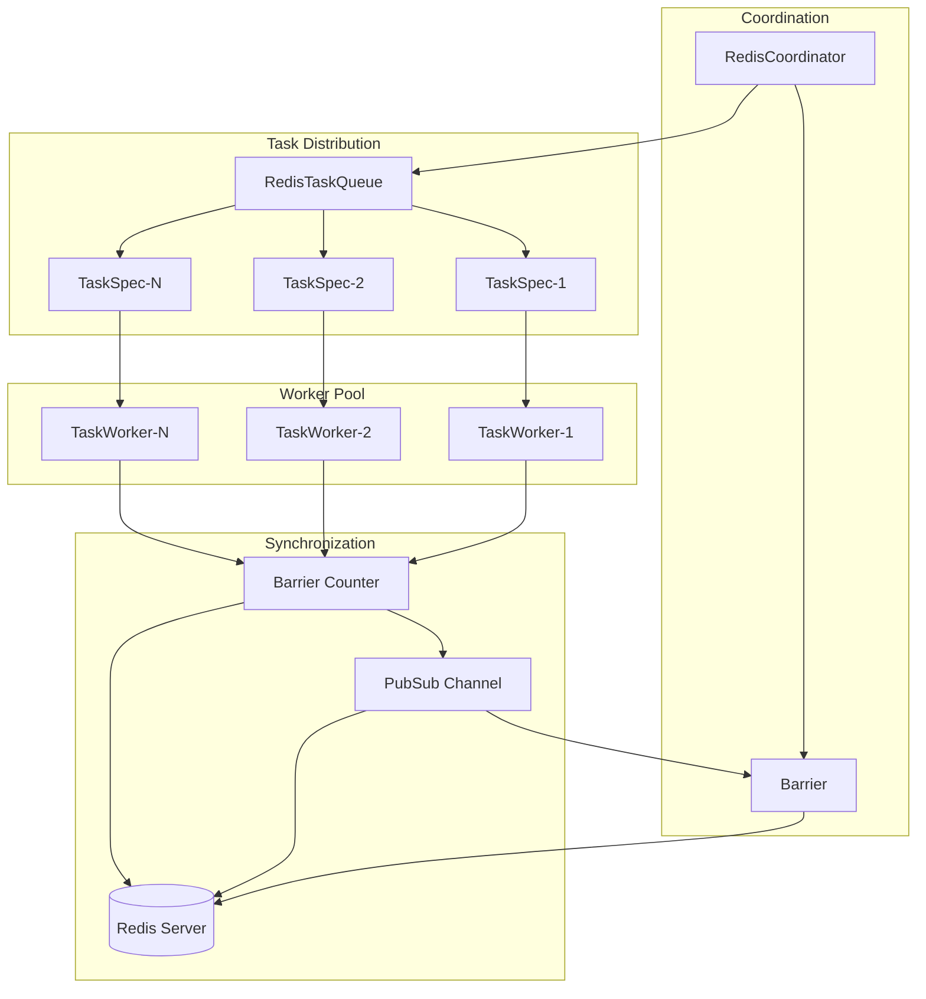
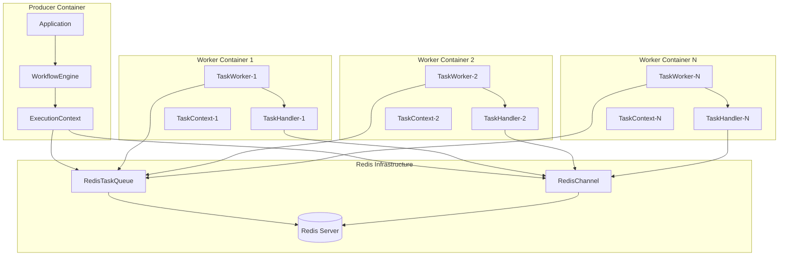
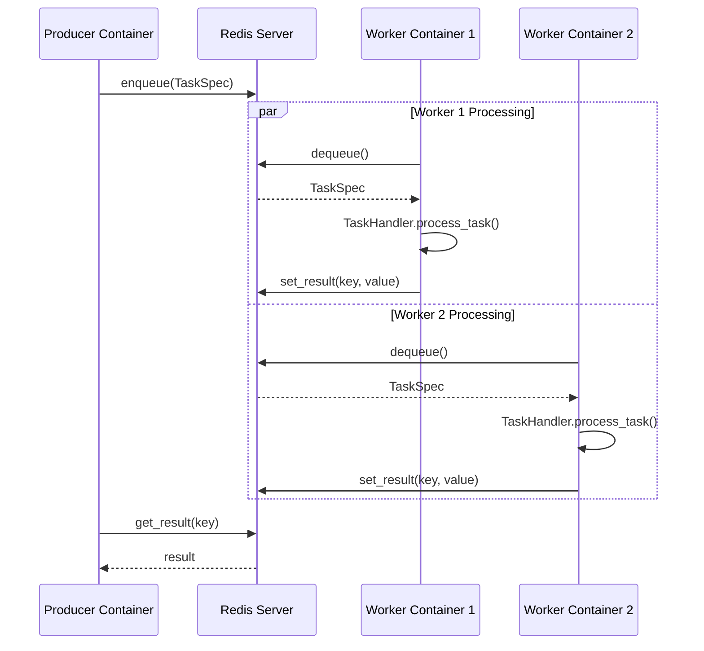
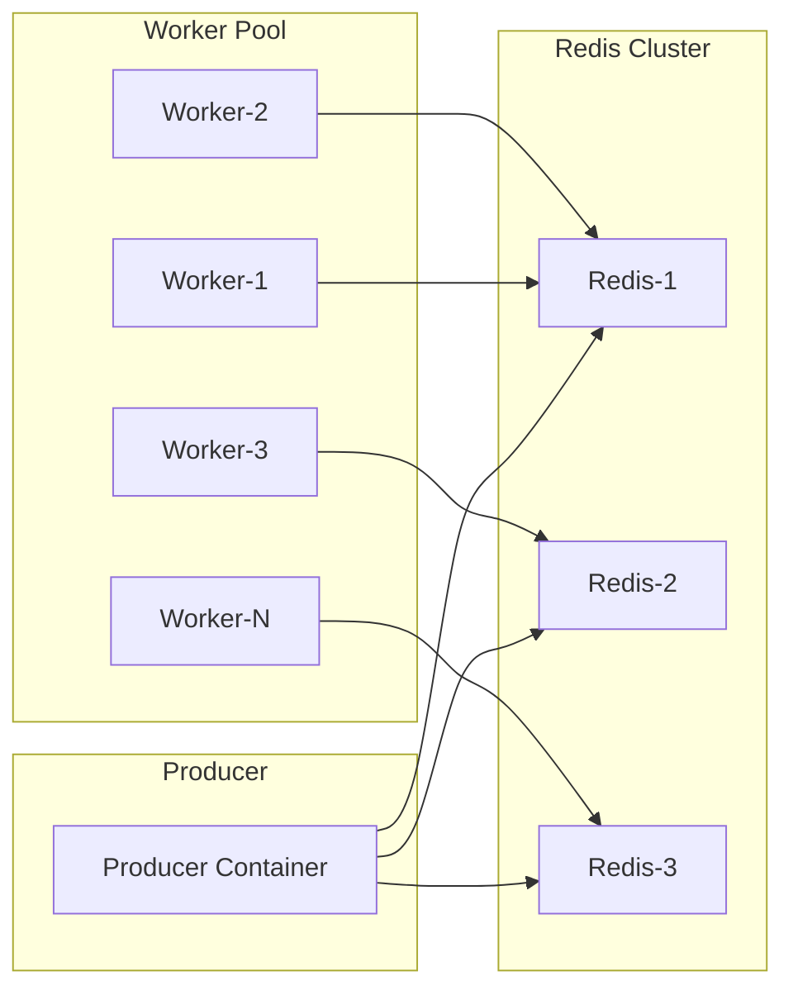

# Graflow Architecture

Graflowは分散タスク実行とワークフロー管理のためのPythonフレームワークです。この文書では、主要コンポーネントとそれらの関係について説明します。

## 全体アーキテクチャ



## コンポーネント詳細

### ExecutionContext
ワークフロー実行の中心的なオーケストレーター

- **役割**: タスクの実行状態管理、キューイング、結果保存
- **主要機能**:
  - TaskQueueとChannelの管理
  - タスクの実行コンテキスト管理
  - サイクル制御とリトライ処理
  - 動的タスク生成とgoto機能

### TaskQueue
タスクのキューイング管理の抽象基底クラス

- **実装**: 
  - `MemoryTaskQueue`: インメモリ実装
  - `RedisTaskQueue`: Redis分散実装
- **機能**:
  - TaskSpecの enqueue/dequeue
  - メトリクス収集
  - リトライ処理

### Channel
タスク間通信の抽象基底クラス

- **実装**:
  - `MemoryChannel`: インメモリ実装
  - `RedisChannel`: Redis分散実装
- **機能**:
  - キー・バリューストア
  - TTL対応
  - タスク結果の保存・取得

### TaskWorker
キューからタスクを取得して実行するワーカー

- **機能**:
  - 並行タスク処理
  - メトリクス収集
  - グレースフルシャットダウン
  - タイムアウト処理

### RedisCoordinator
Redis基盤の分散タスク調整

- **機能**:
  - 並列グループ実行
  - バリア同期
  - タスクディスパッチ

## Redis分散アーキテクチャ



## データフロー

### 基本タスク実行フロー



### 並列グループ実行フロー



## バックエンド設定



## 並列グループ実行



## 主要な設計パターン

### 1. ファクトリーパターン
- `TaskQueueFactory`: バックエンドに応じたTaskQueue実装を生成
- `ChannelFactory`: バックエンドに応じたChannel実装を生成

### 2. 抽象基底クラスパターン
- `TaskQueue`: キューの抽象インターface
- `Channel`: チャネルの抽象インターface

### 3. ワーカープールパターン
- `TaskWorker`: 複数タスクの並行処理
- スレッドプールによる並行実行

### 4. オブザーバーパターン
- Redis PubSubによるイベント通知
- バリア同期での完了通知

## スケーラビリティ

### 水平スケーリング
- 複数TaskWorkerによる分散処理
- Redisを介したタスク分散
- ステートレスワーカー設計

### 垂直スケーリング
- TaskWorker内での並行タスク処理
- 設定可能な同時実行数
- スレッドプールによるリソース管理

## 設定例

### インメモリ設定
```python
context = ExecutionContext.create(
    graph=task_graph,
    start_node="start",
    queue_backend=QueueBackend.IN_MEMORY,
    channel_backend="memory"
)
```

### Redis分散設定
```python
redis_config = {
    "host": "localhost",
    "port": 6379,
    "db": 0
}

context = ExecutionContext.create(
    graph=task_graph,
    start_node="start", 
    queue_backend=QueueBackend.REDIS,
    channel_backend="redis",
    config=redis_config
)
```

## エラー処理と信頼性

### リトライメカニズム
- TaskSpecレベルでのリトライ制御
- 設定可能なリトライ回数
- 指数バックオフ対応

### メトリクス収集
- タスク処理統計
- 実行時間測定
- 成功率監視

### グレースフルシャットダウン
- シグナルハンドリング
- アクティブタスクの完了待機
- リソースクリーンアップ

## コンテナ化アーキテクチャ

TaskHandlerとTaskWorkerをコンテナ化することで、分散処理とスケーラビリティを実現できます。

### コンテナ化設計



### コンテナ間通信フロー



### コンテナ設定例

#### Docker Compose設定

```yaml
version: '3.8'

services:
  redis:
    image: redis:7-alpine
    ports:
      - "6379:6379"
    command: redis-server --appendonly yes
    volumes:
      - redis_data:/data

  producer:
    build: .
    environment:
      - REDIS_HOST=redis
      - REDIS_PORT=6379
      - GRAFLOW_MODE=producer
    depends_on:
      - redis
    volumes:
      - ./workflows:/app/workflows

  worker:
    build: .
    environment:
      - REDIS_HOST=redis
      - REDIS_PORT=6379
      - GRAFLOW_MODE=worker
      - WORKER_ID=${WORKER_ID:-worker-1}
      - MAX_CONCURRENT_TASKS=4
    depends_on:
      - redis
    scale: 3  # 3つのワーカーコンテナを起動

volumes:
  redis_data:
```

#### ワーカーコンテナエントリーポイント

```python
# worker_main.py
import os
import redis
from graflow.worker.worker import TaskWorker
from graflow.worker.handler import InProcessTaskExecutor
from graflow.queue.redis import RedisTaskQueue
from graflow.core.context import ExecutionContext

def create_worker_from_env():
    """環境変数からワーカー設定を生成"""
    redis_host = os.getenv('REDIS_HOST', 'localhost')
    redis_port = int(os.getenv('REDIS_PORT', '6379'))
    worker_id = os.getenv('WORKER_ID', 'worker-1')
    max_concurrent = int(os.getenv('MAX_CONCURRENT_TASKS', '4'))
    
    # Redis接続
    redis_client = redis.Redis(
        host=redis_host, 
        port=redis_port, 
        decode_responses=True
    )
    
    # ダミーExecutionContext（ワーカー専用）
    from graflow.core.graph import TaskGraph
    dummy_graph = TaskGraph()
    context = ExecutionContext.create(
        graph=dummy_graph,
        start_node="dummy",
        queue_backend="redis",
        channel_backend="redis",
        config={"redis_client": redis_client}
    )
    
    # TaskQueue作成
    task_queue = RedisTaskQueue(context, redis_client=redis_client)
    
    # TaskHandler作成
    handler = InProcessTaskExecutor()
    
    # ワーカー作成
    worker = TaskWorker(
        queue=task_queue,
        handler=handler,
        worker_id=worker_id,
        max_concurrent_tasks=max_concurrent
    )
    
    return worker

if __name__ == "__main__":
    worker = create_worker_from_env()
    try:
        worker.start()
        # Keep running until signal
        while worker.is_running:
            time.sleep(1)
    except KeyboardInterrupt:
        worker.stop()
```

### カスタムTaskHandlerの実装

コンテナ化では、特定のタスクタイプに特化したTaskHandlerを実装できます：

```python
class ContainerizedTaskHandler(TaskHandler):
    """コンテナ環境用のタスクハンドラー"""
    
    def __init__(self, task_registry: Dict[str, Callable]):
        self.task_registry = task_registry
        
    def _process_task(self, task: Any) -> bool:
        task_type = getattr(task, 'task_type', None)
        if task_type and task_type in self.task_registry:
            func = self.task_registry[task_type]
            try:
                result = func(task)
                return True
            except Exception as e:
                logger.error(f"Task {task.task_id} failed: {e}")
                return False
        else:
            # デフォルト処理
            return task() if callable(task) else False
```

### スケーリング戦略



この設計により、Graflowは単一プロセスでの実行から大規模分散環境まで柔軟にスケールできる実行基盤を提供します。