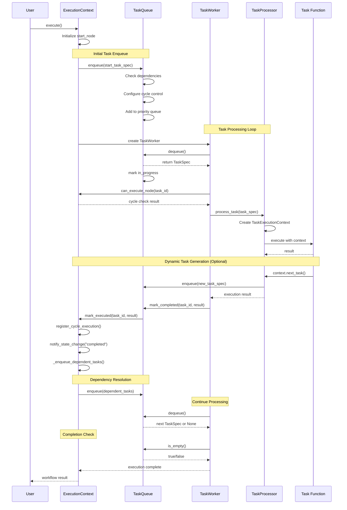
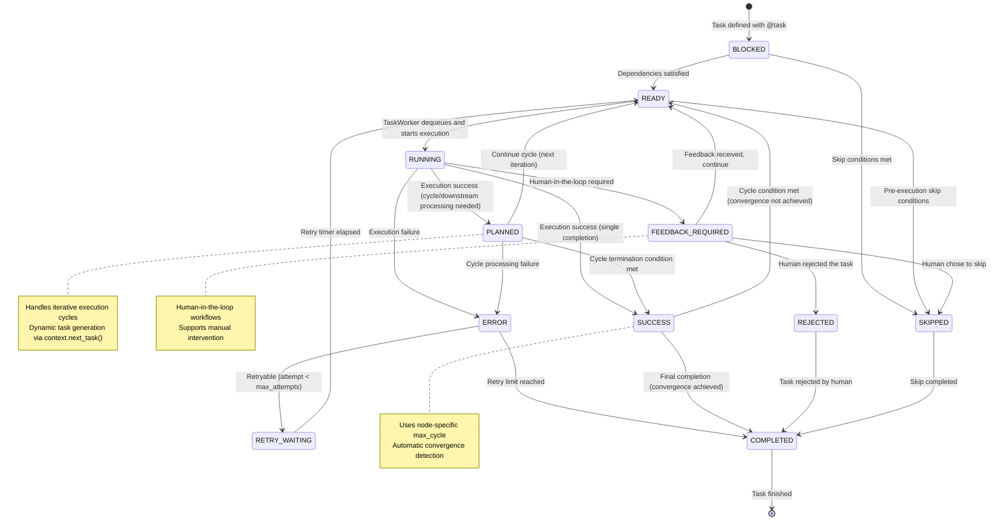

# Graflow 実用的開発計画書 (改訂版)

## 概要

既存の実装とアーキテクチャ設計を基に、実用的で段階的な開発計画を策定しました。現在の基盤コードを活用し、循環グラフ対応ワークフローエンジンの実現を目指します。

## 現状分析

### 既存実装の強み
- **基本アーキテクチャ**: Executable抽象化、Task/ParallelGroup実装が完成
- **グラフ基盤**: NetworkX統合、WorkflowContext、ExecutionContext実装済み
- **演算子記法**: `>>` (パイプライン)、`|` (並列)演算子実装済み
- **デコレータシステム**: @task デコレータによる関数のタスク化機能

### 実装が必要な主要機能
1. **循環制御メカニズム** - 現在未実装
2. **TaskQueue/スケジューリング** - 現在未実装
3. **Channel/データ受け渡し** - 現在未実装
4. **動的タスク生成** - 部分実装
5. **監視・API機能** - 現在未実装

## 段階別開発計画

### Phase 1: 基盤強化 (2週間)

#### 1.1 TaskStatus Enum and State Management (from backup plan)
```python
# graflow/core/task_status.py
from enum import Enum
from dataclasses import dataclass, field
from typing import Optional, Any, Dict
from datetime import datetime

class TaskStatus(Enum):
    """Enhanced TaskStatus supporting cyclic workflows and HITL."""
    BLOCKED = "blocked"           # Waiting for dependencies
    READY = "ready"              # Ready for execution
    RUNNING = "running"          # Currently executing
    PLANNED = "planned"          # Completed, awaiting downstream processing
    FEEDBACK_REQUIRED = "feedback_required"   # HITL: Feedback needed
    REJECTED = "rejected"        # HITL: Rejected by human
    SUCCESS = "success"          # Successfully completed
    ERROR = "error"              # Execution error
    RETRY_WAITING = "retry_waiting"  # Waiting for retry
    SKIPPED = "skipped"          # Skipped execution
    COMPLETED = "completed"      # Final completion (no re-execution)

@dataclass
class TaskState:
    """Channel-based task state management."""
    task_id: str
    status: TaskStatus
    result: Any = None
    error: Optional[Exception] = None
    retry_count: int = 0
    version: int = 1
    cycle_count: int = 0
    updated_at: datetime = field(default_factory=datetime.now)
    
    def to_channel_value(self) -> Dict[str, Any]:
        """Convert to dictionary for channel storage."""
        return {
            "task_id": self.task_id,
            "status": self.status.value,
            "result": self.result,
            "error": str(self.error) if self.error else None,
            "retry_count": self.retry_count,
            "version": self.version,
            "cycle_count": self.cycle_count,
            "updated_at": self.updated_at.isoformat()
        }
    
    @classmethod
    def from_channel_value(cls, data: Dict[str, Any]) -> 'TaskState':
        """Restore from channel value."""
        return cls(
            task_id=data["task_id"],
            status=TaskStatus(data["status"]),
            result=data.get("result"),
            error=Exception(data["error"]) if data.get("error") else None,
            retry_count=data.get("retry_count", 0),
            version=data.get("version", 1),
            cycle_count=data.get("cycle_count", 0)
        )
    
    def transition_to(self, new_status: TaskStatus, **kwargs) -> None:
        """Transition to new status with metadata update."""
        old_status = self.status
        self.status = new_status
        self.updated_at = datetime.now()
        
        # Update specific metadata based on status
        if new_status == TaskStatus.RUNNING:
            # Reset error state when starting execution
            self.error = None
        elif new_status == TaskStatus.ERROR:
            self.error = kwargs.get('error')
            if kwargs.get('increment_retry', True):
                self.retry_count += 1
        elif new_status == TaskStatus.PLANNED:
            # Successful execution, ready for next cycle
            self.cycle_count += 1
            self.result = kwargs.get('result')
        elif new_status in [TaskStatus.SUCCESS, TaskStatus.COMPLETED]:
            self.result = kwargs.get('result')
```

#### 1.2 Basic Cycle Control Implementation
```python
# graflow/core/cycle.py
from typing import Dict, Optional
from .task_status import TaskStatus, TaskState

class CycleController:
    """Controls cycle execution and prevents infinite loops."""
    
    def __init__(self, default_max_iterations: int = 100):
        self.default_max_iterations: int = default_max_iterations
        self.cycle_counts: Dict[str, int] = {}
        self.node_max_cycles: Dict[str, int] = {}
    
    def set_node_max_cycles(self, node_id: str, max_cycles: int) -> None:
        """Set maximum cycle count for a specific node."""
        self.node_max_cycles[node_id] = max_cycles
    
    def get_max_cycles_for_node(self, node_id: str) -> int:
        """Get maximum cycle count for a node (node-specific or default)."""
        return self.node_max_cycles.get(node_id, self.default_max_iterations)
    
    def can_execute(self, node_id: str, iteration: Optional[int] = None) -> bool:
        """Check if node can be executed based on iteration count."""
        if iteration is None:
            iteration = self.cycle_counts.get(node_id, 0)
        max_cycles = self.get_max_cycles_for_node(node_id)
        return iteration < max_cycles
    
    def register_cycle(self, node_id: str) -> int:
        """Register a cycle execution and return current count."""
        self.cycle_counts[node_id] = self.cycle_counts.get(node_id, 0) + 1
        return self.cycle_counts[node_id]
```

#### 1.2 ExecutionContext Enhancement for Cycle and Retry Support
```python
# Extension to graflow/core/context.py
@dataclass
class ExecutionContext:
    # Existing fields...
    cycle_controller: CycleController = field(default_factory=lambda: CycleController())
    cycle_detection: bool = True
    
    # New default configuration fields
    default_max_cycle: int = 10
    default_max_retries: int = 3
    execution_mode: str = "sequential"
    
    @classmethod
    def create(cls, graph: nx.DiGraph, start_node: str, max_steps: int = 10, 
               default_max_cycle: int = 10, default_max_retries: int = 3,
               execution_mode: str = "sequential") -> 'ExecutionContext':
        """Create a new execution context with configuration."""
        return cls(
            queue=deque([start_node]),
            start_node=start_node,
            max_steps=max_steps,
            graph=graph,
            default_max_cycle=default_max_cycle,
            default_max_retries=default_max_retries,
            execution_mode=execution_mode,
            cycle_controller=CycleController(default_max_cycle)
        )
    
    def can_execute_node(self, node: str) -> bool:
        """Check if node can be executed considering cycle limits."""
        iteration = self.cycle_controller.cycle_counts.get(node, 0)
        return self.cycle_controller.can_execute(node, iteration)
    
    def register_cycle_execution(self, node: str) -> None:
        """Register that a node was executed in a cycle."""
        self.cycle_controller.register_cycle(node)
    
    def configure_node_max_cycles(self, node: str, max_cycles: int) -> None:
        """Configure max cycles for a specific node."""
        self.cycle_controller.set_node_max_cycles(node, max_cycles)
    
    def get_max_retries_for_node(self, node: str) -> int:
        """Get max retries for a specific node."""
        if hasattr(self, 'graph') and node in self.graph.nodes:
            task_obj = self.graph.nodes[node]["task"]
            if hasattr(task_obj, 'get_max_retries'):
                return task_obj.get_max_retries(self.default_max_retries)
        return self.default_max_retries
```

#### 1.3 Enhanced TaskWrapper with Cycle Configuration
```python
# Enhancement to graflow/core/task.py
class TaskWrapper(Executable):
    """Wrapper class for function-based tasks with cycle and retry support."""

    def __init__(self, name: str, func: Callable[..., Any]) -> None:
        """Initialize a task wrapper with name and function."""
        self._name: str = name
        self.func: Callable[..., Any] = func
        self.max_cycle: Optional[int] = None  # Node-specific max cycle limit
        self.max_retries: Optional[int] = None  # Node-specific max retry limit
        # Register to current workflow context
        self._register_to_context()

    @property
    def name(self) -> str:
        """Return the name of this task wrapper."""
        return self._name

    def __call__(self, *args: Any, **kwargs: Any) -> Any:
        """Allow direct function call."""
        return self.func(*args, **kwargs)

    def run(self) -> Any:
        """Execute the wrapped function."""
        return self.func()
    
    def configure_cycle_control(self, execution_context: ExecutionContext) -> None:
        """Configure cycle control for this task in the execution context."""
        if self.max_cycle is not None:
            execution_context.configure_node_max_cycles(self.name, self.max_cycle)
    
    def get_max_retries(self, default: int) -> int:
        """Get max retries for this task (task-specific or default)."""
        return self.max_retries if self.max_retries is not None else default

    def __repr__(self) -> str:
        """Return string representation of this task wrapper."""
        config_info = []
        if self.max_cycle is not None:
            config_info.append(f"max_cycle={self.max_cycle}")
        if self.max_retries is not None:
            config_info.append(f"max_retries={self.max_retries}")
        
        config_str = f", {', '.join(config_info)}" if config_info else ""
        return f"TaskWrapper({self._name}{config_str})"
```

#### 1.4 Basic Data Channel Implementation
```python
# graflow/core/channel.py
class Channel:
    """Data channel for inter-task communication."""
    
    def __init__(self, name: str):
        self.name = name
        self.data = {}
    
    def set(self, key: str, value: Any) -> None:
        """Store data in the channel."""
        self.data[key] = value
    
    def get(self, key: str, default: Any = None) -> Any:
        """Retrieve data from the channel."""
        return self.data.get(key, default)

# Integration into graflow/core/context.py
@dataclass 
class ExecutionContext:
    # Existing fields...
    channels: Dict[str, Channel] = field(default_factory=dict)
    
    def get_channel(self, name: str) -> Channel:
        """Get or create a data channel."""
        if name not in self.channels:
            self.channels[name] = Channel(name)
        return self.channels[name]
```

#### 1.5 Human-in-the-loop Feedback Framework

```python
# graflow/core/feedback.py
from typing import Dict, Any, Optional, Callable, Union
from enum import Enum
import uuid
import time
import threading

class FeedbackType(Enum):
    """Types of feedback that can be requested."""
    APPROVAL = "approval"        # Boolean approval (approved/rejected)
    TEXT = "text"               # Text input feedback

class FeedbackManager:
    """Event-driven feedback manager supporting multiple feedback types."""
    
    def __init__(self):
        self.pending_feedback: Dict[str, Dict[str, Any]] = {}
        self.suspended_tasks: Dict[str, Callable] = {}
        self._lock = threading.Lock()
    
    def request_feedback(self, task_id: str, data: Any, 
                        feedback_type: Union[FeedbackType, str] = FeedbackType.APPROVAL,
                        prompt: str = None, options: list = None) -> str:
        """Request feedback and return feedback ID."""
        feedback_id = str(uuid.uuid4())
        
        # Convert string to enum if needed
        if isinstance(feedback_type, str):
            feedback_type = FeedbackType(feedback_type)
        
        with self._lock:
            self.pending_feedback[feedback_id] = {
                "task_id": task_id,
                "data": data,
                "feedback_type": feedback_type,
                "prompt": prompt,
                "options": options,
                "timestamp": time.time()
            }
        
        # Notify external system (can be extended)
        self.notify_feedback_needed(feedback_id, data, feedback_type, prompt, options)
        return feedback_id
    
    def provide_feedback(self, feedback_id: str, response: Any, 
                        approved: bool = True, reason: str = None) -> bool:
        """Provide feedback response with flexible response types."""
        with self._lock:
            if feedback_id not in self.pending_feedback:
                return False
            
            feedback_data = self.pending_feedback[feedback_id]
            task_id = feedback_data["task_id"]
            feedback_type = feedback_data["feedback_type"]
            
            # Resume suspended task
            if task_id in self.suspended_tasks:
                resume_callback = self.suspended_tasks[task_id]
                del self.suspended_tasks[task_id]
                
                # Prepare response based on feedback type
                if feedback_type == FeedbackType.APPROVAL:
                    if approved:
                        resume_callback(feedback_data["data"])
                    else:
                        resume_callback(FeedbackRejectedException(reason))
                elif feedback_type == FeedbackType.TEXT:
                    # Return text response directly
                    resume_callback(response)
                else:
                    # Default: return the response directly
                    resume_callback(response)
            
            del self.pending_feedback[feedback_id]
            return True
    
    def suspend_task(self, task_id: str, resume_callback: Callable) -> None:
        """Suspend a task until feedback is received."""
        with self._lock:
            self.suspended_tasks[task_id] = resume_callback
    
    def notify_feedback_needed(self, feedback_id: str, data: Any, 
                              feedback_type: FeedbackType, prompt: str = None, 
                              options: list = None) -> None:
        """Notify external system about feedback requirement (extensible)."""
        # Default implementation - can be overridden
        print(f"Feedback required: {feedback_type.value} for {feedback_id}")
        if prompt:
            print(f"Prompt: {prompt}")
        if options:
            print(f"Options: {options}")

class FeedbackRejectedException(Exception):
    """Exception raised when feedback is rejected."""
    pass

# Convenience methods for common feedback types

class FeedbackManager:
    """Event-driven feedback manager supporting multiple feedback types."""
    
    def __init__(self):
        self.pending_feedback: Dict[str, Dict[str, Any]] = {}
        self.suspended_tasks: Dict[str, Callable] = {}
        self._lock = threading.Lock()
    
    # ... (existing methods remain the same) ...
    
    def request_approval(self, task_id: str, data: Any, prompt: str = None) -> str:
        """Convenience method to request approval."""
        return self.request_feedback(
            task_id=task_id,
            data=data,
            feedback_type=FeedbackType.APPROVAL,
            prompt=prompt or "Please approve this task"
        )
    
    def request_text_input(self, task_id: str, data: Any, prompt: str) -> str:
        """Convenience method to request text input."""
        return self.request_feedback(
            task_id=task_id,
            data=data,
            feedback_type=FeedbackType.TEXT,
            prompt=prompt
        )
    
    def approve(self, feedback_id: str, reason: str = None) -> bool:
        """Convenience method to approve a request."""
        return self.provide_feedback(feedback_id, None, approved=True, reason=reason)
    
    def reject(self, feedback_id: str, reason: str = None) -> bool:
        """Convenience method to reject a request."""
        return self.provide_feedback(feedback_id, None, approved=False, reason=reason)
    
    def provide_text(self, feedback_id: str, text: str) -> bool:
        """Convenience method to provide text response."""
        return self.provide_feedback(feedback_id, text)

# Integration into ExecutionContext
@dataclass
class ExecutionContext:
    # Existing fields...
    feedback_manager: FeedbackManager = field(default_factory=FeedbackManager)
    
    def get_service(self, service_name: str) -> Any:
        """Get service by name."""
        if service_name == "feedback_manager":
            return self.feedback_manager
        return None
    
    def suspend_until_feedback(self, task_id: str, feedback_id: str) -> None:
        """Suspend task execution until feedback is received."""
        def resume_callback(result):
            if isinstance(result, Exception):
                self.set_result(task_id, result)
            else:
                self.set_result(task_id, result)
        
        self.feedback_manager.suspend_task(task_id, resume_callback)
```

#### 1.6 Task Feedback Integration

```python
# Enhancement to graflow/core/task.py
class TaskExecutionContext:
    """Context for task execution with feedback support."""
    
    def __init__(self, task_id: str, execution_context: ExecutionContext):
        self.task_id = task_id
        self.execution_context = execution_context
        self.current_task_id = task_id
    
    def get_service(self, service_name: str) -> Any:
        """Get service from execution context."""
        return self.execution_context.get_service(service_name)
    
    def suspend_until_feedback(self, feedback_id: str) -> None:
        """Suspend current task until feedback is received."""
        self.execution_context.suspend_until_feedback(self.task_id, feedback_id)

# Usage examples for different feedback types

@task(name="approval_task")
def require_approval(context: TaskExecutionContext, data: Any) -> Any:
    """Task requiring approval before continuing."""
    feedback_manager = context.get_service("feedback_manager")
    feedback_id = feedback_manager.request_approval(
        context.current_task_id, 
        data, 
        prompt="Please approve this data processing"
    )
    
    # Task will be suspended here until approval is received
    context.suspend_until_feedback(feedback_id)
    
    # This point will be reached after approval is provided
    return data

@task(name="text_input_task")
def require_text_input(context: TaskExecutionContext, data: Any) -> Any:
    """Task requiring text input from user."""
    feedback_manager = context.get_service("feedback_manager")
    feedback_id = feedback_manager.request_text_input(
        context.current_task_id,
        data,
        prompt="Please provide additional information about this data"
    )
    
    # Task will be suspended here until text input is received
    context.suspend_until_feedback(feedback_id)
    
    # The result will be the text input provided by user
    return context.get_result()
```

#### 1.7 Enhanced WorkflowContext with Default Settings
```python
# Enhancement to graflow/core/workflow.py
class WorkflowContext:
    """Enhanced context manager with default configuration support."""

    def __init__(self, name: str, *, 
                 default_max_cycle: int = 10,
                 default_max_retries: int = 3,
                 execution_mode: str = "sequential"):
        """Initialize a new workflow context with defaults.

        Args:
            name: Name for this workflow
            default_max_cycle: Default max cycles for tasks
            default_max_retries: Default max retries for tasks
            execution_mode: "sequential" or "parallel"
        """
        self.name = name
        self.graph: nx.DiGraph = nx.DiGraph()
        self._task_counter = 0
        self._group_counter = 0
        
        # Default configuration
        self.default_max_cycle = default_max_cycle
        self.default_max_retries = default_max_retries
        self.execution_mode = execution_mode

    def execute(self, start_node: Optional[str] = None, max_steps: int = 100) -> None:
        """Execute the workflow with configured defaults."""
        if start_node is None:
            candidate_nodes = [node for node in self.graph.nodes() if self.graph.in_degree(node) == 0]
            if not candidate_nodes:
                raise ValueError("No start node specified and no nodes with no predecessors found.")
            start_node = candidate_nodes[0]

        # Create ExecutionContext with workflow defaults
        exec_context = ExecutionContext.create(
            self.graph, 
            start_node, 
            max_steps=max_steps,
            default_max_cycle=self.default_max_cycle,
            default_max_retries=self.default_max_retries,
            execution_mode=self.execution_mode
        )
        
        # Configure task-specific settings
        for node_name in self.graph.nodes():
            task_obj = self.graph.nodes[node_name]["task"]
            if hasattr(task_obj, 'max_cycle') and task_obj.max_cycle is not None:
                exec_context.configure_node_max_cycles(node_name, task_obj.max_cycle)
        
        exec_context.execute()

def workflow(name: str, **kwargs) -> WorkflowContext:
    """Enhanced workflow factory with configuration support.

    Args:
        name: Name of the workflow
        **kwargs: Configuration options (default_max_cycle, default_max_retries, etc.)

    Returns:
        WorkflowContext instance with specified configuration
        
    Examples:
        # Use system defaults
        with workflow("my_workflow") as wf:
            pass
            
        # Custom defaults
        with workflow("reliable_workflow", default_max_retries=5, default_max_cycle=20) as wf:
            pass
    """
    return WorkflowContext(name, **kwargs)
```

#### 1.8 Usage Examples with max_cycle, max_retries, and Feedback
```python
# Example usage of max_cycle and max_retries parameters
from graflow.core.decorators import task
from graflow.core.workflow import workflow

@task(name="data_processor", max_cycle=5, max_retries=2)
def process_data(context: TaskExecutionContext, data: Dict[str, Any]) -> Dict[str, Any]:
    """A task that can iterate up to 5 times and retry up to 2 times."""
    iteration = context.cycle_controller.cycle_counts.get("data_processor", 0)
    
    # Simulate potential failure
    if random.random() < 0.3:  # 30% chance of failure
        raise Exception("Random processing error")
    
    # Process data
    processed = {"value": data.get("value", 0) + 1, "iteration": iteration}
    
    # Continue iterating if condition not met
    if processed["value"] < 10 and iteration < 4:  # Will respect max_cycle=5
        context.next_iteration(data=processed)
    
    return processed

@task(name="unreliable_task", max_retries=5)
def unreliable_network_call() -> Dict[str, Any]:
    """A task that might fail but has high retry limit."""
    if random.random() < 0.7:  # 70% chance of failure
        raise Exception("Network timeout")
    return {"status": "success", "data": "fetched"}

@task(name="simple_task")  # Uses workflow defaults
def simple_task() -> str:
    """A simple task with default limits."""
    return "completed"

@task(name="feedback_required_task")
def require_human_approval(context: TaskExecutionContext, data: Dict[str, Any]) -> Dict[str, Any]:
    """A task that requires human approval before continuing."""
    # Check if approval is needed
    if data.get("requires_approval", False):
        feedback_manager = context.get_service("feedback_manager")
        feedback_id = feedback_manager.request_feedback(
            context.current_task_id, 
            data, 
            feedback_type="approval"
        )
        
        # Task will suspend here until feedback is received
        context.suspend_until_feedback(feedback_id)
    
    return {"status": "approved", "data": data}

# Usage examples with different configurations
def example_default_workflow():
    """Example with system defaults (max_cycle=10, max_retries=3)."""
    with workflow("default_workflow") as wf:
        flow = simple_task >> unreliable_network_call
        wf.execute()

def example_custom_workflow():
    """Example with custom workflow defaults."""
    with workflow("custom_workflow", 
                  default_max_cycle=20, 
                  default_max_retries=5) as wf:
        # simple_task will use max_retries=5 (workflow default)
        # unreliable_network_call will use max_retries=5 (its own setting)
        # data_processor will use max_retries=2 (its own setting)
        flow = simple_task >> (unreliable_network_call | data_processor)
        wf.execute()

def example_parallel_workflow():
    """Example with parallel execution mode."""
    with workflow("parallel_workflow", 
                  execution_mode="parallel",
                  default_max_retries=3) as wf:
        flow = simple_task >> (unreliable_network_call | data_processor)
        wf.execute()

def example_feedback_workflow():
    """Example with feedback/approval workflow."""
    with workflow("feedback_workflow") as wf:
        # Setup workflow with feedback integration
        flow = simple_task >> require_human_approval >> data_processor
        
        # Execute workflow
        wf.execute()
        
        # External system can provide feedback
        feedback_manager = wf.execution_context.feedback_manager
        
        # Simulate external approval (this would be done via API/UI)
        import time
        time.sleep(1)  # Simulate human thinking time
        
        # Get pending feedback requests
        pending = feedback_manager.pending_feedback
        for feedback_id in pending:
            # Approve the request
            feedback_manager.provide_feedback(feedback_id, approved=True)

def example_text_feedback_workflow():
    """Example with text input feedback workflow."""
    with workflow("text_feedback_workflow") as wf:
        # Setup workflow with text input
        flow = simple_task >> require_text_input >> data_processor
        
        # Execute workflow
        wf.execute()
        
        # External system provides text feedback
        feedback_manager = wf.execution_context.feedback_manager
        
        # Simulate external text input
        pending = feedback_manager.pending_feedback
        for feedback_id in pending:
            # Provide text input using convenience method
            feedback_manager.provide_text(feedback_id, "Additional context provided by user")

def example_mixed_feedback_workflow():
    """Example with multiple feedback types in one workflow."""
    with workflow("mixed_feedback_workflow") as wf:
        # Setup workflow with approval and text input
        flow = (simple_task >> 
                require_approval >> 
                require_text_input >> 
                data_processor)
        
        # Execute workflow
        wf.execute()
        
        # External system handles different feedback types
        feedback_manager = wf.execution_context.feedback_manager
        
        # Handle all pending feedback requests
        pending = feedback_manager.pending_feedback
        for feedback_id, feedback_data in pending.items():
            feedback_type = feedback_data["feedback_type"]
            
            if feedback_type == FeedbackType.APPROVAL:
                # Use convenience method for approval
                feedback_manager.approve(feedback_id, reason="Approved by user")
            elif feedback_type == FeedbackType.TEXT:
                # Use convenience method for text input
                feedback_manager.provide_text(feedback_id, "User provided text input")
```

#### 1.9 Parallel Group Coordination with Barrier Synchronization

```python
# graflow/coordination/coordinator.py
from abc import ABC, abstractmethod
from typing import List, Dict, Any, Optional, Callable, Union
from enum import Enum
import uuid
import time
import json
import threading
import multiprocessing as mp

class CoordinationBackend(Enum):
    """Types of coordination backends for parallel execution."""
    REDIS = "redis"
    MULTIPROCESSING = "multiprocessing"
    MEMORY = "memory"  # Single-process testing

class TaskCoordinator(ABC):
    """Abstract base class for task coordination."""
    
    @abstractmethod
    def create_barrier(self, barrier_id: str, participant_count: int) -> str:
        """Create a barrier for parallel task synchronization."""
        pass
    
    @abstractmethod
    def wait_barrier(self, barrier_id: str, timeout: int = 30) -> bool:
        """Wait at barrier until all participants arrive."""
        pass
    
    @abstractmethod
    def signal_barrier(self, barrier_id: str) -> None:
        """Signal barrier completion."""
        pass
    
    @abstractmethod
    def dispatch_task(self, task_spec: 'TaskSpec', group_id: str) -> None:
        """Dispatch task to worker."""
        pass
    
    @abstractmethod
    def cleanup_barrier(self, barrier_id: str) -> None:
        """Clean up barrier resources."""
        pass

class RedisCoordinator(TaskCoordinator):
    """Redis-based task coordination."""
    
    def __init__(self, redis_client):
        self.redis = redis_client
        self.active_barriers: Dict[str, Dict[str, Any]] = {}
    
    def create_barrier(self, barrier_id: str, participant_count: int) -> str:
        barrier_key = f"barrier:{barrier_id}"
        completion_channel = f"barrier_done:{barrier_id}"
        
        # Reset barrier
        self.redis.delete(barrier_key)
        self.redis.set(f"{barrier_key}:expected", participant_count)
        
        self.active_barriers[barrier_id] = {
            "key": barrier_key,
            "channel": completion_channel,
            "expected": participant_count
        }
        
        return barrier_key
    
    def wait_barrier(self, barrier_id: str, timeout: int = 30) -> bool:
        if barrier_id not in self.active_barriers:
            return False
        
        barrier_info = self.active_barriers[barrier_id]
        
        # Increment participant count
        current_count = self.redis.incr(barrier_info["key"])
        
        if current_count >= barrier_info["expected"]:
            # Last participant - notify all
            self.redis.publish(barrier_info["channel"], "complete")
            return True
        else:
            # Wait for completion notification
            pubsub = self.redis.pubsub()
            pubsub.subscribe(barrier_info["channel"])
            
            try:
                for message in pubsub.listen():
                    if message["type"] == "message":
                        return True
            finally:
                pubsub.close()
        
        return False
    
    def signal_barrier(self, barrier_id: str) -> None:
        if barrier_id in self.active_barriers:
            barrier_info = self.active_barriers[barrier_id]
            current_count = self.redis.incr(barrier_info["key"])
            
            if current_count >= barrier_info["expected"]:
                self.redis.publish(barrier_info["channel"], "complete")
    
    def dispatch_task(self, task_spec: 'TaskSpec', group_id: str) -> None:
        queue_key = f"task_queue:{group_id}"
        task_data = {
            "task_id": task_spec.task_id,
            "func_name": task_spec.func.__name__,
            "args": task_spec.args,
            "kwargs": task_spec.kwargs,
            "group_id": group_id
        }
        self.redis.lpush(queue_key, json.dumps(task_data))
    
    def get_task_registry(self) -> Dict[str, Callable]:
        """Get registry of available task functions for Redis workers."""
        # This would be populated with registered task functions
        return getattr(self, '_task_registry', {})
    
    def cleanup_barrier(self, barrier_id: str) -> None:
        if barrier_id in self.active_barriers:
            barrier_info = self.active_barriers[barrier_id]
            self.redis.delete(barrier_info["key"])
            self.redis.delete(f"{barrier_info['key']}:expected")
            del self.active_barriers[barrier_id]

class MultiprocessingCoordinator(TaskCoordinator):
    """Multiprocessing-based task coordination."""
    
    def __init__(self, process_count: int = None):
        self.mp = mp
        self.manager = mp.Manager()
        self.barriers: Dict[str, mp.Barrier] = {}
        self.task_queue = mp.Queue()
        self.result_queue = mp.Queue()
        self.process_count = process_count or mp.cpu_count()
        self.workers: List[mp.Process] = []
    
    def create_barrier(self, barrier_id: str, participant_count: int) -> str:
        barrier = self.mp.Barrier(participant_count)
        self.barriers[barrier_id] = barrier
        return barrier_id
    
    def wait_barrier(self, barrier_id: str, timeout: int = 30) -> bool:
        if barrier_id not in self.barriers:
            return False
        
        try:
            self.barriers[barrier_id].wait(timeout)
            return True
        except self.mp.BrokenBarrierError:
            return False
    
    def signal_barrier(self, barrier_id: str) -> None:
        # In multiprocessing, signaling is done through wait_barrier
        pass
    
    def dispatch_task(self, task_spec: 'TaskSpec', group_id: str) -> None:
        task_data = {
            "task_id": task_spec.task_id,
            "func": task_spec.func,
            "args": task_spec.args,
            "kwargs": task_spec.kwargs,
            "group_id": group_id
        }
        self.task_queue.put(task_data)
    
    def cleanup_barrier(self, barrier_id: str) -> None:
        if barrier_id in self.barriers:
            # Reset barrier if needed
            barrier = self.barriers[barrier_id]
            if barrier.n_waiting > 0:
                barrier.abort()
            del self.barriers[barrier_id]
    
    def start_workers(self) -> None:
        """Start worker processes."""
        for i in range(self.process_count):
            worker = self.mp.Process(
                target=self._worker_loop,
                args=(i,)
            )
            worker.start()
            self.workers.append(worker)
    
    def stop_workers(self) -> None:
        """Stop worker processes."""
        # Send stop signals
        for _ in self.workers:
            self.task_queue.put(None)
        
        # Wait for workers to finish
        for worker in self.workers:
            worker.join()
        
        self.workers.clear()
    
    def _worker_loop(self, worker_id: int) -> None:
        """Worker process loop."""
        while True:
            try:
                task_data = self.task_queue.get(timeout=1)
                if task_data is None:
                    break
                
                # Execute task
                result = self._execute_task(task_data)
                
                # Signal completion
                self.result_queue.put({
                    "task_id": task_data["task_id"],
                    "group_id": task_data["group_id"],
                    "result": result,
                    "worker_id": worker_id
                })
                
            except Exception as e:
                self.result_queue.put({
                    "task_id": task_data.get("task_id", "unknown"),
                    "group_id": task_data.get("group_id", "unknown"),
                    "error": str(e),
                    "worker_id": worker_id
                })
    
    def _execute_task(self, task_data: Dict[str, Any]) -> Any:
        """Execute a single task."""
        func = task_data["func"]
        args = task_data["args"]
        kwargs = task_data["kwargs"]
        
        return func(*args, **kwargs)

class MemoryCoordinator(TaskCoordinator):
    """In-memory coordination for single-process testing."""
    
    def __init__(self):
        self.barriers: Dict[str, Dict[str, Any]] = {}
        self.task_results: Dict[str, Any] = {}
    
    def create_barrier(self, barrier_id: str, participant_count: int) -> str:
        self.barriers[barrier_id] = {
            "expected": participant_count,
            "current": 0,
            "completed": False
        }
        return barrier_id
    
    def wait_barrier(self, barrier_id: str, timeout: int = 30) -> bool:
        if barrier_id not in self.barriers:
            return False
        
        barrier = self.barriers[barrier_id]
        return barrier["completed"]
    
    def signal_barrier(self, barrier_id: str) -> None:
        if barrier_id in self.barriers:
            barrier = self.barriers[barrier_id]
            barrier["current"] += 1
            
            if barrier["current"] >= barrier["expected"]:
                barrier["completed"] = True
    
    def dispatch_task(self, task_spec: 'TaskSpec', group_id: str) -> None:
        # Execute task immediately in memory coordinator
        result = task_spec.func(*task_spec.args, **task_spec.kwargs)
        self.task_results[task_spec.task_id] = result
        
        # Signal completion
        self.signal_barrier(group_id)
    
    def cleanup_barrier(self, barrier_id: str) -> None:
        if barrier_id in self.barriers:
            del self.barriers[barrier_id]

class ParallelGroupExecutor:
    """Unified executor for parallel task groups supporting multiple backends."""
    
    def __init__(self, backend: CoordinationBackend = CoordinationBackend.MEMORY, 
                 backend_config: Dict[str, Any] = None):
        self.backend = backend
        self.coordinator = self._create_coordinator(backend, backend_config or {})
        self.execution_context: Optional[ExecutionContext] = None
    
    def _create_coordinator(self, backend: CoordinationBackend, config: Dict[str, Any]) -> TaskCoordinator:
        """Create appropriate coordinator based on backend."""
        if backend == CoordinationBackend.REDIS:
            import redis
            redis_client = config.get("redis_client") or redis.Redis(
                host=config.get("host", "localhost"),
                port=config.get("port", 6379),
                db=config.get("db", 0)
            )
            return RedisCoordinator(redis_client)
        
        elif backend == CoordinationBackend.MULTIPROCESSING:
            process_count = config.get("process_count")
            return MultiprocessingCoordinator(process_count)
        
        elif backend == CoordinationBackend.MEMORY:
            return MemoryCoordinator()
        
        else:
            raise ValueError(f"Unsupported backend: {backend}")
    
    def execute_sequence(self, sequence: List[Union[TaskSpec, List[TaskSpec]]]) -> None:
        """Execute task sequence with proper parallel group coordination."""
        try:
            if self.backend == CoordinationBackend.MULTIPROCESSING:
                self.coordinator.start_workers()
            
            for i, phase in enumerate(sequence):
                if isinstance(phase, list):
                    # Parallel group
                    group_id = f"phase_{i}_{uuid.uuid4().hex[:8]}"
                    self._execute_parallel_group(group_id, phase)
                else:
                    # Single task
                    self._execute_single_task(phase)
        
        finally:
            if self.backend == CoordinationBackend.MULTIPROCESSING:
                self.coordinator.stop_workers()
    
    def _execute_parallel_group(self, group_id: str, tasks: List[TaskSpec]) -> None:
        """Execute parallel group with barrier synchronization."""
        # Create barrier
        barrier_id = self.coordinator.create_barrier(group_id, len(tasks))
        
        try:
            # Dispatch all tasks
            for task in tasks:
                self.coordinator.dispatch_task(task, group_id)
            
            # Wait for all tasks to complete
            if not self.coordinator.wait_barrier(barrier_id):
                raise TimeoutError(f"Barrier wait timeout for group {group_id}")
            
            print(f"Parallel group {group_id} completed successfully")
        
        finally:
            # Clean up barrier
            self.coordinator.cleanup_barrier(barrier_id)
    
    def _execute_single_task(self, task: TaskSpec) -> None:
        """Execute single task."""
        result = task.func(*task.args, **task.kwargs)
        if self.execution_context:
            self.execution_context.set_result(task.task_id, result)
```

#### 1.10 Usage Examples for Different Coordination Backends

```python
# Usage examples for different backends

# Redis backend example
def example_redis_parallel_execution():
    """Example using Redis for distributed parallel execution."""
    import redis
    
    executor = ParallelGroupExecutor(
        backend=CoordinationBackend.REDIS,
        backend_config={
            "redis_client": redis.Redis(host="localhost", port=6379)
        }
    )
    
    # Define task sequence: task_a >> (task_b | task_c) >> task_d
    sequence = [
        TaskSpec("task_a", task_a_func, args=(), kwargs={}),
        [  # Parallel group with barrier synchronization
            TaskSpec("task_b", task_b_func, args=(), kwargs={}),
            TaskSpec("task_c", task_c_func, args=(), kwargs={})
        ],
        TaskSpec("task_d", task_d_func, args=(), kwargs={})
    ]
    
    executor.execute_sequence(sequence)

# Multiprocessing backend example
def example_multiprocessing_parallel_execution():
    """Example using multiprocessing for local parallel execution."""
    executor = ParallelGroupExecutor(
        backend=CoordinationBackend.MULTIPROCESSING,
        backend_config={
            "process_count": 4
        }
    )
    
    # Same task sequence as Redis example
    sequence = [
        TaskSpec("task_a", task_a_func, args=(), kwargs={}),
        [  # Parallel group
            TaskSpec("task_b", task_b_func, args=(), kwargs={}),
            TaskSpec("task_c", task_c_func, args=(), kwargs={})
        ],
        TaskSpec("task_d", task_d_func, args=(), kwargs={})
    ]
    
    executor.execute_sequence(sequence)

# Memory backend example (for testing)
def example_memory_parallel_execution():
    """Example using in-memory coordination for testing."""
    executor = ParallelGroupExecutor(
        backend=CoordinationBackend.MEMORY
    )
    
    # Same task sequence
    sequence = [
        TaskSpec("task_a", task_a_func, args=(), kwargs={}),
        [  # Parallel group
            TaskSpec("task_b", task_b_func, args=(), kwargs={}),
            TaskSpec("task_c", task_c_func, args=(), kwargs={})
        ],
        TaskSpec("task_d", task_d_func, args=(), kwargs={})
    ]
    
    executor.execute_sequence(sequence)

# Integration with existing workflow syntax
def example_workflow_with_parallel_coordination():
    """Example integrating parallel coordination with existing workflow syntax."""
    
    @task(name="task_a")
    def task_a() -> str:
        return "Task A completed"
    
    @task(name="task_b")
    def task_b() -> str:
        time.sleep(2)  # Simulate work
        return "Task B completed"
    
    @task(name="task_c")
    def task_c() -> str:
        time.sleep(1)  # Simulate work
        return "Task C completed"
    
    @task(name="task_d")
    def task_d() -> str:
        return "Task D completed"
    
    # Use multiprocessing backend for local execution
    with workflow("parallel_workflow", 
                  coordination_backend=CoordinationBackend.MULTIPROCESSING) as wf:
        # Define flow: task_a >> (task_b | task_c) >> task_d
        flow = task_a >> (task_b | task_c) >> task_d
        
        # Execute with barrier synchronization
        wf.execute()
```

#### 1.11 Redis TaskWorker Core Logic

```python
# graflow/worker/redis_worker.py
import redis
import json
import time
from typing import Dict, Any

def redis_worker_main(group_id: str, total_tasks: int, redis_config: Dict[str, Any] = None):
    """Core Redis worker logic for barrier synchronization."""
    
    # Redis connection
    redis_config = redis_config or {}
    r = redis.Redis(
        host=redis_config.get('host', 'localhost'),
        port=redis_config.get('port', 6379),
        db=redis_config.get('db', 0)
    )
    
    # Queue and barrier keys
    queue_key = f"task_queue:{group_id}"
    barrier_key = f"barrier:{group_id}"
    phase_done_channel = f"barrier_done:{group_id}"
    
    print(f"[Worker] Starting worker for group {group_id}, expecting {total_tasks} tasks")
    
    while True:
        # Block until task is available or timeout
        task_json = r.brpop(queue_key, timeout=10)
        if task_json is None:
            print(f"[Worker] No more tasks for group {group_id}, exiting")
            break
        
        # Parse task data
        _, task_str = task_json
        task_data = json.loads(task_str)
        
        # Execute the task
        run_task(task_data)
        
        # Increment barrier counter
        count = r.incr(barrier_key)
        print(f"[Worker] Task completed. Progress: {count}/{total_tasks}")
        
        # Check if all tasks in this group are done
        if count == total_tasks:
            print(f"[Worker] Group {group_id} all tasks done, publishing completion...")
            r.publish(phase_done_channel, str(group_id))
            break
    
    print(f"[Worker] Worker for group {group_id} finished")

def run_task(task_data: Dict[str, Any]) -> Any:
    """Execute a single task."""
    task_id = task_data.get("task_id", "unknown")
    func_name = task_data.get("func_name", "unknown")
    args = task_data.get("args", [])
    kwargs = task_data.get("kwargs", {})
    
    print(f"[Worker] Executing task: {task_id} ({func_name})")
    
    # Task execution logic would go here
    # For now, simulate work
    duration = task_data.get("duration", 1)
    time.sleep(duration)
    
    print(f"[Worker] Task {task_id} completed")
    return f"Task {task_id} result"

# Example usage
def example_redis_worker():
    """Example of running Redis worker."""
    
    # This would typically be called from command line or process manager
    group_id = "phase_1_abc123"
    total_tasks = 2  # For parallel group (task_b | task_c)
    
    redis_config = {
        'host': 'localhost',
        'port': 6379,
        'db': 0
    }
    
    redis_worker_main(group_id, total_tasks, redis_config)
```

### Phase 2: Task Queue Implementation (3 weeks)

#### 2.1 Enhanced TaskQueue with TaskStatus Integration
```python
# graflow/queue/task_queue.py
from queue import PriorityQueue
from dataclasses import dataclass, field
from typing import Any, Callable, Dict, Optional, List
import time
from ..core.task_status import TaskStatus, TaskState

@dataclass
class TaskSpec:
    """Enhanced task specification with state management."""
    task_id: str
    func: Callable[..., Any]
    execution_context: 'ExecutionContext'
    task_obj: Any  # Reference to original Task/TaskWrapper object
    priority: int = 0
    dependencies: List[str] = field(default_factory=list)
    args: tuple = field(default_factory=tuple)
    kwargs: dict = field(default_factory=dict)
    enqueue_time: float = field(default_factory=time.time)
    max_retries: int = 3
    retry_delay: float = 1.0

class TaskQueue:
    """Enhanced queue with TaskStatus state management."""
    
    def __init__(self, execution_context: 'ExecutionContext'):
        self.execution_context = execution_context
        self.queue = PriorityQueue()
        self.task_states: Dict[str, TaskState] = {}
        self._lock = threading.Lock()
        self._enqueue_count = 0
    
    def enqueue(self, task_spec: TaskSpec) -> bool:
        """Enqueue task with state management."""
        with self._lock:
            # Initialize task state
            if task_spec.task_id not in self.task_states:
                self.task_states[task_spec.task_id] = TaskState(
                    task_id=task_spec.task_id,
                    status=TaskStatus.BLOCKED
                )
            
            task_state = self.task_states[task_spec.task_id]
            
            # Check if dependencies are satisfied
            if self._dependencies_satisfied(task_spec):
                # Transition to READY state
                task_state.transition_to(TaskStatus.READY)
                
                # Configure cycle control if task has max_cycle setting
                if hasattr(task_spec.task_obj, 'max_cycle') and task_spec.task_obj.max_cycle:
                    self.execution_context.configure_node_max_cycles(
                        task_spec.task_id, 
                        task_spec.task_obj.max_cycle
                    )
                
                self._enqueue_count += 1
                priority_tuple = (task_spec.priority, self._enqueue_count, task_spec)
                self.queue.put(priority_tuple)
                
                print(f"Enqueued task: {task_spec.task_id} (status: {task_state.status.value})")
                return True
            return False
    
    def dequeue(self) -> Optional[TaskSpec]:
        """Dequeue next available task and mark as RUNNING."""
        try:
            if not self.queue.empty():
                _, _, task_spec = self.queue.get_nowait()
                with self._lock:
                    task_state = self.task_states[task_spec.task_id]
                    task_state.transition_to(TaskStatus.RUNNING)
                return task_spec
        except:
            pass
        return None
    
    def mark_completed(self, task_id: str, result: Any = None) -> None:
        """Mark task as completed with appropriate status transition."""
        with self._lock:
            if task_id not in self.task_states:
                return
                
            task_state = self.task_states[task_id]
            
            # Determine completion status based on result and cycle requirements
            if self._should_continue_cycle(task_id, result):
                task_state.transition_to(TaskStatus.PLANNED, result=result)
                print(f"Task {task_id} planned for next cycle")
            elif self._has_dependent_tasks(task_id):
                task_state.transition_to(TaskStatus.SUCCESS, result=result)
                print(f"Task {task_id} completed successfully")
            else:
                task_state.transition_to(TaskStatus.COMPLETED, result=result)
                print(f"Task {task_id} final completion")
        
        # Update execution context (thread-safe)
        self.execution_context.mark_executed(task_id, result)
    
    def mark_failed(self, task_id: str, error: Exception) -> None:
        """Mark task as failed with retry logic."""
        with self._lock:
            if task_id not in self.task_states:
                return
                
            task_state = self.task_states[task_id]
            
            # Check if task can be retried
            if task_state.retry_count < self._get_max_retries(task_id):
                task_state.transition_to(TaskStatus.RETRY_WAITING, error=error)
                print(f"Task {task_id} scheduled for retry ({task_state.retry_count + 1})")
                # TODO: Schedule retry after delay
            else:
                task_state.transition_to(TaskStatus.ERROR, error=error)
                print(f"Task {task_id} failed permanently")
        
        # Update execution context
        self.execution_context.mark_failed(task_id, error)
    
    def get_task_state(self, task_id: str) -> Optional[TaskState]:
        """Get current state of a task."""
        return self.task_states.get(task_id)
    
    def get_tasks_by_status(self, status: TaskStatus) -> List[str]:
        """Get all task IDs with specific status."""
        return [
            task_id for task_id, state in self.task_states.items()
            if state.status == status
        ]
    
    def is_empty(self) -> bool:
        """Check if queue is empty and no tasks in progress."""
        running_tasks = self.get_tasks_by_status(TaskStatus.RUNNING)
        return self.queue.empty() and len(running_tasks) == 0
    
    def _dependencies_satisfied(self, task_spec: TaskSpec) -> bool:
        """Check if task dependencies are satisfied."""
        completed_statuses = {TaskStatus.SUCCESS, TaskStatus.COMPLETED}
        return all(
            self.task_states.get(dep_id, TaskState("", TaskStatus.BLOCKED)).status in completed_statuses
            for dep_id in task_spec.dependencies
        )
    
    def _should_continue_cycle(self, task_id: str, result: Any) -> bool:
        """Determine if task should continue cycling."""
        # This would integrate with convergence detection and cycle limits
        task_state = self.task_states.get(task_id)
        if not task_state:
            return False
            
        # Check cycle limits
        max_cycles = self.execution_context.cycle_controller.get_max_cycles_for_node(task_id)
        if task_state.cycle_count >= max_cycles:
            return False
            
        # TODO: Add convergence detection logic
        return False  # Simplified for now
    
    def _has_dependent_tasks(self, task_id: str) -> bool:
        """Check if task has dependent tasks."""
        return len(list(self.execution_context.graph.successors(task_id))) > 0
    
    def _get_max_retries(self, task_id: str) -> int:
        """Get max retry count for a task (task-specific or workflow default)."""
        # Find the task specification in the execution context
        if hasattr(self.execution_context, 'graph') and task_id in self.execution_context.graph.nodes:
            task_obj = self.execution_context.graph.nodes[task_id]["task"]
            if hasattr(task_obj, 'get_max_retries'):
                workflow_default = getattr(self.execution_context, 'default_max_retries', 3)
                return task_obj.get_max_retries(workflow_default)
        
        # Fallback to execution context default or system default
        return getattr(self.execution_context, 'default_max_retries', 3)
```

#### 2.2 TaskWorker Implementation
```python
# graflow/worker/task_worker.py
class TaskWorker:
    """Worker that executes tasks from the queue."""
    
    def __init__(self, queue: TaskQueue, context: ExecutionContext):
        self.queue = queue
        self.context = context
        self.running = False
    
    def start(self) -> None:
        """Start the worker loop."""
        self.running = True
        while self.running:
            task_spec = self.queue.dequeue()
            if task_spec:
                self._execute_task(task_spec)
            else:
                time.sleep(0.1)
    
    def _execute_task(self, task_spec: TaskSpec) -> None:
        """Execute a single task and handle results."""
        try:
            result = task_spec.func(*task_spec.args, **task_spec.kwargs)
            self.context.set_result(task_spec.task_id, result)
            self.queue.mark_completed(task_spec.task_id)
        except Exception as e:
            self.context.set_result(task_spec.task_id, e)
            print(f"Task {task_spec.task_id} failed: {e}")
```

### Phase 3: Dynamic Task Generation (2 weeks)

#### 3.1 TaskExecutionContext Extension
```python
# graflow/core/execution_context.py
from typing import Optional, Dict, Any, Callable
import uuid

class TaskExecutionContext:
    """Context for dynamic task generation during execution."""
    
    def __init__(self, workflow_id: str, task_queue: TaskQueue) -> None:
        self.workflow_id: str = workflow_id
        self.task_queue: TaskQueue = task_queue
        self.current_task: Optional[TaskSpec] = None
    
    def next_task(self, func: Callable[..., Any], **kwargs: Any) -> str:
        """Generate a new task dynamically."""
        task_id: str = f"{func.__name__}_{uuid.uuid4().hex[:8]}"
        task_spec = TaskSpec(
            task_id=task_id,
            func=func,
            kwargs=kwargs
        )
        self.task_queue.enqueue(task_spec)
        return task_id
    
    def next_iteration(self, func: Optional[Callable[..., Any]] = None, **kwargs: Any) -> str:
        """Generate an iteration task (for cycles)."""
        if func is None and self.current_task is not None:
            func = self.current_task.func
        if func is None:
            raise ValueError("No function provided and no current task available")
        return self.next_task(func, **kwargs)
```

#### 3.2 Enhanced @task Decorator with max_cycle Support
```python
# Enhancement to graflow/core/decorators.py
from typing import Optional, Callable, TypeVar, overload
import functools

F = TypeVar('F', bound=Callable[..., Any])

@overload
def task(func: F) -> TaskWrapper: ... # type: ignore

@overload
def task(
    func: None = None, 
    *, 
    name: Optional[str] = None, 
    max_cycle: Optional[int] = None,
    max_retries: Optional[int] = None
) -> Callable[[F], TaskWrapper]: ... # type: ignore

def task(
    func: Optional[F] = None, 
    *, 
    name: Optional[str] = None,
    max_cycle: Optional[int] = None,
    max_retries: Optional[int] = None
) -> TaskWrapper | Callable[[F], TaskWrapper]:
    """Enhanced task decorator with max_cycle and max_retries support.
    
    Args:
        func: The function to decorate
        name: Optional custom name for the task
        max_cycle: Maximum number of cycles for this specific task
        max_retries: Maximum number of retries for this specific task
        
    Examples:
        @task
        def simple_task(): pass
        
        @task(name="custom_name", max_cycle=5, max_retries=3)
        def iterative_task(): pass
        
        @task(max_retries=5)
        def unreliable_task(): pass
    """
    
    def decorator(f: F) -> TaskWrapper:
        task_name = name if name is not None else getattr(f, '__name__', 'unnamed_task')
        
        @functools.wraps(f)
        def wrapper(*args, **kwargs):
            return f(*args, **kwargs)
        
        # Create TaskWrapper with configuration
        from .task import TaskWrapper
        task_obj = TaskWrapper(task_name, wrapper)
        
        # Set max_cycle if provided
        if max_cycle is not None:
            task_obj.max_cycle = max_cycle
            
        # Set max_retries if provided
        if max_retries is not None:
            task_obj.max_retries = max_retries
        
        # Copy function attributes
        task_obj.__name__ = f.__name__
        task_obj.__doc__ = f.__doc__
        
        return task_obj
    
    if func is not None:
        return decorator(func)
    return decorator
```

#### 3.3 Channel Push/Pull Decorators
```python
# graflow/decorators/channel.py
from typing import Dict, Any, Callable, Optional, TypeVar
import functools

F = TypeVar('F', bound=Callable[..., Any])

def channel_push(channel_name: str, key: Optional[str] = None) -> Callable[[F], F]:
    """Decorator to push task results to a channel."""
    def decorator(func: F) -> F:
        @functools.wraps(func)
        def wrapper(context: TaskExecutionContext, *args: Any, **kwargs: Any) -> Any:
            result = func(context, *args, **kwargs)
            channel = context.get_channel(channel_name)
            channel.set(key or func.__name__, result)
            return result
        return wrapper  # type: ignore
    return decorator

def channel_pull(channels: Dict[str, str]) -> Callable[[F], F]:
    """Decorator to pull data from channels and inject as parameters."""
    def decorator(func: F) -> F:
        @functools.wraps(func)
        def wrapper(context: TaskExecutionContext, *args: Any, **kwargs: Any) -> Any:
            channel_data: Dict[str, Any] = {}
            for param, channel_name in channels.items():
                channel = context.get_channel(channel_name)
                channel_data[param] = channel.get("data")
            return func(context, *args, **kwargs, **channel_data)
        return wrapper  # type: ignore
    return decorator
```

### Phase 4: Monitoring & API Implementation (2 weeks)

#### 4.1 Basic Monitoring
```python
# graflow/monitoring/monitor.py
from typing import Dict, Union
import time

class WorkflowMonitor:
    """Monitor workflow execution metrics."""
    
    def __init__(self) -> None:
        self.metrics: Dict[str, Union[int, float]] = {
            "tasks_executed": 0,
            "tasks_failed": 0,
            "average_execution_time": 0.0
        }
    
    def record_task_execution(self, task_id: str, duration: float, success: bool) -> None:
        """Record task execution metrics."""
        if success:
            self.metrics["tasks_executed"] += 1
        else:
            self.metrics["tasks_failed"] += 1
        
        # Update average execution time
        total_tasks: int = int(self.metrics["tasks_executed"]) + int(self.metrics["tasks_failed"])
        current_avg: float = float(self.metrics["average_execution_time"])
        self.metrics["average_execution_time"] = (
            (current_avg * (total_tasks - 1) + duration) / total_tasks
        )
```

#### 4.2 REST API (FastAPI)
```python
# graflow/api/endpoints.py
from fastapi import FastAPI, HTTPException
from typing import Dict, Any, Union
from pydantic import BaseModel

app = FastAPI(title="Graflow API")

class WorkflowStatus(BaseModel):
    """Workflow status response model."""
    workflow_id: str
    status: str
    tasks_completed: int
    tasks_pending: int
    start_time: float

class MetricsResponse(BaseModel):
    """Metrics response model."""
    tasks_executed: int
    tasks_failed: int
    average_execution_time: float
    uptime: float

@app.get("/workflows/{workflow_id}/status", response_model=WorkflowStatus)
async def get_workflow_status(workflow_id: str) -> WorkflowStatus:
    """Get workflow execution status."""
    # Workflow status retrieval logic
    raise HTTPException(status_code=501, detail="Not implemented")

@app.post("/workflows/{workflow_id}/stop")
async def stop_workflow(workflow_id: str) -> Dict[str, str]:
    """Stop a running workflow."""
    # Workflow stop logic
    return {"message": f"Workflow {workflow_id} stopped"}

@app.get("/metrics", response_model=MetricsResponse)
async def get_metrics() -> MetricsResponse:
    """Get system metrics."""
    # Metrics retrieval logic
    raise HTTPException(status_code=501, detail="Not implemented")
```

### Phase 5: Advanced Cycle Control (3 weeks)

#### 5.1 Cycle Detection & Control Algorithms
```python
# graflow/core/cycle_detection.py
from typing import List, Set, Optional
import networkx as nx

class CycleDetector:
    """Detects and manages cycles in workflow graphs."""
    
    def __init__(self, graph: nx.DiGraph) -> None:
        self.graph: nx.DiGraph = graph
    
    def detect_cycles(self) -> List[List[str]]:
        """Detect all cycles in the graph."""
        return list(nx.simple_cycles(self.graph))
    
    def is_safe_to_add_edge(self, from_node: str, to_node: str) -> bool:
        """Check if adding an edge would create a cycle."""
        # Temporarily add edge and check for cycles
        self.graph.add_edge(from_node, to_node)
        has_cycle: bool = len(self.detect_cycles()) > 0
        self.graph.remove_edge(from_node, to_node)
        return not has_cycle
```

#### 5.2 State Convergence Detection
```python
# graflow/core/convergence.py
from typing import Any, Dict, List, Union

class ConvergenceDetector:
    """Detects convergence in iterative workflows."""
    
    def __init__(self, tolerance: float = 1e-6) -> None:
        self.tolerance: float = tolerance
        self.state_history: Dict[str, List[Any]] = {}
    
    def check_convergence(self, task_id: str, current_state: Any) -> bool:
        """Check if the task state has converged."""
        if task_id not in self.state_history:
            self.state_history[task_id] = [current_state]
            return False
        
        previous_state: Any = self.state_history[task_id][-1]
        self.state_history[task_id].append(current_state)
        
        # Numerical convergence check
        if isinstance(current_state, (int, float)) and isinstance(previous_state, (int, float)):
            return abs(current_state - previous_state) < self.tolerance
        
        # Object comparison
        return current_state == previous_state
```

## プロジェクト構造

```
graflow/
├── __init__.py
├── core/
│   ├── __init__.py
│   ├── task.py              # 既存: Executable, Task, ParallelGroup
│   ├── workflow.py          # 既存: WorkflowContext
│   ├── context.py           # 既存: ExecutionContext (拡張要)
│   ├── cycle.py             # 新規: 循環制御
│   ├── channel.py           # 新規: データチャネル
│   ├── feedback.py          # 新規: フィードバック管理
│   └── execution_context.py # 新規: TaskExecutionContext
├── coordination/
│   ├── __init__.py
│   ├── coordinator.py       # 新規: 並列実行コーディネータ
│   └── barriers.py          # 新規: バリア同期実装
├── queue/
│   ├── __init__.py
│   ├── task_queue.py        # 新規: タスクキュー
│   └── scheduler.py         # 新規: スケジューラ
├── worker/
│   ├── __init__.py
│   ├── task_worker.py       # 新規: タスクワーカー
│   └── redis_worker.py      # 新規: Redis分散タスクワーカー
├── decorators/
│   ├── __init__.py
│   ├── decorators.py        # 既存: @task デコレータ
│   └── channel.py           # 新規: @channel_push/pull
├── monitoring/
│   ├── __init__.py
│   └── monitor.py           # 新規: モニタリング
├── api/
│   ├── __init__.py
│   └── endpoints.py         # 新規: REST API
└── utils/
    ├── __init__.py
    └── graph.py             # 既存: グラフユーティリティ
```

## 実装優先度

### High Priority (Phase 1-2: 5 weeks)
1. **Cycle Control Foundation** - Basic cycle execution control
2. **TaskQueue/Worker** - Scheduling engine
3. **Channel Foundation** - Inter-task data communication
4. **Feedback Framework** - Human-in-the-loop workflow support
5. **Parallel Group Coordination** - Redis/Multiprocessing barrier synchronization

### Medium Priority (Phase 3-4: 4 weeks)
1. **Dynamic Task Generation** - Runtime task creation functionality
2. **Basic Monitoring API** - Status monitoring and REST endpoints

### Low Priority (Phase 5: 3 weeks)
1. **Advanced Cycle Control** - Convergence detection, complex cycle patterns
2. **Performance Optimization** - Redis integration, distributed execution

## 成功指標

### Phase 1-2 Completion Targets
- [ ] Basic cyclic graph execution capability
- [ ] Simple iterative processing implementation
- [ ] Task execution through TaskQueue
- [ ] Human-in-the-loop feedback integration
- [ ] Parallel group execution with barrier synchronization (Redis/Multiprocessing)

### Phase 3-4 Completion Targets  
- [ ] Dynamic task generation for flexible execution flows
- [ ] Data passing through Channels
- [ ] Basic monitoring via REST API

### Phase 5 Completion Targets
- [ ] Safe execution of complex cycle patterns
- [ ] Automatic convergence detection
- [ ] Production-ready deployment capability

## 実装時の重要な設計原則

1. **Leverage Existing Codebase**: Extensible approach that doesn't break current implementation
2. **Incremental Feature Addition**: Maintain Minimal Viable Product (MVP) at each Phase
3. **Test-Driven Development**: Implement unit tests and integration tests for each feature
4. **Documentation Maintenance**: Concurrent updates of usage examples and API documentation
5. **Performance Considerations**: Continuous monitoring of memory usage and execution efficiency

## Execution Flow Diagrams

### Sequence Diagram: ExecutionContext → TaskQueue → TaskWorker Flow



### Parallel Execution Sequence


### Task State Transition Diagram (Enhanced from backup plan)



### Cycle Control State Machine


### WorkflowContext Integration Flow


This plan enables the gradual realization of a cycle-aware workflow engine by leveraging the existing solid foundation through incremental development.