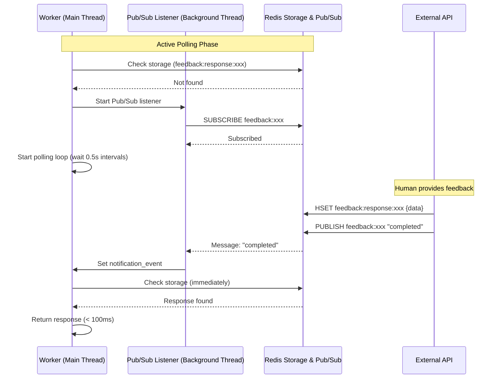
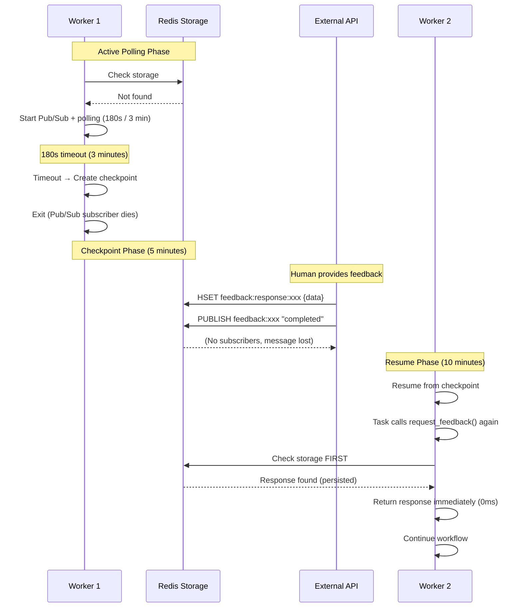

# Human-in-the-Loop (HITL) Design Document

**Document Version**: 1.2
**Date**: 2025-01-28
**Status**: Design Confirmed

**Changelog**:
- v1.2: Finalized implementation options
  - Option 6 (Notification): Confirmed Hybrid (Pub/Sub + Polling Fallback) approach
  - Added detailed Hybrid implementation section with pseudocode and sequence diagrams
  - Redis backend confirmed for distributed execution
  - Status changed to "Design Confirmed"
- v1.1: Added Channel integration support
  - Added `channel_key` and `write_to_channel` to FeedbackRequest
  - Added auto-write to channel in FeedbackManager.provide_feedback()
  - Added channel integration examples (Example 5)
  - Updated TaskExecutionContext convenience methods to support channel integration
- v1.0: Initial design

---

## Table of Contents

1. [Overview](#overview)
2. [Motivation](#motivation)
3. [Requirements](#requirements)
4. [Design Goals](#design-goals)
5. [Architecture](#architecture)
6. [API Design](#api-design)
7. [Implementation Details](#implementation-details)
8. [Checkpoint Integration](#checkpoint-integration)
9. [Cross-Process Communication](#cross-process-communication)
10. [Usage Examples](#usage-examples)
11. [Edge Cases and Limitations](#edge-cases-and-limitations)
12. [Future Enhancements](#future-enhancements)
13. [Implementation Options](#implementation-options)
14. [Implementation Checklist](#implementation-checklist)

---

## Overview

This document describes the design of Human-in-the-Loop (HITL) functionality for Graflow workflows. The HITL feature allows workflows to pause execution and wait for human feedback before continuing, with intelligent handling of both immediate and delayed responses.

### Key Features

1. **Multiple feedback types**: Approval, text input, selection, custom
2. **Intelligent timeout handling**: Short-term polling for immediate feedback, checkpoint creation on timeout
3. **Cross-process feedback**: API/GUI can provide feedback to running workflows
4. **Persistent feedback state**: Feedback requests survive process restarts
5. **Checkpoint integration**: Seamless resume from checkpoint after feedback received
6. **Channel integration**: Automatic write of feedback responses to workflow channels for inter-task communication

---

## Motivation

### Use Cases

1. **Approval workflows**: Require human approval before executing critical operations (e.g., deployment, payment)
2. **Data validation**: Human validation of ML predictions, data quality checks
3. **Parameter tuning**: Allow humans to adjust parameters during workflow execution
4. **Error recovery**: Present errors to humans for decision (retry, skip, abort)
5. **Interactive pipelines**: LLM-based workflows requiring iterative human input
6. **Batch processing**: Periodic human review of batch processing results

### Example Scenarios

**Scenario 1: Immediate approval (< 3 minutes)**
```
Task requests approval → Polling (3 min) → Human approves → Task continues
```

**Scenario 2: Delayed approval (hours/days)**
```
Task requests approval → Polling (3 min) → Timeout
→ Checkpoint created → Workflow exits
→ (Later) Human approves via API → Workflow resumes from checkpoint
→ Task continues with approval
```

**Scenario 3: Distributed execution**
```
Worker 1: Task requests feedback → Timeout → Checkpoint → Worker exits
→ Human provides feedback via API (stored in Redis)
→ Worker 2: Resume from checkpoint → Fetch feedback → Continue
```

---

## Requirements

### Functional Requirements

**FR1**: Tasks can request human feedback using `context.request_feedback()`
**FR2**: Multiple feedback types: approval, text input, selection, custom
**FR3**: Short-term polling for immediate responses (configurable timeout, default 3 minutes)
**FR4**: Automatic checkpoint creation on timeout
**FR5**: REST API for external feedback submission
**FR6**: Feedback state persists across process restarts
**FR7**: Support both Memory and Redis backends
**FR8**: Feedback responses can come from different processes

### Non-Functional Requirements

**NFR1**: Minimal overhead for non-HITL workflows
**NFR2**: Thread-safe feedback management
**NFR3**: Feedback requests should be queryable via API
**NFR4**: Clear timeout behavior (no indefinite blocking)

---

## Design Goals

1. **Non-blocking**: Workflows don't block indefinitely waiting for feedback
2. **Persistent**: Feedback state survives process restarts
3. **Scalable**: Works with distributed execution (multiple workers)
4. **Flexible**: Multiple feedback types and custom metadata
5. **Simple API**: Easy to use from tasks
6. **Checkpoint-aware**: Seamless integration with checkpoint/resume

---

## Architecture

### High-Level Architecture

```
┌─────────────────────────────────────────────────────────────┐
│                    User Task Code                           │
│                                                             │
│  @task(inject_context=True)                                 │
│  def my_task(context):                                      │
│      response = context.request_feedback(                   │
│          feedback_type="approval",                          │
│          prompt="Approve deployment?",                      │
│          timeout=180  # 3 minutes                           │
│      )                                                      │
│      if response.approved:                                  │
│          deploy()                                           │
└──────────────────────┬──────────────────────────────────────┘
                       │
                       ▼
┌─────────────────────────────────────────────────────────────┐
│              TaskExecutionContext                           │
│  .request_feedback() ──────────────────────────────┐        │
└────────────────────────────────────────────────────┼────────┘
                                                     │
                                                     ▼
┌─────────────────────────────────────────────────────────────┐
│              FeedbackManager                                │
│                                                             │
│  1. Create FeedbackRequest                                  │
│  2. Store in backend (Memory/Redis)                         │
│  3. Start polling loop (timeout=180s / 3 minutes)           │
│     ├─> Poll for response                                   │
│     ├─> If response received: return FeedbackResponse       │
│     └─> If timeout: raise FeedbackTimeoutException          │
└──────────────────────┬──────────────────────────────────────┘
                       │
                       ▼
┌─────────────────────────────────────────────────────────────┐
│              WorkflowEngine                                 │
│                                                             │
│  Catches FeedbackTimeoutException:                          │
│  1. Create checkpoint (current task NOT completed)          │
│  2. Exit workflow execution                                 │
│  3. Feedback request remains in backend (pending)           │
└──────────────────────┬──────────────────────────────────────┘
                       │
                       ▼
┌─────────────────────────────────────────────────────────────┐
│              External API/GUI                               │
│                                                             │
│  POST /api/feedback/{feedback_id}/respond                   │
│  {                                                          │
│    "approved": true,                                        │
│    "reason": "Looks good"                                   │
│  }                                                          │
│                                                             │
│  1. Update FeedbackRequest status in backend                │
│  2. Store FeedbackResponse                                  │
│  3. Publish notification (Redis Pub/Sub)                    │
└──────────────────────┬──────────────────────────────────────┘
                       │
                       ▼
┌─────────────────────────────────────────────────────────────┐
│              Resume from Checkpoint                         │
│                                                             │
│  1. CheckpointManager.resume_from_checkpoint(path)          │
│  2. Engine restarts from pending task                       │
│  3. Task calls request_feedback() again                     │
│  4. FeedbackManager finds existing response                 │
│  5. Returns response immediately (no polling)               │
│  6. Task continues with feedback                            │
└─────────────────────────────────────────────────────────────┘
```

### Component Interactions

```
Task
  │
  │ context.request_feedback(type, prompt, timeout)
  ▼
TaskExecutionContext
  │
  │ execution_context.feedback_manager.request_feedback()
  ▼
FeedbackManager
  │
  ├─> Create FeedbackRequest (feedback_id, task_id, type, prompt)
  │
  ├─> Store in backend (Memory: dict, Redis: hash)
  │
  └─> Poll for response (timeout seconds)
      │
      ├─> Response received → Return FeedbackResponse
      │
      └─> Timeout → Raise FeedbackTimeoutException
                    │
                    ▼
                WorkflowEngine catches exception
                    │
                    ├─> Create checkpoint
                    │
                    └─> Exit workflow

External API
  │
  │ POST /feedback/{feedback_id}/respond
  ▼
FeedbackManager
  │
  ├─> Update FeedbackRequest status
  │
  ├─> Store FeedbackResponse
  │
  └─> Publish notification (Redis Pub/Sub)

Resume Workflow
  │
  │ CheckpointManager.resume_from_checkpoint()
  ▼
WorkflowEngine.execute()
  │
  │ Task calls request_feedback() again
  ▼
FeedbackManager
  │
  ├─> Check if response already exists
  │
  └─> Return existing response (no polling)
```

---

## API Design

### Core Classes

#### FeedbackType

```python
from enum import Enum

class FeedbackType(Enum):
    """Types of feedback that can be requested."""
    APPROVAL = "approval"        # Boolean approval (approved/rejected)
    TEXT = "text"                # Free-form text input
    SELECTION = "selection"      # Single selection from options
    MULTI_SELECTION = "multi_selection"  # Multiple selections
    CUSTOM = "custom"            # Custom feedback structure
```

#### FeedbackRequest

```python
from dataclasses import dataclass, field
from datetime import datetime
from typing import Any, Optional

@dataclass
class FeedbackRequest:
    """Represents a feedback request."""
    feedback_id: str                    # Unique request ID
    task_id: str                        # Task requesting feedback
    session_id: str                     # Workflow session ID
    feedback_type: FeedbackType         # Type of feedback
    prompt: str                         # Prompt for human
    options: Optional[list[str]] = None # Options for selection types
    metadata: dict[str, Any] = field(default_factory=dict)  # Custom metadata
    created_at: str = field(default_factory=lambda: datetime.now().isoformat())
    timeout: float = 180.0              # Polling timeout in seconds (default: 3 minutes)
    status: str = "pending"             # pending, completed, timeout, cancelled

    # Channel integration (NEW)
    channel_key: Optional[str] = None   # Channel key to write response to
    write_to_channel: bool = False      # Whether to auto-write to channel

    def to_dict(self) -> dict[str, Any]:
        """Convert to dictionary for storage."""
        return {
            "feedback_id": self.feedback_id,
            "task_id": self.task_id,
            "session_id": self.session_id,
            "feedback_type": self.feedback_type.value,
            "prompt": self.prompt,
            "options": self.options,
            "metadata": self.metadata,
            "created_at": self.created_at,
            "timeout": self.timeout,
            "status": self.status,
            "channel_key": self.channel_key,
            "write_to_channel": self.write_to_channel,
        }

    @classmethod
    def from_dict(cls, data: dict[str, Any]) -> "FeedbackRequest":
        """Restore from dictionary."""
        data = data.copy()
        data["feedback_type"] = FeedbackType(data["feedback_type"])
        return cls(**data)
```

#### FeedbackResponse

```python
@dataclass
class FeedbackResponse:
    """Represents a feedback response."""
    feedback_id: str                    # Request ID
    response_type: FeedbackType         # Type of response

    # Approval responses
    approved: Optional[bool] = None
    reason: Optional[str] = None

    # Text responses
    text: Optional[str] = None

    # Selection responses
    selected: Optional[str] = None
    selected_multiple: Optional[list[str]] = None

    # Custom responses
    custom_data: Optional[dict[str, Any]] = None

    # Metadata
    responded_at: str = field(default_factory=lambda: datetime.now().isoformat())
    responded_by: Optional[str] = None  # User ID or system identifier

    def to_dict(self) -> dict[str, Any]:
        """Convert to dictionary for storage."""
        return {
            "feedback_id": self.feedback_id,
            "response_type": self.response_type.value,
            "approved": self.approved,
            "reason": self.reason,
            "text": self.text,
            "selected": self.selected,
            "selected_multiple": self.selected_multiple,
            "custom_data": self.custom_data,
            "responded_at": self.responded_at,
            "responded_by": self.responded_by,
        }

    @classmethod
    def from_dict(cls, data: dict[str, Any]) -> "FeedbackResponse":
        """Restore from dictionary."""
        data = data.copy()
        data["response_type"] = FeedbackType(data["response_type"])
        return cls(**data)
```

#### FeedbackManager

```python
import threading
import time
import uuid
from typing import Optional

class FeedbackTimeoutException(Exception):
    """Raised when feedback request times out."""
    def __init__(self, feedback_id: str, timeout: float):
        self.feedback_id = feedback_id
        self.timeout = timeout
        super().__init__(
            f"Feedback request {feedback_id} timed out after {timeout} seconds"
        )

class FeedbackManager:
    """Manages feedback requests and responses with backend persistence."""

    def __init__(
        self,
        backend: str = "memory",
        backend_config: Optional[dict] = None,
        channel_manager: Optional[Any] = None  # NEW: Channel manager for writing
    ):
        """Initialize feedback manager.

        Args:
            backend: "memory" or "redis"
            backend_config: Backend-specific configuration
            channel_manager: Optional ChannelManager for writing feedback to channels
        """
        self.backend = backend
        self.backend_config = backend_config or {}
        self.channel_manager = channel_manager  # NEW
        self._lock = threading.Lock()

        # Backend initialization
        if backend == "memory":
            self._requests: dict[str, FeedbackRequest] = {}
            self._responses: dict[str, FeedbackResponse] = {}
        elif backend == "redis":
            import redis
            self._redis_client = backend_config.get("redis_client") or redis.Redis(
                host=backend_config.get("host", "localhost"),
                port=backend_config.get("port", 6379),
                db=backend_config.get("db", 0),
                decode_responses=True
            )
            # Subscribe to feedback notifications
            self._pubsub = self._redis_client.pubsub()
        else:
            raise ValueError(f"Unsupported backend: {backend}")

    def request_feedback(
        self,
        task_id: str,
        session_id: str,
        feedback_type: FeedbackType,
        prompt: str,
        options: Optional[list[str]] = None,
        metadata: Optional[dict] = None,
        timeout: float = 180.0,  # Default: 3 minutes
        channel_key: Optional[str] = None,  # NEW
        write_to_channel: bool = False,  # NEW
    ) -> FeedbackResponse:
        """Request feedback and wait for response.

        Args:
            task_id: Task requesting feedback
            session_id: Workflow session ID
            feedback_type: Type of feedback
            prompt: Prompt for human
            options: Options for selection types
            metadata: Custom metadata
            timeout: Polling timeout in seconds (default: 180s / 3 minutes)
            channel_key: Optional channel key to write response to (NEW)
            write_to_channel: Whether to auto-write response to channel (NEW)

        Returns:
            FeedbackResponse

        Raises:
            FeedbackTimeoutException: If timeout exceeded without response
        """
        # Generate feedback ID
        feedback_id = f"{task_id}_{uuid.uuid4().hex[:8]}"

        # Check if response already exists (resume case)
        existing_response = self._get_response(feedback_id)
        if existing_response:
            print(f"[FeedbackManager] Found existing response for {feedback_id}")
            return existing_response

        # Create and store request
        request = FeedbackRequest(
            feedback_id=feedback_id,
            task_id=task_id,
            session_id=session_id,
            feedback_type=feedback_type,
            prompt=prompt,
            options=options,
            metadata=metadata or {},
            timeout=timeout,
            status="pending",
            channel_key=channel_key,  # NEW
            write_to_channel=write_to_channel,  # NEW
        )
        self._store_request(request)

        print(f"[FeedbackManager] Created feedback request: {feedback_id}")
        print(f"[FeedbackManager] Prompt: {prompt}")
        print(f"[FeedbackManager] Polling for {timeout} seconds...")

        # Poll for response
        response = self._poll_for_response(feedback_id, timeout)

        if response:
            # Update request status
            request.status = "completed"
            self._store_request(request)
            return response
        else:
            # Timeout - update status and raise exception
            request.status = "timeout"
            self._store_request(request)
            raise FeedbackTimeoutException(feedback_id, timeout)

    def provide_feedback(
        self,
        feedback_id: str,
        response: FeedbackResponse,
    ) -> bool:
        """Provide feedback response (called by external API).

        Args:
            feedback_id: Feedback request ID
            response: Feedback response

        Returns:
            True if successful, False if request not found
        """
        # Get request
        request = self._get_request(feedback_id)
        if not request:
            print(f"[FeedbackManager] Request {feedback_id} not found")
            return False

        # Store response
        self._store_response(response)

        # Update request status
        request.status = "completed"
        self._store_request(request)

        # Write to channel if requested (NEW)
        if request.write_to_channel and request.channel_key and self.channel_manager:
            try:
                # Get channel
                channel = self.channel_manager.get_channel(request.session_id)

                # Write response to channel based on feedback type
                if request.feedback_type == FeedbackType.APPROVAL:
                    channel.set(request.channel_key, response.approved)
                elif request.feedback_type == FeedbackType.TEXT:
                    channel.set(request.channel_key, response.text)
                elif request.feedback_type == FeedbackType.SELECTION:
                    channel.set(request.channel_key, response.selected)
                elif request.feedback_type == FeedbackType.MULTI_SELECTION:
                    channel.set(request.channel_key, response.selected_multiple)
                elif request.feedback_type == FeedbackType.CUSTOM:
                    channel.set(request.channel_key, response.custom_data)

                # Also write full response object to {channel_key}.__feedback_response__
                channel.set(f"{request.channel_key}.__feedback_response__", response.to_dict())

                print(f"[FeedbackManager] Wrote feedback to channel key: {request.channel_key}")
            except Exception as e:
                print(f"[FeedbackManager] Failed to write to channel: {e}")
                # Don't fail the entire operation if channel write fails

        # Publish notification (for Redis backend)
        # Note: publish() is fire-and-forget and does NOT block/wait
        # If no subscribers are listening, message is lost (which is OK - storage is source of truth)
        if self.backend == "redis":
            self._redis_client.publish(
                f"feedback:{feedback_id}",
                "completed"
            )

        print(f"[FeedbackManager] Feedback provided for {feedback_id}")
        return True

    def list_pending_requests(
        self,
        session_id: Optional[str] = None
    ) -> list[FeedbackRequest]:
        """List pending feedback requests.

        Args:
            session_id: Optional filter by session ID

        Returns:
            List of pending FeedbackRequest objects
        """
        if self.backend == "memory":
            requests = [
                req for req in self._requests.values()
                if req.status == "pending"
            ]
        else:  # redis
            # Get all request keys
            keys = self._redis_client.keys("feedback:request:*")
            requests = []
            for key in keys:
                data = self._redis_client.hgetall(key)
                if data and data.get("status") == "pending":
                    requests.append(FeedbackRequest.from_dict(data))

        # Filter by session_id if provided
        if session_id:
            requests = [req for req in requests if req.session_id == session_id]

        return requests

    def _poll_for_response(
        self,
        feedback_id: str,
        timeout: float,
    ) -> Optional[FeedbackResponse]:
        """Poll for response with timeout.

        Args:
            feedback_id: Feedback request ID
            timeout: Timeout in seconds

        Returns:
            FeedbackResponse if received, None if timeout
        """
        poll_interval = 0.5  # Poll every 500ms
        elapsed = 0.0

        if self.backend == "redis":
            # Subscribe to notification channel
            channel = f"feedback:{feedback_id}"
            self._pubsub.subscribe(channel)

        try:
            while elapsed < timeout:
                # Check for response
                response = self._get_response(feedback_id)
                if response:
                    return response

                # Wait for notification or poll interval
                if self.backend == "redis":
                    # Use pub/sub with timeout
                    message = self._pubsub.get_message(timeout=poll_interval)
                    if message and message["type"] == "message":
                        # Response arrived, fetch it
                        response = self._get_response(feedback_id)
                        if response:
                            return response
                else:
                    # Simple sleep for memory backend
                    time.sleep(poll_interval)

                elapsed += poll_interval
        finally:
            if self.backend == "redis":
                self._pubsub.unsubscribe(channel)

        return None

    def _store_request(self, request: FeedbackRequest) -> None:
        """Store feedback request in backend."""
        if self.backend == "memory":
            with self._lock:
                self._requests[request.feedback_id] = request
        else:  # redis
            key = f"feedback:request:{request.feedback_id}"
            self._redis_client.hset(
                key,
                mapping=request.to_dict()
            )
            # Set expiration (e.g., 7 days)
            self._redis_client.expire(key, 7 * 24 * 60 * 60)

    def _get_request(self, feedback_id: str) -> Optional[FeedbackRequest]:
        """Get feedback request from backend."""
        if self.backend == "memory":
            return self._requests.get(feedback_id)
        else:  # redis
            key = f"feedback:request:{feedback_id}"
            data = self._redis_client.hgetall(key)
            if data:
                return FeedbackRequest.from_dict(data)
            return None

    def _store_response(self, response: FeedbackResponse) -> None:
        """Store feedback response in backend."""
        if self.backend == "memory":
            with self._lock:
                self._responses[response.feedback_id] = response
        else:  # redis
            key = f"feedback:response:{response.feedback_id}"
            self._redis_client.hset(
                key,
                mapping=response.to_dict()
            )
            # Set expiration (e.g., 7 days)
            self._redis_client.expire(key, 7 * 24 * 60 * 60)

    def _get_response(self, feedback_id: str) -> Optional[FeedbackResponse]:
        """Get feedback response from backend."""
        if self.backend == "memory":
            return self._responses.get(feedback_id)
        else:  # redis
            key = f"feedback:response:{feedback_id}"
            data = self._redis_client.hgetall(key)
            if data:
                return FeedbackResponse.from_dict(data)
            return None
```

### TaskExecutionContext API

```python
class TaskExecutionContext:
    def request_feedback(
        self,
        feedback_type: str | FeedbackType,
        prompt: str,
        options: Optional[list[str]] = None,
        metadata: Optional[dict] = None,
        timeout: float = 180.0,  # Default: 3 minutes
        channel_key: Optional[str] = None,  # NEW
        write_to_channel: bool = False,  # NEW
    ) -> FeedbackResponse:
        """Request human feedback.

        Args:
            feedback_type: Type of feedback ("approval", "text", "selection", etc.)
            prompt: Prompt for human
            options: Options for selection types
            metadata: Custom metadata
            timeout: Polling timeout in seconds (default: 180 / 3 minutes)
            channel_key: Optional channel key to write response to (NEW)
            write_to_channel: Whether to auto-write response to channel (NEW)

        Returns:
            FeedbackResponse

        Raises:
            FeedbackTimeoutException: If timeout exceeded

        Example:
            @task(inject_context=True)
            def my_task(context):
                try:
                    # Simple usage (no channel integration)
                    response = context.request_feedback(
                        feedback_type="approval",
                        prompt="Approve this deployment?",
                        timeout=180  # 3 minutes
                    )
                    if response.approved:
                        deploy()

                    # With channel integration (NEW)
                    response = context.request_feedback(
                        feedback_type="approval",
                        prompt="Approve deployment?",
                        channel_key="deployment_approved",
                        write_to_channel=True,
                        timeout=180  # 3 minutes
                    )
                    # Feedback response automatically written to channel
                    # Other tasks can read: channel.get("deployment_approved")
                except FeedbackTimeoutException:
                    # This will be caught by engine and checkpoint created
                    raise
        """
        # Convert string to enum
        if isinstance(feedback_type, str):
            feedback_type = FeedbackType(feedback_type)

        # Get feedback manager from execution context
        feedback_manager = self.execution_context.feedback_manager

        # Request feedback
        return feedback_manager.request_feedback(
            task_id=self.task_id,
            session_id=self.execution_context.session_id,
            feedback_type=feedback_type,
            prompt=prompt,
            options=options,
            metadata=metadata,
            timeout=timeout,
            channel_key=channel_key,
            write_to_channel=write_to_channel,
        )

    # Convenience methods
    def request_approval(
        self,
        prompt: str,
        metadata: Optional[dict] = None,
        timeout: float = 180.0,  # Default: 3 minutes
        channel_key: Optional[str] = None,  # NEW
        write_to_channel: bool = False,  # NEW
    ) -> bool:
        """Request approval (convenience method).

        Args:
            prompt: Approval prompt
            metadata: Custom metadata
            timeout: Polling timeout
            channel_key: Optional channel key to write response to (NEW)
            write_to_channel: Whether to auto-write to channel (NEW)

        Returns:
            True if approved, False if rejected

        Example:
            # Approval with channel integration
            approved = context.request_approval(
                prompt="Approve deployment?",
                channel_key="deployment_approved",
                write_to_channel=True
            )
            # Result auto-written to channel["deployment_approved"]
        """
        response = self.request_feedback(
            feedback_type=FeedbackType.APPROVAL,
            prompt=prompt,
            metadata=metadata,
            timeout=timeout,
            channel_key=channel_key,
            write_to_channel=write_to_channel,
        )
        return response.approved or False

    def request_text_input(
        self,
        prompt: str,
        metadata: Optional[dict] = None,
        timeout: float = 180.0,  # Default: 3 minutes
        channel_key: Optional[str] = None,  # NEW
        write_to_channel: bool = False,  # NEW
    ) -> str:
        """Request text input (convenience method).

        Args:
            prompt: Text input prompt
            metadata: Custom metadata
            timeout: Polling timeout
            channel_key: Optional channel key to write response to (NEW)
            write_to_channel: Whether to auto-write to channel (NEW)

        Returns:
            Text response
        """
        response = self.request_feedback(
            feedback_type=FeedbackType.TEXT,
            prompt=prompt,
            metadata=metadata,
            timeout=timeout,
            channel_key=channel_key,
            write_to_channel=write_to_channel,
        )
        return response.text or ""

    def request_selection(
        self,
        prompt: str,
        options: list[str],
        metadata: Optional[dict] = None,
        timeout: float = 180.0,  # Default: 3 minutes
        channel_key: Optional[str] = None,  # NEW
        write_to_channel: bool = False,  # NEW
    ) -> str:
        """Request selection (convenience method).

        Args:
            prompt: Selection prompt
            options: Selection options
            metadata: Custom metadata
            timeout: Polling timeout
            channel_key: Optional channel key to write response to (NEW)
            write_to_channel: Whether to auto-write to channel (NEW)

        Returns:
            Selected option
        """
        response = self.request_feedback(
            feedback_type=FeedbackType.SELECTION,
            prompt=prompt,
            options=options,
            metadata=metadata,
            timeout=timeout,
            channel_key=channel_key,
            write_to_channel=write_to_channel,
        )
        return response.selected or ""
```

### ExecutionContext Integration

```python
from dataclasses import dataclass, field

@dataclass
class ExecutionContext:
    # Existing fields...
    feedback_manager: FeedbackManager = field(default_factory=lambda: FeedbackManager())

    @classmethod
    def create(
        cls,
        graph,
        start_node,
        *,
        feedback_backend: str = "memory",
        feedback_config: Optional[dict] = None,
        **kwargs
    ):
        """Create execution context with feedback support.

        Args:
            graph: Task graph
            start_node: Start node
            feedback_backend: "memory" or "redis"
            feedback_config: Backend-specific configuration
        """
        # Create feedback manager
        feedback_manager = FeedbackManager(
            backend=feedback_backend,
            backend_config=feedback_config
        )

        # Create context
        context = cls(
            graph=graph,
            start_node=start_node,
            feedback_manager=feedback_manager,
            **kwargs
        )

        return context
```

### WorkflowEngine Integration

```python
class WorkflowEngine:
    def execute(self, context: ExecutionContext, start_task_id: Optional[str] = None):
        """Execute workflow with HITL support.

        Handles FeedbackTimeoutException by creating checkpoint.
        """
        while task_id is not None and context.steps < context.max_steps:
            try:
                # Execute task
                task = graph.get_node(task_id)
                with context.executing_task(task):
                    self._execute_task(task, context)

                # Track completion
                context.mark_task_completed(task_id)
                context.increment_step()

                # Schedule successors
                # ...

                # Get next task
                task_id = context.get_next_task()

            except FeedbackTimeoutException as e:
                print(f"[WorkflowEngine] Feedback timeout: {e.feedback_id}")
                print(f"[WorkflowEngine] Creating checkpoint...")

                # Create checkpoint (current task NOT completed)
                from graflow.core.checkpoint import CheckpointManager
                checkpoint_path, metadata = CheckpointManager.create_checkpoint(
                    context,
                    metadata={
                        "reason": "feedback_timeout",
                        "feedback_id": e.feedback_id,
                        "task_id": task_id,
                    }
                )

                print(f"[WorkflowEngine] Checkpoint created: {checkpoint_path}")
                print(f"[WorkflowEngine] Waiting for feedback: {e.feedback_id}")
                print(f"[WorkflowEngine] Resume with: CheckpointManager.resume_from_checkpoint('{checkpoint_path}')")

                # Exit workflow (feedback pending)
                return
```

---

## Implementation Details

### Feedback Storage Schema

#### Memory Backend

```python
# In-memory storage
_requests: dict[str, FeedbackRequest] = {
    "deploy_task_abc123": FeedbackRequest(...),
    "validate_task_def456": FeedbackRequest(...),
}

_responses: dict[str, FeedbackResponse] = {
    "deploy_task_abc123": FeedbackResponse(...),
}
```

#### Redis Backend

```redis
# Request storage
HSET feedback:request:deploy_task_abc123
    feedback_id "deploy_task_abc123"
    task_id "deploy_task"
    session_id "session_12345"
    feedback_type "approval"
    prompt "Approve deployment?"
    status "pending"
    created_at "2025-01-28T10:00:00Z"
    timeout "180.0"

# Response storage
HSET feedback:response:deploy_task_abc123
    feedback_id "deploy_task_abc123"
    response_type "approval"
    approved "true"
    reason "Looks good"
    responded_at "2025-01-28T10:00:30Z"
    responded_by "user@example.com"

# Pub/Sub notification
PUBLISH feedback:deploy_task_abc123 "completed"

# Expiration (7 days)
EXPIRE feedback:request:deploy_task_abc123 604800
EXPIRE feedback:response:deploy_task_abc123 604800
```

### Idempotency Handling

Tasks may be re-executed on resume. To handle this idempotently:

```python
@task(inject_context=True)
def idempotent_approval_task(context):
    # request_feedback() checks for existing response first
    # If response exists (resume case), returns immediately without polling
    response = context.request_feedback(
        feedback_type="approval",
        prompt="Approve?",
        timeout=180  # 3 minutes
    )

    # This code runs whether:
    # 1. Immediate response (within 3 minutes)
    # 2. Resumed after checkpoint with feedback provided
    if response.approved:
        do_approved_action()
```

**Key point**: `FeedbackManager.request_feedback()` checks for existing response before creating new request. This ensures:
- Resume case: Existing response returned immediately (no new polling)
- New execution: New request created and polling starts

### Feedback ID Generation

Feedback IDs are deterministic to support idempotency:

```python
feedback_id = f"{task_id}_{uuid.uuid4().hex[:8]}"
```

For more robust idempotency (same task re-executed multiple times), use:

```python
# Include cycle count for iterative tasks
feedback_id = f"{task_id}_cycle{cycle_count}_{uuid.uuid4().hex[:8]}"
```

---

## Checkpoint Integration

### Checkpoint with Pending Feedback

When a task times out waiting for feedback, the workflow creates a checkpoint and exits:

```python
# Checkpoint state includes pending feedback request
{
    "schema_version": "1.0",
    "session_id": "session_12345",
    "pending_tasks": [
        {
            "task_id": "deploy_task",
            "status": "waiting_feedback",  # Special status
            "feedback_id": "deploy_task_abc123",  # Reference to pending feedback
            # ... other TaskSpec fields
        }
    ],
    # ... other checkpoint state
}
```

### Resume Flow

```
1. Human provides feedback via API
   POST /api/feedback/deploy_task_abc123/respond
   → FeedbackManager stores response in backend

2. Resume workflow from checkpoint
   context, metadata = CheckpointManager.resume_from_checkpoint(path)
   engine.execute(context)

3. Engine restarts from pending task (deploy_task)

4. Task calls request_feedback() again
   response = context.request_feedback(...)

5. FeedbackManager finds existing response
   → Returns immediately (no polling)

6. Task continues with feedback
```

### Example: Resume After Feedback

```python
# Initial execution
with workflow("deployment") as wf:
    @task(inject_context=True)
    def deploy(context):
        response = context.request_approval(
            prompt="Approve deployment to production?",
            timeout=180  # 3 minutes
        )
        if response.approved:
            execute_deployment()
        else:
            cancel_deployment()

    try:
        wf.execute()
    except SystemExit:
        # Checkpoint created, waiting for feedback
        pass

# (Later) Human approves via API
# POST /api/feedback/deploy_abc123/respond
# {"approved": true, "reason": "Approved by manager"}

# Resume workflow
from graflow.core.checkpoint import CheckpointManager
from graflow.core.engine import WorkflowEngine

context, metadata = CheckpointManager.resume_from_checkpoint(
    "checkpoints/session_12345_step_5.pkl"
)

engine = WorkflowEngine()
engine.execute(context)
# Task resumes, finds feedback, continues with deployment
```

---

## Cross-Process Communication

### Architecture for Cross-Process Feedback

```
┌─────────────────────────────────────────────────────────────┐
│                    Worker Process                           │
│                                                              │
│  WorkflowEngine → Task → FeedbackManager                    │
│                           │                                  │
│                           ├─> Create request in Redis       │
│                           ├─> Subscribe to Redis Pub/Sub    │
│                           ├─> Poll for response (3 min)     │
│                           └─> Timeout → Checkpoint → Exit   │
└─────────────────────────────────────────────────────────────┘
                               ▲
                               │ Redis
                               │ (feedback:request:*, feedback:response:*)
                               │
┌─────────────────────────────────────────────────────────────┐
│                    API Server Process                       │
│                                                              │
│  FastAPI → FeedbackAPI                                      │
│              │                                               │
│              ├─> GET /feedback (list pending)               │
│              ├─> POST /feedback/{id}/respond                │
│              │     └─> Store response in Redis              │
│              │     └─> Publish to Redis Pub/Sub             │
│              └─> GET /feedback/{id} (get status)            │
└─────────────────────────────────────────────────────────────┘
                               ▲
                               │ HTTP
                               │
┌─────────────────────────────────────────────────────────────┐
│                    Web GUI / CLI                            │
│                                                              │
│  - List pending feedback requests                           │
│  - Display prompt and options                               │
│  - Submit response (approve/reject/text/selection)          │
│  - View feedback history                                    │
└─────────────────────────────────────────────────────────────┘
```

### Redis Pub/Sub for Real-Time Notifications

**Why Pub/Sub?**
- Immediate notification when feedback is provided
- Reduces polling overhead
- Supports multiple subscribers (multiple workers)

**Channel Naming**:
```
feedback:{feedback_id}      # Notifications for specific feedback
feedback:global             # Global notifications for all feedback
```

**Usage**:
```python
# Worker: Subscribe to specific feedback
pubsub = redis_client.pubsub()
pubsub.subscribe(f"feedback:{feedback_id}")

# API: Publish notification when feedback provided
redis_client.publish(f"feedback:{feedback_id}", "completed")
```

### REST API Design

#### Pydantic Schemas

**Module**: `graflow/api/schemas/feedback.py`

```python
from pydantic import BaseModel, Field
from typing import Optional, Any
from datetime import datetime


class FeedbackResponseRequest(BaseModel):
    """Request body for providing feedback response."""
    # Approval
    approved: Optional[bool] = Field(None, description="Approval decision")
    reason: Optional[str] = Field(None, description="Reason for decision")

    # Text
    text: Optional[str] = Field(None, description="Text input")

    # Selection
    selected: Optional[str] = Field(None, description="Selected option")
    selected_multiple: Optional[list[str]] = Field(None, description="Multiple selections")

    # Custom
    custom_data: Optional[dict[str, Any]] = Field(None, description="Custom data")

    # Metadata
    responded_by: Optional[str] = Field(None, description="User who responded")

    class Config:
        json_schema_extra = {
            "example": {
                "approved": True,
                "reason": "Approved by manager",
                "responded_by": "user@example.com"
            }
        }


class FeedbackRequestResponse(BaseModel):
    """Response model for feedback request."""
    feedback_id: str
    task_id: str
    session_id: str
    feedback_type: str
    prompt: str
    options: Optional[list[str]] = None
    status: str
    created_at: str
    timeout: float
    metadata: dict[str, Any] = Field(default_factory=dict)


class FeedbackDetailResponse(BaseModel):
    """Response model for feedback details."""
    request: FeedbackRequestResponse
    response: Optional[dict[str, Any]] = None


class MessageResponse(BaseModel):
    """Generic message response."""
    message: str
```

#### API Router

**Module**: `graflow/api/router.py`

```python
from fastapi import APIRouter, HTTPException, Depends
from typing import Optional
from datetime import datetime

from graflow.hitl.manager import FeedbackManager
from graflow.hitl.types import FeedbackResponse, FeedbackType
from graflow.api.schemas.feedback import (
    FeedbackResponseRequest,
    FeedbackDetailResponse,
    MessageResponse
)

router = APIRouter(prefix="/api/feedback", tags=["feedback"])


# Dependency injection for FeedbackManager
def get_feedback_manager() -> FeedbackManager:
    """Get FeedbackManager from app state."""
    # Implementation provided by create_feedback_api()
    pass

@router.get("")
async def list_pending_feedback(
    session_id: Optional[str] = None
) -> list[dict]:
    """List pending feedback requests.

    Args:
        session_id: Optional filter by session

    Returns:
        List of pending feedback requests
    """
    feedback_manager = get_feedback_manager()
    requests = feedback_manager.list_pending_requests(session_id)
    return [req.to_dict() for req in requests]

@router.get("/{feedback_id}")
async def get_feedback(feedback_id: str) -> dict:
    """Get feedback request details.

    Args:
        feedback_id: Feedback request ID

    Returns:
        Feedback request with response (if available)
    """
    feedback_manager = get_feedback_manager()

    request = feedback_manager._get_request(feedback_id)
    if not request:
        raise HTTPException(status_code=404, detail="Feedback request not found")

    response = feedback_manager._get_response(feedback_id)

    return {
        "request": request.to_dict(),
        "response": response.to_dict() if response else None,
    }

@router.post("/{feedback_id}/respond")
async def respond_to_feedback(
    feedback_id: str,
    body: FeedbackResponseRequest
) -> dict:
    """Provide feedback response.

    Args:
        feedback_id: Feedback request ID
        body: Response data

    Returns:
        Success message
    """
    feedback_manager = get_feedback_manager()

    # Get request to determine type
    request = feedback_manager._get_request(feedback_id)
    if not request:
        raise HTTPException(status_code=404, detail="Feedback request not found")

    # Create response based on type
    response = FeedbackResponse(
        feedback_id=feedback_id,
        response_type=request.feedback_type,
        approved=body.approved,
        reason=body.reason,
        text=body.text,
        selected=body.selected,
        selected_multiple=body.selected_multiple,
        custom_data=body.custom_data,
        responded_by=body.responded_by,
    )

    # Provide feedback
    success = feedback_manager.provide_feedback(feedback_id, response)
    if not success:
        raise HTTPException(status_code=400, detail="Failed to provide feedback")

    return {"message": "Feedback provided successfully"}

@router.delete("/{feedback_id}")
async def cancel_feedback(feedback_id: str) -> dict:
    """Cancel pending feedback request.

    Args:
        feedback_id: Feedback request ID

    Returns:
        Success message
    """
    feedback_manager = get_feedback_manager()

    request = feedback_manager._get_request(feedback_id)
    if not request:
        raise HTTPException(status_code=404, detail="Feedback request not found")

    # Update status
    request.status = "cancelled"
    feedback_manager._store_request(request)

    return {"message": "Feedback request cancelled"}
```

#### Creating the FastAPI Application

**Module**: `graflow/api/__init__.py`

```python
from typing import Optional
import redis

try:
    from fastapi import FastAPI
    HAS_FASTAPI = True
except ImportError:
    HAS_FASTAPI = False

from graflow.hitl.manager import FeedbackManager


def create_feedback_api(
    redis_client: Optional[redis.Redis] = None,
    feedback_backend: str = "redis",
    feedback_config: Optional[dict] = None
) -> "FastAPI":
    """Create FastAPI application with feedback endpoints.

    Args:
        redis_client: Optional Redis client
        feedback_backend: Backend type ("redis" or "memory")
        feedback_config: Backend configuration

    Returns:
        FastAPI application with feedback routes

    Raises:
        ImportError: If FastAPI is not installed
    """
    if not HAS_FASTAPI:
        raise ImportError(
            "FastAPI is required for feedback API. "
            "Install with: pip install fastapi uvicorn"
        )

    # Create FastAPI app
    app = FastAPI(
        title="Graflow Feedback API",
        description="Human-in-the-Loop feedback management API",
        version="1.0.0"
    )

    # Initialize feedback manager
    backend_config = feedback_config or {}
    if redis_client:
        backend_config["redis_client"] = redis_client

    feedback_manager = FeedbackManager(
        backend=feedback_backend,
        backend_config=backend_config
    )

    # Store in app state
    app.state.feedback_manager = feedback_manager

    # Import and include router
    from graflow.api.router import router as feedback_router
    app.include_router(feedback_router)

    return app


# Helper function for endpoints to get manager
def get_feedback_manager():
    """Get feedback manager from app state (for dependency injection)."""
    from fastapi import Request
    # This is a placeholder - actual implementation uses FastAPI dependency injection
    # See graflow/api/router.py for proper usage
    pass
```

**Usage Example**:

```python
# API server (separate process)
import redis
from graflow.api import create_feedback_api

# Create Redis client
redis_client = redis.Redis(host='localhost', port=6379, db=0, decode_responses=True)

# Create FastAPI app with feedback routes
app = create_feedback_api(
    redis_client=redis_client,
    feedback_backend="redis"
)

# Run with: uvicorn api:app --host 0.0.0.0 --port 8000
```

### Example API Usage

```bash
# List pending feedback
curl http://localhost:8000/api/feedback

# Get specific feedback request
curl http://localhost:8000/api/feedback/deploy_task_abc123

# Approve deployment
curl -X POST http://localhost:8000/api/feedback/deploy_task_abc123/respond \
  -H "Content-Type: application/json" \
  -d '{"approved": true, "reason": "Approved by manager", "responded_by": "alice@example.com"}'

# Provide text feedback
curl -X POST http://localhost:8000/api/feedback/review_task_def456/respond \
  -H "Content-Type: application/json" \
  -d '{"text": "Please fix typos in section 3", "responded_by": "bob@example.com"}'

# Make selection
curl -X POST http://localhost:8000/api/feedback/config_task_ghi789/respond \
  -H "Content-Type: application/json" \
  -d '{"selected": "option_b", "responded_by": "charlie@example.com"}'
```

---

## OAuth 2.0 Authentication Design (Future Extension)

### Overview

The API is designed to support **optional OAuth 2.0 authentication** using FastAPI's `Depends` dependency injection. This allows:
- **Development**: Run without authentication
- **Production**: Enable OAuth 2.0 with scope-based permissions
- **Gradual migration**: Add authentication to specific endpoints incrementally

### Architecture

**Module Structure (Extended)**:
```
graflow/api/
├── __init__.py
├── router.py
├── schemas/
│   ├── feedback.py
│   └── auth.py              # OAuth 2.0 token models
├── dependencies/
│   ├── __init__.py
│   └── auth.py              # Authentication dependencies
└── security/
    ├── __init__.py
    ├── oauth2.py            # OAuth 2.0 implementation
    └── permissions.py       # Scope-based permissions
```

### Implementation Design

#### 1. Authentication Schemas

**File**: `graflow/api/schemas/auth.py`

```python
from pydantic import BaseModel, Field
from typing import Optional


class Token(BaseModel):
    """OAuth 2.0 access token."""
    access_token: str
    token_type: str = "bearer"
    expires_in: Optional[int] = None
    refresh_token: Optional[str] = None
    scope: Optional[str] = None


class TokenData(BaseModel):
    """Decoded token data."""
    username: Optional[str] = None
    scopes: list[str] = Field(default_factory=list)
    user_id: Optional[str] = None
    email: Optional[str] = None


class User(BaseModel):
    """User model."""
    user_id: str
    username: str
    email: Optional[str] = None
    disabled: bool = False
```

#### 2. OAuth 2.0 Security

**File**: `graflow/api/security/oauth2.py`

```python
from fastapi import Depends, HTTPException, status
from fastapi.security import OAuth2PasswordBearer, SecurityScopes
from jose import JWTError, jwt
from typing import Optional
import os

from graflow.api.schemas.auth import TokenData, User


# OAuth2 scheme (auto-generates /docs UI for token input)
oauth2_scheme = OAuth2PasswordBearer(
    tokenUrl="/api/auth/token",  # Token endpoint
    scopes={
        "feedback:read": "Read feedback requests",
        "feedback:write": "Respond to feedback requests",
        "feedback:admin": "Delete/cancel feedback requests"
    },
    auto_error=False  # Don't auto-raise 401, allows optional auth
)


# Configuration (from environment variables)
SECRET_KEY = os.getenv("GRAFLOW_SECRET_KEY", "dev-secret-key-change-in-production")
ALGORITHM = os.getenv("GRAFLOW_JWT_ALGORITHM", "HS256")
ACCESS_TOKEN_EXPIRE_MINUTES = int(os.getenv("GRAFLOW_TOKEN_EXPIRE_MINUTES", "30"))


def verify_token(token: str) -> TokenData:
    """Verify JWT token and extract claims.

    Args:
        token: JWT access token

    Returns:
        TokenData with user info and scopes

    Raises:
        HTTPException: If token is invalid
    """
    credentials_exception = HTTPException(
        status_code=status.HTTP_401_UNAUTHORIZED,
        detail="Could not validate credentials",
        headers={"WWW-Authenticate": "Bearer"},
    )

    try:
        payload = jwt.decode(token, SECRET_KEY, algorithms=[ALGORITHM])
        username: str = payload.get("sub")
        if username is None:
            raise credentials_exception

        token_scopes = payload.get("scopes", [])
        token_data = TokenData(
            username=username,
            scopes=token_scopes,
            user_id=payload.get("user_id"),
            email=payload.get("email")
        )
        return token_data
    except JWTError:
        raise credentials_exception


def create_access_token(
    data: dict,
    expires_delta: Optional[int] = None
) -> str:
    """Create JWT access token.

    Args:
        data: Claims to encode (sub, scopes, etc.)
        expires_delta: Token expiration in minutes

    Returns:
        Encoded JWT token
    """
    from datetime import datetime, timedelta

    to_encode = data.copy()
    if expires_delta:
        expire = datetime.utcnow() + timedelta(minutes=expires_delta)
    else:
        expire = datetime.utcnow() + timedelta(minutes=ACCESS_TOKEN_EXPIRE_MINUTES)

    to_encode.update({"exp": expire})
    encoded_jwt = jwt.encode(to_encode, SECRET_KEY, algorithm=ALGORITHM)
    return encoded_jwt


async def get_current_user_optional(
    token: Optional[str] = Depends(oauth2_scheme)
) -> Optional[User]:
    """Get current user from token (optional - returns None if no token).

    This dependency allows endpoints to work with or without authentication.

    Args:
        token: JWT token from Authorization header

    Returns:
        User object if authenticated, None if not
    """
    if token is None:
        return None

    try:
        token_data = verify_token(token)
        # In production, fetch user from database
        # For now, construct from token data
        user = User(
            user_id=token_data.user_id or token_data.username,
            username=token_data.username,
            email=token_data.email
        )
        return user
    except HTTPException:
        # Invalid token, but optional auth allows None
        return None


async def get_current_user(
    security_scopes: SecurityScopes,
    token: str = Depends(oauth2_scheme)
) -> User:
    """Get current user from token (required authentication).

    This dependency enforces authentication and checks scopes.

    Args:
        security_scopes: Required scopes for the endpoint
        token: JWT token from Authorization header

    Returns:
        User object

    Raises:
        HTTPException: If authentication fails or scopes insufficient
    """
    if token is None:
        raise HTTPException(
            status_code=status.HTTP_401_UNAUTHORIZED,
            detail="Not authenticated",
            headers={"WWW-Authenticate": "Bearer"},
        )

    token_data = verify_token(token)

    # Check scopes
    for scope in security_scopes.scopes:
        if scope not in token_data.scopes:
            raise HTTPException(
                status_code=status.HTTP_403_FORBIDDEN,
                detail=f"Not enough permissions. Required scope: {scope}",
                headers={"WWW-Authenticate": f'Bearer scope="{security_scopes.scope_str}"'},
            )

    # In production, fetch user from database
    user = User(
        user_id=token_data.user_id or token_data.username,
        username=token_data.username,
        email=token_data.email
    )

    return user
```

#### 3. Authentication Dependencies

**File**: `graflow/api/dependencies/auth.py`

```python
from fastapi import Depends, Security
from typing import Optional

from graflow.api.security.oauth2 import get_current_user, get_current_user_optional
from graflow.api.schemas.auth import User


# Optional authentication (for development or public endpoints)
async def get_optional_user(
    current_user: Optional[User] = Depends(get_current_user_optional)
) -> Optional[User]:
    """Dependency for optional authentication."""
    return current_user


# Required authentication with read permission
async def require_feedback_read(
    current_user: User = Security(get_current_user, scopes=["feedback:read"])
) -> User:
    """Require authentication with feedback:read scope."""
    return current_user


# Required authentication with write permission
async def require_feedback_write(
    current_user: User = Security(get_current_user, scopes=["feedback:write"])
) -> User:
    """Require authentication with feedback:write scope."""
    return current_user


# Required authentication with admin permission
async def require_feedback_admin(
    current_user: User = Security(get_current_user, scopes=["feedback:admin"])
) -> User:
    """Require authentication with feedback:admin scope."""
    return current_user
```

#### 4. Updated Router with Authentication

**File**: `graflow/api/router.py` (Updated)

```python
from fastapi import APIRouter, HTTPException, Depends
from typing import Optional

from graflow.hitl.manager import FeedbackManager
from graflow.api.schemas.feedback import (
    FeedbackResponseRequest,
    FeedbackDetailResponse,
    MessageResponse
)
from graflow.api.schemas.auth import User
from graflow.api.dependencies.auth import (
    get_optional_user,
    require_feedback_read,
    require_feedback_write,
    require_feedback_admin
)

router = APIRouter(prefix="/api/feedback", tags=["feedback"])


@router.get(
    "",
    response_model=list[dict],
    summary="List pending feedback requests"
)
async def list_pending_feedback(
    session_id: Optional[str] = None,
    current_user: Optional[User] = Depends(get_optional_user)  # Optional auth
):
    """List pending feedback requests.

    **Authentication**: Optional (returns public requests if not authenticated)
    **Scopes**: None required (public endpoint)
    """
    feedback_manager = get_feedback_manager()

    # Filter by user if authenticated
    requests = feedback_manager.list_pending_requests(session_id)

    # Optional: Filter by user permissions
    if current_user:
        # Authenticated user can see all their requests
        # Implementation of user-specific filtering...
        pass

    return [req.to_dict() for req in requests]


@router.get(
    "/{feedback_id}",
    response_model=FeedbackDetailResponse,
    summary="Get feedback details"
)
async def get_feedback(
    feedback_id: str,
    current_user: User = Depends(require_feedback_read)  # Required auth
):
    """Get feedback request details.

    **Authentication**: Required
    **Scopes**: `feedback:read`
    """
    feedback_manager = get_feedback_manager()

    request = feedback_manager._get_request(feedback_id)
    if not request:
        raise HTTPException(status_code=404, detail="Feedback request not found")

    # Optional: Check user owns this feedback request
    # if request.created_by != current_user.user_id:
    #     raise HTTPException(status_code=403, detail="Not authorized")

    response = feedback_manager._get_response(feedback_id)

    return {
        "request": request.to_dict(),
        "response": response.to_dict() if response else None,
    }


@router.post(
    "/{feedback_id}/respond",
    response_model=MessageResponse,
    summary="Provide feedback response"
)
async def respond_to_feedback(
    feedback_id: str,
    body: FeedbackResponseRequest,
    current_user: User = Depends(require_feedback_write)  # Required auth with write scope
):
    """Provide feedback response.

    **Authentication**: Required
    **Scopes**: `feedback:write`
    """
    feedback_manager = get_feedback_manager()

    request = feedback_manager._get_request(feedback_id)
    if not request:
        raise HTTPException(status_code=404, detail="Feedback request not found")

    # Create response
    from graflow.hitl.types import FeedbackResponse
    from datetime import datetime

    response = FeedbackResponse(
        feedback_id=feedback_id,
        response_type=request.feedback_type,
        approved=body.approved,
        reason=body.reason,
        text=body.text,
        selected=body.selected,
        selected_multiple=body.selected_multiple,
        custom_data=body.custom_data,
        responded_at=datetime.now().isoformat(),
        responded_by=body.responded_by or current_user.email or current_user.username
    )

    success = feedback_manager.provide_feedback(feedback_id, response)
    if not success:
        raise HTTPException(status_code=400, detail="Failed to provide feedback")

    return {"message": "Feedback provided successfully"}


@router.delete(
    "/{feedback_id}",
    response_model=MessageResponse,
    summary="Cancel feedback request"
)
async def cancel_feedback(
    feedback_id: str,
    current_user: User = Depends(require_feedback_admin)  # Required auth with admin scope
):
    """Cancel pending feedback request.

    **Authentication**: Required
    **Scopes**: `feedback:admin`
    """
    feedback_manager = get_feedback_manager()

    request = feedback_manager._get_request(feedback_id)
    if not request:
        raise HTTPException(status_code=404, detail="Feedback request not found")

    request.status = "cancelled"
    feedback_manager._store_request(request)

    return {"message": "Feedback request cancelled"}
```

#### 5. Configuration

**File**: `graflow/api/__init__.py` (Updated with auth config)

```python
def create_feedback_api(
    redis_client: Optional[redis.Redis] = None,
    feedback_backend: str = "redis",
    feedback_config: Optional[dict] = None,
    enable_auth: bool = False,  # NEW: Enable OAuth 2.0 authentication
    auth_config: Optional[dict] = None  # NEW: Authentication configuration
) -> "FastAPI":
    """Create FastAPI application with feedback endpoints.

    Args:
        redis_client: Optional Redis client
        feedback_backend: Backend type ("redis" or "memory")
        feedback_config: Backend configuration
        enable_auth: Enable OAuth 2.0 authentication (default: False)
        auth_config: Authentication configuration
            - secret_key: JWT secret key
            - algorithm: JWT algorithm (default: HS256)
            - token_expire_minutes: Token expiration (default: 30)

    Returns:
        FastAPI application
    """
    if not HAS_FASTAPI:
        raise ImportError("FastAPI required")

    # Create app
    app = FastAPI(
        title="Graflow Feedback API",
        description="Human-in-the-Loop feedback management API",
        version="1.0.0"
    )

    # Initialize feedback manager
    feedback_manager = FeedbackManager(
        backend=feedback_backend,
        backend_config=feedback_config or {}
    )
    app.state.feedback_manager = feedback_manager

    # Configure authentication (if enabled)
    if enable_auth:
        auth_config = auth_config or {}

        # Set environment variables for oauth2.py
        import os
        if "secret_key" in auth_config:
            os.environ["GRAFLOW_SECRET_KEY"] = auth_config["secret_key"]
        if "algorithm" in auth_config:
            os.environ["GRAFLOW_JWT_ALGORITHM"] = auth_config["algorithm"]
        if "token_expire_minutes" in auth_config:
            os.environ["GRAFLOW_TOKEN_EXPIRE_MINUTES"] = str(auth_config["token_expire_minutes"])

        # Add authentication router (token endpoint)
        # from graflow.api.auth_router import auth_router
        # app.include_router(auth_router)

    # Include feedback router
    from graflow.api.router import router as feedback_router
    app.include_router(feedback_router)

    return app
```

### Usage Examples with Authentication

#### Development (No Authentication)

```python
# API server without authentication
app = create_feedback_api(
    redis_client=redis_client,
    enable_auth=False  # No authentication
)

# curl works without token
curl http://localhost:8000/api/feedback
```

#### Production (OAuth 2.0 Enabled)

```python
# API server with OAuth 2.0
app = create_feedback_api(
    redis_client=redis_client,
    enable_auth=True,
    auth_config={
        "secret_key": "your-secret-key-from-env",
        "algorithm": "HS256",
        "token_expire_minutes": 30
    }
)

# Get token (implement /api/auth/token endpoint)
curl -X POST http://localhost:8000/api/auth/token \
  -d "username=alice&password=secret&scope=feedback:read feedback:write"

# Response: {"access_token": "eyJ...", "token_type": "bearer"}

# Use token in requests
curl http://localhost:8000/api/feedback \
  -H "Authorization: Bearer eyJ..."

# Respond to feedback (requires feedback:write scope)
curl -X POST http://localhost:8000/api/feedback/xxx/respond \
  -H "Authorization: Bearer eyJ..." \
  -H "Content-Type: application/json" \
  -d '{"approved": true}'
```

### Scope-Based Permissions

| Scope | Permissions | Endpoints |
|-------|------------|-----------|
| **`feedback:read`** | View feedback requests | `GET /api/feedback`, `GET /api/feedback/{id}` |
| **`feedback:write`** | Respond to feedback | `POST /api/feedback/{id}/respond` |
| **`feedback:admin`** | Cancel/delete feedback | `DELETE /api/feedback/{id}` |

### Key Design Benefits

✅ **Optional Authentication**: Works without auth in development
✅ **Gradual Migration**: Add auth to specific endpoints incrementally
✅ **Scope-Based**: Fine-grained permissions with OAuth 2.0 scopes
✅ **Dependency Injection**: Clean separation using FastAPI `Depends`
✅ **OpenAPI Integration**: Auto-generated docs with auth UI
✅ **Extensible**: Easy to add more scopes or auth providers

### Future Extensions

- **OAuth 2.0 Providers**: Auth0, Okta, Google, GitHub
- **OpenID Connect**: User profile information
- **API Keys**: Alternative to JWT for service accounts
- **Rate Limiting**: Per-user request limits
- **Audit Logging**: Track who accessed/modified feedback

---

## Usage Examples

### Example 1: Deployment Approval

```python
from graflow.core.decorators import task
from graflow.core.workflow import workflow
from graflow.core.checkpoint import CheckpointManager
from graflow.core.engine import WorkflowEngine
from graflow.hitl.exceptions import FeedbackTimeoutException

with workflow("deployment") as wf:
    @task(inject_context=True)
    def build(context):
        print("Building application...")
        return {"build_id": "build_123", "status": "success"}

    @task(inject_context=True)
    def request_deployment_approval(context):
        channel = context.get_channel()
        build_info = channel.get("build_result")

        # Request approval with 3 minute timeout
        try:
            response = context.request_approval(
                prompt=f"Approve deployment of build {build_info['build_id']}?",
                metadata={"build_id": build_info["build_id"]},
                timeout=180  # 3 minutes
            )

            channel.set("deployment_approved", response.approved)
            return response.approved
        except FeedbackTimeoutException as e:
            # Will be caught by engine, checkpoint created
            print(f"Waiting for approval (feedback_id: {e.feedback_id})")
            raise

    @task(inject_context=True)
    def deploy(context):
        channel = context.get_channel()
        if channel.get("deployment_approved"):
            print("Deploying to production...")
            return {"status": "deployed"}
        else:
            print("Deployment rejected")
            return {"status": "rejected"}

    # Build workflow
    build >> request_deployment_approval >> deploy

    # Execute
    try:
        wf.execute()
    except SystemExit:
        print("Workflow paused, waiting for approval")

# (Later) Resume after approval via API
context, metadata = CheckpointManager.resume_from_checkpoint(
    "checkpoints/session_12345.pkl"
)
engine = WorkflowEngine()
engine.execute(context)
```

### Example 2: ML Model Review

```python
@task(inject_context=True)
def train_model(context):
    print("Training model...")
    model = train_ml_model()
    metrics = evaluate_model(model)

    channel = context.get_channel()
    channel.set("model", model)
    channel.set("metrics", metrics)

    return metrics

@task(inject_context=True)
def request_model_review(context):
    channel = context.get_channel()
    metrics = channel.get("metrics")

    # Request text feedback
    try:
        response = context.request_text_input(
            prompt=f"Review model (accuracy: {metrics['accuracy']:.2%}). Comments?",
            metadata={"metrics": metrics},
            timeout=300  # 5 minutes for review
        )

        channel.set("review_comments", response.text)

        # Additional approval
        approved = context.request_approval(
            prompt="Approve model for production?",
            timeout=180  # 3 minutes
        )

        channel.set("model_approved", approved)
        return approved
    except FeedbackTimeoutException:
        # Checkpoint will be created
        raise

@task(inject_context=True)
def deploy_model(context):
    channel = context.get_channel()
    if channel.get("model_approved"):
        model = channel.get("model")
        comments = channel.get("review_comments")

        print(f"Deploying model with comments: {comments}")
        deploy_to_production(model)
        return {"status": "deployed"}
    else:
        print("Model deployment rejected")
        return {"status": "rejected"}

with workflow("ml_deployment") as wf:
    train_model >> request_model_review >> deploy_model
    wf.execute()
```

### Example 3: Batch Processing with Periodic Review

```python
@task(inject_context=True)
def process_batch(context):
    channel = context.get_channel()
    batch_num = channel.get("batch_num", default=0)

    # Process batch
    results = process_data_batch(batch_num)
    channel.set(f"batch_{batch_num}_results", results)

    # Request review every 10 batches
    if (batch_num + 1) % 10 == 0:
        try:
            response = context.request_approval(
                prompt=f"Review batch {batch_num} results. Continue processing?",
                metadata={"batch_num": batch_num, "results": results},
                timeout=300  # 5 minutes (longer for review)
            )

            if not response.approved:
                print(f"Processing stopped at batch {batch_num}")
                return "STOPPED"
        except FeedbackTimeoutException:
            # Checkpoint created, will resume later
            raise

    # Continue to next batch
    channel.set("batch_num", batch_num + 1)

    if batch_num < 100:
        context.next_iteration()
    else:
        return "COMPLETED"

with workflow("batch_processing") as wf:
    wf.execute("process_batch", max_steps=1000)
```

### Example 4: Parameter Tuning

```python
@task(inject_context=True)
def iterative_optimization(context):
    channel = context.get_channel()
    iteration = channel.get("iteration", default=0)
    current_params = channel.get("params", default={"lr": 0.01, "batch_size": 32})

    # Run experiment
    result = run_experiment(current_params)
    channel.set(f"result_{iteration}", result)

    # Request parameter adjustment
    try:
        response = context.request_selection(
            prompt=f"Iteration {iteration}: loss={result['loss']:.4f}. Next action?",
            options=[
                "continue",
                "increase_lr",
                "decrease_lr",
                "increase_batch_size",
                "decrease_batch_size",
                "stop"
            ],
            metadata={"iteration": iteration, "result": result},
            timeout=180  # 3 minutes
        )

        # Apply adjustment
        if response.selected == "stop":
            return "STOPPED"
        elif response.selected == "increase_lr":
            current_params["lr"] *= 1.5
        elif response.selected == "decrease_lr":
            current_params["lr"] *= 0.67
        # ... etc

        channel.set("params", current_params)
        channel.set("iteration", iteration + 1)

        if iteration < 50:
            context.next_iteration()
        else:
            return "COMPLETED"
    except FeedbackTimeoutException:
        raise

with workflow("parameter_tuning") as wf:
    wf.execute("iterative_optimization", max_steps=100)
```

### Example 5: Channel Integration (NEW)

```python
from graflow.core.decorators import task
from graflow.core.workflow import workflow

with workflow("approval_workflow") as wf:
    @task(inject_context=True)
    def prepare_deployment(context):
        """Prepare deployment package."""
        channel = context.get_channel()

        # Prepare deployment
        deployment_info = {
            "build_id": "build_456",
            "environment": "production",
            "services": ["api", "worker", "frontend"]
        }

        # Store deployment info in channel
        channel.set("deployment_info", deployment_info)
        return deployment_info

    @task(inject_context=True)
    def request_approval(context):
        """Request approval and write result to channel."""
        channel = context.get_channel()
        deployment_info = channel.get("deployment_info")

        # Request approval with channel integration
        # Response automatically written to channel["deployment_approved"]
        approved = context.request_approval(
            prompt=f"Approve deployment {deployment_info['build_id']} to {deployment_info['environment']}?",
            metadata={"deployment_info": deployment_info},
            channel_key="deployment_approved",  # Auto-write to this channel key
            write_to_channel=True,  # Enable auto-write
            timeout=180  # 3 minutes
        )

        # Full response also written to channel["deployment_approved.__feedback_response__"]
        return approved

    @task(inject_context=True)
    def execute_deployment(context):
        """Execute deployment based on approval from channel."""
        channel = context.get_channel()

        # Read approval from channel (works even after checkpoint/resume)
        approved = channel.get("deployment_approved")
        deployment_info = channel.get("deployment_info")

        if approved:
            print(f"Deploying {deployment_info['build_id']}...")
            deploy_to_production(deployment_info)
            return {"status": "deployed"}
        else:
            print("Deployment cancelled")
            return {"status": "cancelled"}

    @task(inject_context=True)
    def send_notification(context):
        """Send notification with deployment result and feedback metadata."""
        channel = context.get_channel()

        # Get full feedback response with metadata
        feedback_response = channel.get("deployment_approved.__feedback_response__")

        deployment_result = channel.get("deployment_result")

        # Send notification with who approved and when
        send_email(
            subject=f"Deployment {deployment_result['status']}",
            body=f"Approved by: {feedback_response['responded_by']}\n"
                 f"Approval time: {feedback_response['responded_at']}\n"
                 f"Reason: {feedback_response.get('reason', 'N/A')}"
        )

    # Build workflow
    (prepare_deployment
     >> request_approval
     >> execute_deployment
     >> send_notification)

    try:
        wf.execute()
    except SystemExit:
        print("Workflow paused for approval")

# After approval via API, resume workflow
# The channel already contains approval result, so execute_deployment runs smoothly
```

### Example 6: Distributed Execution with Redis

```python
import redis
from graflow.core.context import create_execution_context
from graflow.core.engine import WorkflowEngine
from graflow.core.checkpoint import CheckpointManager
from graflow.queue.factory import QueueBackend
from graflow.hitl.manager import FeedbackManager

# Worker process
redis_client = redis.Redis(host='localhost', port=6379, db=0, decode_responses=True)

# Create feedback manager
feedback_manager = FeedbackManager(
    backend="redis",
    backend_config={"redis_client": redis_client}
)

context = create_execution_context(
    graph=wf.graph,
    start_node="my_task",
    queue_backend=QueueBackend.REDIS,
    channel_backend="redis",
    feedback_manager=feedback_manager  # Inject feedback manager
)

try:
    engine = WorkflowEngine()
    engine.execute(context)
except SystemExit:
    print("Workflow paused for feedback")

# API server (separate process)
from graflow.api import create_feedback_api

# Create FastAPI app with feedback routes
app = create_feedback_api(
    redis_client=redis_client,
    feedback_backend="redis"
)

# Run: uvicorn api_server:app --host 0.0.0.0 --port 8000

# Web GUI/CLI can now:
# 1. GET /api/feedback - List pending requests
# 2. GET /api/feedback/{id} - Get request details
# 3. POST /api/feedback/{id}/respond - Provide feedback
# 4. DELETE /api/feedback/{id} - Cancel request

# Worker resumes (same or different process)
context, metadata = CheckpointManager.resume_from_checkpoint(checkpoint_path)
engine.execute(context)
# Feedback already in Redis storage, workflow continues
```

---

## Edge Cases and Limitations

### Edge Cases

1. **Multiple feedback requests in same task**:
   ```python
   @task(inject_context=True)
   def multi_feedback_task(context):
       # First approval
       approved1 = context.request_approval("Approve step 1?", timeout=180)
       if not approved1:
           return "REJECTED"

       # Second approval
       approved2 = context.request_approval("Approve step 2?", timeout=180)
       if not approved2:
           return "REJECTED"

       return "APPROVED"
   ```
   - Each request creates separate feedback_id
   - If timeout on second request, checkpoint includes first approval result
   - On resume, first request returns immediately (response exists), second request polls

2. **Feedback during parallel execution**:
   ```python
   task_a | task_b  # Both request feedback
   ```
   - Each task has separate feedback_id
   - Timeouts are independent
   - Checkpoint captures both pending feedback requests
   - Resume continues both tasks after both feedbacks provided

3. **Feedback in iterative tasks**:
   ```python
   @task(inject_context=True)
   def iterative_task(context):
       iteration = context.get_channel().get("iteration", 0)

       # Feedback with iteration-specific ID
       approved = context.request_approval(
           f"Approve iteration {iteration}?",
           timeout=180  # 3 minutes
       )

       if approved and iteration < 10:
           context.get_channel().set("iteration", iteration + 1)
           context.next_iteration()
   ```
   - Each iteration creates new feedback request
   - Feedback ID should include iteration number for idempotency

4. **Checkpoint created during feedback polling**:
   - **Current behavior**: Checkpoint created AFTER timeout
   - **If process crashes during polling**: No checkpoint, feedback request remains in backend
   - **On restart**: Workflow restarts from last checkpoint (before feedback request)
   - **Solution**: Periodic checkpoints or checkpoint before long-running operations

5. **Stale feedback requests**:
   - Feedback request created, timeout, checkpoint saved
   - User never provides feedback
   - **Solution**: Set expiration on feedback requests (e.g., 7 days)
   - After expiration, requests are deleted from backend

### Limitations

**L1**: Feedback requests don't support cancellation after timeout
- **Impact**: Once timeout occurs, feedback request remains pending
- **Workaround**: Manual deletion via API or set expiration

**L2**: No built-in feedback routing/assignment
- **Impact**: Any user can respond to any feedback request
- **Workaround**: Add metadata with assigned user, enforce in API

**L3**: Polling overhead for many concurrent feedback requests
- **Impact**: High Redis traffic if many tasks waiting for feedback
- **Mitigation**: Use Pub/Sub to reduce polling (already implemented)

**L4**: Feedback responses not versioned
- **Impact**: Cannot track feedback history or revisions
- **Workaround**: Add version field to FeedbackResponse

**L5**: Memory backend not suitable for distributed execution
- **Impact**: Feedback only works within single process
- **Workaround**: Use Redis backend for distributed workflows

**L6**: No authentication/authorization for feedback API
- **Impact**: Anyone can provide feedback
- **Workaround**: Add API authentication (OAuth, API keys, etc.)

---

## Future Enhancements

### Phase 2: Advanced Feedback Types

```python
class FeedbackType(Enum):
    # Existing types
    APPROVAL = "approval"
    TEXT = "text"
    SELECTION = "selection"
    MULTI_SELECTION = "multi_selection"

    # New types
    NUMERIC = "numeric"              # Numeric input with range
    DATE = "date"                    # Date picker
    FILE_UPLOAD = "file_upload"      # File upload
    RICH_TEXT = "rich_text"          # Rich text editor
    FORM = "form"                    # Complex form with multiple fields
```

### Phase 3: Feedback Assignment and Routing

```python
@task(inject_context=True)
def assigned_approval(context):
    response = context.request_approval(
        prompt="Approve deployment?",
        assigned_to="manager@example.com",  # Assign to specific user
        required_role="deployer",            # Require specific role
        escalation_timeout=3600,             # Escalate after 1 hour
        escalation_to="senior-manager@example.com"
    )
```

### Phase 4: Feedback Templates and Workflows

```python
# Predefined feedback templates
FeedbackTemplate.register(
    "deployment_approval",
    feedback_type=FeedbackType.APPROVAL,
    prompt="Approve deployment of {build_id} to {environment}?",
    metadata_schema={
        "build_id": str,
        "environment": str
    }
)

# Use template
response = context.request_feedback_from_template(
    "deployment_approval",
    build_id="build_123",
    environment="production"
)
```

### Phase 5: Feedback Audit Trail

```python
@dataclass
class FeedbackAudit:
    """Audit trail for feedback."""
    feedback_id: str
    events: list[FeedbackAuditEvent]

@dataclass
class FeedbackAuditEvent:
    """Single audit event."""
    event_type: str  # "created", "responded", "cancelled", "escalated"
    timestamp: str
    user: Optional[str]
    metadata: dict[str, Any]

# Query audit trail
audit = feedback_manager.get_audit_trail(feedback_id)
```

### Phase 6: Bulk Feedback Operations

```python
# Approve multiple requests at once
feedback_manager.bulk_approve(
    feedback_ids=["id1", "id2", "id3"],
    reason="Batch approval",
    responded_by="admin@example.com"
)

# Delegate feedback requests
feedback_manager.bulk_delegate(
    feedback_ids=["id1", "id2"],
    delegate_to="manager@example.com"
)
```

### Phase 7: Feedback Analytics

```python
# Feedback metrics
metrics = feedback_manager.get_metrics(
    session_id="session_12345",
    time_range=("2025-01-01", "2025-01-31")
)
# Returns: {
#     "total_requests": 100,
#     "completed": 85,
#     "timeout": 10,
#     "cancelled": 5,
#     "avg_response_time": 45.2,  # seconds
#     "by_type": {...},
#     "by_user": {...}
# }
```

### Phase 8: Custom Feedback Handlers

```python
class SlackFeedbackHandler:
    """Send feedback requests to Slack."""

    def send_request(self, request: FeedbackRequest):
        slack_client.post_message(
            channel="#approvals",
            text=request.prompt,
            attachments=[
                {"text": "Approve", "callback_id": f"approve_{request.feedback_id}"},
                {"text": "Reject", "callback_id": f"reject_{request.feedback_id}"}
            ]
        )

# Register handler
feedback_manager.register_handler(
    SlackFeedbackHandler(slack_client)
)
```

---

## Implementation Options

This section presents key implementation choices that need to be made before development. Each option includes trade-offs and recommendations.

### Option 1: Polling Strategy

**A: Fixed Interval Polling (RECOMMENDED)**
```python
poll_interval = 0.5  # 500ms fixed
while elapsed < timeout:
    response = check_response()
    time.sleep(poll_interval)
```
- ✅ **Pros**: Simple, predictable behavior, consistent latency
- ❌ **Cons**: Slight overhead for immediate responses (500ms worst case)
- 📊 **Use case**: General purpose, works well for most scenarios

**B: Exponential Backoff**
```python
poll_interval = 0.1  # Start at 100ms
while elapsed < timeout:
    response = check_response()
    time.sleep(poll_interval)
    poll_interval = min(poll_interval * 2, 5.0)  # Max 5 seconds
```
- ✅ **Pros**: Optimized for fast responses, resource-efficient for long waits
- ❌ **Cons**: More complex, unpredictable timing for UI/debugging
- 📊 **Use case**: High-frequency feedback requests with variable response times

**RECOMMENDATION**: **Option A** (Simple and sufficient for most use cases)

---

### Option 2: Checkpoint Timing on Timeout

**A: Immediate Checkpoint (RECOMMENDED)**
```python
except FeedbackTimeoutException:
    checkpoint_path = create_checkpoint(context)
    exit()
```
- ✅ **Pros**: State saved immediately, safe process termination, no lost work
- ❌ **Cons**: More frequent checkpoint creation
- 📊 **Use case**: Production environments, critical workflows

**B: Delayed Checkpoint (Multiple Timeouts)**
```python
except FeedbackTimeoutException:
    timeout_count += 1
    if timeout_count >= 3:  # After 3 timeouts
        checkpoint_path = create_checkpoint(context)
        exit()
```
- ✅ **Pros**: Reduced checkpoint frequency, lower I/O overhead
- ❌ **Cons**: Process must wait longer, risk of lost work if crash
- 📊 **Use case**: Development environments, non-critical workflows

**RECOMMENDATION**: **Option A** (Safety first)

---

### Option 3: Feedback ID Generation Strategy

**A: UUID-based (RECOMMENDED)**
```python
feedback_id = f"{task_id}_{uuid.uuid4().hex[:8]}"
```
- ✅ **Pros**: No collisions, simple implementation
- ❌ **Cons**: Non-deterministic, new ID on each execution
- 📊 **Use case**: General purpose, one-time feedback requests

**B: Deterministic (Cycle Count)**
```python
feedback_id = f"{task_id}_cycle{cycle_count}_{timestamp}"
```
- ✅ **Pros**: Predictable IDs, easier debugging, cycle-aware
- ❌ **Cons**: Potential collisions (rare), requires cycle tracking
- 📊 **Use case**: Iterative tasks with feedback per iteration

**C: Content Hash**
```python
content = f"{task_id}_{prompt}_{str(metadata)}"
feedback_id = hashlib.sha256(content.encode()).hexdigest()[:16]
```
- ✅ **Pros**: Fully deterministic, same request = same ID
- ❌ **Cons**: ID changes if prompt/metadata changes
- 📊 **Use case**: Idempotent feedback requests with fixed prompts

**RECOMMENDATION**: **Option A** (Simple, no collisions)

---

### Option 4: Backend Default Configuration

**A: Conditional Default (RECOMMENDED)**
```python
# Development: Memory backend
# Production: Redis backend
if os.getenv("GRAFLOW_ENV") == "production":
    feedback_backend = "redis"
else:
    feedback_backend = "memory"
```
- ✅ **Pros**: Best of both worlds, no Redis for local dev
- ❌ **Cons**: Requires environment variable management
- 📊 **Use case**: Teams with dev/prod separation

**B: Always Redis**
```python
feedback_backend = "redis"  # Always
```
- ✅ **Pros**: Consistent behavior, production-ready defaults
- ❌ **Cons**: Requires Redis for local development
- 📊 **Use case**: Teams with containerized dev environments

**C: Auto-detection**
```python
# Try Redis first, fallback to Memory
try:
    redis_client = redis.Redis(...)
    redis_client.ping()
    feedback_backend = "redis"
except:
    feedback_backend = "memory"
```
- ✅ **Pros**: Zero configuration, automatic adaptation
- ❌ **Cons**: Hidden behavior, harder to debug
- 📊 **Use case**: Simple deployments, prototyping

**RECOMMENDATION**: **Option A** (Explicit environment-based choice)

---

### Option 5: API Framework Selection

**A: FastAPI Only**
```python
from fastapi import FastAPI
app = FastAPI()
```
- ✅ **Pros**: Modern, type-safe, auto-documentation, async support
- ❌ **Cons**: Extra dependency for core library
- 📊 **Use case**: Projects already using FastAPI

**B: Flask Only**
```python
from flask import Flask
app = Flask(__name__)
```
- ✅ **Pros**: Lightweight, minimal dependencies, widely known
- ❌ **Cons**: No type safety, manual documentation
- 📊 **Use case**: Simple deployments, minimal dependencies

**C: Optional FastAPI (RECOMMENDED)**
```python
# graflow/hitl/api.py
try:
    from fastapi import FastAPI
    HAS_FASTAPI = True
except ImportError:
    HAS_FASTAPI = False

def create_feedback_api():
    if not HAS_FASTAPI:
        raise ImportError("Install FastAPI: pip install fastapi uvicorn")
    return FastAPI()
```
- ✅ **Pros**: Core library has no API dependency, users choose when to install
- ❌ **Cons**: Slightly more complex implementation
- 📊 **Use case**: Library design, optional features

**RECOMMENDATION**: **Option C** (Keep API optional)

---

### Option 6: Notification Mechanism ✅ SELECTED

**SELECTED: Hybrid (Pub/Sub + Polling Fallback) with Redis**

The finalized notification strategy combines Redis Pub/Sub for low-latency notifications with polling fallback for reliability:

```python
# Hybrid approach: Pub/Sub optimization + Polling reliability
def _poll_for_response(self, feedback_id: str, timeout: float):
    # 1. Check storage first (resume case)
    response = self._get_response_from_storage(feedback_id)
    if response:
        return response  # Already available

    # 2. Start Pub/Sub listener (background thread for optimization)
    notification_event = threading.Event()
    self._start_pubsub_listener(feedback_id, notification_event)

    # 3. Polling loop (always runs for reliability)
    poll_interval = 0.5
    elapsed = 0.0

    while elapsed < timeout:
        notification_event.wait(timeout=poll_interval)
        response = self._get_response_from_storage(feedback_id)
        if response:
            return response
        elapsed += poll_interval

    return None  # Timeout
```

**Architecture Principle**:
- **Redis Hash Storage** = SOURCE OF TRUTH (persistent)
- **Redis Pub/Sub** = NOTIFICATION OPTIMIZATION (ephemeral, can be lost)

**Benefits**:
- ✅ Low latency when subscriber active (< 100ms via Pub/Sub)
- ✅ Reliable when subscriber inactive (polling finds response in storage)
- ✅ Works across checkpoint/resume boundaries
- ✅ Supports distributed execution (multiple workers)

**See detailed implementation**: Section "Hybrid Implementation Details"

---

### Option 7: Checkpoint Integration Detail

**A: Minimal (Reference Only) (RECOMMENDED)**
```python
# Checkpoint state includes only feedback_id reference
{
    "pending_tasks": [{
        "task_id": "deploy",
        "feedback_id": "deploy_abc123"  # Reference only
    }]
}
```
- ✅ **Pros**: Small checkpoint size, feedback state in backend
- ❌ **Cons**: Backend must be available on resume
- 📊 **Use case**: Trusted backend (Redis with persistence)

**B: Full Embedding**
```python
# Checkpoint state includes full feedback request
{
    "pending_tasks": [{
        "task_id": "deploy",
        "feedback_request": {  # Full request embedded
            "feedback_id": "deploy_abc123",
            "prompt": "Approve deployment?",
            "type": "approval",
            # ... all fields
        }
    }]
}
```
- ✅ **Pros**: Self-contained, survives backend failures
- ❌ **Cons**: Larger checkpoint files, data duplication
- 📊 **Use case**: Unreliable backend, long-term archival

**RECOMMENDATION**: **Option A** (Trust backend persistence)

---

### Option 8: Feedback Expiration Strategy

**A: Fixed TTL (RECOMMENDED)**
```python
# Fixed 7-day expiration for all feedback
FEEDBACK_TTL = 7 * 24 * 60 * 60  # 7 days
redis_client.expire(key, FEEDBACK_TTL)
```
- ✅ **Pros**: Simple, predictable behavior
- ❌ **Cons**: Not flexible for different use cases
- 📊 **Use case**: Standard workflows with consistent timelines

**B: Per-Request TTL**
```python
# Configurable TTL per request
@dataclass
class FeedbackRequest:
    ttl: int = 7 * 24 * 60 * 60  # Default 7 days

# Usage
context.request_feedback(..., ttl=24*60*60)  # 1 day
```
- ✅ **Pros**: Flexible, use-case specific
- ❌ **Cons**: More complex API, requires user decision
- 📊 **Use case**: Mixed workflows (urgent approvals vs long-term reviews)

**RECOMMENDATION**: **Option A** with global configuration override

---

## Hybrid Implementation Details

This section provides detailed implementation of the finalized Hybrid (Pub/Sub + Polling Fallback) notification approach with Redis backend.

### Key Architecture Principle

```
┌─────────────────────────────────────────────┐
│  Redis Storage (Hash) = SOURCE OF TRUTH    │
│  ├─ feedback:request:xxx                    │
│  └─ feedback:response:xxx  ◄────────────────┼─── Always check here
└─────────────────────────────────────────────┘
           ▲
           │
           │ (Optional notification for latency optimization)
           │
┌─────────────────────────────────────────────┐
│  Redis Pub/Sub = NOTIFICATION ONLY          │
│  └─ feedback:xxx channel                    │
└─────────────────────────────────────────────┘
```

**Principle**: Storage is always the source of truth. Pub/Sub only provides optimization to reduce latency when an active subscriber is listening.

---

### Implementation: Complete Polling Loop

```python
def _poll_for_response(self, feedback_id: str, timeout: float) -> Optional[FeedbackResponse]:
    """Hybrid polling: Pub/Sub optimization + polling reliability.

    This method implements a hybrid approach:
    1. Storage check FIRST (for resume case)
    2. Pub/Sub listener in background (for low-latency notification)
    3. Polling loop ALWAYS runs (for reliability)

    Args:
        feedback_id: Feedback request ID
        timeout: Timeout in seconds

    Returns:
        FeedbackResponse if received, None if timeout
    """
    # STEP 1: Check storage immediately (resume case)
    response = self._get_response_from_storage(feedback_id)
    if response:
        print(f"[FeedbackManager] Found existing response for {feedback_id}")
        return response  # Already available (resume case)

    # STEP 2: Start Pub/Sub listener (optimization)
    notification_event = threading.Event()
    pubsub_thread = None

    if self.backend == "redis":
        # Start Pub/Sub listener in background thread
        def pubsub_listener():
            try:
                pubsub = self._redis_client.pubsub()
                pubsub.subscribe(f"feedback:{feedback_id}")

                print(f"[Pub/Sub] Subscribed to feedback:{feedback_id}")

                for message in pubsub.listen():
                    if message["type"] == "message":
                        # Notification received
                        print(f"[Pub/Sub] Notification received for {feedback_id}")
                        notification_event.set()
                        break
            except Exception as e:
                # Pub/Sub failed, no problem (polling fallback)
                print(f"[Pub/Sub] Listener error: {e}")
            finally:
                try:
                    pubsub.unsubscribe(f"feedback:{feedback_id}")
                    pubsub.close()
                except:
                    pass

        pubsub_thread = threading.Thread(target=pubsub_listener, daemon=True)
        pubsub_thread.start()

    # STEP 3: Polling loop (ALWAYS runs, regardless of Pub/Sub)
    poll_interval = 0.5  # 500ms
    elapsed = 0.0

    while elapsed < timeout:
        # Wait for notification OR poll interval
        # Returns True if notification received, False if timeout
        notified = notification_event.wait(timeout=poll_interval)

        if notified:
            print(f"[FeedbackManager] Pub/Sub notification received, checking storage...")

        # Always check storage (source of truth)
        response = self._get_response_from_storage(feedback_id)
        if response:
            print(f"[FeedbackManager] Response found in storage for {feedback_id}")
            return response  # Found

        elapsed += poll_interval

    # STEP 4: Timeout
    print(f"[FeedbackManager] Timeout after {timeout}s for {feedback_id}")
    return None


def _get_response_from_storage(self, feedback_id: str) -> Optional[FeedbackResponse]:
    """Get feedback response from Redis storage (source of truth).

    Args:
        feedback_id: Feedback request ID

    Returns:
        FeedbackResponse if exists, None otherwise
    """
    key = f"feedback:response:{feedback_id}"
    data = self._redis_client.hgetall(key)

    if data:
        return FeedbackResponse.from_dict(data)

    return None
```

---

### Scenario A: Active Subscriber (Synchronous)

When the subscriber is actively listening, Pub/Sub provides low-latency notification.

```
Timeline:
  0s: Worker starts polling (subscriber active)
      ├─ Storage check: Not found
      ├─ Pub/Sub listener: Started (background thread)
      └─ Polling loop: Started (main thread)

  5s: Human provides feedback via API
      ├─ API stores response in Redis Hash (source of truth)
      └─ API publishes notification to Redis Pub/Sub channel

  5s: Pub/Sub listener receives notification
      ├─ Sets notification_event flag
      └─ Polling loop wakes up immediately

  5s: Polling loop checks storage
      └─ Response found → Returns immediately

Total latency: < 100ms ✅
```

**Sequence Diagram (Mermaid)**:



**ASCII Diagram**:

```
┌───────────────────────────────────────────────────────────────┐
│                    Active Polling Phase                       │
│                                                                │
│  Worker Thread 1 (Main):                                      │
│  ┌──────────────────────────────────────────────┐             │
│  │ while elapsed < timeout:                     │             │
│  │     notification_event.wait(0.5s)            │◄────────┐   │
│  │     response = storage.get(feedback_id)      │         │   │
│  │     if response: return response             │         │   │
│  └──────────────────────────────────────────────┘         │   │
│                     ▲                                      │   │
│                     │ Checks storage every 500ms           │   │
│                     │ (or immediately on notification)     │   │
│                     │                                      │   │
│  Worker Thread 2 (Background Pub/Sub):                    │   │
│  ┌──────────────────────────────────────────────┐         │   │
│  │ pubsub.subscribe(f"feedback:{id}")           │         │   │
│  │ for message in pubsub.listen():              │         │   │
│  │     if message: notification_event.set() ────┼─────────┘   │
│  └──────────────────────────────────────────────┘             │
│                                                                │
│  Redis Storage (Hash):                                        │
│  feedback:response:xxx ◄─── SOURCE OF TRUTH                  │
│                                                                │
│  Redis Pub/Sub:                                               │
│  feedback:xxx channel ◄─── NOTIFICATION OPTIMIZATION          │
└───────────────────────────────────────────────────────────────┘
                                │
                                │ Feedback provided (5s)
                                │ Pub/Sub notifies → < 100ms latency
                                ▼
                         Response returned
```

---

### Scenario B: Inactive Subscriber (Asynchronous)

When the subscriber is inactive (after timeout and checkpoint), polling finds the response in storage on resume.

```
Timeline:
  0s: Worker starts polling
      ├─ Storage check: Not found
      ├─ Pub/Sub listener: Started
      └─ Polling loop: Started

180s: Timeout (no feedback received after 3 minutes)
      ├─ Polling loop: Exits
      ├─ FeedbackTimeoutException: Raised
      ├─ Checkpoint: Created
      └─ Worker: Exits (Pub/Sub subscriber dies)

  5min: Human provides feedback via API
      ├─ API stores response in Redis Hash (persisted)
      └─ API publishes Pub/Sub notification → NO SUBSCRIBER → Lost ❌
         (But doesn't matter! Storage has the data)

 10min: Worker 2 resumes from checkpoint
      ├─ Worker 2 calls request_feedback() again
      ├─ Storage check: FOUND ✅
      └─ Returns immediately (no polling needed)

Total latency: 0ms (immediate on resume) ✅
```

**Sequence Diagram (Mermaid)**:



**ASCII Diagram**:

```
┌───────────────────────────────────────────────────────────────┐
│                    Active Polling Phase                       │
│                                                                │
│  Worker 1: Polls for 3 min → Timeout → No response           │
│  ┌──────────────────────────────────────────────┐             │
│  │ while elapsed < 180:                         │             │
│  │     response = storage.get(feedback_id)      │             │
│  │     # Not found                              │             │
│  └──────────────────────────────────────────────┘             │
└───────────────────────────────────────────────────────────────┘
                                │
                                │ Timeout (3 minutes)
                                ▼
┌───────────────────────────────────────────────────────────────┐
│                    Checkpoint Phase                           │
│                                                                │
│  - Worker 1 exits (Pub/Sub subscriber dies)                   │
│  - FeedbackTimeoutException raised                            │
│  - Checkpoint created (task NOT completed)                    │
│  - Feedback request remains in Redis storage                  │
│                                                                │
│  (5 minutes later)                                            │
│                                                                │
│  - Human provides feedback via API                            │
│  - Response stored in Redis Hash (persisted) ✅               │
│  - Pub/Sub message published → NO SUBSCRIBER → Lost ❌        │
│    (Doesn't matter! Storage has the data)                     │
└───────────────────────────────────────────────────────────────┘
                                │
                                │ Resume (10 minutes)
                                ▼
┌───────────────────────────────────────────────────────────────┐
│                    Resume Phase                               │
│                                                                │
│  Worker 2:                                                    │
│  ┌──────────────────────────────────────────────┐             │
│  │ Resume from checkpoint                       │             │
│  │ Task calls request_feedback() again          │             │
│  │                                              │             │
│  │ # STEP 1: Check storage FIRST                │             │
│  │ response = storage.get(feedback_id)          │             │
│  │ if response:                                 │             │
│  │     return response  # Found immediately ✅  │             │
│  │                                              │             │
│  │ # No polling needed (response already exists) │            │
│  └──────────────────────────────────────────────┘             │
│                                                                │
│  Total latency: 0ms (immediate) ✅                            │
└───────────────────────────────────────────────────────────────┘
```

---

### Edge Cases Handled by Hybrid Approach

#### Edge Case 1: Pub/Sub Fails to Start

```python
try:
    pubsub_thread.start()
except Exception as e:
    print(f"[Pub/Sub] Failed to start: {e}")
    pass  # No problem, polling still works
```

**Result**: Falls back to polling only (500ms intervals) ✅

---

#### Edge Case 2: Pub/Sub Message Lost

```
Scenario: Subscriber starts late → Pub/Sub message already published → Lost
```

**Result**: Polling finds it in storage within 500ms ✅

---

#### Edge Case 3: Storage Check Fails

```python
try:
    response = storage.get(feedback_id)
except redis.RedisError as e:
    # This is a real error (source of truth unavailable)
    raise FeedbackStorageError(f"Storage unavailable: {e}")
```

**Result**: This is a critical error (source of truth unavailable) ❌

---

#### Edge Case 4: Concurrent Resume

```
Worker 1: Resumes, checks storage → Found → Returns response
Worker 2: Resumes, checks storage → Found → Returns response (idempotent)
```

**Result**: Both workers get response safely (idempotent) ✅

---

### Performance Analysis

#### Latency Comparison

| Scenario | Pub/Sub Only | Polling Only | Hybrid |
|----------|--------------|--------------|--------|
| **Active (response within 1s)** | < 100ms | < 500ms | < 100ms ✅ |
| **Active (response within 10s)** | < 100ms | < 500ms | < 100ms ✅ |
| **Resume (response available)** | N/A (no subscriber) | 0ms | 0ms ✅ |
| **Pub/Sub fails** | Fails ❌ | < 500ms | < 500ms ✅ |

#### Resource Usage

| Approach | Redis Connections | Threads | Memory |
|----------|------------------|---------|--------|
| **Pub/Sub Only** | 2 (storage + pubsub) | 1 | Low |
| **Polling Only** | 1 (storage) | 0 | Low |
| **Hybrid** | 2 (storage + pubsub) | 1 | Low |

**Conclusion**: Hybrid has minimal overhead vs Pub/Sub only, but provides full reliability.

---

### Why This Works

**1. Storage is Persistent**

```redis
# Response stored in Redis Hash (persisted)
HSET feedback:response:deploy_abc123
    feedback_id "deploy_abc123"
    response_type "approval"
    approved "true"
    responded_at "2025-01-28T10:00:00Z"

# Persists even when no subscribers
# Available for days (with TTL: 7 days default)
EXPIRE feedback:response:deploy_abc123 604800
```

**2. Pub/Sub is Ephemeral**

```redis
# Pub/Sub message (ephemeral)
PUBLISH feedback:deploy_abc123 "completed"

# If no subscribers → Lost immediately
# But doesn't matter because storage has the data
```

**3. Workflow Behavior**

**Active Polling**:
```python
# Pub/Sub: Reduces latency from 500ms → < 100ms
notification_event.wait(0.5)  # Returns early if Pub/Sub notifies
storage.get(feedback_id)      # Still checks storage (source of truth)
```

**Resume After Checkpoint**:
```python
# Pub/Sub: Not relevant (subscriber dead)
storage.get(feedback_id)      # Checks storage directly
# Found immediately, no polling needed
```

---

### Implementation Recommendation

**Phase 1 Configuration**:

```python
class FeedbackManager:
    def __init__(
        self,
        backend: str = "redis",  # Redis required for distributed execution
        backend_config: Optional[dict] = None,
        notification_mode: str = "auto",  # "auto", "polling", "pubsub", "hybrid"
    ):
        self.backend = backend
        self.notification_mode = notification_mode

        # Auto mode: Use hybrid for Redis, polling-only for Memory
        if notification_mode == "auto":
            if backend == "redis":
                self.use_pubsub = True  # Hybrid mode
            else:
                self.use_pubsub = False  # Polling-only mode

# Usage
feedback_manager = FeedbackManager(
    backend="redis",
    notification_mode="auto",  # Default: hybrid for Redis
    backend_config={
        "redis_client": redis_client,
        "poll_interval": 0.5,  # 500ms polling
    }
)
```

---

## Implementation Options Summary

### Recommended Configuration (Phase 1)

```python
# Recommended defaults for initial implementation
POLLING_STRATEGY = "fixed_interval"          # 500ms polling
CHECKPOINT_TIMING = "immediate"              # Checkpoint on timeout
FEEDBACK_ID_STRATEGY = "uuid"                # UUID-based IDs
BACKEND_DEFAULT = "conditional"              # Memory (dev), Redis (prod)
API_FRAMEWORK = "optional_fastapi"           # FastAPI as optional dependency
NOTIFICATION = "redis_pubsub"                # Redis Pub/Sub for real-time
CHECKPOINT_INTEGRATION = "minimal"           # Reference only
FEEDBACK_TTL = 7 * 24 * 60 * 60              # 7 days fixed

# Configuration in code
config = {
    "poll_interval": 0.5,
    "checkpoint_on_timeout": True,
    "use_uuid_ids": True,
    "default_backend": "memory" if is_dev else "redis",
    "enable_pubsub": True,
    "feedback_ttl_days": 7,
}
```

### Decision Matrix ✅ FINALIZED

| Option | Selected Choice | Rationale |
|--------|----------------|-----------|
| **1. Polling Strategy** | ✅ A: Fixed Interval (500ms) | Simple, sufficient for most use cases |
| **2. Checkpoint Timing** | ✅ A: Immediate | Safety first, prevents data loss |
| **3. Feedback ID** | ✅ A: UUID | No collisions, simple, sufficient for API notifications |
| **4. Backend Default** | ✅ A: Conditional (Memory/Redis) | Best dev/prod experience |
| **5. API Framework** | ✅ C: Optional FastAPI | No core dependency |
| **6. Notification** | ✅ **HYBRID (Pub/Sub + Polling)** | **Best of both worlds: low latency + reliability** |
| **7. Checkpoint Integration** | ✅ A: Minimal (Reference) | Small checkpoints, trust backend |
| **8. Feedback TTL** | ✅ A: Fixed 7 days | Simple, predictable |

**Status**: All implementation options finalized and confirmed.

### Alternative Configurations

**For High-Performance Scenarios**:
- Polling: Exponential backoff
- Notification: Redis Pub/Sub + Webhook
- Backend: Always Redis

**For Simple/Embedded Deployments**:
- Backend: Always Memory
- API: Flask (simpler)
- Checkpoint: Full embedding (self-contained)

---

## Implementation Checklist

### Phase 1: Core Functionality (Module: `graflow/hitl/`)

**Module Structure**:
```
graflow/
├── hitl/
│   ├── __init__.py
│   ├── types.py          # FeedbackType, FeedbackRequest, FeedbackResponse
│   ├── exceptions.py     # FeedbackTimeoutException, FeedbackStorageError
│   ├── manager.py        # FeedbackManager
│   └── backends/
│       ├── __init__.py
│       ├── base.py       # Abstract backend interface
│       ├── memory.py     # Memory backend
│       └── redis.py      # Redis backend with Pub/Sub
```

**Tasks**:
- [ ] Create `graflow/hitl/` module structure
- [ ] Implement `graflow/hitl/types.py`:
  - [ ] `FeedbackType` enum
  - [ ] `FeedbackRequest` dataclass
  - [ ] `FeedbackResponse` dataclass
- [ ] Implement `graflow/hitl/exceptions.py`:
  - [ ] `FeedbackTimeoutException`
  - [ ] `FeedbackStorageError`
- [ ] Implement `graflow/hitl/manager.py`:
  - [ ] `FeedbackManager` class
  - [ ] `request_feedback()` with hybrid polling (Pub/Sub + polling fallback)
  - [ ] `provide_feedback()` for external responses
  - [ ] `list_pending_requests()`
  - [ ] Channel integration support:
    - [ ] `channel_key` and `write_to_channel` parameters
    - [ ] Auto-write response to channel in `provide_feedback()`
    - [ ] Write full response to `{channel_key}.__feedback_response__`
    - [ ] `channel_manager` parameter in `__init__()`
- [ ] Implement `graflow/hitl/backends/`:
  - [ ] `base.py` - Abstract backend interface
  - [ ] `memory.py` - Memory backend support
  - [ ] `redis.py` - Redis backend with Pub/Sub integration
- [ ] Update `graflow/core/context.py`:
  - [ ] Add `feedback_manager` to `ExecutionContext`
  - [ ] Add `request_feedback()` to `TaskExecutionContext`
  - [ ] Add convenience methods (`request_approval`, `request_text_input`, `request_selection`)
- [ ] Update `graflow/core/engine.py`:
  - [ ] Handle `FeedbackTimeoutException` in `WorkflowEngine.execute()`
  - [ ] Create checkpoint on timeout
- [ ] Update `graflow/core/checkpoint.py`:
  - [ ] Update checkpoint state schema to include feedback metadata
  - [ ] Store pending feedback request references

### Phase 2: REST API (Module: `graflow/api/`)

**Module Structure**:
```
graflow/
├── api/
│   ├── __init__.py           # create_feedback_api() factory
│   ├── router.py             # FastAPI router with endpoints
│   └── schemas/
│       ├── __init__.py
│       └── feedback.py       # Pydantic schemas for request/response
```

**Tasks**:
- [ ] Create `graflow/api/` module structure
- [ ] Implement `graflow/api/schemas/feedback.py`:
  - [ ] `FeedbackResponseRequest` Pydantic schema
  - [ ] `FeedbackRequestResponse` Pydantic schema
  - [ ] `FeedbackListResponse` Pydantic schema
  - [ ] Request/response validation models
- [ ] Implement `graflow/api/router.py`:
  - [ ] FastAPI `APIRouter` for feedback endpoints
  - [ ] `GET /api/feedback` (list pending requests)
  - [ ] `GET /api/feedback/{id}` (get feedback details)
  - [ ] `POST /api/feedback/{id}/respond` (provide feedback response)
  - [ ] `DELETE /api/feedback/{id}` (cancel request)
  - [ ] Dependency injection for `FeedbackManager`
- [ ] Implement `graflow/api/__init__.py`:
  - [ ] `create_feedback_api()` factory function
  - [ ] Optional FastAPI dependency handling
  - [ ] Include router from `router.py`
- [ ] Add API authentication/authorization (optional OAuth 2.0)
  - [ ] Implement `api/dependencies/auth.py` with `Depends` injection
  - [ ] Implement `api/security/oauth2.py` for OAuth 2.0 support
  - [ ] Implement `api/schemas/auth.py` for token models
  - [ ] Add scope-based permissions (read, write, admin)
  - [ ] Support optional authentication (configurable)
- [ ] Generate OpenAPI/Swagger documentation
- [ ] Create simple web UI for feedback management (optional)

### Phase 3: Testing

**Test Structure**:
```
tests/
├── hitl/
│   ├── unit/
│   │   ├── test_feedback_manager.py
│   │   ├── test_feedback_types.py
│   │   ├── test_memory_backend.py
│   │   └── test_redis_backend.py
│   ├── integration/
│   │   ├── test_checkpoint_resume.py
│   │   ├── test_distributed_feedback.py
│   │   ├── test_channel_integration.py
│   │   └── test_api_endpoints.py
│   └── scenario/
│       ├── test_resume_after_feedback.py
│       ├── test_deployment_approval.py
│       ├── test_ml_review.py
│       └── test_concurrent_feedback.py
```

#### Unit Tests

**File**: `tests/hitl/unit/test_feedback_manager.py`
- [ ] Test `FeedbackManager.__init__()` with memory backend
- [ ] Test `FeedbackManager.__init__()` with Redis backend
- [ ] Test `request_feedback()` creates request and stores it
- [ ] Test `provide_feedback()` stores response and publishes notification
- [ ] Test `list_pending_requests()` filters by session_id
- [ ] Test `_poll_for_response()` returns immediately if response exists (resume case)
- [ ] Test `_poll_for_response()` returns None on timeout
- [ ] Test `_poll_for_response()` returns response when provided during polling
- [ ] Test channel integration: auto-write to channel on `provide_feedback()`

**File**: `tests/hitl/unit/test_feedback_types.py`
- [ ] Test `FeedbackRequest.to_dict()` and `from_dict()`
- [ ] Test `FeedbackResponse.to_dict()` and `from_dict()`
- [ ] Test `FeedbackType` enum values
- [ ] Test dataclass field defaults

**File**: `tests/hitl/unit/test_memory_backend.py`
- [ ] Test request storage and retrieval
- [ ] Test response storage and retrieval
- [ ] Test concurrent access with threading

**File**: `tests/hitl/unit/test_redis_backend.py`
- [ ] Test request storage and retrieval (Redis Hash)
- [ ] Test response storage and retrieval (Redis Hash)
- [ ] Test TTL expiration
- [ ] Test Pub/Sub message publishing
- [ ] Test Pub/Sub message receiving with timeout

#### Integration Tests

**File**: `tests/hitl/integration/test_checkpoint_resume.py`

**Test Case 1: Resume After Feedback (Core Scenario)**
```python
def test_resume_after_feedback_timeout():
    """Test workflow timeout → checkpoint → feedback → resume flow.

    Scenario:
    1. Workflow requests feedback
    2. No response within timeout (3 min simulated as 1s)
    3. FeedbackTimeoutException raised
    4. Checkpoint created
    5. Feedback provided via API
    6. Workflow resumed from checkpoint
    7. Task continues with feedback
    """
    # Setup
    redis_client = redis.Redis(decode_responses=True)
    feedback_manager = FeedbackManager(backend="redis",
                                       backend_config={"redis_client": redis_client})

    # Step 1: Create workflow
    with workflow("deployment") as wf:
        @task(inject_context=True)
        def deploy_task(context):
            response = context.request_approval(
                prompt="Approve deployment?",
                timeout=1  # 1 second for testing
            )
            if response.approved:
                return "DEPLOYED"
            else:
                return "CANCELLED"

        context = create_execution_context(
            graph=wf.graph,
            start_node="deploy_task",
            feedback_manager=feedback_manager
        )

    # Step 2: Execute and expect timeout
    engine = WorkflowEngine()
    checkpoint_path = None

    with pytest.raises(FeedbackTimeoutException) as exc_info:
        engine.execute(context)

    # Step 3: Checkpoint should be created
    checkpoint_path = exc_info.value.checkpoint_path
    assert checkpoint_path is not None
    assert os.path.exists(checkpoint_path)

    feedback_id = exc_info.value.feedback_id
    assert feedback_id is not None

    # Step 4: Provide feedback via API (simulating external process)
    response = FeedbackResponse(
        feedback_id=feedback_id,
        response_type=FeedbackType.APPROVAL,
        approved=True,
        reason="Approved by manager",
        responded_at=datetime.now().isoformat(),
        responded_by="test_user"
    )
    success = feedback_manager.provide_feedback(feedback_id, response)
    assert success is True

    # Step 5: Resume from checkpoint
    resumed_context, metadata = CheckpointManager.resume_from_checkpoint(checkpoint_path)

    # Step 6: Execute resumed workflow
    result = engine.execute(resumed_context)

    # Step 7: Verify task completed with approval
    assert result == "DEPLOYED"

    # Cleanup
    os.remove(checkpoint_path)
```

**Test Case 2: Multiple Feedback Requests in Single Task**
```python
def test_multiple_feedback_requests_with_checkpoint():
    """Test task with multiple feedback requests, timeout on second request.

    Scenario:
    1. Task requests first approval → provided immediately
    2. Task requests second approval → timeout
    3. Checkpoint created (first approval result saved)
    4. Second approval provided
    5. Resume workflow
    6. Task continues with both approvals
    """
    # Implementation...
```

**File**: `tests/hitl/integration/test_distributed_feedback.py`

**Test Case 3: Multiple Workers Resume**
```python
def test_multiple_workers_resume_idempotent():
    """Test multiple workers resuming same checkpoint is idempotent.

    Scenario:
    1. Worker 1 creates checkpoint on feedback timeout
    2. Feedback provided
    3. Worker 1 resumes → gets feedback
    4. Worker 2 also resumes (race condition) → gets same feedback
    5. Both workers complete successfully (idempotent)
    """
    # Implementation...
```

**File**: `tests/hitl/integration/test_channel_integration.py`

**Test Case 4: Channel Auto-Write**
```python
def test_feedback_auto_write_to_channel():
    """Test feedback response automatically written to channel.

    Scenario:
    1. Task A requests feedback with channel_key="approval_result"
    2. Timeout → checkpoint
    3. Feedback provided → auto-written to channel
    4. Task B (downstream) reads from channel
    5. Verify Task B gets the approval result
    """
    # Implementation...
```

**File**: `tests/hitl/integration/test_api_endpoints.py`

**Test Case 5: API Endpoints**
```python
from fastapi.testclient import TestClient
from graflow.api import create_feedback_api

def test_api_list_pending_feedback():
    """Test GET /api/feedback lists pending requests."""
    redis_client = redis.Redis(decode_responses=True)
    app = create_feedback_api(redis_client=redis_client)
    client = TestClient(app)

    # Create pending feedback
    # ...

    response = client.get("/api/feedback")
    assert response.status_code == 200
    data = response.json()
    assert len(data) > 0

def test_api_provide_feedback():
    """Test POST /api/feedback/{id}/respond provides feedback."""
    # Implementation...

def test_api_get_feedback_details():
    """Test GET /api/feedback/{id} returns details."""
    # Implementation...

def test_api_cancel_feedback():
    """Test DELETE /api/feedback/{id} cancels request."""
    # Implementation...
```

#### Scenario Tests

**File**: `tests/hitl/scenario/test_resume_after_feedback.py`

**Complete End-to-End Test for "Resume After Feedback" Example**
```python
"""
End-to-end test for the "Resume After Feedback" example from docs.

This test replicates the exact scenario shown in the documentation:
1. Workflow starts, task requests approval
2. Timeout after 3 minutes (simulated as 2 seconds)
3. Checkpoint created, worker exits
4. External process provides feedback via API
5. Worker resumes from checkpoint
6. Workflow continues and completes
"""
import pytest
import redis
import os
import time
import threading
from datetime import datetime

from graflow.core.workflow import workflow
from graflow.core.decorators import task
from graflow.core.context import create_execution_context
from graflow.core.engine import WorkflowEngine
from graflow.core.checkpoint import CheckpointManager
from graflow.hitl.manager import FeedbackManager
from graflow.hitl.types import FeedbackResponse, FeedbackType
from graflow.hitl.exceptions import FeedbackTimeoutException


@pytest.fixture
def redis_client():
    """Redis client fixture."""
    client = redis.Redis(host='localhost', port=6379, db=15, decode_responses=True)
    client.flushdb()  # Clean test database
    yield client
    client.flushdb()


@pytest.fixture
def feedback_manager(redis_client):
    """FeedbackManager fixture."""
    return FeedbackManager(
        backend="redis",
        backend_config={"redis_client": redis_client}
    )


def test_deployment_approval_resume_after_feedback(redis_client, feedback_manager, tmp_path):
    """
    Test: Deployment approval workflow with timeout → checkpoint → resume

    This is the exact scenario from documentation section "Example: Resume After Feedback"
    """

    # Track execution state
    deployment_executed = threading.Event()
    deployment_result = {"status": None}

    def execute_deployment():
        """Simulated deployment action."""
        deployment_result["status"] = "DEPLOYED"
        deployment_executed.set()

    def cancel_deployment():
        """Simulated cancellation action."""
        deployment_result["status"] = "CANCELLED"
        deployment_executed.set()

    # ==========================================
    # PHASE 1: Initial Execution (Timeout)
    # ==========================================

    checkpoint_path = None
    feedback_id = None

    with workflow("deployment") as wf:
        @task(inject_context=True)
        def deploy(context):
            """Deploy task that requests approval."""
            response = context.request_approval(
                prompt="Approve deployment to production?",
                timeout=2  # 2 seconds for testing (normally 180s)
            )
            if response.approved:
                execute_deployment()
            else:
                cancel_deployment()

            return deployment_result["status"]

        # Create execution context
        context = create_execution_context(
            graph=wf.graph,
            start_node="deploy",
            feedback_manager=feedback_manager,
            checkpoint_dir=str(tmp_path)
        )

    # Execute workflow (expect timeout)
    engine = WorkflowEngine()

    try:
        result = engine.execute(context)
        pytest.fail("Expected FeedbackTimeoutException")
    except FeedbackTimeoutException as e:
        # Expected: timeout after 2 seconds
        print(f"[Test] Timeout occurred: {e}")
        checkpoint_path = e.checkpoint_path
        feedback_id = e.feedback_id

        # Verify checkpoint created
        assert checkpoint_path is not None, "Checkpoint path should be set"
        assert os.path.exists(checkpoint_path), f"Checkpoint file should exist: {checkpoint_path}"

        # Verify feedback request in Redis
        request = feedback_manager._get_request(feedback_id)
        assert request is not None, "Feedback request should exist in Redis"
        assert request.status == "pending", "Request status should be pending"
        assert request.prompt == "Approve deployment to production?"

    # Verify deployment NOT executed yet
    assert not deployment_executed.is_set(), "Deployment should NOT have executed yet"

    # ==========================================
    # PHASE 2: External Feedback (Via API)
    # ==========================================

    # Simulate human providing feedback via API (external process)
    # This would normally be: POST /api/feedback/{feedback_id}/respond
    time.sleep(0.5)  # Simulate delay

    response = FeedbackResponse(
        feedback_id=feedback_id,
        response_type=FeedbackType.APPROVAL,
        approved=True,
        reason="Approved by manager",
        responded_at=datetime.now().isoformat(),
        responded_by="test_manager@example.com"
    )

    success = feedback_manager.provide_feedback(feedback_id, response)
    assert success is True, "Feedback should be provided successfully"

    # Verify response stored in Redis
    stored_response = feedback_manager._get_response(feedback_id)
    assert stored_response is not None, "Response should be stored"
    assert stored_response.approved is True
    assert stored_response.reason == "Approved by manager"

    # ==========================================
    # PHASE 3: Resume Workflow
    # ==========================================

    # Resume from checkpoint
    resumed_context, metadata = CheckpointManager.resume_from_checkpoint(checkpoint_path)

    # Verify metadata
    assert metadata is not None
    assert "feedback_id" in metadata
    assert metadata["feedback_id"] == feedback_id

    # Execute resumed workflow
    print("[Test] Resuming workflow from checkpoint...")
    result = engine.execute(resumed_context)

    # ==========================================
    # VERIFICATION
    # ==========================================

    # Verify deployment executed
    assert deployment_executed.wait(timeout=5), "Deployment should have executed"
    assert deployment_result["status"] == "DEPLOYED", "Should deploy (approved)"
    assert result == "DEPLOYED", "Task should return DEPLOYED"

    # Verify feedback request marked as completed
    final_request = feedback_manager._get_request(feedback_id)
    assert final_request.status == "completed", "Request should be marked completed"

    print("[Test] ✅ Resume After Feedback test PASSED")


def test_deployment_rejection_resume_after_feedback(redis_client, feedback_manager, tmp_path):
    """
    Test: Deployment rejection (approved=False) via feedback
    """
    # Similar to above but with approved=False
    # Verify cancel_deployment() is called instead
    # Implementation...


def test_resume_with_stale_checkpoint(redis_client, feedback_manager, tmp_path):
    """
    Test: Resume from checkpoint when feedback is very old (edge case)
    """
    # 1. Create checkpoint with pending feedback
    # 2. Wait for TTL to expire (or manually delete from Redis)
    # 3. Try to resume
    # 4. Verify appropriate error handling
    # Implementation...


def test_concurrent_resume_multiple_workers(redis_client, feedback_manager, tmp_path):
    """
    Test: Two workers try to resume same checkpoint simultaneously
    """
    # 1. Create checkpoint
    # 2. Provide feedback
    # 3. Start two worker threads simultaneously
    # 4. Both try to resume same checkpoint
    # 5. Verify both complete successfully (idempotent)
    # Implementation...
```

**File**: `tests/hitl/scenario/test_deployment_approval.py`

**Full deployment workflow test (Example 1 from docs)**
```python
def test_full_deployment_approval_workflow():
    """Test complete deployment approval workflow from Example 1."""
    # 1. build() task
    # 2. request_deployment_approval() task → timeout → checkpoint
    # 3. Provide approval
    # 4. Resume
    # 5. execute_deployment() task
    # Implementation...
```

**File**: `tests/hitl/scenario/test_ml_review.py`

**ML model review workflow test (Example 2 from docs)**
```python
def test_ml_model_review_workflow():
    """Test ML model review workflow with text feedback."""
    # Implementation...
```

**File**: `tests/hitl/scenario/test_concurrent_feedback.py`

**Test concurrent feedback requests**
```python
def test_concurrent_feedback_requests_different_tasks():
    """Test multiple tasks requesting feedback concurrently."""
    # Implementation...
```

#### Test Configuration

**File**: `tests/hitl/conftest.py`
```python
import pytest
import redis
import os
from graflow.hitl.manager import FeedbackManager


@pytest.fixture(scope="session")
def redis_test_client():
    """Session-scoped Redis client for testing."""
    client = redis.Redis(
        host=os.getenv("REDIS_HOST", "localhost"),
        port=int(os.getenv("REDIS_PORT", 6379)),
        db=15,  # Use separate DB for tests
        decode_responses=True
    )

    # Check connection
    try:
        client.ping()
    except redis.ConnectionError:
        pytest.skip("Redis not available for testing")

    yield client

    # Cleanup
    client.flushdb()


@pytest.fixture
def feedback_manager_redis(redis_test_client):
    """FeedbackManager with Redis backend."""
    return FeedbackManager(
        backend="redis",
        backend_config={"redis_client": redis_test_client}
    )


@pytest.fixture
def feedback_manager_memory():
    """FeedbackManager with Memory backend."""
    return FeedbackManager(backend="memory")
```

**Testing Checklist**:
- [ ] **Unit Tests** (15+ tests)
  - [ ] FeedbackManager core methods
  - [ ] Data type serialization
  - [ ] Backend storage/retrieval
  - [ ] Pub/Sub messaging
- [ ] **Integration Tests** (8+ tests)
  - [ ] Checkpoint + feedback flow
  - [ ] Distributed feedback (multiple workers)
  - [ ] Channel integration
  - [ ] API endpoints (FastAPI routing with `APIRouter`)
- [ ] **Scenario Tests** (5+ tests)
  - [ ] **Resume After Feedback** (comprehensive E2E test)
  - [ ] Deployment approval workflow
  - [ ] ML model review workflow
  - [ ] Concurrent feedback handling
  - [ ] Edge cases (timeout, TTL, errors)

### Phase 4: Documentation

- [ ] API reference documentation
- [ ] User guide with examples
- [ ] Best practices guide
- [ ] Migration guide for existing workflows
- [ ] API documentation (OpenAPI/Swagger)

---

## Conclusion

This HITL design provides a robust, production-ready solution for human-in-the-loop workflows in Graflow. Key features:

1. **Intelligent timeout handling**: Short-term polling for immediate responses, automatic checkpoint creation on timeout
2. **Cross-process communication**: Redis-based feedback state persistence and Pub/Sub notifications
3. **Checkpoint integration**: Seamless resume from checkpoint after feedback provided
4. **Flexible API**: Multiple feedback types, custom metadata, convenience methods
5. **Distributed execution**: Works with both Memory and Redis backends
6. **REST API**: External systems (GUI, CLI) can provide feedback
7. **Channel integration**: Automatic write of feedback responses to workflow channels for inter-task communication

The design prioritizes:
- **Non-blocking**: Workflows don't block indefinitely
- **Persistent**: Feedback survives process restarts
- **Scalable**: Supports distributed execution
- **Simple**: Easy-to-use API for task developers
- **Integrated**: Seamless channel integration for inter-task data flow

---

**Document Status**: ✅ Design Confirmed - Ready for Implementation
**Design Version**: 1.2
**Finalized Date**: 2025-01-28
**Next Steps**: Begin Phase 1 implementation (Core Functionality)

**Key Design Decisions**:
- Hybrid notification approach (Redis Pub/Sub + Polling Fallback) confirmed
- Redis backend for distributed execution
- UUID-based feedback IDs sufficient for API notifications
- All implementation options (1-8) finalized
- Channel integration support included
- Module structure defined: `graflow/hitl/` for core, `graflow/api/` for REST API

**Module Structure Summary**:
```
graflow/
├── hitl/                      # Core HITL implementation
│   ├── types.py              # Data types and enums
│   ├── exceptions.py         # Exceptions
│   ├── manager.py            # FeedbackManager
│   └── backends/             # Backend implementations
│       ├── base.py           # Abstract interface
│       ├── memory.py         # Memory backend
│       └── redis.py          # Redis backend with Pub/Sub
├── api/                       # REST API (optional, with OAuth 2.0)
│   ├── __init__.py           # create_feedback_api()
│   ├── router.py             # FastAPI router with endpoints
│   ├── schemas/
│   │   ├── feedback.py       # Feedback request/response schemas
│   │   └── auth.py           # OAuth 2.0 token schemas (optional)
│   ├── dependencies/
│   │   └── auth.py           # Authentication dependencies (optional)
│   └── security/
│       ├── oauth2.py         # OAuth 2.0 implementation (optional)
│       └── permissions.py    # Scope-based permissions (optional)
└── core/                      # Core workflow updates
    ├── context.py            # Add feedback_manager, request_feedback()
    ├── engine.py             # Handle FeedbackTimeoutException
    └── checkpoint.py         # Include feedback metadata
```

**Related Documents**:
- `hitl_notification_options.md` - Detailed notification mechanism analysis
- `hitl_pubsub_clarification.md` - Hybrid approach technical clarification
- `checkpoint_resume_design.md` - Checkpoint integration reference
