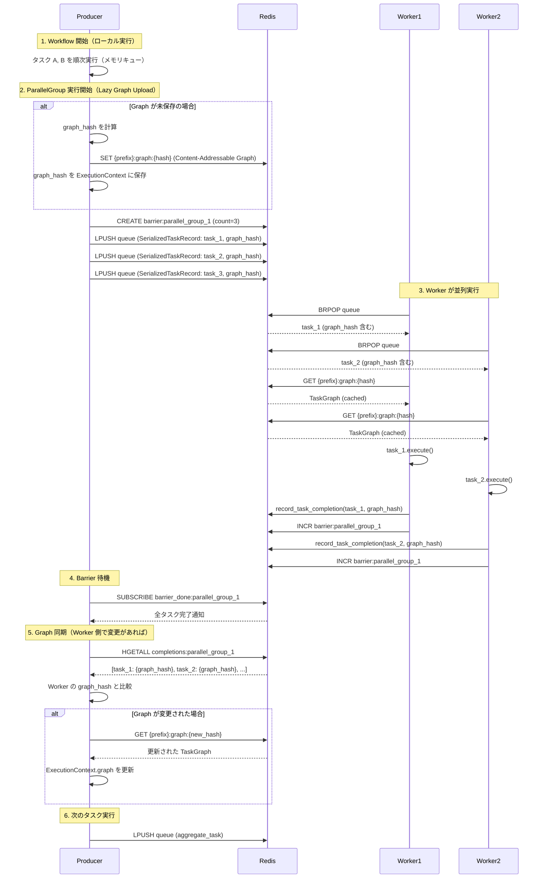

# Redis分散実行アーキテクチャ v3

**作成日:** 2025-01-20
**最終更新:** 2025-11-20
**ステータス:** Draft（設計レビュー中）
**対象:** graflow 分散実行基盤の再設計
**コンセプト:** Immutable Graph Snapshots - Simple, Clean, Maintainable

---

## 1. 設計概要

### 1.1 解決する問題

**現状の課題:**

1. **Graph重複問題**
   - 同じワークフロー定義を100回実行すると、Redisに100個のGraphが保存される
   - session_id単位の管理により、重複排除ができない
   - ストレージとネットワーク帯域の無駄

2. **動的タスクの将来対応**
   - `next_task()`, `next_iteration()` による実行時のGraph変更
   - 現状は分散実行では使用されていないが、将来の拡張に備える必要

### 1.2 コア・コンセプト: "Immutable Graph Snapshots"

分散システムにおける状態管理の複雑さを排除するため、**「グラフは不変（Immutable）なスナップショットである」**という原則を導入します。

**コア・フィロソフィー:**

1. **Content-Addressable**: グラフの同一性は「内容のハッシュ値」で定義する
   - Graphの内容（構造）からSHA256ハッシュを計算
   - ハッシュをキーとして保存 → 同じ内容なら重複しない
   - 不変性保証: 一度保存したGraphは変更されない

2. **Local Execution, Global Snapshot**: Worker内での動的変更はローカルで完結させ、分散実行（ParallelGroup）が必要になった時点でのみスナップショットを共有する
   - Worker内での`next_task()`による変更はローカルメモリで完結
   - ネストしたParallelGroupを実行する時のみ、新しいスナップショットとして保存
   - **親への同期不要**: 各Workerは独立した世界を持つ

3. **Lazy & Minimal**: 必要な時だけ、必要な分だけを扱う
   - **Lazy Upload**: ParallelGroup実行時に初めてGraphを保存（それまで不要）
   - **効率性**: 通常ケース（Graph変更なし）では1回のみ保存

**Bulk Synchronous Parallel (BSP) モデル:**
- ParallelGroup は Producer が全タスクを dispatch してから wait_barrier() で待機
- Worker はタスク実行 + barrier カウントのみ（後続タスクの enqueue は行わない）
- Producer が barrier 完了後に次のタスクを enqueue
- 依存カウンタは不要（BSP で十分）

### 1.3 設計原則

1. **Immutability**: 一度保存したGraphは変更しない
2. **Content-Addressable**: 内容ベースのキーで重複排除
3. **Worker Local & Lazy Propagation**: Worker内の変更はローカルで完結、分散実行時のみ共有
4. **BSP Coordination**: Bulk Synchronous Parallel モデルで同期
5. **Backward Compatible**: 既存のengine.pyの実行フローを維持

### 1.4 Architecture Overview



**実行フロー:**

1. **Producer: Workflow 開始（ローカル実行）**
   - メモリキューでタスク A, B を順次実行
   - この段階では Graph を Redis に保存しない（不要）

2. **Producer: ParallelGroup Dispatch（Lazy Graph Upload）**
   - **初回のみ**: graph_hash を計算し、Content-Addressable Graph として Redis に保存
   - graph_hash を ExecutionContext に保存
   - Barrier を作成（期待タスク数を設定）
   - 各タスクを SerializedTaskRecord として queue に enqueue（graph_hash 含む）

3. **Worker: 並列実行**
   - queue から SerializedTaskRecord を取得
   - graph_hash を使って Redis から Graph を取得（ローカルキャッシュ）
   - graph.get_node(task_id) でタスクを復元
   - タスクを実行

4. **Worker: 完了通知**
   - record_task_completion() で完了を記録
   - 現在の graph_hash を含める（next_task() で変更された可能性）
   - Barrier カウントをインクリメント

5. **Producer: Barrier 待機 & Graph 同期**
   - wait_barrier() で全タスク完了を待つ
   - completion results から graph_hash を収集
   - Worker 側で Graph が変更されていれば Producer の Graph を更新

6. **Producer: 次のタスク**
   - 更新された Graph で次のタスク（aggregate）を実行

---

## 2. アーキテクチャ設計

### 2.1 GraphStore (Immutable Graph Storage)

```python
import hashlib
import zlib
from typing import Optional
from redis import Redis
from cachetools import LRUCache
from graflow.core.graph import TaskGraph
from graflow.serialization import dumps, loads

class GraphStore:
    """Content-Addressable Graph Storage on Redis

    グラフの保存と取得を責務とする単一コンポーネント。
    内部でシリアライズ/デシリアライズ、圧縮、Redis操作を統合。

    運用上の改善:
    - Sliding TTL: load()時にexpireを延長（長時間実行ワークフロー対応）
    - zlib圧縮: ネットワーク帯域とRedisメモリを削減
    - LRUキャッシュ: Workerのメモリリークを防止
    """

    DEFAULT_TTL = 86400  # 24時間（長時間実行ワークフロー対応）
    DEFAULT_CACHE_SIZE = 100  # LRUキャッシュの最大サイズ

    def __init__(
        self,
        redis_client: Redis,
        key_prefix: str,
        ttl: int = DEFAULT_TTL,
        cache_size: int = DEFAULT_CACHE_SIZE
    ):
        """Initialize GraphStore

        Args:
            redis_client: Redis connection
            key_prefix: Redis key prefix (e.g., "app_name:workflows")
            ttl: Time-to-live in seconds (default: 24 hours)
            cache_size: LRU cache max size (default: 100 graphs)
        """
        self.redis = redis_client
        self.key_prefix = key_prefix
        self.ttl = ttl
        # LRU Cache: メモリリーク防止（長時間稼働Worker対応）
        self._local_cache: LRUCache = LRUCache(maxsize=cache_size)

    def save(self, graph: TaskGraph) -> str:
        """Graphを保存し、Content-Addressable Hashを返す

        同じ内容のGraphは同じhashを持つため、重複保存されない（べき等）。
        圧縮してRedisに保存することで、ネットワーク帯域とメモリを削減。

        Args:
            graph: TaskGraph instance to save

        Returns:
            graph_hash: SHA256 hash of the graph (hex string)
        """
        # Serialize and calculate hash (before compression)
        graph_bytes = dumps(graph)
        graph_hash = hashlib.sha256(graph_bytes).hexdigest()

        # Compress for storage efficiency
        compressed = zlib.compress(graph_bytes, level=6)

        # Save to Redis (atomic operation with SET NX EX)
        graph_key = f"{self.key_prefix}:graph:{graph_hash}"
        # SET NX EX: 存在しない場合のみ設定（アトミック、1ラウンドトリップ）
        self.redis.set(graph_key, compressed, nx=True, ex=self.ttl)

        # Update local cache
        self._local_cache[graph_hash] = graph

        return graph_hash

    def load(self, graph_hash: str) -> TaskGraph:
        """ハッシュからGraphを復元

        Sliding TTL: 参照されるたびにexpireを延長し、長時間実行ワークフローでの
        TTL切れを防止。

        Args:
            graph_hash: SHA256 hash of the graph

        Returns:
            TaskGraph instance

        Raises:
            ValueError: If graph not found in Redis (TTL expired or never uploaded)
        """
        # Check local cache first (LRU)
        if graph_hash in self._local_cache:
            return self._local_cache[graph_hash]

        # Load from Redis
        graph_key = f"{self.key_prefix}:graph:{graph_hash}"
        # Sliding TTL: Extend expire on every access
        # 長時間実行ワークフロー（例: 数時間のML training）でもGraphが消えない
        compressed = self.redis.getex(graph_key, ex=self.ttl)

        if not compressed:
            raise ValueError(
                f"Graph snapshot not found: {graph_hash}\n"
                f"Key: {graph_key}\n"
                f"This may indicate:\n"
                f"  - Graph TTL expiration (current TTL: {self.ttl}s)\n"
                f"  - Missing graph upload (Lazy Upload not triggered)\n"
                f"  - Redis eviction (memory pressure)"
            )

        # Decompress and deserialize
        graph_bytes = zlib.decompress(compressed)
        graph = loads(graph_bytes)

        # Update local cache (LRU)
        self._local_cache[graph_hash] = graph

        return graph
```

**特徴:**

1. **シンプルなAPI**:
   - `save(graph) → hash`: Graphを保存してhashを返す
   - `load(hash) → graph`: hashからGraphを復元

2. **Content-Addressable**:
   - 同じ内容のGraph = 同じhash
   - 100回実行しても1つだけ保存（ストレージ効率90%以上削減）

3. **べき等性**:
   - `save()`を何度呼んでも、同じhashなら重複保存されない
   - `SET NX EX`でアトミックに保存（1ラウンドトリップ）

4. **データ圧縮**:
   - zlib圧縮でRedisメモリとネットワーク帯域を削減
   - 圧縮レベル6（バランス型: 速度と圧縮率の中間）
   - 大規模Graphでは50-70%のサイズ削減が期待できる

5. **Sliding TTL（長時間実行ワークフロー対応）**:
   - デフォルトTTL: 24時間（1時間 → 24時間に変更）
   - `load()`時に自動的にexpireを延長
   - 数時間実行されるML trainingワークフローでもGraphが消えない

6. **LRUキャッシュ（メモリリーク防止）**:
   - `cachetools.LRUCache`でサイズ制限（デフォルト100個）
   - 長時間稼働するWorkerプロセスでもメモリ使用量が安定
   - Redisアクセスを削減してパフォーマンス向上

7. **明確なエラーメッセージ**:
   - Graph not foundの詳細な原因（TTL切れ、未アップロード、eviction）
   - 現在のTTL設定を表示してトラブルシューティングを支援

### 2.3 SerializedTaskRecord (Redis Queue Item)

```python
from dataclasses import dataclass, asdict
import json

@dataclass
class SerializedTaskRecord:
    """Redis永続化用のTaskRecord (Content-Addressable版)"""

    # タスク識別
    task_id: str
    session_id: str          # ワークフローインスタンスID
    graph_hash: str          # Content-Addressable key
    trace_id: str

    # 分散トレーシング
    group_id: Optional[str] = None
    parent_span_id: Optional[str] = None

    # メタデータ
    created_at: float

    def to_json(self) -> str:
        """JSON文字列にシリアライズ"""
        return json.dumps(asdict(self))

    @classmethod
    def from_json(cls, data: str) -> 'SerializedTaskRecord':
        """JSON文字列からデシリアライズ"""
        return cls(**json.loads(data))
```

**重要な特徴:**
- ✅ `graph_hash` で Graph を参照（session_id ではない）
- ✅ タスク識別情報のみ（~100 bytes）- Redisキューは単なるタスク配送機構
- ✅ `task_data` 不要（Graph に含まれる）
- ✅ `channel_config` 不要（Worker が持つ）
- ✅ **リトライ処理は Engine 側で実施**（統一実行ロジックの一部）

### 2.4 Graph保存の最適化（Lazy Upload）

#### 2.4.1 Workflow 開始時の処理

```python
# graflow/core/workflow.py
class WorkflowContext:
    def execute(self, start_node: Optional[str] = None, max_steps: int = 10) -> Any:
        """Workflowを実行"""
        # ... 既存の start_node 解決 ...

        from .context import ExecutionContext
        from .engine import WorkflowEngine

        exec_context = ExecutionContext.create(
            self.graph, start_node, max_steps=max_steps, tracer=self._tracer
        )

        # Redis への保存は行わない（Lazy Upload）
        # ParallelGroup 実行時に初めて保存される

        engine = WorkflowEngine()
        return engine.execute(exec_context)
```

**重要:**
- Workflow 開始時は **何もしない**（graph_hash計算も不要）
- Redis への保存は行わない（Lazy Upload）
- メモリキューで実行される場合、Graph は Redis に保存されない

#### 2.4.2 動的タスク生成への対応（Worker Local & Lazy Propagation）

**方針: Worker内での変更はローカルで完結、分散実行時のみ共有**

Worker内での`next_task()`によるGraph変更は、そのWorkerのローカルメモリ内でのみ完結させます。親（Producer）にGraphの変更を戻す必要はありません。

**シナリオA: Worker内でのローカル実行**

Workerが`next_task()`を呼び出し、後続タスクをローカル（または同一キュー）で実行する場合：

```python
# graflow/core/context.py
class ExecutionContext:
    def next_task(self, executable: Executable, goto: bool = False, _is_iteration: bool = False):
        """次のタスクを動的に追加"""
        task_id = executable.task_id
        is_new_task = task_id not in self.graph.nodes

        if is_new_task:
            # Graph にノードを追加（ローカルメモリのみ）
            self.graph.add_node(executable, task_id)

        # Queue に追加（メモリキューまたはRedisキュー）
        self.add_to_queue(executable)
        return task_id
```

**重要:**
- Worker内の`next_task()`は**ローカルGraphのみ変更**（Redisへの保存不要）
- Worker内のEngineがそのタスクをローカルで実行
- 分散共有する必要がないため、効率的

**シナリオB: ネストしたParallelGroupの実行**

Worker内でさらに`ParallelGroup`（分散実行）が開始される場合：

```python
# Worker (acting as Producer for nested group)
def execute_nested_group(self, group_tasks, context):
    # 1. Lazy Upload: 現在のローカルgraphの状態を保存
    # (next_task()で変更された最新のローカルgraphを使用)
    graph_hash = self.graph_store.save(context.graph)
    context.graph_hash = graph_hash

    # 2. 新しいhashを使って子タスクをDispatch
    for task in group_tasks:
        self.dispatch_task(task, group_id)

    # 3. Barrier待機
    self.wait_barrier(group_id)
```

**結論:**
- **親Producerへの「Graphのマージ/同期」は一切不要**
- 各Workerは独立した世界を持ち、必要になった時（分散実行時）だけ自分の世界（Graph）を公開（Upload）すれば良い
- シンプルで効率的、かつ状態管理の複雑さを排除

#### 2.4.3 ParallelGroup 実行時の Graph アップロード（Lazy Upload）

```python
# graflow/coordination/redis.py
class RedisCoordinator:
    def execute_group(
        self,
        group_id: str,
        tasks: List['Executable'],
        execution_context: 'ExecutionContext',
        handler: 'TaskHandler'
    ) -> None:
        """ParallelGroup 実行（Lazy Graph Upload）"""
        # Lazy Upload: 現在のgraphの状態を保存
        # (ProducerでもWorkerでも、分散実行を開始する側がこれを行う)
        graph_hash = self.graph_store.save(execution_context.graph)
        execution_context.graph_hash = graph_hash

        # BSP: 全タスクをDispatchしてからBarrier待機
        self.create_barrier(group_id, len(tasks))
        try:
            for task in tasks:
                self.dispatch_task(task, group_id)

            if not self.wait_barrier(group_id):
                raise TimeoutError(f"Barrier wait timeout for group {group_id}")

            # 完了後、次のタスクへ進む
            # 以下、既存の handler 処理 ...
```

**最適化のポイント:**
- ✅ **Lazy Upload**: ParallelGroup 実行時に初めて Graph を保存（それまで不要）
- ✅ **Content-Addressable**: 同じgraph_hashなら重複保存されない（graph_store.save()内で自動スキップ）
- ✅ **Worker Local**: Worker内での`next_task()`はローカルで完結、親への同期不要
- ✅ **Nested Support**: ネストしたParallelGroupも同じロジックで対応可能
- ✅ **分散実行のみ**: メモリキューでは不要（同一プロセスで Graph を直接参照）

**動作フロー（Redis backend の場合）:**

**ケース A: 通常のワークフロー（Graph 変更なし）**
1. Workflow 開始 → graph_hash を計算（保存はしない）
2. メモリキューでタスク A, B を実行
3. ParallelGroup 実行開始 → Graph を保存（Lazy Upload、同じhashなら自動スキップ）
4. Worker は graph_hash から Graph を取得して実行

**ケース B: Worker内でのローカル実行（next_task）**
1. ParallelGroup 実行開始 → Graph を保存
2. Worker: タスク実行中に `next_task()` 呼び出し
   - Worker のローカルGraph にノード追加（Redisに保存しない）
   - Worker内のEngineがそのタスクをローカル実行
3. Worker: タスク完了通知（通常のBarrierカウント）

**ケース C: Worker内でのネストしたParallelGroup**
1. ParallelGroup 実行開始 → Graph を保存
2. Worker: タスク実行中に `next_task()` でノード追加
3. Worker: ネストしたParallelGroupに到達
   - Workerが新しいProducerとして動作
   - 現在のローカルGraphから新しいgraph_hashを計算・保存（Lazy Upload）
   - 子タスクをDispatch（新しいgraph_hashを使用）
4. Worker: Barrier待機、完了後に親に戻る

**メモリキューの場合:**
- Graph は Producer のメモリ内に存在
- Worker（実際には同一プロセス）が直接 Graph を参照
- Redis への保存不要（同じメモリ空間）

### 2.5 ExecutionContextFactory (Worker側)

```python
# graflow/worker/context_factory.py
class ExecutionContextFactory:
    """Worker側でExecutionContextとタスクを再構築"""

    @staticmethod
    def create_from_record(
        record: SerializedTaskRecord,
        graph_store: GraphStore
    ) -> Tuple[ExecutionContext, Executable]:
        """SerializedTaskRecordからExecutionContextとタスクを復元

        Args:
            record: Redis から取得した TaskRecord
            graph_store: GraphStore instance

        Returns:
            (ExecutionContext, Executable)
        """
        # 1. graph_hash から Graph を取得
        graph = graph_store.load(record.graph_hash)
        # graph_store.load() は見つからない場合 ValueError を raise

        # 2. Graph から task を取得
        task = graph.get_node(record.task_id)

        if task is None:
            raise ValueError(
                f"Task {record.task_id} not found in graph {record.graph_hash}"
            )

        # 3. ExecutionContext を作成
        context = ExecutionContext(
            graph=graph,
            start_node=None,
            session_id=record.session_id,
            trace_id=record.trace_id,
            channel_backend="redis",
            config={"redis_client": graph_store.redis, "key_prefix": graph_store.key_prefix}
        )

        return context, task
```

**エラーハンドリング:**
- Graph が見つからない場合: `graph_store.load()` が明確なエラーメッセージとともに ValueError を raise
- Task が Graph に存在しない場合: エラー

### 2.6 BSP (Bulk Synchronous Parallel) モデルと Graph 同期

**現在の実装パターン:**

```
[Producer]
  1. ParallelGroup.run() 実行
  2. RedisCoordinator.execute_group() 呼び出し
     - create_barrier(group_id, task_count)
     - dispatch_task() × N (全タスク)
     - wait_barrier(group_id) ← ここで待機（BSP）
  3. barrier 完了後、completion results を収集
  4. Worker の Graph 変更を Producer に同期
  5. 次のタスク（aggregate）を enqueue

[Worker]
  1. Redis queue から task_spec を dequeue
  2. engine.execute(context, start_task_id=task_id)
     - タスク実行中に next_task() が呼ばれる可能性
     - Worker の Graph にノード追加
     - 新しい graph_hash で Redis に保存
  3. 実行完了後、notify_task_completion()
     - barrier カウントを増やす
     - 現在の graph_hash を completion に含める
     - 全タスク完了で barrier を通知
```

**Graph 構造:**
```
ParallelGroup (task_id="parallel_group_1")
    └─> aggregate

※ extract_1, extract_2, extract_3 は Graph のノードではない
  ParallelGroup の内部タスクとして扱われる
```

**依存関係の処理:**
- ParallelGroup 内のタスク間: 依存関係なし（並列実行）
- ParallelGroup → 次のタスク: Producer が barrier 完了後に enqueue
- **Worker は後続タスクを enqueue しない**（ParallelGroup の子タスクは Graph 外）

**BSP で十分な理由:**
1. ParallelGroup は1つの SuperStep
2. 全タスクを dispatch → 全完了を待つ → 次へ進む
3. Worker は単純な実行 + barrier カウント
4. 複雑な依存管理は不要

---

## 3. 実装詳細

### 3.1 Redisキー構造

```
{prefix}:graph:{graph_hash}              # Content-Addressable Graph (TTL: 1h)
{prefix}:queue                            # SerializedTaskRecord の FIFO queue
{prefix}:channel:{session_id}:*          # Channel データ (session単位)
{prefix}:barrier:{group_id}              # Barrier カウンタ
{prefix}:barrier:{group_id}:expected     # 期待するタスク数
{prefix}:completions:{group_id}          # タスク完了記録
```

**例:**
```
graflow:graph:a3f5e8c1d9b2...            # Graph (SHA256 hash)
graflow:queue                            # Task queue
graflow:channel:session-001:task_a.__result__
graflow:barrier:parallel_group_1         # Barrier カウンタ
graflow:completions:parallel_group_1     # 完了記録
```

### 3.2 データフロー

```
[Producer]
  1. Workflow定義完了
  2. WorkflowContext.execute() 呼び出し
  3. ParallelGroup実行時: graph_store.save(graph)
     → graph_hash を返す
     → Redis: {prefix}:graph:{graph_hash}
  4. ParallelGroup の各タスクを enqueue
     → SerializedTaskRecord(graph_hash=...) を LPUSH
  5. wait_barrier(group_id) で待機（BSP）
  6. 完了後、次のタスク（aggregate）を enqueue

[Worker]
  1. BRPOP → SerializedTaskRecord
  2. graph_store.load(graph_hash) → TaskGraph
  3. graph.get_node(task_id) → Executable
  4. タスク実行
  5. 結果を channel に保存
  6. notify_task_completion()
     - barrier カウント増加
     - completions に記録
```

### 3.3 SerializedTaskRecord の enqueue

```python
# graflow/coordination/redis.py
class RedisCoordinator:
    def dispatch_task(self, task: Executable, group_id: str) -> None:
        """タスクを Redis queue に dispatch"""
        context = task.get_execution_context()

        # graph_hash は ExecutionContext から取得
        graph_hash = getattr(context, 'graph_hash', None)
        if graph_hash is None:
            raise ValueError("graph_hash not set in ExecutionContext")

        record = SerializedTaskRecord(
            task_id=task.task_id,
            session_id=context.session_id,
            graph_hash=graph_hash,
            trace_id=context.trace_id,
            group_id=group_id,
            parent_span_id=getattr(context, 'span_id', None),
            created_at=time.time()
        )

        # Redis queue に push
        self.task_queue.redis_client.lpush(
            self.task_queue.queue_key,
            record.to_json()
        )
```

### 3.4 制約事項とベストプラクティス

分散実行の安定性を保つため、以下の制約とベストプラクティスを推奨します。

#### 3.4.1 ParallelGroup内での `goto` の使用制限

`ParallelGroup`内で実行されるタスクにおいて、`next_task(..., goto=True)`を使用して既存のタスクへジャンプすることは**推奨されません**。

**理由:**

1. **Barrier同期の破壊**: `goto`によって実行フローが予期せぬ方向に進むと、Barrier同期が正しく完了しない（あるいはデッドロックする）リスクがあります。
   - ParallelGroupは「N個のタスクが完了したらBarrierを解放」という前提で動作
   - `goto`によってタスク数が変動すると、この前提が崩れる

2. **分散コンテキストの複雑化**: Worker間を跨ぐジャンプはサポートされておらず、ローカル内でのジャンプに留めるべきですが、その挙動は直感的ではありません。

3. **Graph不変性の破綻**: `goto`はGraph構造の変更を伴う可能性があり、Immutable Graph Snapshotsの原則に反します。

**推奨パターン:**

分散実行内での動的制御は、以下のパターンに限定してください：

```python
# ✅ 推奨: 新規タスクの追加（順次実行）
@task(inject_context=True)
def dynamic_task(context):
    if some_condition:
        context.next_task(new_task)  # 新しいタスクを追加

# ✅ 推奨: 自己ループ（再実行）
@task(inject_context=True)
def retry_task(context):
    if not_done:
        context.next_iteration()  # 自分自身を再実行

# ❌ 非推奨: ParallelGroup内でのgoto
@task(inject_context=True)
def bad_pattern(context):
    if error:
        context.next_task(some_existing_task, goto=True)  # 避けるべき
```

#### 3.4.2 ネストしたParallelGroupのベストプラクティス

Worker内でネストしたParallelGroupを実行する場合：

- ✅ **推奨**: Worker自身が新しいProducerとして、ローカルGraphから新しいスナップショットを作成
- ✅ **推奨**: ネストの深さは2-3レベルまでに抑える（トラブルシューティングの容易さのため）
- ⚠️ **注意**: 過度なネストは複雑性を増し、デバッグを困難にする

---

## 4. 使用例と用途

### 4.1 基本的な使用パターン

**用途: ETL パイプラインの並列化**

```python
from graflow.core.workflow import workflow
from graflow.core.decorators import task
from graflow.coordination.base import CoordinationBackend
import redis

redis_client = redis.Redis(
    host='localhost', port=6379, db=0, decode_responses=True
)

@task
def extract_source_1():
    """データソース1からデータ抽出"""
    return {"source": "db1", "records": 1000}

@task
def extract_source_2():
    """データソース2からデータ抽出"""
    return {"source": "db2", "records": 1500}

@task
def extract_source_3():
    """データソース3からデータ抽出"""
    return {"source": "db3", "records": 2000}

@task(inject_context=True)
def aggregate(context: TaskExecutionContext):
    """全データソースの結果を集約"""
    r1 = context.get_result("extract_source_1")
    r2 = context.get_result("extract_source_2")
    r3 = context.get_result("extract_source_3")
    total = r1["records"] + r2["records"] + r3["records"]
    return {"total": total}

with workflow("etl_pipeline") as wf:
    # ParallelGroup with Redis backend
    parallel_extract = (
        extract_source_1 | extract_source_2 | extract_source_3
    ).with_execution(
        backend=CoordinationBackend.REDIS,
        backend_config={"key_prefix": "graflow"}
    ).set_group_name("parallel_extract")

    parallel_extract >> aggregate

    # Workflow実行（この時点で graph_hash が計算され、Redisに保存される）
    wf.execute(start_node="extract_parallel_extract", max_steps=10)
```

**実行フロー:**
1. Producer が graph_hash を計算・アップロード（1回のみ）
2. ParallelGroup の3タスクを Redis queue に dispatch
3. 3つの Worker が並列に各タスクを実行
4. 全タスク完了後（BSP）、aggregate を実行

### 4.2 Worker起動

```bash
# Terminal 1: Worker 1
python -m graflow.worker.main \
  --worker-id worker-1 \
  --redis-host localhost \
  --redis-port 6379 \
  --redis-key-prefix graflow

# Terminal 2: Worker 2
python -m graflow.worker.main \
  --worker-id worker-2 \
  --redis-host localhost \
  --redis-port 6379 \
  --redis-key-prefix graflow

# Terminal 3: Worker 3
python -m graflow.worker.main \
  --worker-id worker-3 \
  --redis-host localhost \
  --redis-port 6379 \
  --redis-key-prefix graflow
```

### 4.3 適用シナリオ

**✅ 適している用途:**
1. **並列データ処理**: 複数データソースからの抽出、複数ファイルの変換
2. **マイクロバッチ処理**: 小さなバッチを Worker プールで並列処理
3. **I/O バウンドタスク**: API 呼び出し、データベースクエリの並列化
4. **スケールアウト**: Worker を追加してスループット向上
5. **動的タスク生成**: 実行時の条件分岐による異なるタスクフロー（Worker Local で対応）
6. **ネストしたワークフロー**: Worker自身がProducerとして動作するネストしたParallelGroup

**⚠️ 制約のある用途:**
1. **ParallelGroup内での`goto`**: Barrier同期の破壊を避けるため非推奨（セクション3.4.1参照）
2. **過度にネストしたParallelGroup**: 2-3レベルまでに抑えることを推奨（トラブルシューティングの容易さのため）

**❌ 適していない用途:**
1. **タスク間の密な通信**: 頻繁なデータ交換が必要な場合（RedisChannelを使用すれば可能だが、ローカル実行の方が効率的）

---

## 5. 実装フェーズ

### Phase 1: Immutable Graph Storage（基盤構築）

まずは「GraphをRedisに置く」「ハッシュで参照する」部分のみを実装します。

**依存関係の追加:**
- [ ] `pyproject.toml` に `cachetools` 依存を追加（LRUキャッシュ用）

**実装:**
- [ ] `GraphStore` クラス実装
  - [ ] save/load メソッド（SHA256ハッシュ計算、シリアライズ）
  - [ ] zlib圧縮/解凍（level=6、ネットワーク帯域とRedisメモリ削減）
  - [ ] LRUキャッシュ（`cachetools.LRUCache`, maxsize=100、メモリリーク防止）
  - [ ] Sliding TTL（load時にexpire延長、長時間実行ワークフロー対応）
  - [ ] SET NX EX でアトミック保存（1ラウンドトリップ）
  - [ ] デフォルトTTL: 24時間（86400秒）
- [ ] `SerializedTaskRecord` 簡素化（`graph_hash`フィールド追加、リトライフィールド削除）
- [ ] `WorkflowContext.execute()` 修正（Lazy Upload: 何もしない、ParallelGroup実行時に初めて保存）
- [ ] `RedisCoordinator` に `graph_store` インスタンス追加
- [ ] `RedisCoordinator.execute_group()` 修正（Lazy Upload: graph_store.save() を呼び出し）
- [ ] `RedisCoordinator.dispatch_task()` 修正（graph_hashを含める）
- [ ] `ExecutionContextFactory` 実装（Worker側の復元ロジック、graph_storeを受け取る）
- [ ] `TaskWorker` に `graph_store` インスタンス追加
- [ ] `TaskWorker.process_task()` 修正（ExecutionContextFactory使用）
- [ ] `ExecutionContext.next_task()` 簡素化（ローカルGraphのみ変更、Redis保存不要）

**テスト:**
- [ ] 同じWorkflowを複数回実行してGraphが重複しないことを確認
- [ ] Workerがgraph_hashからGraphを正しく取得できることを確認
- [ ] Content-Addressableキャッシュヒット動作の確認（同じhashは再アップロードされない）
- [ ] Sliding TTL動作確認（load後にexpireが延長されることを確認）
- [ ] LRUキャッシュの動作確認（maxsizeを超えた場合に古いエントリが削除される）
- [ ] zlib圧縮の効果測定（大規模Graphでのサイズ削減率）
- [ ] 長時間実行ワークフロー（2時間以上）でTTL切れが起きないことを確認
- [ ] Graph TTL期限切れ時のエラーハンドリング
- [ ] BSP (Barrier) による並列実行の正常動作確認

**期待される効果:**
- Graph重複排除によるストレージ使用量の削減（90%以上）
- zlib圧縮によるネットワーク転送量の削減（50-70%）
- Sliding TTLにより長時間実行ワークフローでも安定動作
- LRUキャッシュにより長時間稼働WorkerのメモリリークなしWorker起動時のGraphキャッシュヒット率向上
- シンプルな実装（親への同期不要）

### Phase 2: ネスト実行の検証

動的タスク生成を含むネストされた`ParallelGroup`が正しく動作することを検証します。
（ロジック的にはPhase 1の実装で自然に対応できるはずですが、検証フェーズとして設けます）

**テスト:**
- [ ] Worker内での`next_task()`によるローカル実行が正しく動作することを確認
- [ ] Worker内でネストしたParallelGroupを実行した場合、新しいgraph_hashで子タスクがDispatchされることを確認
- [ ] 2-3レベルのネストしたParallelGroupが正しく動作することを確認
- [ ] Worker内で動的に追加されたタスクが、ネストしたParallelGroupを含む場合の動作確認
- [ ] ParallelGroup内での`goto`制限が守られていることを確認（ドキュメントと実装の整合性）

**想定ユースケース:**
- LLMエージェントによる動的なタスク生成後の並列処理
- 実行時の条件分岐による異なるタスクフローの生成
- Iterative processing + ParallelGroupの組み合わせ
- ネストしたワークフロー（Worker自身がProducerとして動作）

---

## 6. まとめ

### 6.1 設計の利点

1. **完全な重複排除**
   - Content-Addressable Graph により、同じワークフロー定義は1つだけ保存
   - ストレージ効率が大幅に向上（90%以上削減）

2. **シンプルかつクリーン**
   - **Immutable Graph Snapshots**: 状態管理の複雑さを排除
   - **Worker Local & Lazy Propagation**: 親への同期不要、各Workerは独立した世界
   - **Lazy Upload**: 必要な時だけ、必要な分だけを扱う
   - BSPモデルによるシンプルな同期

3. **メンテナンス性が高い**
   - 状態遷移が明示的であるため、デバッグやトレースが容易
   - Graphは不変なので、並行実行時の競合が発生しない
   - Worker間の複雑な同期ロジック不要

4. **Backward Compatible**
   - 既存のengine.pyの実行フローを維持
   - メモリキューとの共存可能
   - 既存のParallelGroup実装を活用

5. **運用上の堅牢性**
   - **Sliding TTL**: 長時間実行ワークフロー（数時間のML training）でもTTL切れなし
   - **zlib圧縮**: ネットワーク帯域とRedisメモリの削減（50-70%）
   - **LRUキャッシュ**: 長時間稼働WorkerでもメモリリークなしWorker起動時のGraphキャッシュヒット率向上
   - **明確なエラー**: TTL切れ、未アップロード、evictionを区別して診断

6. **将来の拡張性**
   - ネストしたParallelGroupを自然にサポート
   - 動的タスク生成が Phase 1 の実装で対応可能
   - Worker自身がProducerとして動作する柔軟性

### 6.2 v1 設計との比較

| 項目 | v1 | v2 |
|------|----|----|
| Graph管理 | session単位 | **graph_hash単位（Content-Addressable）** |
| Graph重複 | あり（100回 = 100個） | **なし（1個）** |
| Graph保存頻度 | タスクごと（N回） | **ParallelGroup実行時のみ（Lazy）** |
| Worker同期 | - | **不要（Worker Local）** |
| 依存管理 | engine.py の逐次処理 | **BSP (Barrier)** |
| 実装複雑度 | 低 | **低（よりシンプル）** |
| ストレージ効率 | 低 | **高** |
| スケーラビリティ | 中 | **高** |

### 6.3 推奨する実装順序

```
Phase 1: Immutable Graph Storage
  ↓ (最大の改善効果 + 動的タスクも対応可能)
Phase 2: ネスト実行の検証
  ↓ (検証フェーズ)
```

**Phase 1 だけで大きな価値**があり、動的タスク生成を含むネストされたParallelGroupも自然に対応できます。Phase 2は検証フェーズとして設けていますが、ロジック的にはPhase 1で完結します。

---

## 7. 環境互換性とライブラリ競合対策

### 7.1 問題の認識

**異なるアプリケーションが異なるライブラリバージョンを使用する場合の競合リスク:**

```
[App A - データ分析]             [App B - 機械学習]
Python 3.11                     Python 3.10
numpy 1.24.0                    numpy 1.26.0
pandas 2.0.0                    pandas 1.5.3
    ↓                               ↓
[Redis Queue]  ← 同じキュー
    ↓
[Worker Pool]  ← 共有 Worker
Python 3.11
numpy 1.24.0
```

**発生しうる問題:**

1. **デシリアライゼーションエラー**
   - cloudpickle でシリアライズされた関数が、Worker 側で異なるライブラリバージョンのためデシリアライズ失敗
   - 例: numpy の内部構造変更により pickle 互換性が破綻

2. **import エラー**
   - Producer 側で使用したライブラリが Worker 側に存在しない
   - 例: Producer が `scikit-learn` を使用、Worker には未インストール

3. **実行時エラー**
   - API の非互換性による実行時エラー
   - 例: pandas 1.x と 2.x で `.append()` メソッドの挙動が異なる

4. **意図しない動作**
   - バージョン違いによる計算結果の差異
   - 例: numpy の乱数生成アルゴリズム変更

### 7.2 解決策: Namespace 分離

**アプリケーション（グループ）単位で Worker プールを用意（key_prefix で完全分離）**

```bash
# App A: データ分析パイプライン
# Producer
python -m data_pipeline --redis-key-prefix app_a:workflows

# Worker Pool (App A 専用)
python -m graflow.worker.main --worker-id worker-a-1 --redis-key-prefix app_a:workflows
python -m graflow.worker.main --worker-id worker-a-2 --redis-key-prefix app_a:workflows

# App B: 機械学習トレーニング
# Producer
python -m ml_training --redis-key-prefix app_b:workflows

# Worker Pool (App B 専用)
python -m graflow.worker.main --worker-id worker-b-1 --redis-key-prefix app_b:workflows
```

**Redis キー構造（物理的に分離）:**
```
app_a:workflows:graph:{hash}       # App A の Graph（App B からアクセス不可）
app_a:workflows:queue              # App A の Queue
app_a:workflows:barrier:{group}    # App A の Barrier

app_b:workflows:graph:{hash}       # App B の Graph（App A からアクセス不可）
app_b:workflows:queue              # App B の Queue
app_b:workflows:barrier:{group}    # App B の Barrier
```

**重要なポイント:**
- ✅ **Content-Addressable Graph は key_prefix 配下に保存される**
  - `{key_prefix}:graph:{hash}` というキー構造
  - 異なる key_prefix = 異なる Redis キー = 物理的に分離
  - **他のアプリケーションの Graph が使われることは物理的にあり得ない**

- ✅ **完全な環境分離が可能**
  - App A: Python 3.11 + numpy 1.24.0
  - App B: Python 3.10 + numpy 1.26.0
  - 両者は完全に独立（競合なし）

- ✅ **シンプル**
  - 追加実装不要（既存の key_prefix 機能で実現）
  - 環境メタデータの管理不要
  - バージョンチェック不要

**制約:**
- ⚠️ Worker プールをアプリケーション単位で起動・管理する必要がある
- ⚠️ 同一アプリケーション内では Producer と Worker で**同じ環境を使用すること**（requirements.txt を統一）

### 7.3 ベストプラクティス

**1. アプリケーション（グループ）単位で key_prefix を分ける**

```python
# 悪い例（衝突リスク）
redis_key_prefix = "graflow"  # すべてのアプリケーションが同じ

# 良い例（Namespace 分離）
# アプリケーション名をベースにする
APP_NAME = "data_pipeline"  # または "ml_training", "etl_workflow" など
redis_key_prefix = f"{APP_NAME}:workflows"

# または環境変数から取得
import os
app_name = os.getenv("APP_NAME", "default")
redis_key_prefix = f"{app_name}:workflows"
```

**key_prefix の命名例:**
```python
# プロジェクト/アプリケーション単位
"data_pipeline:workflows"      # データ分析パイプライン
"ml_training:workflows"        # 機械学習トレーニング
"etl_batch:workflows"          # ETL バッチ処理
"sales_analysis:workflows"     # 営業分析ワークフロー

# 環境を含める場合（開発/本番の分離）
"data_pipeline:prod:workflows"  # 本番環境
"data_pipeline:dev:workflows"   # 開発環境
```

**2. 同一アプリケーション内で環境を統一する**

```bash
# requirements.txt を固定
numpy==1.24.0
pandas==2.0.0

# Producer と Worker で同じ環境を使用
pip install -r requirements.txt
```

**3. 環境を変える場合は新しい Namespace で起動**

```bash
# 古い環境（v1）
python -m graflow.worker.main --redis-key-prefix data_pipeline:v1:workflows

# 新しい環境（v2）に移行する場合
python -m graflow.worker.main --redis-key-prefix data_pipeline:v2:workflows
```

### 7.4 補足: Docker 実行サポート

graflow は既に Docker コンテナ内でのタスク実行をサポートしています（`examples/04_execution/docker_handler.py`）。

これにより、タスク単位で異なる環境を使用可能です：
- Worker 自体は Python 3.11 で起動
- 特定タスクだけ Docker コンテナ（Python 3.10 + 特定ライブラリ）で実行

ただし、**Phase 1 では Namespace 分離で十分**であり、Docker 実行は特殊なケースでの利用を想定しています。

### 7.5 まとめ

**環境競合問題への対応:**

✅ **Namespace 分離（key_prefix）で完全に解決**
- 追加実装不要
- key_prefix を分けるだけで物理的に分離
- 異なる環境（Python バージョン、ライブラリバージョン）が完全に独立

⚠️ **同一アプリケーション内での注意点:**
- Producer と Worker で同じ環境を使用すること
- requirements.txt を統一
- 同じ key_prefix を使用すること

🔮 **将来の拡張（必要に応じて）:**
- 環境検証機能（env_metadata）
- Kubernetes による自動スケーリング

---

## 8. 将来の改善

Phase 1の実装後、運用経験を積んで以下の改善を検討できます。

### 8.1 専用例外クラス（エラーハンドリング強化）

**現状（Phase 1）:**
- `GraphStore.load()`が`ValueError`を返す
- TTL切れ、未アップロード、Redis evictionを区別できない

**改善案:**
```python
# graflow/exceptions.py
class GraphStoreError(Exception):
    """GraphStore関連のエラーの基底クラス"""
    pass

class GraphExpiredError(GraphStoreError):
    """Graph TTL期限切れ（リトライしても無駄）"""
    def __init__(self, graph_hash: str, ttl: int):
        super().__init__(
            f"Graph expired: {graph_hash} (TTL: {ttl}s)\n"
            f"ワークフローが{ttl}秒を超えて実行されている可能性があります。\n"
            f"TTLを延長するか、Sliding TTLが正しく動作しているか確認してください。"
        )
        self.graph_hash = graph_hash
        self.ttl = ttl

class GraphNotFoundError(GraphStoreError):
    """Graph未アップロード（Lazy Upload未実行、リトライ可能）"""
    def __init__(self, graph_hash: str):
        super().__init__(
            f"Graph not uploaded: {graph_hash}\n"
            f"Lazy Uploadが実行されていない可能性があります。"
        )
        self.graph_hash = graph_hash

class GraphEvictedError(GraphStoreError):
    """Redis eviction（メモリ不足、Redis設定見直し）"""
    def __init__(self, graph_hash: str):
        super().__init__(
            f"Graph evicted: {graph_hash}\n"
            f"Redisのメモリ不足によりevictされた可能性があります。\n"
            f"Redisのmaxmemory設定とeviction policyを確認してください。"
        )
        self.graph_hash = graph_hash
```

**利点:**
- リトライ判断が可能（`GraphExpiredError` → リトライ不要、`GraphNotFoundError` → リトライ可能）
- 運用時のトラブルシューティングが容易
- 適切なアラート設定が可能（Expired → TTL調整、Evicted → Redisメモリ増強）

**実装タイミング:** Phase 1の運用で問題が発生した場合、Phase 2で追加

### 8.2 Graph圧縮レベルの動的調整

**現状（Phase 1）:**
- zlib圧縮レベル固定（level=6）

**改善案:**
- Graphサイズに応じて圧縮レベルを動的調整
- 小さいGraph（<10KB）: 圧縮なし or level=1（高速）
- 中規模Graph（10KB-100KB）: level=6（バランス）
- 大規模Graph（>100KB）: level=9（高圧縮）

**実装タイミング:** パフォーマンステストで必要性が確認されたら

### 8.3 GraphStoreのメトリクス収集

**改善案:**
- save/load の呼び出し回数
- キャッシュヒット率
- 平均Graph圧縮率
- TTL延長回数（Sliding TTLの有効性指標）

**利点:**
- 運用状況の可視化
- パフォーマンスボトルネックの特定
- キャパシティプランニング

**実装タイミング:** 本番運用後、監視が必要になったら

---

**Phase 1の設計は、これらの将来の改善を妨げない柔軟性を持っています。**
まずはシンプルな実装で価値を提供し、運用経験を積んで必要な改善を追加するアプローチを推奨します。
