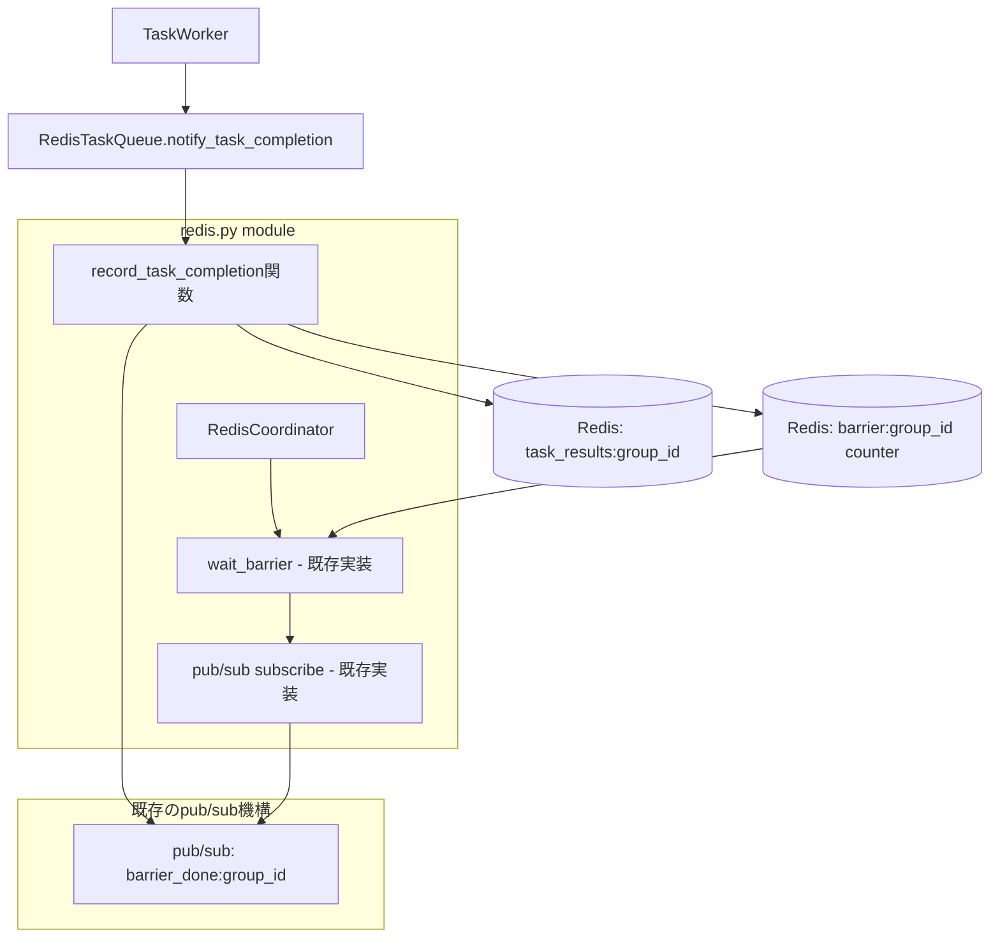

# Signal Barrier Implementation Design

## 問題の背景

現在の `graflow` アーキテクチャでは、`RedisCoordinator` の `signal_barrier()` メソッドが `TaskWorker` から呼び出されることが想定されているが、実際の実装では以下の問題がある：

1. **TaskWorkerからの通知が未実装**: TaskWorkerがタスク完了時にバリア通知を行っていない
2. **疎結合性の欠如**: TaskWorkerとRedisCoordinatorが直接結合することは設計上好ましくない
3. **グループ情報の不足**: TaskSpecにgroup_id情報が含まれていない

## 設計方針

### 基本原則

1. **疎結合性の維持**: TaskWorkerとRedisCoordinatorは互いを知らない設計
2. **責任の明確化**: 各コンポーネントの責任を明確に分離
3. **既存アーキテクチャとの整合性**: 現在のTaskQueue抽象化を活用

### 選択した解決方式

**TaskQueueを介したコールバック方式 + 既存pub/sub機構の活用**

```
TaskWorker → RedisTaskQueue.notify_task_completion() → record_task_completion()関数 → barrier counter更新 + pub/sub通知
    ↑                                                                                               ↓
疎結合：TaskQueueにのみ依存                                                      既存wait_barrier()が受信（無変更）
```

**重要**: 既存の`wait_barrier()`と`signal_barrier()`のpub/sub機構をそのまま活用

### アーキテクチャ図



## 実装詳細

### 1. TaskSpec拡張

```python
@dataclass
class TaskSpec:
    # 既存フィールド...
    group_id: Optional[str] = None  # バリア同期用グループID
```

### 2. graflow/coordination/redis.py に関数追加

```python
def record_task_completion(redis_client, key_prefix: str, task_id: str, 
                          group_id: str, success: bool, result=None):
    """タスク完了をRedisに記録（独立関数）"""
    import json
    import time
    
    task_result = {
        "task_id": task_id,
        "success": success,
        "timestamp": time.time(),
        "result": result
    }
    
    results_key = f"{key_prefix}:task_results:{group_id}"
    redis_client.hset(results_key, task_id, json.dumps(task_result))


def count_successful_tasks(redis_client, key_prefix: str, group_id: str) -> int:
    """成功したタスク数をカウント（独立関数）"""
    import json
    
    results_key = f"{key_prefix}:task_results:{group_id}"
    task_results = redis_client.hgetall(results_key)
    
    return sum(1 for result_json in task_results.values()
              if json.loads(result_json).get("success", False))


def cleanup_group_results(redis_client, key_prefix: str, group_id: str):
    """グループのタスク結果をクリーンアップ（独立関数）"""
    results_key = f"{key_prefix}:task_results:{group_id}"
    redis_client.delete(results_key)
```

### 3. RedisTaskQueue実装

```python
class RedisTaskQueue(TaskQueue):
    def notify_task_completion(self, task_id: str, success: bool, 
                             group_id: Optional[str] = None,
                             result: Optional[Any] = None) -> None:
        """タスク完了通知をredis.pyの関数に委譲"""
        if group_id:
            from graflow.coordination.redis import record_task_completion
            record_task_completion(
                self.redis_client, self.key_prefix, 
                task_id, group_id, success, result
            )
```

### 4. TaskWorker修正

```python
class TaskWorker:
    def _task_completed(self, task_spec: Any, future: Future) -> None:
        # 既存の処理...
        
        # TaskQueue経由でタスク完了を通知
        group_id = getattr(task_spec, 'group_id', None)
        if group_id:
            self.queue.notify_task_completion(
                task_id, success, group_id, result.get('result')
            )
```

### 5. RedisCoordinator修正（最小限の変更）

```python
class RedisCoordinator:
    # wait_barrier()は無変更！既存のpub/sub機構がそのまま動作
    # signal_barrier()も無変更！
    
    def dispatch_task(self, task_spec: TaskSpec, group_id: str) -> None:
        """タスクをディスパッチし、group_idを設定"""
        queue_task_spec = self._convert_to_queue_task_spec(task_spec)
        queue_task_spec.group_id = group_id  # group_id情報を追加
        
        self.task_queue.enqueue(queue_task_spec)
    
    def cleanup_barrier(self, barrier_id: str) -> None:
        """バリア情報とタスク結果をクリーンアップ"""
        if barrier_id in self.active_barriers:
            # 既存のクリーンアップ処理...
            barrier_info = self.active_barriers[barrier_id]
            self.redis.delete(barrier_info["key"])
            self.redis.delete(f"{barrier_info['key']}:expected")
            
            # タスク結果もクリーンアップ（追加）
            cleanup_group_results(
                self.redis, self.task_queue.key_prefix, barrier_id
            )
            
            with self._lock:
                del self.active_barriers[barrier_id]
```

**重要**: `wait_barrier()`と`signal_barrier()`は変更不要。既存のpub/sub機構が自動的にTaskWorkerからの通知を受信します。

## 実装ステップ

### Phase 1: TaskQueue拡張
- [x] TaskQueue基底クラスに`notify_task_completion`メソッド追加
- [x] TaskSpecに`group_id`フィールド追加

### Phase 2: Redis関数実装
- [x] graflow/coordination/redis.pyに`record_task_completion`関数追加
  - 既存の`signal_barrier()`と同じpub/sub機構を活用
  - タスク結果記録 + アトミックなbarrier counter更新
- [x] 同モジュールに`cleanup_group_results`関数追加

### Phase 3: RedisTaskQueue修正
- [x] `notify_task_completion`でのredis関数呼び出し実装
- [x] group_id情報のシリアライズ/デシリアライズ対応
  - `enqueue()`: TaskSpecからgroup_idをJSON化
  - `dequeue()`: JSONからgroup_idを復元

### Phase 4: TaskWorker修正
- [x] `_task_completed`メソッドでのコールバック呼び出し
  - TaskQueueの`notify_task_completion()`を適切に呼び出し
  - group_id情報の取得と転送

### Phase 5: RedisCoordinator修正
- [ ] `dispatch_task`でのgroup_id設定
- [ ] `cleanup_barrier`での`cleanup_group_results`呼び出し追加
- [x] `signal_barrier`は既存のpub/sub機構で自動化（関数から呼び出し）

### Phase 6: テスト・検証
- [ ] 単体テストの作成
- [ ] 統合テストでのバリア同期確認
- [ ] 既存の`wait_barrier()`が無変更で動作することを確認

## 期待される効果

### メリット

1. **完全疎結合**: TaskWorkerとRedisCoordinatorが互いを知らない
2. **既存実装への影響最小**: `wait_barrier()`と`signal_barrier()`が無変更で動作
3. **確実性**: `signal_barrier`呼び忘れリスクが完全になくなる
4. **既存アーキテクチャ活用**: 実績あるpub/sub機構を再利用
5. **シンプル**: 特別な設定やポーリング不要、リアルタイム通知
6. **拡張性**: 他のTaskQueue実装でも同様の仕組みが使える
7. **デバッグ性**: Redis内のタスク状態が直接確認可能

### デメリットと対応策

1. **pub/sub接続**: Redis pub/sub接続の維持が必要
   - **対応**: 既存実装で実績あり、接続断でも自動復旧
2. **Redis容量**: タスク結果の一時保存
   - **対応**: バリア完了時の自動クリーンアップで対処
3. **メッセージ順序**: pub/subメッセージの順序保証なし
   - **対応**: barrier counterによる冪等性で順序に依存しない設計

## 運用上の考慮事項

### Redis設定
- 特別な設定は不要（標準的なRedis機能のみ使用）
- メモリ使用量: グループあたり数KB程度の一時データ
- 既存のpub/sub設定をそのまま活用

### 監視・メトリクス
- pub/sub接続状態: 既存の監視機構を活用
- バリア完了時間: ログで確認可能（リアルタイム）
- タスク失敗率: Redis内の結果から算出可能

### エラーハンドリング
- Redis接続エラー: TaskQueueレベルでの例外処理
- pub/sub接続断: 既存の自動復旧機構を活用
- バリアタイムアウト: configurable timeout（デフォルト30秒）

## まとめ

この設計により、`signal_barrier()`の直接呼び出しが不要になり、疎結合で確実なバリア同期機構を実現できる。

### 実装の最大の特徴

1. **既存実装の活用**: `wait_barrier()`と`signal_barrier()`の実績あるpub/sub機構をそのまま再利用
2. **最小限の変更**: 新規関数追加のみで既存コードへの影響を最小化
3. **確実性**: TaskWorkerからの通知が自動的に既存のpub/subチャンネルに配信される
4. **疎結合性**: TaskWorkerとRedisCoordinatorが完全に分離された設計

既存のアーキテクチャを大きく変更せずに、TaskQueueの抽象化と実績あるRedis pub/sub機構を活用した自然で確実な解決策となる。TaskWorkerの開発者は新しい通知機構について何も知る必要がなく、既存の`wait_barrier()`が透明にTaskWorkerからの通知を受信する。