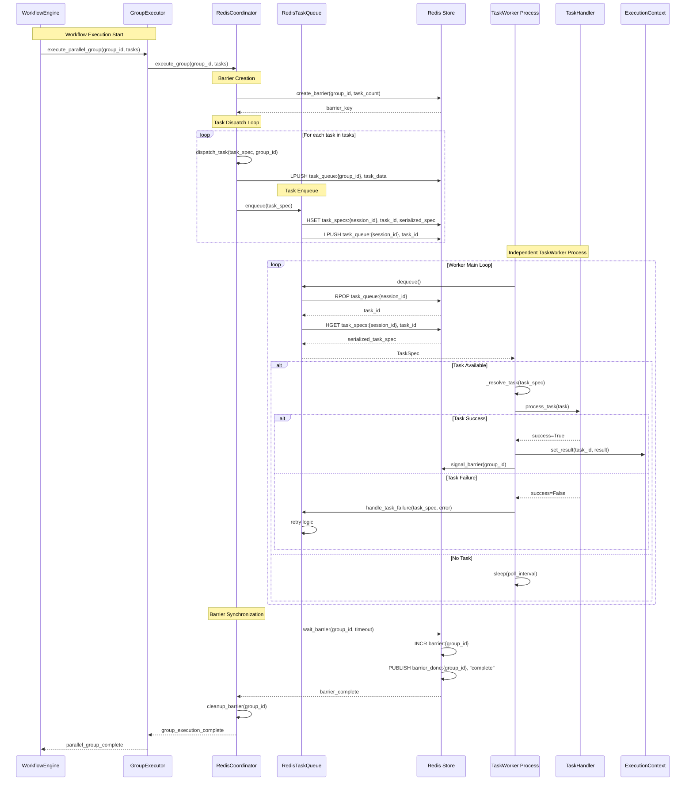
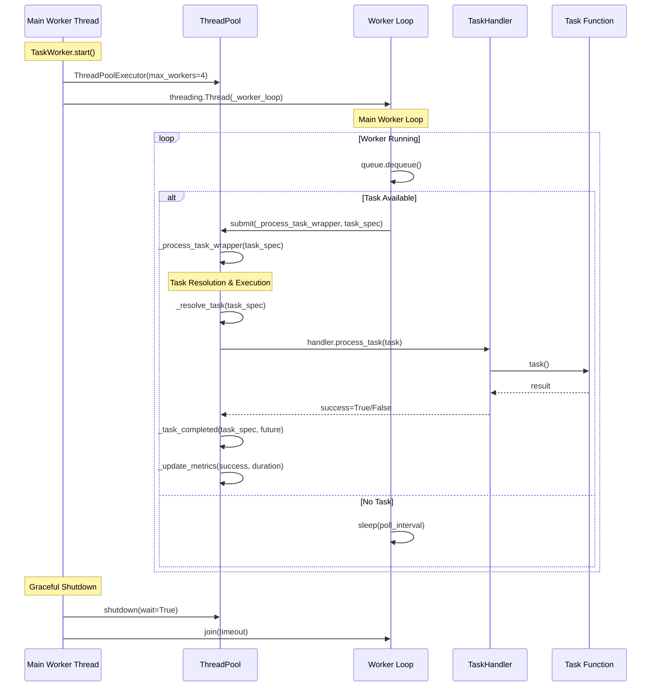
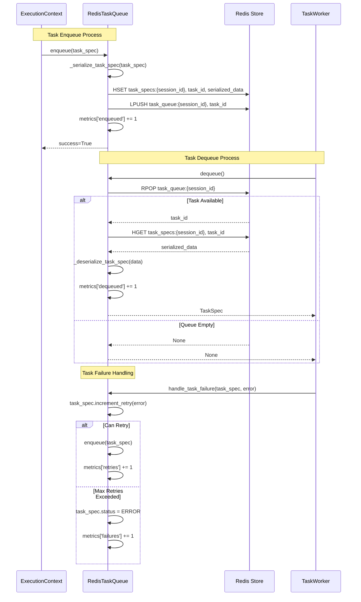

# Graflow Task Graph Execution Architecture

This document describes the execution architecture in graflow that separates **workflow context management**, **execution control**, and **task execution** with support for **cyclic task graphs**, **channel-based data exchange**, **context-aware task execution**, and **distributed task processing** through TaskWorker components.

---

## 🧠 Motivation

The graflow architecture separates concerns to provide:

- **Clear separation** between workflow definition and execution
- **Channel-based communication** for reliable data exchange between tasks
- **Context-aware execution** supporting both workflow mode and direct debugging mode
- **Cycle management** with configurable limits per task
- **State persistence** through execution contexts and channels
- **Distributed task execution** through independent TaskWorker processes
- **Queue-based task coordination** supporting both in-memory and Redis backends

---

## 🎯 Goals

Build a system where:

- **WorkflowContext** manages task graph definition and scoped task registration
- **ExecutionContext** manages execution state, channels, and task coordination
- **TaskExecutionContext** provides per-task execution state and cycle management
- **WorkflowEngine** orchestrates task execution with proper dependency resolution
- **Channel system** handles all data exchange between tasks with type safety
- **TaskFlow API** enables intuitive workflow definition with automatic dependency detection
- **TaskWorker** processes execute tasks independently with configurable handlers
- **TaskQueue** backends coordinate distributed task execution

---

## 🧱 Architecture Overview

```text
+---------------------+    +---------------------+    +---------------------+
|   WorkflowContext   |    |  ExecutionContext   |    |   WorkflowEngine    |
|---------------------|    |---------------------|    |---------------------|
| - TaskGraph         |    | - TaskGraph ref     |    | - ExecutionContext  |
| - Task registration |    | - Channel system    |    | - Task scheduling   |
| - Dependency edges  |    | - Task contexts     |    | - Dependency logic  |
| - Context vars      |    | - TaskQueue mgmt    |    | - Cycle management  |
+---------------------+    +---------------------+    +---------------------+
         |                           |                           |
         v                           v                           v
+---------------------+    +---------------------+    +---------------------+
|  TaskWrapper/Task   |    | TaskExecutionCtx    |    |   Channel System    |
|---------------------|    |---------------------|    |---------------------|
| - Function wrapper  |    | - Per-task state    |    | - MemoryChannel     |
| - Context detection |    | - Cycle counting    |    | - TypedChannel      |
| - Direct/Flow exec  |    | - Local data        |    | - Data exchange     |
+---------------------+    +---------------------+    +---------------------+
                                       |
                                       v
+---------------------+    +---------------------+    +---------------------+
|    TaskQueue        |    |     TaskWorker      |    |   TaskHandler       |
|---------------------|    |---------------------|    |---------------------|
| - InMemoryQueue     |    | - Process isolation |    | - InProcess exec    |
| - RedisQueue        |    | - Concurrent tasks  |    | - Async exec        |
| - TaskSpec mgmt     |    | - Metrics tracking  |    | - Docker exec       |
| - Retry logic       |    | - Signal handling   |    | - Custom handlers   |
+---------------------+    +---------------------+    +---------------------+
```

---

## 📦 1. `WorkflowContext`: Task Graph Definition and Management

```python
class WorkflowContext:
    """Context for workflow definition and scoped task registration."""
    
    def __init__(self, name: str):
        self.name = name
        self.graph = TaskGraph()
        self._task_counter = 0
        self._group_counter = 0
    
    def __enter__(self):
        """Enter workflow context - set as current context."""
        self._previous_context = _current_context.get()
        _current_context.set(self)
        return self
    
    def __exit__(self, exc_type, exc_val, exc_tb):
        """Exit workflow context - restore previous context."""
        _current_context.set(self._previous_context)
    
    def add_node(self, name: str, task: Executable) -> None:
        """Add task node to workflow graph."""
        self.graph.add_node(name, task)
    
    def add_edge(self, from_node: str, to_node: str) -> None:
        """Add dependency edge between tasks."""
        self.graph.add_edge(from_node, to_node)
    
    def execute(self, start_node: Optional[str] = None, max_steps: int = 10, 
                queue_backend: str = "in_memory") -> None:
        """Execute the workflow using WorkflowEngine."""
        # Create execution context with queue backend configuration
        exec_context = ExecutionContext.create(
            self.graph, start_node, max_steps=max_steps, 
            queue_backend=queue_backend
        )
        engine = WorkflowEngine()
        engine.execute(exec_context)
```

---

## ⚙ 2. `ExecutionContext`: Execution State and Channel Management

```python
class ExecutionContext:
    """Encapsulates execution state and provides execution methods."""
    
    def __init__(self, graph: TaskGraph, start_node: str, max_steps: int = 10,
                 queue_backend: str = "in_memory", queue_config: dict = None):
        self.session_id = str(uuid.uuid4().int)
        self.graph = graph
        self.queue = deque([start_node])
        self.start_node = start_node
        self.max_steps = max_steps
        self.steps = 0
        self.executed = []
        
        # Channel-based result management
        self.channel = MemoryChannel(self.session_id)
        
        # Task queue for distributed execution
        self.task_queue = self._create_task_queue(queue_backend, queue_config or {})
        
        # Cycle management
        self.cycle_controller = CycleController(default_max_cycles=10)
        
        # Task execution contexts
        self._task_execution_stack: list[TaskExecutionContext] = []
        self._task_contexts: dict[str, TaskExecutionContext] = {}
    
    def _create_task_queue(self, backend: str, config: dict):
        """Create task queue based on backend configuration."""
        if backend == "redis":
            from graflow.queue.redis import RedisTaskQueue
            return RedisTaskQueue(execution_context=self, **config)
        else:  # in_memory
            from graflow.queue.memory import InMemoryTaskQueue
            return InMemoryTaskQueue(execution_context=self)
    
    def set_result(self, node: str, result: Any) -> None:
        """Store execution result using channel system."""
        channel_key = f"{node}.__return_value__"
        self.channel.set(channel_key, result)
    
    def get_result(self, node: str, default: Any = None) -> Any:
        """Get execution result from channel system."""
        channel_key = f"{node}.__return_value__"
        return self.channel.get(channel_key, default)
    
    @contextmanager
    def executing_task(self, task: Executable):
        """Context manager for task execution with proper cleanup."""
        task_ctx = self.create_task_context(task.task_id)
        self.push_task_context(task_ctx)
        try:
            task.set_execution_context(self)
            yield task_ctx
        finally:
            self.pop_task_context()
```

---

## 🔄 3. `TaskExecutionContext`: Per-Task State Management

```python
class TaskExecutionContext:
    """Per-task execution context managing task-specific state and cycles."""
    
    def __init__(self, task_id: str, execution_context: ExecutionContext):
        self.task_id = task_id
        self.execution_context = execution_context
        self.start_time = time.time()
        self.cycle_count = 0
        self.max_cycles = execution_context.cycle_controller.get_max_cycles_for_node(task_id)
        self.retries = 0
        self.max_retries = execution_context.default_max_retries
        self.local_data: dict[str, Any] = {}
    
    def can_iterate(self) -> bool:
        """Check if this task can execute another cycle."""
        return self.cycle_count < self.max_cycles
    
    def register_cycle(self) -> int:
        """Register a cycle execution and return new count."""
        if not self.can_iterate():
            raise ValueError(f"Cycle limit exceeded for task {self.task_id}")
        self.cycle_count += 1
        self.execution_context.cycle_controller.cycle_counts[self.task_id] = self.cycle_count
        return self.cycle_count
    
    def get_channel(self) -> Channel:
        """Get communication channel."""
        return self.execution_context.get_channel()
    
    def get_typed_channel(self, message_type: Type[T]) -> TypedChannel[T]:
        """Get a type-safe communication channel."""
        channel = self.execution_context.get_channel()
        return TypedChannel(channel, message_type)
    
    def next_iteration(self, data: Any = None) -> str:
        """Create iteration task using this task's context."""
        return self.execution_context.next_iteration(data, self.task_id)
```

---

## 🚀 4. `TaskWrapper`: Context-Aware Task Execution

```python
class TaskWrapper(Executable):
    """Wrapper class for function-based tasks with context-aware execution."""
    
    def __init__(self, task_id: str, func, inject_context: bool = False):
        self._task_id = task_id
        self.func = func
        self.inject_context = inject_context
        self._register_to_context()
    
    def __call__(self, *args, **kwargs) -> Any:
        """Context-aware function call - workflow vs direct execution."""
        # Check if we're within a workflow context
        from .workflow import get_current_workflow_context
        current_workflow_context = get_current_workflow_context(create_if_not_exist=False)
        
        if current_workflow_context is not None:
            # Within workflow context - use workflow execution mode
            if self.inject_context:
                exec_context = self.get_execution_context()
                task_context = exec_context.current_task_context
                if task_context:
                    return self.func(task_context, *args, **kwargs)
                else:
                    with exec_context.executing_task(self) as task_ctx:
                        return self.func(task_ctx, *args, **kwargs)
            return self.func(*args, **kwargs)
        else:
            # Outside workflow context - direct function call for debugging
            return self.func(*args, **kwargs)
    
    def run(self) -> Any:
        """Execute the wrapped function within execution context."""
        if self.inject_context:
            exec_context = self.get_execution_context()
            task_context = exec_context.current_task_context
            if task_context:
                return self.func(task_context)
            else:
                with exec_context.executing_task(self) as task_ctx:
                    return self.func(task_ctx)
        return self.func()
```

---

## 🚀 5. Distributed Task Execution with TaskWorker

The TaskWorker system enables distributed task execution through independent processes:

```python
class TaskWorker:
    """Worker that processes tasks from a queue using a specified handler."""
    
    def __init__(self, queue: Any, handler: TaskHandler, worker_id: str,
                 max_concurrent_tasks: int = 4, poll_interval: float = 0.1):
        self.queue = queue
        self.handler = handler
        self.worker_id = worker_id
        self.max_concurrent_tasks = max_concurrent_tasks
        self.poll_interval = poll_interval
        
        # ThreadPoolExecutor for concurrent task processing
        self._executor = None
        self.is_running = False
        
        # Metrics tracking
        self.tasks_processed = 0
        self.tasks_succeeded = 0
        self.tasks_failed = 0
    
    def start(self) -> None:
        """Start the worker with thread pool for concurrent execution."""
        self.is_running = True
        self._executor = ThreadPoolExecutor(
            max_workers=self.max_concurrent_tasks,
            thread_name_prefix=f"worker-{self.worker_id}"
        )
        self._worker_thread = threading.Thread(target=self._worker_loop)
        self._worker_thread.start()
    
    def _worker_loop(self) -> None:
        """Main worker loop - polls for tasks and processes them."""
        while self.is_running:
            task_spec = self.queue.dequeue()
            if task_spec:
                self._submit_task(task_spec)
            else:
                time.sleep(self.poll_interval)

class TaskHandler(ABC):
    """Abstract base class for task processing handlers."""
    
    @abstractmethod
    def _process_task(self, task: Any) -> bool:
        """Custom task processing implementation."""
        pass

class InProcessTaskExecutor(TaskHandler):
    """Execute tasks directly in the worker process."""
    
    def _process_task(self, task: Any) -> bool:
        try:
            result = task()  # Execute the task
            return True
        except Exception as e:
            logger.error(f"Task execution failed: {e}")
            return False

# Command-line TaskWorker process
# Usage: python -m graflow.worker.main --queue-type redis --worker-id worker1
```

### TaskWorker Integration with ExecutionContext

```python
# In ExecutionContext - dispatch tasks to distributed workers
def dispatch_task_to_workers(self, task_spec: TaskSpec) -> None:
    """Send task to TaskWorker processes via queue."""
    self.task_queue.enqueue(task_spec)

# TaskWorker resolves tasks from TaskSpec
def _resolve_task_from_spec(self, task_spec: TaskSpec) -> Task:
    """Resolve actual Task object from TaskSpec."""
    # Future implementation: resolve from execution context
    node_id = task_spec.node_id
    return self.execution_context.graph.get_node(node_id)
```

---

## 💾 6. Channel-Based Data Exchange

```python
class MemoryChannel(Channel):
    """In-memory channel for task data exchange."""
    
    def set(self, key: str, value: Any) -> None:
        """Store data with key."""
        self._data[key] = value
    
    def get(self, key: str, default: Any = None) -> Any:
        """Retrieve data by key."""
        return self._data.get(key, default)
    
    def has(self, key: str) -> bool:
        """Check if key exists."""
        return key in self._data

class TypedChannel(Generic[T]):
    """Type-safe wrapper around Channel."""
    
    def __init__(self, channel: Channel, message_type: Type[T]):
        self.channel = channel
        self.message_type = message_type
    
    def send(self, key: str, message: T) -> None:
        """Send typed message."""
        # Type validation can be added here
        self.channel.set(key, message)
    
    def receive(self, key: str) -> Optional[T]:
        """Receive typed message."""
        return self.channel.get(key)

# Usage in execution context
def set_result(self, node: str, result: Any) -> None:
    """Store execution result using channel system."""
    channel_key = f"{node}.__return_value__"
    self.channel.set(channel_key, result)

def get_result(self, node: str, default: Any = None) -> Any:
    """Get execution result from channel system."""
    channel_key = f"{node}.__return_value__"
    return self.channel.get(channel_key, default)
```

---

## 🔄 7. Task Execution Sequence Diagrams

### 7.1 Distributed Task Execution with Redis Backend



### 7.2 TaskWorker Internal Processing Flow



### 7.3 Redis TaskQueue Operations



---

## 🔄 8. Complete Execution Flow with Distributed Processing

```python
# 1. Workflow Definition with Distributed Execution
with workflow("data_pipeline") as wf:
    @task(inject_context=True)
    def extract(ctx):
        result = {"data": [1, 2, 3]}
        ctx.get_channel().set("extracted_data", result)
        return result
    
    @task(inject_context=True)
    def transform(ctx):
        data = ctx.get_channel().get("extracted_data")
        result = {"processed": [x * 2 for x in data["data"]]}
        return result
    
    # Define dependencies
    extract >> transform

# 2. Start distributed workers (separate processes)
# Terminal 1: python -m graflow.worker.main --queue-type redis --worker-id worker1
# Terminal 2: python -m graflow.worker.main --queue-type redis --worker-id worker2

# 3. Execute workflow with Redis queue backend
wf.execute(start_node="extract", queue_backend="redis")

# 4. Execution flow:
# - WorkflowContext.execute() creates ExecutionContext with Redis TaskQueue
# - WorkflowEngine dispatches tasks to TaskQueue
# - Independent TaskWorker processes pick up tasks and execute them
# - Results are stored back in Redis channels for coordination

# 5. Direct debugging mode (unchanged)
@task
def debug_task(x: int) -> int:
    return x * 2

# Outside workflow context - direct execution
result = debug_task(5)  # Returns 10 immediately
print(result)  # 10 - no distributed processing or channel involvement
```

## ✅ Architecture Advantages

| Feature | Benefit |
|---------|---------|
| **Context Separation** | Clear distinction between workflow definition and execution |
| **Channel-based Communication** | Reliable, type-safe data exchange between tasks |
| **Context-aware Execution** | Tasks can run in workflow mode or direct mode for debugging |
| **Cycle Management** | Per-task cycle limits with configurable thresholds |
| **State Persistence** | Execution state managed through channels and contexts |
| **Type Safety** | TypedChannel provides compile-time type checking |
| **Debugging Support** | Direct task execution outside workflow context |
| **Distributed Processing** | Independent TaskWorker processes for scalable execution |
| **Queue Backend Flexibility** | Support for in-memory and Redis-based task queues |
| **Concurrent Task Handling** | ThreadPoolExecutor enables parallel task processing |
| **Process Isolation** | TaskWorker failures don't affect main workflow process |
| **Modular Design** | Clear separation of concerns across components |

---

## 🎯 Use Cases

This architecture is particularly well-suited for:

### 1. **AI/ML Pipelines with Distributed Processing**
```python
with workflow("ml_pipeline") as wf:
    @task
    def load_data(): 
        return load_dataset()
    
    @task  
    def preprocess(ctx):
        data = ctx.get_result("load_data")
        return clean_and_transform(data)
    
    @task
    def train_model(ctx):
        data = ctx.get_result("preprocess") 
        return train_ml_model(data)
    
    load_data >> preprocess >> train_model

# Execute with distributed workers for CPU-intensive tasks
# Start workers: python -m graflow.worker.main --queue-type redis --handler-type inprocess
wf.execute(start_node="load_data", queue_backend="redis")
```

### 2. **Cyclic Workflows**
```python
@task(inject_context=True)
def iterative_optimization(ctx):
    if ctx.cycle_count < 5:
        # Continue iteration
        return ctx.next_iteration(improved_params)
    else:
        return final_result
```

### 3. **Interactive Debugging and Development**
```python
# Debug individual tasks
@task
def complex_calculation(x, y):
    return expensive_operation(x, y)

# Direct testing - no workflow context needed
result = complex_calculation(10, 20)  # Immediate execution
assert result > 0

# Test TaskWorker locally for development
from graflow.worker.worker import TaskWorker
from graflow.worker.handler import InProcessTaskExecutor
from graflow.queue.memory import InMemoryTaskQueue

# Create local worker for testing
queue = InMemoryTaskQueue(execution_context=mock_context)
handler = InProcessTaskExecutor()
worker = TaskWorker(queue, handler, "dev_worker")
worker.start()
```

### 4. **Scalable Distributed Processing**
```python
# Production deployment with multiple worker processes
# Each running on different machines or containers

# Machine 1: Start high-CPU workers
# python -m graflow.worker.main --queue-type redis --worker-id cpu-worker-1 --max-concurrent-tasks 8

# Machine 2: Start GPU workers with Docker handler
# python -m graflow.worker.main --queue-type redis --worker-id gpu-worker-1 --handler-type docker

# Main process: Submit workflow
with workflow("distributed_processing") as wf:
    # Define compute-intensive tasks
    wf.execute(queue_backend="redis")  # Automatically distributed to available workers
```

---

## 📝 Summary

The graflow architecture provides a robust, scalable foundation for workflow execution with:

- **Clear separation** between definition, execution, and task logic
- **Channel-based data flow** ensuring reliable task communication  
- **Context-aware execution** supporting both workflow and debugging modes
- **Comprehensive cycle management** preventing infinite loops
- **Type-safe communication** through TypedChannel system
- **Distributed task processing** via independent TaskWorker processes
- **Flexible execution backends** supporting local and Redis-based coordination
- **Concurrent task handling** with ThreadPoolExecutor for parallel processing
- **Process isolation** ensuring fault tolerance in distributed environments
- **Modular, testable components** with well-defined responsibilities

This design enables complex workflow patterns while maintaining simplicity for common use cases, making it ideal for AI/ML pipelines, data processing workflows, distributed computing scenarios, and interactive development environments. The TaskWorker system provides the foundation for horizontal scaling and fault-tolerant execution.

