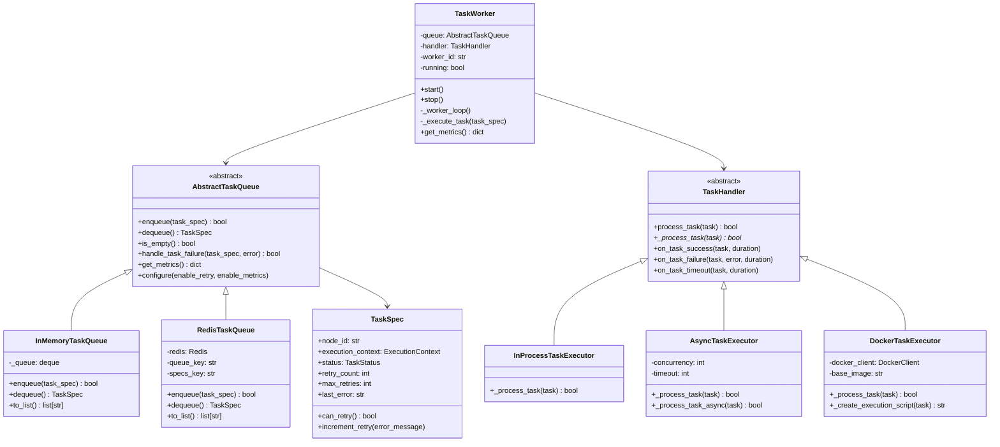
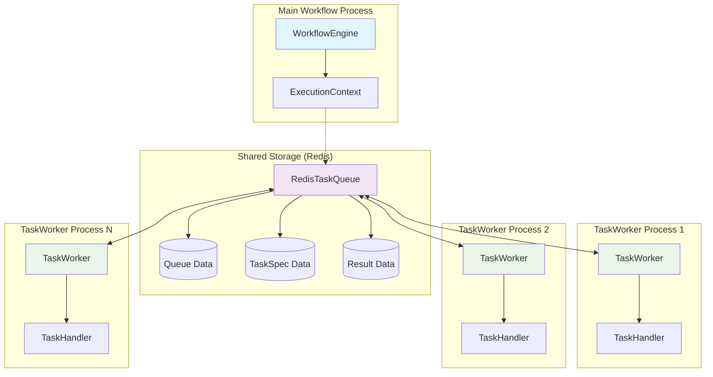
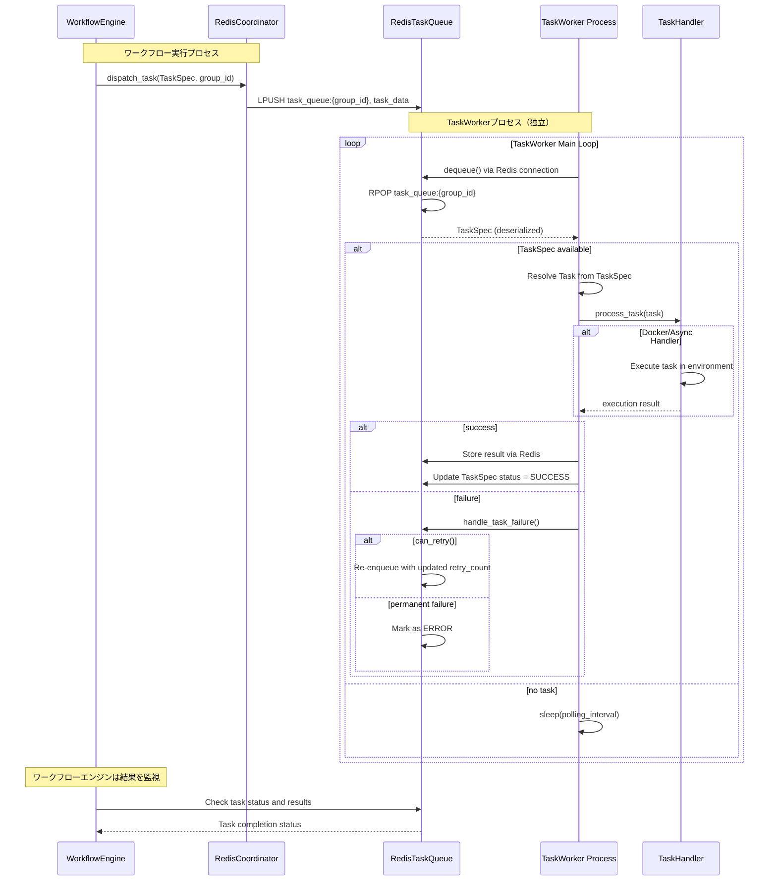

# TaskWorker設計書

## 概要

`TaskWorker`は、**独立したプロセス**として動作し、`TaskQueue`を介してタスク実行を担当するワーカープロセスです。`RedisCoordinator`の`dispatch_task`メソッドを通じてタスクを受信し、`TaskHandler`抽象化を通じて様々な実行環境（プロセス内直接実行、Docker実行等）でタスクを実行します。TaskWorkerプロセスは、主となるワークフロー実行プロセスとは完全に分離されており、Redisを通じた疎結合な通信でシンプルな分散実行を実現します。

## 設計目標

1. **プロセス分離**: TaskWorkerは完全に独立したプロセスとして動作
2. **TaskQueue統合**: RedisTaskQueue等の共有キューを通じた疎結合な連携
3. **分散実行**: 複数のTaskWorkerプロセスによる水平分散処理
4. **耐障害性**: TaskWorkerプロセスの障害がワークフロー全体に影響しない設計
5. **実行環境の柔軟性**: InProcess実行とDocker実行の両方をサポート
6. **リトライ機能統合**: TaskSpecのリトライ機能との連携
7. **スケーラビリティ**: 負荷に応じたTaskWorkerプロセスの動的スケーリング

## アーキテクチャ設計

### コンポーネント構成



### TaskWorker独立プロセス アーキテクチャ



### 独立プロセス通信フロー



## TaskHandlerインターフェース設計

### 基底クラス: TaskHandler

```python
class TaskHandler(ABC):
    """タスク処理の抽象基底クラス"""
    
    def process_task(self, task: Task) -> bool:
        """タスク処理のメインエントリポイント
        
        機能:
        - 関数タスクの自動解決
        - 分散実行での関数解決失敗ハンドリング
        - カスタム処理ロジックへのフォールバック
        """
        
    @abstractmethod
    def _process_task(self, task: Task) -> bool:
        """カスタムタスク処理の実装点"""
        
    def on_task_success(self, task: Task, duration: float) -> None:
        """タスク成功時のコールバック"""
        
    def on_task_failure(self, task: Task, error: Exception, duration: float) -> None:
        """タスク失敗時のコールバック"""
        
    def on_task_timeout(self, task: Task, duration: float) -> None:
        """タスクタイムアウト時のコールバック"""
```

### 関数解決処理ロジック

```python
def process_task(self, task: Task) -> bool:
    if task.func is not None:
        # 関数が利用可能な場合の直接実行
        try:
            result = task()
            return True
        except Exception as e:
            return False
    else:
        # 関数解決失敗の検出と処理
        if task.payload.get("__is_function_task__"):
            func_meta = task.payload.get("__function_meta__")
            # 明示的に失敗させる
            return False
        # 通常のカスタムタスク処理
        return self._process_task(task)
```

## TaskHandler実装パターン

### 実行環境別実装戦略

TaskHandlerは実行環境に応じて以下のパターンをサポートします：

1. **InProcess実行** - TaskWorkerプロセス内での直接実行
2. **AsyncTaskExecutor** - 非同期並行実行による高効率処理
3. **Docker実行** - Dockerコンテナでの分離実行

### 1. InProcessTaskExecutor (プロセス内直接実行)

```python
class InProcessTaskExecutor(TaskHandler):
    """TaskWorkerプロセス内での直接実行エグゼキューター"""
    
    def _process_task(self, task: Task) -> bool:
        """プロセス内でタスクを直接実行"""
        try:
            # 同一プロセス内で直接実行
            result = task()
            return True
        except Exception as e:
            logger.error(f"InProcess task execution failed: {e}")
            return False
```

### 2. AsyncTaskExecutor (非同期並行実行)

```python
class AsyncTaskExecutor(TaskHandler):
    """非同期処理を行うTaskExecutor"""
    
    def __init__(self, concurrency: int = 10, timeout: int = 300):
        super().__init__()
        self.concurrency = concurrency
        self.timeout = timeout
        
        # 非同期実行用の設定
        self._loop: Optional[asyncio.AbstractEventLoop] = None
        self._loop_thread: Optional[threading.Thread] = None
        self._setup_lock = threading.Lock()
        self._semaphore: Optional[asyncio.Semaphore] = None
    
    def _process_task(self, task: Task) -> bool:
        """TaskHandlerインターフェースの実装"""
        if self._loop is None:
            self._setup_async_loop()
        
        try:
            future = asyncio.run_coroutine_threadsafe(
                self._process_task_async(task),
                self._loop
            )
            return future.result()
        except Exception as e:
            logger.error(f"AsyncTaskExecutor failed: {e}")
            return False
    
    def _setup_async_loop(self):
        """非同期ループを専用スレッドで設定"""
        with self._setup_lock:
            if self._loop is not None:
                return
            
            loop_ready = threading.Event()
            
            def run_loop():
                try:
                    self._loop = asyncio.new_event_loop()
                    asyncio.set_event_loop(self._loop)
                    self._semaphore = asyncio.Semaphore(self.concurrency)
                    loop_ready.set()
                    self._loop.run_forever()
                except Exception as e:
                    logger.error(f"Event loop error: {e}")
                finally:
                    if self._loop:
                        self._loop.close()
            
            self._loop_thread = threading.Thread(target=run_loop, daemon=True)
            self._loop_thread.start()
            
            loop_ready.wait(timeout=5.0)
            if not loop_ready.is_set():
                raise RuntimeError("Failed to start async event loop")
    
    async def _process_task_async(self, task: Task) -> bool:
        """非同期でタスクを実行"""
        async with self._semaphore:
            try:
                loop = asyncio.get_event_loop()
                result = await asyncio.wait_for(
                    loop.run_in_executor(None, task),
                    timeout=self.timeout
                )
                return True
            except asyncio.TimeoutError:
                logger.warning(f"Task {task.task_id} timed out after {self.timeout}s")
                return False
            except Exception as e:
                logger.error(f"Async task execution failed: {e}")
                return False
    
    def shutdown(self):
        """リソースクリーンアップ"""
        if self._loop and not self._loop.is_closed():
            self._loop.call_soon_threadsafe(self._loop.stop)
        
        if self._loop_thread and self._loop_thread.is_alive():
            self._loop_thread.join(timeout=5.0)
```

### 3. DockerTaskExecutor (Docker実行)

```python
class DockerTaskExecutor(TaskHandler):
    """Dockerコンテナでのタスク実行エグゼキューター"""
    
    def __init__(self, 
                 base_image: str = "python:3.10-slim",
                 docker_client=None,
                 volume_mounts: Dict[str, str] = None,
                 environment: Dict[str, str] = None,
                 timeout: int = 300):
        """
        Args:
            base_image: ベースDockerイメージ
            docker_client: Dockerクライアント (None時は自動作成)
            volume_mounts: ボリュームマウント設定
            environment: 環境変数設定
            timeout: タスク実行タイムアウト (秒)
        """
        self.base_image = base_image
        self.volume_mounts = volume_mounts or {}
        self.environment = environment or {}
        self.timeout = timeout
        
        if docker_client is None:
            import docker
            self.docker_client = docker.from_env()
        else:
            self.docker_client = docker_client
    
    def _process_task(self, task: Task) -> bool:
        """Dockerコンテナ内でタスクを実行"""
        try:
            # タスク実行スクリプトを生成
            execution_script = self._create_execution_script(task)
            
            # コンテナ設定
            container_config = {
                "image": self.base_image,
                "command": ["python", "-c", execution_script],
                "environment": self.environment,
                "volumes": self.volume_mounts,
                "detach": True,
                "remove": True,  # 実行後自動削除
                "network_mode": "bridge"
            }
            
            # コンテナ実行
            container = self.docker_client.containers.run(**container_config)
            
            # 実行完了待ち
            result = container.wait(timeout=self.timeout)
            
            # ログ取得
            logs = container.logs().decode('utf-8')
            
            # 実行結果判定
            exit_code = result['StatusCode']
            success = exit_code == 0
            
            if success:
                logger.info(f"Docker task completed successfully")
                logger.debug(f"Container logs: {logs}")
            else:
                logger.error(f"Docker task failed with exit code {exit_code}")
                logger.error(f"Container logs: {logs}")
            
            return success
            
        except Exception as e:
            logger.error(f"Docker task execution failed: {e}")
            return False
    
    def _create_execution_script(self, task: Task) -> str:
        """タスク実行用Pythonスクリプトを生成"""
        import pickle
        import base64
        
        # タスクをシリアライズしてbase64エンコード
        task_bytes = pickle.dumps(task)
        task_b64 = base64.b64encode(task_bytes).decode('utf-8')
        
        script = f'''
import pickle
import base64
import sys
import logging

# ログ設定
logging.basicConfig(level=logging.INFO)
logger = logging.getLogger(__name__)

try:
    # タスクをデシリアライズ
    task_data = base64.b64decode("{task_b64}")
    task = pickle.loads(task_data)
    
    # タスク実行
    logger.info(f"Executing task: {{task.task_id}}")
    result = task()
    
    logger.info(f"Task completed successfully: {{result}}")
    print("DOCKER_TASK_SUCCESS")
    sys.exit(0)
    
except Exception as e:
    logger.error(f"Task execution failed: {{e}}")
    print(f"DOCKER_TASK_ERROR: {{e}}")
    sys.exit(1)
'''
        return script
    
    def on_task_failure(self, task: Task, error: Exception, duration: float) -> None:
        """Docker実行失敗時の詳細ログ"""
        logger.error(f"Docker task {task.task_id} failed after {duration:.3f}s: {error}")
        logger.error(f"Check Docker daemon status and image availability: {self.base_image}")
```


## TaskWorker設計

### 主要機能

1. **タスクキューとの連携**
   - `AbstractTaskQueue`からのタスク取得
   - タスク完了・失敗の状態更新
   - リトライロジックとの統合

2. **実行コンテキスト管理**
   - `ExecutionContext`との連携
   - タスクオブジェクトの解決
   - 状態管理とメタデータ更新

3. **エラーハンドリング**
   - 例外キャッチと分類
   - リトライ可能性の判定
   - 永続的失敗の処理

4. **メトリクスとログ**
   - 実行時間の計測
   - 成功率の追跡
   - 詳細なログ出力

### ライフサイクル管理

```python
class TaskWorker:
    def start(self) -> None:
        """ワーカーをスレッドで開始"""
        
    def stop(self) -> None:
        """グレースフルシャットダウン"""
        
    def _worker_loop(self) -> None:
        """メインループ処理"""
        while self.running:
            task_spec = self.queue.dequeue()
            if task_spec:
                self._execute_task(task_spec)
            else:
                time.sleep(0.1)  # ポーリング間隔
```

### メトリクス機能

```python
def get_metrics(self) -> dict:
    return {
        "worker_id": self.worker_id,
        "tasks_processed": self.tasks_processed,
        "tasks_succeeded": self.tasks_succeeded,
        "tasks_failed": self.tasks_failed,
        "total_execution_time": self.total_execution_time,
        "average_execution_time": self.total_execution_time / self.tasks_processed,
        "success_rate": self.tasks_succeeded / self.tasks_processed
    }
```

## TaskWorker独立プロセス実装パターン

### 1. 基本的な独立プロセス実行

```python
# TaskWorker独立プロセスのエントリーポイント
# worker_main.py
import os
import sys
import time
import signal
from graflow.worker import TaskWorker, InProcessTaskExecutor, DockerTaskExecutor, AsyncTaskExecutor
from graflow.queue.redis import RedisTaskQueue

def create_redis_queue(redis_config: dict) -> RedisTaskQueue:
    """Redis TaskQueue接続を作成"""
    import redis
    redis_client = redis.Redis(
        host=redis_config['host'],
        port=redis_config['port'],
        db=redis_config.get('db', 0),
        decode_responses=True
    )
    
    # ダミーのExecutionContext (TaskQueueのみ必要)
    dummy_context = type('DummyContext', (), {
        'session_id': redis_config.get('session_id', 'default_session')
    })()
    
    return RedisTaskQueue(
        execution_context=dummy_context,
        redis_client=redis_client,
        key_prefix=redis_config.get('key_prefix', 'graflow')
    )

def create_task_handler(handler_config: dict):
    """設定に基づいてTaskHandler作成"""
    handler_type = handler_config.get('type', 'inprocess')
    
    if handler_type == 'docker':
        return DockerTaskExecutor(
            base_image=handler_config.get('base_image', 'python:3.10'),
            timeout=handler_config.get('timeout', 1800),
            environment=handler_config.get('environment', {}),
            volume_mounts=handler_config.get('volume_mounts', {})
        )
    elif handler_type == 'async':
        return AsyncTaskExecutor(
            concurrency=handler_config.get('concurrency', 10),
            timeout=handler_config.get('timeout', 300)
        )
    else:  # inprocess
        return InProcessTaskExecutor()

def main():
    """TaskWorkerのエントリーポイント"""
    # 環境変数から設定取得
    worker_id = os.environ.get('WORKER_ID', f'worker_{os.getpid()}')
    
    redis_config = {
        'host': os.environ.get('REDIS_HOST', 'localhost'),
        'port': int(os.environ.get('REDIS_PORT', '6379')),
        'db': int(os.environ.get('REDIS_DB', '0')),
        'key_prefix': os.environ.get('REDIS_KEY_PREFIX', 'graflow'),
        'session_id': os.environ.get('SESSION_ID', 'default_session')
    }
    
    handler_config = {
        'type': os.environ.get('HANDLER_TYPE', 'inprocess'),
        'base_image': os.environ.get('DOCKER_IMAGE', 'python:3.10'),
        'timeout': int(os.environ.get('TASK_TIMEOUT', '1800'))
    }
    
    # シグナルハンドラー設定
    worker = None
    
    def signal_handler(signum, frame):
        print(f"Worker {worker_id} received signal {signum}, shutting down...")
        if worker:
            worker.stop()
        sys.exit(0)
    
    signal.signal(signal.SIGTERM, signal_handler)
    signal.signal(signal.SIGINT, signal_handler)
    
    try:
        # Redis接続とTaskHandler準備
        redis_queue = create_redis_queue(redis_config)
        task_handler = create_task_handler(handler_config)
        
        # TaskWorker作成
        worker = TaskWorker(
            queue=redis_queue,
            handler=task_handler,
            worker_id=worker_id
        )
        
        print(f"TaskWorker {worker_id} starting...")
        
        # TaskWorker開始（ブロッキング実行）
        worker.start()
        
    except Exception as e:
        print(f"TaskWorker {worker_id} failed to start: {e}")
        sys.exit(1)

if __name__ == "__main__":
    main()
```


### 2. TaskSpec活用 + リトライ機能統合

```python
# TaskSpecのリトライ機能との統合（Phase 3対応）
from graflow.worker import TaskWorker, InProcessTaskExecutor
from graflow.queue.memory import InMemoryTaskQueue

# リトライ機能有効化
context = ExecutionContext(
    graph,
    start_node="task1",
    queue_backend="in_memory",
    queue_config={
        'enable_retry': True,      # リトライ機能有効化
        'enable_metrics': True     # メトリクス機能有効化
    }
)

# キューのリトライ設定
context.queue.configure(enable_retry=True, enable_metrics=True)

# TaskWorker with retry integration
class RetryAwareTaskHandler(AsyncTaskExecutor):
    """リトライ機能を認識するTaskHandler"""
    
    def on_task_failure(self, task: Task, error: Exception, duration: float) -> None:
        # リトライ情報をログ出力
        logger.error(f"Task {task.task_id} failed after {duration:.3f}s: {error}")
        logger.info(f"Task will be retried (retry_count will be incremented)")
        
    def on_task_success(self, task: Task, duration: float) -> None:
        logger.info(f"Task {task.task_id} succeeded after {duration:.3f}s")

# リトライ対応ワーカー
retry_handler = RetryAwareTaskHandler()
worker = TaskWorker(
    queue=context.queue,
    handler=retry_handler,
    worker_id="retry_worker"
)

worker.start()

# メトリクス取得例
import time
time.sleep(10)  # ワーカー実行待ち

queue_metrics = context.queue.get_metrics()
worker_metrics = worker.get_metrics()

print("Queue Metrics:", queue_metrics)
print("Worker Metrics:", worker_metrics)
```

### 3. 設定駆動型実行パターン

```python
# YAML設定ファイル (worker_config.yaml)
"""
workers:
  - id: "fast_worker"
    handler_type: "inprocess"
      
  - id: "async_worker" 
    handler_type: "async"
    config:
      concurrency: 20
      timeout: 300
      
  - id: "docker_worker"
    handler_type: "docker"
    config:
      base_image: "python:3.10-slim"
      timeout: 300
      environment:
        PYTHONPATH: "/workspace"
        
  - id: "ml_worker"
    handler_type: "docker"
    config:
      base_image: "tensorflow/tensorflow:latest"
      timeout: 3600
      environment:
        CUDA_VISIBLE_DEVICES: "0"
      volume_mounts:
        "/host/models": 
          bind: "/workspace/models"
          mode: "rw"
"""

import yaml

def create_worker_from_config(config_file: str, queue, context):
    """設定ファイルからワーカーを作成"""
    with open(config_file) as f:
        config = yaml.safe_load(f)
    
    workers = []
    for worker_config in config['workers']:
        handler_type = worker_config['handler_type']
        handler_config = worker_config.get('config', {})
        
        if handler_type == "inprocess":
            handler = InProcessTaskExecutor()
        elif handler_type == "async":
            handler = AsyncTaskExecutor(
                concurrency=handler_config.get('concurrency', 10),
                timeout=handler_config.get('timeout', 300)
            )
        elif handler_type == "docker":
            handler = DockerTaskExecutor(
                base_image=handler_config.get('base_image', 'python:3.10'),
                timeout=handler_config.get('timeout', 300),
                environment=handler_config.get('environment', {}),
                volume_mounts=handler_config.get('volume_mounts', {})
            )
        else:
            raise ValueError(f"Unknown handler type: {handler_type}")
        
        worker = TaskWorker(
            queue=queue,
            handler=handler,
            worker_id=worker_config['id']
        )
        workers.append(worker)
    
    return workers

# 設定ファイルからワーカー作成・起動
workers = create_worker_from_config("worker_config.yaml", queue, context)
for worker in workers:
    worker.start()
```

### 4. RedisCoordinatorとの統合

TaskWorkerは、RedisCoordinatorの`dispatch_task`メソッドを通じてタスクを受信し、シンプルな分散実行を実現します。

#### 基本的な統合パターン

```python
from graflow.coordination.redis import RedisCoordinator
from graflow.worker import TaskWorker, AsyncTaskExecutor
from graflow.queue.redis import RedisTaskQueue

# RedisCoordinator設定
redis_config = {
    'host': 'localhost',
    'port': 6379,
    'db': 0
}

coordinator = RedisCoordinator(redis_client)

# TaskWorkerの作成
def create_worker(worker_id: str, group_id: str):
    """TaskWorker作成"""
    
    # TaskQueueを作成（RedisCoordinatorと同じRedis使用）
    dummy_context = type('DummyContext', (), {
        'session_id': f"session_{group_id}"
    })()
    
    task_queue = RedisTaskQueue(
        execution_context=dummy_context,
        redis_client=redis_client,
        key_prefix=f"workflow_{group_id}"
    )
    
    # TaskHandlerを選択
    handler = AsyncTaskExecutor(concurrency=10, timeout=300)
    
    # TaskWorker作成
    worker = TaskWorker(
        queue=task_queue,
        handler=handler,
        worker_id=worker_id
    )
    
    return worker

# 使用例：dispatch_task → TaskWorker連携
group_id = 'processing_group'

# 複数のWorkerを作成
workers = []
for i in range(3):
    worker_id = f"worker_{i}"
    worker = create_worker(worker_id, group_id)
    workers.append(worker)
    worker.start()  # 非同期で開始

# RedisCoordinatorからタスクをdispatch
# coordinator.dispatch_task()が呼ばれると、TaskQueueに自動的にenqueueされ、
# 待機中のTaskWorkerが自動的にタスクを取得・実行
```

#### dispatch_task統合の仕組み

```python
# RedisCoordinator.dispatch_task()の動作
def dispatch_task(self, task_spec: TaskSpec, group_id: str) -> None:
    """Dispatch task to Redis queue for worker processing."""
    queue_key = f"task_queue:{group_id}"
    
    # タスクデータをシリアライズしてRedisキューに投入
    task_data = {
        "task_id": task_spec.task_id,
        "func_name": getattr(task_spec.func, '__name__', str(task_spec.func)),
        "args": task_spec.args if hasattr(task_spec, 'args') else (),
        "kwargs": task_spec.kwargs if hasattr(task_spec, 'kwargs') else {},
        "group_id": group_id,
        "timestamp": time.time()
    }
    
    # Redisキューに左からプッシュ（FIFOで右から取得）
    self.redis.lpush(queue_key, json.dumps(task_data))

# TaskWorkerが同じキューを監視して自動実行
# TaskWorker._worker_loop()でdequeue()を呼び出し、
# RedisTaskQueue.dequeue()がredis.rpop()でタスクを取得
```


## パフォーマンス考慮事項

### 1. スレッドセーフティ

- `threading.Lock`を使用した状態管理
- アトミックな操作でのメトリクス更新
- デッドロック回避のための適切なロック順序

### 2. メモリ管理

- タスクオブジェクトの適切な解放
- メトリクスデータの定期的なリセット
- 長時間実行でのメモリリーク防止

### 3. CPU効率

- ポーリング間隔の最適化
- 不要な関数呼び出しの削減
- 効率的なエラーハンドリング

## 拡張ポイント

### 1. タスク実行戦略の拡張

- タイムアウト処理の実装
- 優先度ベースの実行順序
- リソース制限の適用

### 2. 監視機能の強化

- プロメテウス メトリクス出力
- 分散トレーシング統合
- アラート機能の実装

## テスト戦略

### 1. 単体テスト

- TaskHandlerの各実装のテスト
- TaskWorkerのライフサイクルテスト
- エラーハンドリングのテスト

### 2. 統合テスト

- TaskQueueとの連携テスト
- ExecutionContextとの統合テスト
- 実際のワークフローでの動作確認

### 3. 負荷テスト

- 大量タスクでの性能測定
- 長時間実行での安定性確認
- メモリ使用量の監視

## 現在の実装状況（2025年8月12日時点）

### ✅ 実装完了 (Phase 1基本部分)
- [x] TaskHandler抽象基底クラス設計・実装
- [x] InProcessTaskExecutor実装
- [x] TaskWorker基本実装（並行実行・メトリクス・シグナルハンドリング対応）
- [x] コマンドライン起動スクリプト (main.py)
- [x] 基本的なテストコード
- [x] InMemoryTaskQueue統合テスト（基本動作確認済み）
- [x] RedisTaskQueue統合対応（接続・基本機能実装済み）

### 📝 実装の特徴
- **並行実行**: ThreadPoolExecutorによる並行タスク処理
- **グレースフルシャットダウン**: シグナルハンドリング・アクティブタスク完了待ち
- **メトリクス**: 成功率・実行時間・処理数の詳細追跡
- **設定駆動**: 環境変数・コマンドライン引数による柔軟な設定
- **エラーハンドリング**: タイムアウト・例外処理・ログ統合

## 段階的実装計画

### Phase 1.1: 高度なTaskHandler実装 (NEXT)
- [ ] AsyncTaskExecutor実装
  - [ ] 非同期実行ループ設定
  - [ ] セマフォによる並行制御
  - [ ] タイムアウト処理
- [ ] DockerTaskExecutor実装
  - [ ] Dockerクライアント統合
  - [ ] コンテナ実行・監視
  - [ ] タスクシリアライゼーション
- [ ] main.pyでの新ハンドラー対応
- [ ] 各ハンドラーの単体テスト

### Phase 1.2: ExecutionContext統合 (HIGH PRIORITY)
- [ ] TaskSpec → 実Taskオブジェクト解決機能
  - [ ] ExecutionContextからのノード解決
  - [ ] グラフトラバーサル統合
  - [ ] タスク関数の動的ロード
- [ ] MockTask実装から実際のTask統合への移行
- [ ] 関数解決失敗ハンドリング（分散実行対応）
- [ ] 統合テスト（実ワークフローでの動作確認）

### Phase 2: 分散実行強化
- [ ] RedisCoordinatorとの完全統合
  - [ ] dispatch_task → TaskWorker自動連携
  - [ ] 複数WorkerプロセスでのLoadBalancing
  - [ ] タスク結果のRedis経由同期
- [ ] TaskSpecリトライ機能統合
  - [ ] handle_task_failureとの連携
  - [ ] 指数バックオフ・リトライ制御
- [ ] 分散実行監視・デバッグ機能

### Phase 3: 本格運用対応
- [ ] 高度な実行環境対応
  - [ ] Docker実行での環境分離
  - [ ] リソース制限・セキュリティ
  - [ ] カスタムイメージ・ボリューム対応
- [ ] 運用・監視機能
  - [ ] ヘルスチェック・生存監視
  - [ ] メトリクスエクスポート（Prometheus等）
  - [ ] 動的スケーリング基盤
- [ ] パフォーマンス最適化

### Phase 4: エンタープライズ機能
- [ ] 高可用性・耐障害性
  - [ ] Workerプロセス自動復旧
  - [ ] タスク実行保証機能
  - [ ] Dead Letter Queue
- [ ] セキュリティ・コンプライアンス
  - [ ] 認証・認可統合
  - [ ] 監査ログ・トレーサビリティ
- [ ] 運用自動化・DevOps統合

## 次の実装推奨順序

1. **Phase 1.1** (AsyncTaskExecutor, DockerTaskExecutor)
2. **Phase 1.2** (ExecutionContext統合) - 最も重要
3. **Phase 2** (分散実行・Redis統合)
4. **Phase 3** (運用・監視)

この段階的なアプローチにより、実用的で堅牢なTaskWorkerシステムを構築できます。