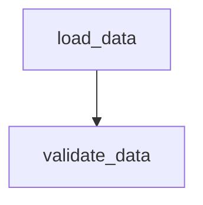

# Graph Visualization Examples

This directory contains examples demonstrating the graph visualization capabilities in graflow.

## Files

### `graph_visualization_example.py`
A comprehensive example showing all visualization methods available in `graflow.utils.graph`:

- **ASCII Drawing**: Text-based graph visualization using `draw_ascii()`
- **Mermaid Diagrams**: Generate Mermaid syntax with `draw_mermaid()`  
- **PNG Generation**: Create PNG images with `draw_png()`
- **Mermaid PNG**: Render Mermaid diagrams as PNG with `draw_mermaid_png()`
- **Graph Analysis**: Analyze graph structure with utility functions

### `task_graph_visualization.py`
A focused example showing how to visualize actual graflow TaskGraph objects:

- Creates real graflow workflows with `@task` decorators
- Extracts NetworkX graphs from TaskGraph objects
- Demonstrates both sequential and parallel workflow visualization
- Shows custom node labeling and coloring

## Available Visualization Methods

### 1. ASCII Drawing (`draw_ascii`)
```python
ascii_output = draw_ascii(graph)
print(ascii_output)
```
- Requires: `pip install grandalf`
- Creates text-based diagrams
- Good for console output and documentation

### 2. Mermaid Diagrams (`draw_mermaid`)
```python
mermaid_syntax = draw_mermaid(graph, title="My Graph")
print(mermaid_syntax)
```
- No additional dependencies
- Generates Mermaid flowchart syntax
- Can be rendered in GitHub, GitLab, or Mermaid viewers

### 3. PNG Generation (`draw_png`)
```python
png_bytes = draw_png(graph, node_colors=colors, node_labels=labels)
```
- Requires: `pip install pygraphviz`
- Creates PNG images using Graphviz
- Supports custom node colors and labels

### 4. Mermaid PNG (`draw_mermaid_png`)
```python
# Via API (requires internet)
png_bytes = draw_mermaid_png(graph, draw_method="api")

# Via local browser
png_bytes = draw_mermaid_png(graph, draw_method="pyppeteer")
```
- API method: Requires `pip install requests`
- Pyppeteer method: Requires `pip install pyppeteer`
- Renders Mermaid diagrams as high-quality PNG images

## Running the Examples

### Basic Graph Visualization
```bash
python examples/graph_visualization_example.py
```

### TaskGraph Visualization
```bash
python examples/task_graph_visualization.py
```

## Dependencies

### Required
- `networkx` (included with graflow)

### Optional (for specific features)
- `grandalf` - ASCII graph drawing
- `pygraphviz` - PNG generation via Graphviz
- `requests` - Mermaid PNG via API
- `pyppeteer` - Mermaid PNG via local browser

### Installation
```bash
# For ASCII drawing
pip install grandalf

# For PNG generation
pip install pygraphviz

# For Mermaid PNG (API method)
pip install requests

# For Mermaid PNG (local method)  
pip install pyppeteer
```

## Output Examples

### ASCII Output
```
+----------+
| load_data |
+----------+
     *
     *
+-------------+
| validate_data |
+-------------+
```

### Mermaid Output


### Graph Analysis
```
=== Graph Information ===
Nodes: ['load_data', 'validate_data', 'transform_data']
Edges: [('load_data', 'validate_data'), ('validate_data', 'transform_data')]
No cycles detected

=== Dependencies ===
load_data >> validate_data
validate_data >> transform_data
transform_data (no dependencies)
```

## Use Cases

1. **Workflow Documentation**: Generate diagrams for documentation
2. **Debugging**: Visualize task dependencies to debug workflow issues  
3. **Presentations**: Create professional diagrams for presentations
4. **Development**: Understand complex workflow structures during development
5. **Monitoring**: Generate runtime visualizations of active workflows

## Tips

- Use ASCII for quick console debugging
- Use Mermaid for documentation and version control
- Use PNG for presentations and reports
- Combine multiple methods for comprehensive workflow analysis