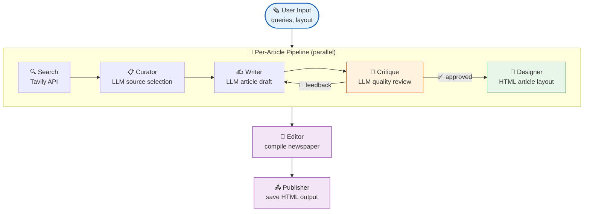
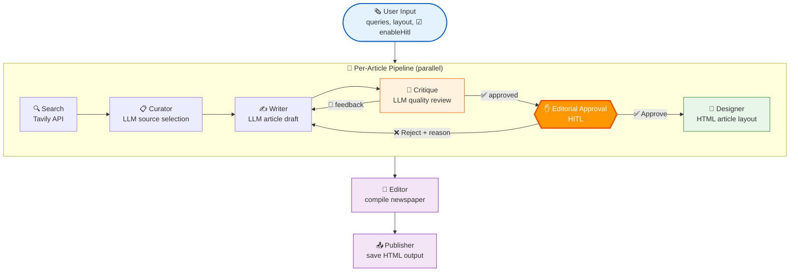
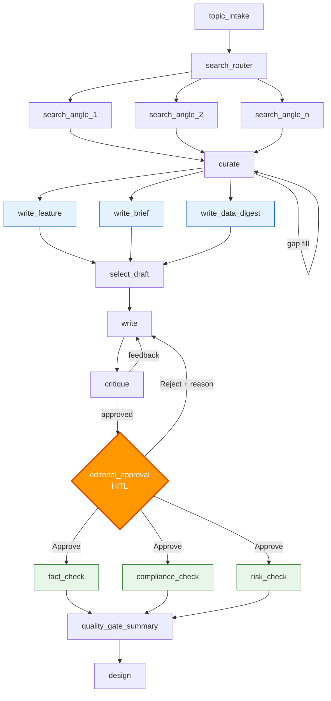

# GPT Newspaper - Graflow Workflow Examples

> **📊 LangFuse トレーシング**: セットアップとトラブルシューティングは [LANGFUSE_SETUP.md](LANGFUSE_SETUP.md) を参照

## 概要

このディレクトリには、**AI新聞記事を自動生成するシステム**の**4つのバージョン**が含まれています。Graflowの様々なパターンとユースケースを段階的に理解できるように設計されています。

## ワークフロー比較

| 機能 | シンプル版 | 動的版 | **エージェント版** | **HITL版** |
|------|-----------|--------|-------------------|------------|
| **ファイル** | `newspaper_workflow.py` | `newspaper_dynamic_workflow.py` | `newspaper_agent_workflow.py` | `newspaper_hitl_workflow.py` |
| **タスク数** | 5タスク | 15+タスク (動的) | 6タスク | 16+タスク (動的+HITL) |
| **複雑度** | 🟢 低 | 🟡 高 | 🟡 中 | 🟡 高 |
| **LLMエージェント** | 0 (純粋なLLMタスク) | 0 (純粋なLLMタスク) | **2 (研究者、編集者)** | 0 (純粋なLLMタスク) |
| **ツール呼び出し** | ❌ なし | ❌ なし | **✅ あり (8ツール)** | ❌ なし |
| **リサーチ** | 単一検索 | 複数角度ファンアウト | **自律的マルチ検索** | 複数角度ファンアウト |
| **執筆** | 単一LLM呼び出し | 3並列ペルソナ | 単一LLM+改訂 | 3並列ペルソナ |
| **品質管理** | シンプル批評 | 批評 + 3ゲート | **エージェント駆動編集** | 批評 + **人間承認** + 3ゲート |
| **改訂ループ** | 固定ロジック (goto) | 固定ロジック (goto) | **エージェント制御** | 固定ロジック + **人間判断** |
| **Human-in-the-Loop** | ❌ なし | ❌ なし | ❌ なし | **✅ 編集承認ゲート** |
| **動的タスク生成** | なし (gotoのみ) | 検索展開、ギャップ補填 | なし (エージェントが決定) | 検索展開、ギャップ補填 |
| **並列実行** | 記事レベル | タスク + 記事レベル | 記事レベル | タスク + 記事レベル |
| **エラーハンドリング** | 反復回数制限 | 部分的成功 (2/3) | エージェント制御 | 部分的成功 + タイムアウト |
| **レイテンシ** | ~30秒 | ~45秒 | ~60秒 | ~45秒 + 人間待機 |
| **LLM呼び出し** | 4-6回 | 10-15回 | 8-12回 + ツール | 10-15回 |
| **コスト (相対)** | 1x | 2-3x | 1.5-2x | 2-3x |
| **品質** | 良 | 優 | **秀** | **秀 (人間保証)** |
| **自律性** | 低 | 中 | **高** | 中 (人間ゲート) |
| **透明性** | 中 | 中 | **高 (ツール可視化)** | **高 (承認UI)** |
| **コード行数** | ~325行 | ~604行 | ~1100行 | ~650行 |
| **学習曲線** | 🟢 初心者向け | 🟡 中級者向け | 🟡 中級者向け | 🟡 中級者向け |

## 選択ガイド

### シンプル版を選ぶべき場合:
- ✅ Graflowの基礎を学ぶ
- ✅ コストが最優先
- ✅ シンプルなコンテンツ生成
- ✅ 複雑な要件がない

### 動的版を選ぶべき場合:
- ✅ 並列実行が必要
- ✅ 複数の処理アプローチが必要
- ✅ 品質ゲートとバリデーション
- ✅ プロダクション規模

### エージェント版を選ぶべき場合:
- ✅ 品質が重要 (ファクトチェック/検証)
- ✅ 自律的な意思決定が必要
- ✅ ツール使用の透明性が必要 (トレースで可視化)
- ✅ エージェントシステムの構築
- ✅ LLMエージェントパターンの探求

### HITL版を選ぶべき場合:
- ✅ 公開前に人間の承認が必要
- ✅ 編集者によるレビューゲートが必要
- ✅ フロントエンドからインラインで承認/却下したい
- ✅ GraflowのHITL機能を学ぶ
- ✅ WebSocket経由のリアルタイムフィードバック連携

---

## 実行方法

### シンプル版
```bash
# 環境変数の設定
export TAVILY_API_KEY="your_tavily_api_key"
export OPENAI_API_KEY="your_openai_api_key"

# 実行
PYTHONPATH=. uv run python examples/gpt_newspaper/backend/newspaper_workflow.py
```

### 動的版
```bash
# シンプル版と同じ環境変数
export TAVILY_API_KEY="your_tavily_api_key"
export OPENAI_API_KEY="your_openai_api_key"

# 実行
PYTHONPATH=. uv run python examples/gpt_newspaper/backend/newspaper_dynamic_workflow.py
```

### エージェント版
```bash
# 追加の依存関係をインストール
uv add google-adk textstat tavily-python

# 環境変数の設定
export TAVILY_API_KEY="your_tavily_api_key"
export GPT_NEWSPAPER_MODEL="gpt-4o-mini"  # エージェントモデル (オプション)
export GRAFLOW_LLM_MODEL="gpt-4o-mini"    # LLMタスク (オプション)
export OPENAI_API_KEY="your_openai_api_key"  # または他のプロバイダー

# 実行
PYTHONPATH=. uv run python examples/gpt_newspaper/backend/newspaper_agent_workflow.py
```

**詳細なエージェントワークフローのセットアップ:** [agent_workflow.md](agent_workflow.md) を参照

### HITL版
```bash
# 動的版と同じ環境変数
export TAVILY_API_KEY="your_tavily_api_key"
export OPENAI_API_KEY="your_openai_api_key"

# バックエンド起動
cd examples/gpt_newspaper/backend
uvicorn api:app --reload --port 8000

# フロントエンド起動 (別ターミナル)
cd examples/gpt_newspaper/frontend
npm run dev

# ブラウザで http://localhost:5173 を開き、"Enable editorial review (HITL)" チェックボックスをオン
```

**詳細なHITLワークフローの説明:** [hitl_workflow.md](hitl_workflow.md) を参照

---

## 学習パス

**推奨順序:** シンプル版 → 動的版 → HITL版 → エージェント版

1. **`newspaper_workflow.py`** - gotoループ、チャンネル、状態管理を学ぶ
2. **`newspaper_dynamic_workflow.py`** - 動的タスク生成、並列実行、グループポリシーを学ぶ
3. **`newspaper_hitl_workflow.py`** - Human-in-the-Loop、WebSocketフィードバック、承認ゲートを学ぶ
4. **`newspaper_agent_workflow.py`** - LLMエージェント、ツール呼び出し、自律的意思決定を学ぶ

---

# Part 1: 基本版 (`newspaper_workflow.py`)

## ワークフローの全体像



### HITL有効化時のワークフロー

`enableHitl` チェックボックスをオンにすると、批評後・デザイン前に**編集承認ゲート**が挿入されます。



## 核となる機能: goto=Trueによるループバック

`newspaper_workflow.py:123-170`

```python
@task(id=f"critique_{article_id}", inject_context=True)
def critique_task(context: TaskExecutionContext) -> Dict:
    """記事を批評し、フィードバックがあれば執筆タスクへループバック"""
    channel = context.get_channel()
    article = channel.get("article")
    iteration = channel.get("iteration", default=0)

    result = critique_agent.run(article)
    channel.set("article", result)

    if result.get("critique") is not None:
        # フィードバックがある場合
        if iteration >= 5:
            print(f"⚠️ Max iterations reached")
            result["critique"] = None  # 強制承認
        else:
            channel.set("iteration", iteration + 1)
            # ★既存のwrite_taskへループバック
            context.next_task(write_task, goto=True)
            return result

    # 承認された場合、自然にdesign_taskへ進む
    return result
```

### チャンネルによる状態管理

```python
# 状態の保存
channel.set("article", result)
channel.set("iteration", iteration + 1)

# 状態の取得
article = channel.get("article")
iteration = channel.get("iteration", default=0)
```

---

# Part 2: 高度版 (`newspaper_dynamic_workflow.py`)

## ワークフローの全体像

```
topic_intake
    ↓
search_router (動的に複数の検索タスクを生成)
    ↓ ↓ ↓ ↓
  search_angle_1 | search_angle_2 | search_angle_3 | ...
    ↓ ↓ ↓ ↓
curate ⟲ (不足時に補足調査を追加)
    ↓
writer_personas (並列実行)
    ↓ ↓ ↓
  write_feature | write_brief | write_data_digest
    ↓ ↓ ↓
select_draft (最良のドラフトを選択)
    ↓
write ⟲←──┐
    ↓      │
critique ──┘ (フィードバックがあればループバック)
    ↓
quality_gate (並列実行、2/3成功で通過)
    ↓ ↓ ↓
  fact_check | compliance_check | risk_check
    ↓ ↓ ↓
quality_gate_summary
    ↓
design
```

## Graflowの高度な機能を活かした3つのポイント

### 1. **動的な検索タスク展開** 📡

`newspaper_dynamic_workflow.py:149-175`

```python
@task(id=f"search_router_{article_id}", inject_context=True)
def search_router_task(context: TaskExecutionContext) -> Dict:
    """トピックに応じた複数の検索角度を動的に決定"""
    channel = context.get_channel()
    angles: List[str] = channel.get("angles", default=["overview"])

    print(f"[{article_id}] 🔍 Launching {len(angles)} targeted searches...")

    for angle in angles:
        angle_id = _slugify(angle)

        def run_angle(angle_label=angle, angle_slug=angle_id):
            task_query = f"{query} - focus on {angle_label}"
            result = search_agent.run({"query": task_query, "angle": angle_label})
            # 結果をチャンネルに集約
            aggregated = channel.get("search_results", default=[])
            aggregated.append(result)
            channel.set("search_results", aggregated)
            return result

        # ★ランタイムでタスクを動的追加
        angle_task = TaskWrapper(f"search_{article_id}_{angle_id}", run_angle)
        context.next_task(angle_task)

    return {"scheduled": len(angles)}
```

#### 何をやっているか

- トピック分析の結果に基づいて、「政策」「市場動向」「気候影響」「技術」などの複数の検索角度を決定
- 各角度ごとに**ランタイムで検索タスクを動的生成**（`context.next_task()`）
- 並列で複数の検索を実行し、結果をチャンネルに集約

#### 従来のワークフローエンジンとの違い

- ✅ 事前に検索タスク数が決まっていなくてもOK
- ✅ トピックの内容に応じて柔軟に検索範囲を拡張できる
- ✅ 実行時の状態に基づいてワークフローが自己適応

---

### 2. **動的なギャップ補填** 🔄

`newspaper_dynamic_workflow.py:205-229`

```python
@task(id=f"curate_{article_id}", inject_context=True)
def curate_task(context: TaskExecutionContext) -> Dict:
    """キュレーション時に情報源が不足していたら補足調査を追加"""
    channel = context.get_channel()
    expected = channel.get("expected_search_tasks", default=0)
    completed = channel.get("completed_search_tasks", default=0)

    # 検索タスクの完了を待つ
    if expected and completed < expected:
        print(f"[{article_id}] ⏳ Waiting for {expected - completed} search tasks...")
        time.sleep(0.05)
        context.next_iteration()  # ★自分自身を再実行
        return {"status": "waiting"}

    # ソースをキュレーション
    result = curator_agent.run(article_data)

    # ソースが不足している場合
    min_sources = 3
    if len(result.get("sources", [])) < min_sources and not channel.get("gap_fill_requested"):
        channel.set("gap_fill_requested", True)

        def supplemental_research():
            # 補足調査を実行
            supplemental_result = search_agent.run({
                "query": f"{query} statistics and data",
                "angle": "data supplement"
            })
            # 結果を集約
            aggregated = channel.get("search_results", default=[])
            aggregated.append(supplemental_result)
            channel.set("search_results", aggregated)
            return supplemental_result

        # ★補足調査タスクを動的に追加
        context.next_task(TaskWrapper(f"search_{article_id}_supplemental", supplemental_research))
        print(f"[{article_id}] 🔄 Not enough sources, scheduling supplemental research...")
        context.next_iteration()  # 再度キュレーションを実行
        return {"status": "gap_filling"}

    return result
```

#### 何をやっているか

- キュレーション時に情報源が不足していることを検出（最低3ソース必要）
- 補足調査タスクを**動的に追加**（`context.next_task()`）
- キュレーションタスク自身を**再実行**（`context.next_iteration()`）して補足情報を待つ

#### ポイント

- ✅ 品質基準を満たすまで自動的に情報収集を拡張
- ✅ 実行時の状態に応じた柔軟な対応
- ✅ 無限ループを防ぐための `gap_fill_requested` フラグ

---

### 3. **執筆-批評の反復ループ** 🔁

`newspaper_dynamic_workflow.py:329-359`

```python
@task(id=f"critique_{article_id}", inject_context=True)
def critique_task(context: TaskExecutionContext) -> Dict:
    """記事を批評し、フィードバックがあれば執筆タスクへループバック"""
    print(f"[{article_id}] 🔎 Critiquing article...")

    channel = context.get_channel()
    article = _get_article_from_channel(context)
    iteration = channel.get("iteration", default=0)

    # 批評エージェントが記事をレビュー
    result = critique_agent.run(article)
    channel.set("article", result)

    # フィードバックがある場合
    if result.get("critique") is not None:
        print(f"[{article_id}] 🔄 Critique feedback received, looping back to writer...")

        if iteration >= MAX_REVISION_ITERATIONS:
            print(f"[{article_id}] ⚠️  Max iterations ({MAX_REVISION_ITERATIONS}) reached")
            result["critique"] = None  # 強制的に承認
        else:
            channel.set("iteration", iteration + 1)
            # ★既存のwrite_taskへループバック
            context.next_task(write_task, goto=True)
            return result

    print(f"[{article_id}] ✅ Article approved by critique!")
    return result
```

#### 何をやっているか

1. 批評エージェントが記事をレビュー
2. フィードバックがある場合、**既存のwrite_taskへループバック**（`goto=True`）
3. 最大3回まで執筆-批評サイクルを繰り返す
4. 批評がOKなら品質チェックフェーズへ進む

#### 従来のワークフローとの違い

- ✅ 静的なDAG（有向非巡回グラフ）では表現できない循環フローを実現
- ✅ 品質が満たされるまで動的に反復
- ✅ 無限ループ防止のための反復回数制限（`MAX_REVISION_ITERATIONS = 3`）

---

## その他のGraflow機能活用

### 4. **並列ライターペルソナ** ✍️

`newspaper_dynamic_workflow.py:263-268`

```python
writer_personas = (
    write_feature_task | write_brief_task | write_data_digest_task
).with_execution(
    backend=CoordinationBackend.THREADING,
    policy=BestEffortGroupPolicy(),
)
```

- 3種類の執筆スタイル（feature、brief、data_digest）を**並列実行**
- `BestEffortGroupPolicy()`: ベストエフォートで実行し、最も良いものを選択
- スレッドベースの並列実行で効率化

### 5. **品質ゲート with 部分的成功許容** 🛡️

`newspaper_dynamic_workflow.py:385-390`

```python
quality_gate = (
    fact_check_task | compliance_check_task | risk_check_task
).with_execution(
    backend=CoordinationBackend.THREADING,
    policy=AtLeastNGroupPolicy(min_success=2),  # ★最低2つ成功が必要
)
```

- ファクトチェック、コンプライアンス、リスク評価を並列実行
- **最低2つが成功すれば**次のフェーズへ進む（部分的な失敗を許容）
- 本番環境での柔軟な品質管理を実現

---

## ワークフローのタスクグラフ (動的版)

```python
# newspaper_dynamic_workflow.py:428
topic_intake_task >> search_router_task >> curate_task >> writer_personas >> select_draft_task >> write_task >> critique_task >> quality_gate >> quality_gate_summary_task >> design_task
```

### 視覚化

```
topic_intake
    ↓
search_router (動的に複数の検索タスクを生成)
    ↓ ↓ ↓ ↓
  search_angle_1 | search_angle_2 | search_angle_3 | ...
    ↓ ↓ ↓ ↓
curate ⟲ (不足時に補足調査を追加)
    ↓
writer_personas (並列実行)
    ↓ ↓ ↓
  write_feature | write_brief | write_data_digest
    ↓ ↓ ↓
select_draft (最良のドラフトを選択)
    ↓
write ⟲←──┐
    ↓      │
critique ──┘ (フィードバックがあればループバック)
    ↓
quality_gate (並列実行、2/3成功で通過)
    ↓ ↓ ↓
  fact_check | compliance_check | risk_check
    ↓ ↓ ↓
quality_gate_summary
    ↓
design
```

---

# Part 3: HITL版 (`newspaper_hitl_workflow.py`)

## ワークフローの全体像

動的版に**編集承認ゲート**を追加したバージョンです。批評が通過した後、品質ゲートの前に人間の承認ステップが挿入されます。



## 核となる機能: Human-in-the-Loopによる編集承認

### 1. **WebSocketFeedbackHandler** 📡

WebSocket経由でフィードバックイベントをフロントエンドにブロードキャストするハンドラーです。

```python
class WebSocketFeedbackHandler(FeedbackHandler):
    """LogStreamManager経由でHITLイベントをWebSocket配信"""

    def __init__(self, log_stream_manager, run_id: str):
        self._log_stream_manager = log_stream_manager
        self._run_id = run_id

    def on_request_created(self, request: FeedbackRequest) -> None:
        # feedback_request イベントをWebSocketで配信
        payload = {
            "type": "feedback_request",
            "feedbackId": request.feedback_id,
            "feedbackType": request.feedback_type.value,
            "prompt": request.prompt,
            "timeout": request.timeout,
            ...
        }
        self._log_stream_manager._publish(self._run_id, payload)

    def on_response_received(self, request, response) -> None:
        # feedback_resolved イベント配信 → フロントエンドが承認フォームを閉じる

    def on_request_timeout(self, request) -> None:
        # feedback_timeout イベント配信 → タイムアウト表示
```

### 2. **editorial_approval_task** ✋

`newspaper_hitl_workflow.py` の核心部分です。

```python
@task(id=f"editorial_approval_{article_id}", inject_context=True)
def editorial_approval_task(context: TaskExecutionContext) -> Dict:
    """品質ゲート前に人間の編集承認を要求"""
    article = _get_article_from_channel(context)
    title = article.get("title", "Untitled")
    body_preview = (article.get("body", "") or "")[:500]

    prompt = f"Editorial Review: {title}\n\n{body_preview}...\n\nApprove for publishing?"

    # ★ WebSocket経由でフロントエンドにフィードバック要求を送信
    handler = WebSocketFeedbackHandler(log_stream_manager, run_id)
    response = context.request_feedback(
        feedback_type="approval",
        prompt=prompt,
        timeout=300.0,  # 5分間待機
        metadata={"article_id": article_id, "stage": "editorial_approval"},
        handler=handler,
    )

    if response.approved:
        return article  # → 品質ゲートへ進む
    else:
        # ★ 却下: エディターのフィードバック付きでライターに差し戻し
        article["critique"] = response.reason or "Editor requested revisions"
        channel.set("article", article)
        context.next_task(write_task, goto=True)
        return {"status": "revision_requested"}
```

#### 何をやっているか

1. 批評が承認した記事のタイトルと本文プレビューを表示
2. `context.request_feedback()` でフィードバックを要求し、**スレッドをブロック**して応答を待つ
3. `WebSocketFeedbackHandler` が `feedback_request` イベントをフロントエンドに配信
4. フロントエンドに「Approve / Reject」フォームが表示される
5. **承認** → 品質ゲートへ進む
6. **却下** → エディターの理由を `article["critique"]` にセットし、`goto=True` でライターに差し戻す

### 2つのフィードバックループ

| ループ | 種別 | トリガー | 最大回数 |
|--------|------|----------|----------|
| critique → write | 自動 (LLM) | 批評エージェントの判断 | 3回 |
| editorial_approval → write | 人間 (HITL) | エディターのReject | 無制限 |

### WebSocketイベントフロー

```
バックエンド                        フロントエンド
   |                                   |
   |-- feedback_request ------------->|  (承認フォーム表示)
   |                                   |
   |<-- POST /api/feedback/{id} ------|  (Approve/Reject クリック)
   |                                   |
   |-- feedback_resolved ------------>|  (フォーム非表示、ワークフロー再開)
   |                                   |
```

### ブロッキングモデル

`context.request_feedback()` は呼び出しスレッドを500msごとにポーリングしてブロックします。FastAPIの `run_in_executor` (スレッドプール) 内で実行されるため、イベントループは `POST /api/feedback/{id}/respond` リクエストを処理可能です。

### タイムアウト

デフォルトは **300秒（5分）** です。応答がない場合、`FeedbackTimeoutError` が発生し、その記事のワークフローは失敗します。

### フロントエンドUI

- ログコンソール下に **FeedbackPanel** コンポーネントが表示される
- 「Approve」(緑) / 「Reject」(赤) ボタン
- Reject時にオプショナルな理由テキストフィールド
- カウントダウンタイマー表示
- 送信中はローディングスピナー

---

## 主な洞察

### シンプル版 → 動的版
**進化**: 並列実行、ランタイムタスク生成、グループポリシーを学ぶ

### 動的版 → HITL版
**進化**: Human-in-the-Loopゲート、WebSocketフィードバック、人間+自動ハイブリッドループを学ぶ

### シンプル版 → エージェント版
**進化**: LLMエージェント、ツール呼び出し、自律的意思決定を学ぶ

### 動的版 → エージェント版
**比較**: 動的版はより多くの並列タスク、エージェント版は自律的推論

### 全4つ
**学習**: 固定ロジック → 並列複雑性 → 人間承認ゲート → 自律的エージェント の進化を確認

---

## チャンネルを使った状態管理

両方のワークフローで、タスク間の状態共有に**チャンネル**を活用しています：

```python
channel = context.get_channel()

# 検索結果の集約
channel.set("search_results", aggregated)
channel.get("search_results", default=[])

# イテレーション管理
channel.set("iteration", iteration + 1)
channel.get("iteration", default=0)

# 記事データの共有
channel.set("article", result)
channel.get("article")

# フラグ管理
channel.set("gap_fill_requested", True)
channel.get("gap_fill_requested", default=False)
```

### チャンネルの利点

- ✅ タスク間でデータを共有できる
- ✅ 反復実行時に状態を維持できる
- ✅ 動的タスクからも同じチャンネルにアクセス可能

---

## まとめ

これらのワークフローは、**シンプルなループから人間参加型、そして自律的エージェントへのGraflowの進化**を示しており、各パターンが前のパターンの上に構築されています。

### Graflow vs 従来のワークフローエンジン

| 機能 | 従来型 | Graflow (シンプル) | Graflow (動的) | Graflow (HITL) | Graflow (エージェント) |
|------|-------|------------------|----------------|----------------|---------------------|
| **タスク定義** | 事前に全て定義 | 事前定義 + goto | 実行時に動的生成 | 動的生成 + HITL | 事前定義 + エージェント |
| **循環フロー** | サポートなし (DAGのみ) | `goto=True`でループバック | 複数パターンのループ | 自動+人間ループ | エージェント制御ループ |
| **条件分岐** | 事前定義が必要 | 実行時の状態で判断 | 動的タスク追加で分岐 | 人間の判断で分岐 | エージェントが決定 |
| **並列実行** | 固定数の並列タスク | ワークフローレベル | タスクレベル + ワークフローレベル | タスク + ワークフロー | ワークフローレベル |
| **エラーハンドリング** | 固定的なリトライ | 反復回数制限 | 動的補完 + 部分的成功許容 | 部分的成功 + タイムアウト | エージェントが判断 |
| **人間の関与** | なし | なし | なし | **承認ゲート** | なし |
| **自律性** | なし | 低 | 中 | 中 (人間ゲート) | **高** |

### 実用例

**シンプル版:**
- 📰 レビューサイクルを伴う基本的なコンテンツ生成
- 📝 品質チェックを伴うドキュメント処理

**動的版:**
- 🔄 複数角度のリサーチを伴う複雑なコンテンツパイプライン
- 📊 動的処理拡張を伴うデータ分析
- ⚙️ 自動ギャップ補填を伴うETLパイプライン

**HITL版:**
- ✋ 公開前に編集者承認が必要なコンテンツパイプライン
- 🏥 医療・法務など人間レビュー必須のドキュメント生成
- 📋 デプロイ承認、データバリデーション等の承認ワークフロー
- 🔄 人間フィードバックによる反復改善ループ

**エージェント版:**
- 🔍 自律的検証を伴うリサーチ自動化
- 🤖 自律的ツール使用を伴うエージェントシステム
- ✅ 品質重視タスク (ファクトチェック、コンプライアンス)
- 🧠 透明性のある推論を伴う意思決定支援

---

## 参考リンク

- [Graflow Documentation](https://github.com/myui/graflow)
- [Dynamic Tasks Example](../../07_dynamic_tasks/)
