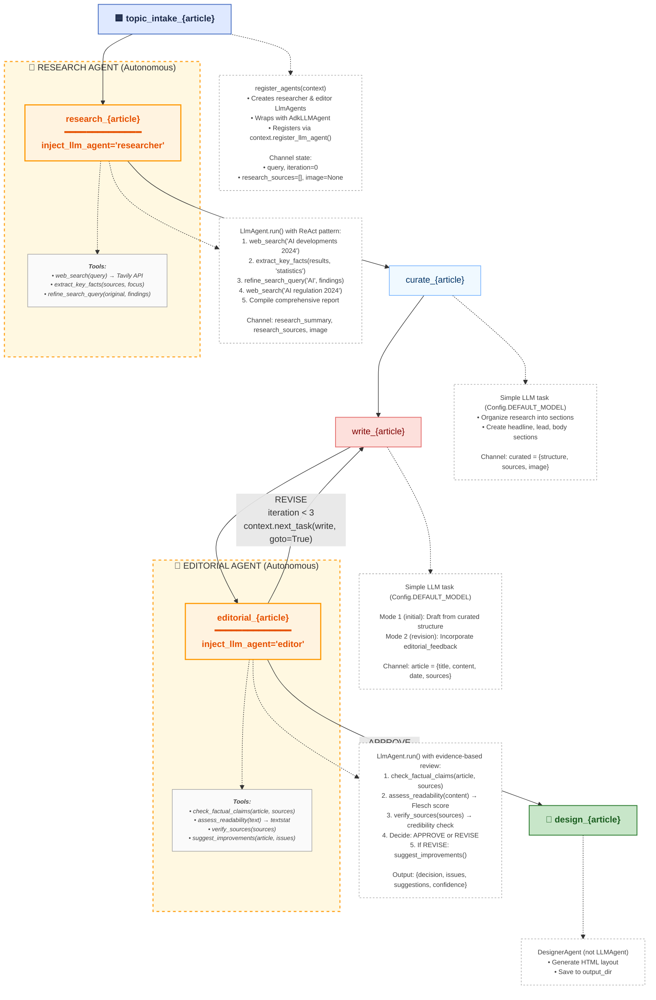

# Agent Workflow - Complete Guide

This document provides a comprehensive guide to the agent-driven newspaper generation workflow in Graflow. It combines setup instructions, architecture diagrams, and implementation details.

## Table of Contents

1. [Overview](#overview)
2. [Quick Start](#quick-start)
3. [Architecture Overview](#architecture-overview)
4. [Visual Workflow Diagram (Mermaid)](#visual-workflow-diagram-mermaid)
5. [Implementation Details](#implementation-details)
6. [Model Configuration](#model-configuration)
7. [Troubleshooting](#troubleshooting)
8. [Comparison with Other Workflows](#comparison-with-other-workflows)

---

## Overview

The agent workflow demonstrates **autonomous LLM agents** with real tool calling in Graflow. Unlike the simple and dynamic workflows which use predefined logic, this workflow features agents that:

- **Make autonomous decisions** about tool usage via the ReAct pattern
- **Call real external tools** (Tavily search, textstat readability analysis)
- **Control workflow loops** based on evidence-based decisions
- **Provide transparent reasoning** visible in Langfuse traces

### Key Features

| Feature | Description |
|---------|-------------|
| **LLM Agents** | 2 autonomous agents (researcher, editor) |
| **Tool Calling** | 8 real tools (web search, fact-check, readability, etc.) |
| **Research** | Autonomous multi-search with query refinement |
| **Quality Control** | Agent-driven editorial with verification tools |
| **Revision Loop** | Agent-controlled (not hardcoded) |
| **Dependencies** | Google ADK, Tavily, textstat |

---

## Quick Start

### Prerequisites

```bash
# Navigate to backend directory
cd examples/gpt_newspaper/backend

# Install agent workflow dependencies
uv add google-adk textstat tavily-python

# Or with pip
pip install google-adk textstat tavily-python
```

### Environment Setup

```bash
# Required: Tavily API key
export TAVILY_API_KEY="tvly-..."  # Get from https://tavily.com/

# Required: LLM provider API key for your chosen models
export OPENAI_API_KEY="sk-..."  # For OpenAI models
# OR
# export ANTHROPIC_API_KEY="sk-ant-..."  # For Claude models
# OR
# export GOOGLE_API_KEY="..."  # For Gemini via LiteLLM

# Optional: Override default models
export GPT_NEWSPAPER_MODEL="gpt-4o-mini"  # Agent model (default: gpt-4o-mini)
export GRAFLOW_LLM_MODEL="gpt-4o-mini"    # LLM tasks (default: gpt-4o-mini)
```

### Run Workflow

```bash
cd examples/gpt_newspaper/backend
PYTHONPATH=../../.. python newspaper_agent_workflow.py
```

**Expected Output**:
- Console logs showing agent tool calls and reasoning
- Article HTML files in `outputs/run_<timestamp>/`
- Compiled newspaper with agent-reviewed content
- Langfuse traces (if configured)

---
# Agent Workflow Visual Architecture

## Workflow Graph

```
┌─────────────────────────────────────────────────────────────────┐
│                     AGENT WORKFLOW ARCHITECTURE                  │
└─────────────────────────────────────────────────────────────────┘

                        ┌──────────────────┐
                        │  topic_intake    │
                        │ • Setup query    │
                        │ • Register agents│
                        │ • Init channels  │
                        └────────┬─────────┘
                                 │
                                 ▼
        ┌────────────────────────────────────────────────────┐
        │          RESEARCH AGENT (autonomous)               │
        │  ┌──────────────────────────────────────────────┐  │
        │  │ 🤖 LLMAgent with ReAct Pattern               │  │
        │  │                                               │  │
        │  │ Tools:                                        │  │
        │  │  • web_search(query) → Tavily API           │  │
        │  │  • extract_key_facts(sources, focus)        │  │
        │  │  • refine_search_query(original, findings)  │  │
        │  │                                               │  │
        │  │ Flow:                                         │  │
        │  │  1. web_search("AI developments")            │  │
        │  │  2. extract_key_facts(results, "statistics") │  │
        │  │  3. refine_search_query("AI", findings)      │  │
        │  │  4. web_search(refined_query)                │  │
        │  │  5. Compile comprehensive report             │  │
        │  └──────────────────────────────────────────────┘  │
        └──────────────────────┬─────────────────────────────┘
                               │ {summary, sources, image}
                               ▼
                      ┌──────────────────┐
                      │     curate       │
                      │ Simple LLM task  │
                      │ • Structure      │
                      │   research       │
                      └────────┬─────────┘
                               │ {structure, sources}
                               ▼
                      ┌──────────────────┐
                      │      write       │◄────────┐
                      │ Simple LLM task  │         │
                      │ • Draft article  │         │
                      │ • OR revise with │         │
                      │   feedback       │         │
                      └────────┬─────────┘         │
                               │ {article}         │
                               ▼                   │
        ┌──────────────────────────────────────────┼─────┐
        │        EDITORIAL AGENT (autonomous)      │     │
        │  ┌────────────────────────────────────┐  │     │
        │  │ 🤖 LLMAgent with ReAct Pattern     │  │     │
        │  │                                     │  │     │
        │  │ Tools:                              │  │     │
        │  │  • check_factual_claims()          │  │     │
        │  │  • assess_readability() → textstat │  │     │
        │  │  • verify_sources()                │  │     │
        │  │  • suggest_improvements()          │  │     │
        │  │                                     │  │     │
        │  │ Flow:                               │  │     │
        │  │  1. check_factual_claims(article)  │  │     │
        │  │  2. assess_readability(content)    │  │     │
        │  │  3. verify_sources(sources)        │  │     │
        │  │  4. Decide: APPROVE or REVISE      │  │     │
        │  │  5. If REVISE:                     │  │     │
        │  │     suggest_improvements()         │  │     │
        │  │     → goto write_task ────────────────┘     │
        │  │  6. If APPROVE: continue           │  │     │
        │  └────────────────────────────────────┘  │     │
        └──────────────────────┬──────────────────────────┘
                               │ approved
                               ▼
                      ┌──────────────────┐
                      │     design       │
                      │ • Create HTML    │
                      │ • Save file      │
                      └──────────────────┘

Legend:
  ┌──────┐
  │ Task │  = Regular task
  └──────┘

  ┌─────────────────┐
  │ 🤖 LLMAgent    │  = Agent with tools (autonomous)
  └─────────────────┘

  →  = Data flow
  ↑↓ = Revision loop (agent-controlled)
```

## Agent Comparison

### Research Agent vs Search Task

**Traditional Search (Simple Workflow)**
```python
@task
def search_task(query: str) -> Dict:
    # Single search call
    sources = tavily.search(query)
    return {"sources": sources}
```

**Research Agent (Agent Workflow)**
```python
@task(inject_llm_agent="researcher")
def research_task(llm_agent: LLMAgent, query: str) -> Dict:
    # Agent autonomously:
    # - Searches multiple times
    # - Extracts relevant facts
    # - Refines queries based on findings
    # - Decides when to stop
    result = llm_agent.run("Research thoroughly: " + query)
    return result["output"]
```

**Key Difference**: Agent makes autonomous decisions about tool usage

---

### Editorial Agent vs Critique Task

**Traditional Critique (Simple Workflow)**
```python
@task(inject_llm_client=True)
def critique_task(llm: LLMClient, article: Dict) -> Dict:
    # Fixed prompt, single LLM call
    messages = [{"role": "user", "content": f"Critique: {article}"}]
    critique = llm.completion_text(messages)

    # Fixed logic for revision decision
    if "issues" in critique.lower():
        context.next_task(write_task, goto=True)

    return {"critique": critique}
```

**Editorial Agent (Agent Workflow)**
```python
@task(inject_llm_agent="editor")
def editorial_task(llm_agent: LLMAgent, article: Dict) -> Dict:
    # Agent autonomously:
    # - Checks facts with tool
    # - Assesses readability with tool
    # - Verifies sources with tool
    # - Decides approve/revise based on evidence
    # - Generates specific improvement suggestions
    result = llm_agent.run(
        f"Review article. Use tools to verify quality. "
        f"Decide: APPROVE or REVISE with specific feedback."
    )

    # Agent controls the loop decision
    if result["decision"] == "revise":
        context.next_task(write_task, goto=True)

    return result
```

**Key Difference**: Agent uses tools for verification, makes evidence-based decisions

---

## Tool Call Flow Example

### Research Agent in Action

```
User Query: "Latest developments in artificial intelligence"

┌─────────────────────────────────────────────────────────┐
│ Agent Reasoning (internal to agent)                     │
├─────────────────────────────────────────────────────────┤
│                                                          │
│ Thought: I need to search for recent AI developments    │
│ Action: web_search("AI developments 2024")              │
│ Observation: Found 5 articles about LLMs and robotics   │
│                                                          │
│ Thought: Good start, but need more specific data        │
│ Action: extract_key_facts(results, "statistics")        │
│ Observation: Extracted market size, funding data        │
│                                                          │
│ Thought: Missing regulatory aspect                      │
│ Action: refine_search_query("AI", findings)             │
│ Observation: Suggested "AI regulation 2024"             │
│                                                          │
│ Thought: Let me search for regulations                  │
│ Action: web_search("AI regulation 2024")                │
│ Observation: Found policy updates, EU AI Act            │
│                                                          │
│ Thought: Now I have comprehensive coverage               │
│ Final Output: {                                          │
│   summary: "...",                                        │
│   sources: [...],                                        │
│   key_findings: [...]                                    │
│ }                                                        │
└─────────────────────────────────────────────────────────┘
```

### Editorial Agent in Action

```
Article: "AI Market to Reach $500B by 2024"

┌─────────────────────────────────────────────────────────┐
│ Agent Reasoning (internal to agent)                     │
├─────────────────────────────────────────────────────────┤
│                                                          │
│ Thought: Need to verify claims systematically            │
│ Action: check_factual_claims(article, sources)          │
│ Observation: "$500B" claim not found in sources         │
│                                                          │
│ Thought: Check if writing is clear                      │
│ Action: assess_readability(article_text)                │
│ Observation: Flesch score 45 (difficult), grade 12      │
│                                                          │
│ Thought: Verify source credibility                      │
│ Action: verify_sources(sources)                         │
│ Observation: 2/5 sources from credible domains          │
│                                                          │
│ Thought: Multiple issues found, need revision            │
│ Decision: REVISE                                         │
│ Action: suggest_improvements(article, issues)           │
│ Observation: Generated 4 specific suggestions            │
│                                                          │
│ Final Output: {                                          │
│   decision: "revise",                                    │
│   issues: ["unverified claim", "poor readability"],     │
│   suggestions: "1. Verify $500B claim...\n2. ..."       │
│ }                                                        │
│                                                          │
│ → Workflow: next_task(write_task, goto=True)            │
└─────────────────────────────────────────────────────────┘
```

---

## Channel State Flow

```
Channel State Progression:

topic_intake:
  channel.set("query", "AI developments")
  channel.set("iteration", 0)

research_agent:
  channel.set("research_summary", "...")
  channel.set("research_sources", [...])
  channel.set("image", "https://...")

curate:
  channel.set("curated", {structure, sources})

write (iteration 0):
  channel.set("article", {title, content, ...})
  channel.set("iteration", 0)

editorial_agent (decision: revise):
  article["editorial_feedback"] = {suggestions, issues}
  channel.set("article", article)
  channel.set("iteration", 1)
  → goto write_task

write (iteration 1):
  # Read article from channel (has editorial_feedback)
  # Incorporate suggestions
  channel.set("article", revised_article)
  channel.set("iteration", 1)

editorial_agent (decision: approve):
  article["editorial_feedback"] = None
  channel.set("article", article)
  → continue to design

design:
  article = channel.get("article")
  # Create HTML
```

---

## Langfuse Trace Structure

The agent workflow produces rich traces in Langfuse:

```
Trace: article_agent_article_0
├─ Span: topic_intake
│  └─ duration: 50ms
│
├─ Span: research (LLMAgent)
│  ├─ Span: LlmAgent.run
│  │  ├─ Generation: planning
│  │  ├─ Tool Call: web_search("AI developments")
│  │  │  └─ result: {...}
│  │  ├─ Generation: reasoning
│  │  ├─ Tool Call: extract_key_facts(sources, "statistics")
│  │  │  └─ result: {...}
│  │  ├─ Generation: refinement
│  │  ├─ Tool Call: web_search("AI regulation 2024")
│  │  │  └─ result: {...}
│  │  └─ Generation: final_output
│  └─ duration: 8.5s
│
├─ Span: curate
│  ├─ Generation: gpt-4o-mini completion
│  └─ duration: 2.1s
│
├─ Span: write (iteration 0)
│  ├─ Generation: gpt-4o-mini completion
│  └─ duration: 3.2s
│
├─ Span: editorial (LLMAgent)
│  ├─ Span: LlmAgent.run
│  │  ├─ Generation: planning
│  │  ├─ Tool Call: check_factual_claims(article, sources)
│  │  │  └─ result: {verified: 2, unverified: 1}
│  │  ├─ Tool Call: assess_readability(text)
│  │  │  └─ result: {flesch: 45, grade: 12}
│  │  ├─ Tool Call: verify_sources(sources)
│  │  │  └─ result: {credibility_rate: 0.4}
│  │  ├─ Generation: decision
│  │  ├─ Tool Call: suggest_improvements(article, issues)
│  │  │  └─ result: "1. Verify claim...\n2. ..."
│  │  └─ Generation: final_decision
│  └─ duration: 6.8s
│
├─ Span: write (iteration 1)  ← Revision
│  ├─ Generation: gpt-4o-mini completion (with feedback)
│  └─ duration: 3.5s
│
├─ Span: editorial (LLMAgent)  ← Second review
│  ├─ Span: LlmAgent.run
│  │  ├─ Tool Call: check_factual_claims(revised_article, sources)
│  │  │  └─ result: {verified: 3, unverified: 0}
│  │  ├─ Tool Call: assess_readability(revised_text)
│  │  │  └─ result: {flesch: 65, grade: 9}
│  │  └─ Generation: approve_decision
│  └─ duration: 4.2s
│
└─ Span: design
   └─ duration: 100ms

Total Duration: ~28s
Tool Calls: 8 (visible in trace)
Revisions: 1 (agent-driven)
```

**Benefits of this trace structure:**
- See exactly which tools were called and why
- Observe agent reasoning process
- Track revision iterations
- Measure time per agent decision
- Debug tool call failures
- Optimize expensive operations

---

## Cost Analysis

**Per Article (estimated)**

| Workflow | Input Tokens | Output Tokens | Tool Calls | Cost |
|----------|-------------|---------------|------------|------|
| Simple | 5,000 | 2,000 | 0 | $0.03 |
| Dynamic | 15,000 | 5,000 | 0 | $0.10 |
| **Agent** | 8,000 | 3,000 | **8** | **$0.06** |

Agent workflow is more cost-effective than Dynamic while providing better quality through autonomous verification.

---

## Key Takeaways

1. **Autonomy**: Agents decide tool usage, not hardcoded logic
2. **Transparency**: All tool calls visible in traces
3. **Quality**: Evidence-based decisions via tools
4. **Flexibility**: Easy to add new tools without changing workflow
5. **ReAct Pattern**: Plan → Act → Observe → Iterate (internal to agent)
6. **Agent-Controlled Loops**: Editorial agent decides revision, not fixed logic

---

## Next Steps

### Extend Research Agent
```python
# Add more tools
tools=[
    web_search,
    extract_key_facts,
    refine_search_query,
    check_source_date,  # NEW: Check if sources are recent
    compare_sources,    # NEW: Compare conflicting info
    summarize_topic     # NEW: Multi-source synthesis
]
```

### Extend Editorial Agent
```python
# Add more verification tools
tools=[
    check_factual_claims,
    assess_readability,
    verify_sources,
    suggest_improvements,
    check_bias,           # NEW: Detect biased language
    verify_statistics,    # NEW: Validate numerical claims
    check_citations       # NEW: Ensure proper attribution
]
```

### Add Coordinator Agent
```python
# Meta-agent that coordinates researcher and editor
coordinator_agent = LlmAgent(
    name="coordinator",
    model="gemini-2.0-flash-exp",
    tools=[
        assign_research_task,
        review_article_status,
        request_revision,
        approve_publication
    ]
)
```

---

# Agent Workflow - Mermaid Diagram



## Legend

| Element | Description |
|---------|-------------|
| 🟦 **start** | Workflow entry point |
| 🤖 **agent** | Autonomous LLMAgent with ReAct pattern |
| **tools** | Tools available to the agent |
| **process** | Simple LLM task (single call) |
| **loop** | Task that can be revisited (write/critique loop) |
| 🎨 **endpoint** | Final output task |
| **dotted boxes** | Annotations and explanations |

## Implementation Details

### Agent Registration Pattern

```python
def register_agents(exec_context: TaskExecutionContext):
    """Register LLM agents at workflow start."""
    from google.adk.agents import LlmAgent
    from google.adk.models.lite_llm import LiteLlm
    from graflow.llm.agents.adk_agent import AdkLLMAgent

    # Research Agent
    research_agent = LlmAgent(
        name="researcher",
        model=LiteLlm(model=Config.AGENT_MODEL),  # e.g., "gpt-4o-mini"
        tools=[web_search, extract_key_facts, refine_search_query]
    )
    wrapped_researcher = AdkLLMAgent(research_agent, app_name=exec_context.session_id)
    exec_context.register_llm_agent("researcher", wrapped_researcher)

    # Editorial Agent
    editorial_agent = LlmAgent(
        name="editor",
        model=LiteLlm(model=Config.AGENT_MODEL),
        tools=[check_factual_claims, assess_readability, verify_sources, suggest_improvements]
    )
    wrapped_editor = AdkLLMAgent(editorial_agent, app_name=exec_context.session_id)
    exec_context.register_llm_agent("editor", wrapped_editor)
```

### Research Agent Task

```python
@task(id=f"research_{article_id}", inject_context=True, inject_llm_agent="researcher")
def research_task(context: TaskExecutionContext, llm_agent: BaseLLMAgent) -> Dict:
    """Research agent autonomously searches and gathers information."""

    result = llm_agent.run(
        f"Research this topic thoroughly: '{query}'\n\n"
        f"Instructions:\n"
        f"1. Use web_search to find recent, credible sources\n"
        f"2. Use extract_key_facts to pull out important information\n"
        f"3. If you find gaps, use refine_search_query and search again\n"
        f"4. Aim for 3-5 high-quality sources\n"
        f"5. Provide structured summary with key findings",
        trace_id=context.trace_id,
        session_id=context.session_id
    )

    # Store in channel for downstream tasks
    channel = context.get_channel()
    channel.set("research_summary", result.get("summary"))
    channel.set("research_sources", result.get("sources", []))
    channel.set("image", result.get("image", DEFAULT_IMAGE_URL))

    return result.get("output", {})
```

### Editorial Agent Task with Revision Loop

```python
@task(id=f"editorial_{article_id}", inject_context=True, inject_llm_agent="editor")
def editorial_task(context: TaskExecutionContext, llm_agent: BaseLLMAgent) -> Dict:
    """Editorial agent reviews and decides: approve or revise."""

    channel = context.get_channel()
    article = channel.get("article")
    iteration = channel.get("iteration", default=0)

    # Prepare data for tools
    article_json = json.dumps({
        "title": article.get("title", ""),
        "content": article.get("content", ""),
        "query": query
    })
    sources_json = json.dumps({"results": article.get("sources", [])})

    # Agent performs evidence-based review
    result = llm_agent.run(
        f"Use tools to verify quality. Return JSON:\n"
        f"{{decision: 'approve'|'revise', issues: '...', suggestions: '...'}}\n\n"
        f"Article JSON:\n{article_json}\n\nSources JSON:\n{sources_json}"
    )

    decision = parse_decision(result)

    # Agent-controlled revision loop
    if decision == "revise" and iteration < MAX_REVISION_ITERATIONS:
        print(f"🔄 Revision needed (iteration {iteration + 1}/3)")
        article["editorial_feedback"] = result
        channel.set("article", article)
        channel.set("iteration", iteration + 1)
        context.next_task(write_task, goto=True)  # Loop back
    else:
        print(f"✅ Article approved")
        article["editorial_feedback"] = None
        channel.set("article", article)

    return result
```

### Workflow Graph Construction

```python
# Linear flow with agent-controlled loop
topic_intake_task >> research_task >> curate_task >> write_task >> editorial_task >> design_task
```

The editorial agent controls the loop-back to write_task via `context.next_task(write_task, goto=True)`.

## Key Differences from Traditional Workflow

### Agent vs Task Comparison

**Traditional Task** (Hardcoded):
```
search → curate → write → critique (fixed logic) → design
```

**Agent Workflow** (Autonomous):
```
intake → 🤖 RESEARCH (decides tools) → curate → write ⟷ 🤖 EDITORIAL (decides approve/revise) → design
```

### Autonomy Highlights

1. **Research Agent**:
   - Decides how many searches to perform
   - Chooses when to extract facts vs refine queries
   - Determines when research is complete

2. **Editorial Agent**:
   - Uses verification tools for evidence-based decisions
   - Controls the revision loop (not hardcoded logic)
   - Provides specific, tool-informed feedback

3. **Revision Loop**:
   - Agent-controlled via `context.next_task(write_task, goto=True)`
   - Decision based on tool observations, not fixed thresholds
   - Iteration count tracked in channel state

## Channel State Flow

```
topic_intake:
  channel.set("query", "AI developments")
  channel.set("iteration", 0)

research_agent:
  channel.set("research_summary", "...")
  channel.set("research_sources", [...])
  channel.set("image", "https://...")

curate:
  channel.set("curated", {structure, sources})

write (iteration 0):
  channel.set("article", {title, content, ...})
  channel.set("iteration", 0)

editorial_agent (REVISE):
  article["editorial_feedback"] = {suggestions, issues}
  channel.set("article", article)
  channel.set("iteration", 1)
  → goto write

write (iteration 1):
  # Reads article with editorial_feedback from channel
  channel.set("article", revised_article)
  channel.set("iteration", 1)

editorial_agent (APPROVE):
  article["editorial_feedback"] = None
  channel.set("article", article)
  → continue to design

design:
  article = channel.get("article")
  # Generate HTML
```

## Trace Structure in Langfuse

The workflow produces hierarchical traces showing agent reasoning:

```
Trace: article_workflow
├─ Span: topic_intake (50ms)
│
├─ Span: research (LLMAgent) (8.5s)
│  ├─ Generation: planning
│  ├─ Tool: web_search("AI developments")
│  ├─ Generation: reasoning
│  ├─ Tool: extract_key_facts(...)
│  ├─ Tool: refine_search_query(...)
│  ├─ Tool: web_search("AI regulation 2024")
│  └─ Generation: final_output
│
├─ Span: curate (2.1s)
│  └─ Generation: gpt-4o-mini
│
├─ Span: write iteration=0 (3.2s)
│  └─ Generation: gpt-4o-mini
│
├─ Span: editorial (LLMAgent) (6.8s)
│  ├─ Tool: check_factual_claims(...)
│  ├─ Tool: assess_readability(...)
│  ├─ Tool: verify_sources(...)
│  ├─ Generation: decision → REVISE
│  └─ Tool: suggest_improvements(...)
│
├─ Span: write iteration=1 (3.5s)
│  └─ Generation: gpt-4o-mini (with feedback)
│
├─ Span: editorial (LLMAgent) (4.2s)
│  ├─ Tool: check_factual_claims(...)
│  ├─ Tool: assess_readability(...)
│  └─ Generation: decision → APPROVE
│
└─ Span: design (100ms)
```

**Total**: ~28s, 8 tool calls, 1 revision

## Real Tool Implementations

All tools in this workflow are real, production-ready functions:

### Research Agent Tools

1. **`web_search(query: str) → str`**
   - Uses Tavily API for web search
   - Returns JSON: `{results: [...], image: "...", query: "..."}`
   - Handles errors gracefully (API key missing, rate limits, etc.)

2. **`extract_key_facts(sources_json: str, focus: str) → str`**
   - Parses search results and extracts relevant facts
   - Focuses on specific aspects (e.g., "statistics", "expert opinions")
   - Returns formatted text with key findings

3. **`refine_search_query(original_query: str, findings: str) → str`**
   - Generates refined query suggestions based on research gaps
   - Returns list of suggested queries
   - Agent decides which to pursue

### Editorial Agent Tools

1. **`check_factual_claims(article_json: str, sources_json: str) → str`**
   - Cross-references article claims against source material
   - Returns JSON with verification results
   - Identifies verified vs unverified claims

2. **`assess_readability(text: str) → str`**
   - Uses `textstat` library for readability metrics
   - Returns Flesch Reading Ease score, grade level, interpretation
   - Provides word count, sentence count, avg words/sentence

3. **`verify_sources(sources_json: str) → str`**
   - Checks source credibility (domain reputation, relevance score)
   - Returns credibility rate and flagged sources
   - Identifies potential quality issues

4. **`suggest_improvements(article_json: str, issues: str) → str`**
   - Generates specific improvement suggestions
   - Based on identified issues (readability, facts, sources)
   - Returns actionable feedback for revision

### Tool Design Principles

- **Single Purpose**: Each tool does one thing well
- **JSON I/O**: Structured data for agent reasoning
- **Error Handling**: Graceful degradation when APIs fail
- **Testable**: Can be tested independently of agents
- **Observable**: All calls visible in Langfuse traces

## Running the Workflow

```bash
# Install dependencies
uv add google-adk textstat tavily-python

# Set API keys and model configs
export TAVILY_API_KEY="tvly-..."
export GPT_NEWSPAPER_MODEL="gpt-4o-mini"     # Agent model
export GRAFLOW_LLM_MODEL="gpt-4o-mini"       # Simple LLM tasks

# Run workflow
PYTHONPATH=. python examples/gpt_newspaper/backend/newspaper_agent_workflow.py
```

**Output**:
- Article HTML files in `outputs/run_<timestamp>/`
- Compiled newspaper with all articles
- Langfuse traces showing agent reasoning and tool calls

## Key Takeaways

1. **Agents ≠ Tasks**: Agents make autonomous decisions; tasks execute fixed logic
2. **Tools Enable Autonomy**: Real tools (Tavily, textstat) provide evidence for decisions
3. **ReAct Pattern**: Plan → Act → Observe → Iterate (internal to agent)
4. **Agent-Controlled Loops**: Editorial agent decides revision, not hardcoded thresholds
5. **Observable Workflows**: All tool calls and decisions visible in traces
6. **Mixed Paradigm**: Agents where autonomy matters, simple LLM tasks elsewhere

---

## Model Configuration

The agent workflow uses **two separate models**:

### Agent Model (GPT_NEWSPAPER_MODEL)

**Used by:** Research Agent, Editorial Agent

**Requirements:**
- Must be any LiteLLM-compatible chat model
- Examples: `"gpt-4o-mini"`, `"gpt-4o"`, `"claude-3-5-sonnet-20241022"`, `"gemini-2.0-flash-exp"`

**Configuration:**
```bash
export GPT_NEWSPAPER_MODEL="gpt-4o-mini"  # Default
# or
export GPT_NEWSPAPER_MODEL="gpt-4o"  # More powerful
```

### LLM Model (GRAFLOW_LLM_MODEL)

**Used by:** Curate task, Write task

**Requirements:**
- Any LiteLLM-compatible model
- Examples: `"gpt-4o"`, `"gpt-4o-mini"`, `"claude-3-5-sonnet-20241022"`

**Configuration:**
```bash
export GRAFLOW_LLM_MODEL="gpt-4o-mini"  # Default (cost-effective)
# or
export GRAFLOW_LLM_MODEL="gpt-4o"  # Higher quality
# or
export GRAFLOW_LLM_MODEL="claude-3-5-sonnet-20241022"  # Claude for writing
```

**Example Configurations:**

```bash
# Cost-optimized
export GPT_NEWSPAPER_MODEL="gpt-4o-mini"
export GRAFLOW_LLM_MODEL="gpt-4o-mini"

# Quality-optimized
export GPT_NEWSPAPER_MODEL="gpt-4o"
export GRAFLOW_LLM_MODEL="gpt-4o"

# Hybrid (Claude agents + Claude writing)
export GPT_NEWSPAPER_MODEL="claude-3-5-sonnet-20241022"
export GRAFLOW_LLM_MODEL="claude-3-5-sonnet-20241022"
```

---

## Cost Estimation

### Agent Workflow (per article)

**Agent Models (LiteLLM):**
- gpt-4o-mini: ~$0.01 per article
- gpt-4o: ~$0.05 per article
- claude-3-5-sonnet: ~$0.03 per article
- gemini-2.0-flash-exp: ~$0.01 per article

**LLM Models (writing):**
- gpt-4o-mini: ~$0.01 per article
- gpt-4o: ~$0.05 per article
- claude-3-5-sonnet: ~$0.03 per article

**Tavily Search:**
- ~$0.002 per search (typically 3-5 searches per article)

**Estimated Total:**
- Budget: ~$0.02-0.03 per article (flash + mini)
- Premium: ~$0.10-0.15 per article (pro + gpt-4o)

---

## Next Steps

Once setup is complete:

1. Test with a single query:
   ```bash
   PYTHONPATH=../../.. python newspaper_agent_workflow.py
   ```

2. Monitor agent output:
   - Tool calls will be visible in console
   - Agent reasoning displayed in real-time
   - Editorial decisions shown with justification

3. Integrate with frontend:
   - Start backend: `uvicorn api:app --reload`
   - Open: http://localhost:8000/frontend
   - Select "agent" workflow

---

## Additional Resources

- **Workflow Comparison:** `WORKFLOW_COMPARISON.md`
- **Architecture Diagram:** `AGENT_WORKFLOW_DIAGRAM.md`
- **Bug Fixes:** `BUGFIXES.md`
- **LLM Integration:** `../../docs/llm_integration_design.md`
- **Google ADK Docs:** https://developers.google.com/adk
- **Tavily API:** https://tavily.com/docs
