# Dynamic Workflow - Mermaid Diagram

```mermaid
---
config:
  layout: dagre
---
flowchart TD
 subgraph G["🧩 Parallel Writer Group<br>BestEffortGroupPolicy"]
    direction TB
        G1["write_feature_{article}"]
        G2["write_brief_{article}"]
        G3["write_data_digest_{article}"]
  end
 subgraph Q["🛡 Quality Gate<br>AtLeastNGroupPolicy(min_success=2)"]
    direction TB
        Q1["fact_check_{article}"]
        Q2["compliance_check_{article}"]
        Q3["risk_check_{article}"]
  end
    A["🟦 topic_intake_{article}"] --> B["search_router_{article}"]
    B -- "runtime fan-out<br/>context.next_task()" --> C["🔀 TaskWrapper:<br>search_{article}_{angle_i}"]
    C -- "add supplemental if<br/>sources insufficient" --> D["curate_{article}"]
    B --> D
    D --> G
    G --> E["select_draft_{article}"]
    E --> F["🖋 write_{article}"]
    F -- "critique feedback<br>iteration < 3<br>context.next_task(goto=True)" --> F
    F --> G4["🔍 critique_{article}"]
    G4 -- "approve or<br>max iteration" --> H["quality_gate_{article}"]
    H --> Q
    Q --> I["quality_gate_summary_{article}"]
    I --> J["🎨 design_{article}"]
    A -.-> NA["Profiles query, extracts angles<br/>Channel: angles, topic_profile, iteration=0"]
    B -.-> NB["Generates TaskWrappers per angle<br/>via context.next_task()<br/><br/>Channel: expected_search_tasks, search_results"]
    C -.-> NC["Each search task runs independently<br/>Appends to channel.search_results<br/>Increments completed_search_tasks"]
    D -.-> ND["Waits for all searches via context.next_iteration()<br/>Aggregates sources, triggers supplemental search if needed<br/><br/>Channel: article = {query, sources, image}"]
    G -.-> NG["3 parallel writers (feature/brief/data_digest)<br/>BestEffortGroupPolicy = all tasks run, failures ok<br/><br/>Each stores draft in channel.drafts"]
    E -.-> NE["Selects best draft from channel.drafts<br/>Ranks by source count<br/><br/>Channel: article = selected_draft, iteration=0"]
    F -.-> NF["Refines selected draft or incorporates<br/>critique feedback<br/><br/>Channel: article updated with revisions"]
    G4 -.-> NG4["LLM critique decides approve/revise<br/>If revise: context.next_task(write, goto=True)<br/><br/>Channel: article.critique updated"]
    Q -.-> NQ["3 parallel checks (fact/compliance/risk)<br/>AtLeastNGroupPolicy(min_success=2) = need 2/3 pass<br/><br/>Simulated failures for demonstration"]
    I -.-> NI["Summarizes quality gate results<br/><br/>Channel: quality_gate = {passed: count}"]
    J -.-> NJ["Generates HTML layout<br/>Saves to output_dir"]
     G1:::parallel
     G2:::parallel
     G3:::parallel
     Q1:::gate
     Q2:::gate
     Q3:::gate
     A:::start
     B:::process
     C:::fanout
     D:::process
     E:::process
     F:::loop
     G4:::loop
     H:::gate
     I:::process
     J:::endpoint
     NA:::note
     NB:::note
     NC:::note
     ND:::note
     NG:::note
     NE:::note
     NF:::note
     NG4:::note
     NQ:::note
     NI:::note
     NJ:::note
    classDef start fill:#dfe9ff,stroke:#4a70c3,stroke-width:1.5px,color:#1c2a4a,font-weight:bold
    classDef process fill:#f0f9ff,stroke:#5ca4ff,stroke-width:1px,color:#003366
    classDef fanout fill:#fff2cc,stroke:#e0b100,stroke-width:1px,color:#4a3a00
    classDef parallel fill:#e8f5e9,stroke:#66bb6a,stroke-width:1px,color:#1b5e20
    classDef loop fill:#fde0dc,stroke:#e57373,stroke-width:1px,color:#7f0000
    classDef gate fill:#ede7f6,stroke:#7e57c2,stroke-width:1px,color:#311b92
    classDef endpoint fill:#c8e6c9,stroke:#2e7d32,stroke-width:1.5px,color:#1b5e20,font-weight:bold
    classDef note fill:#fff,stroke-dasharray:3 3,stroke:#9e9e9e,color:#424242,font-size:12px
    style A fill:transparent
```



## Legend

| Element | Description |
|---------|-------------|
| 🟦 **start** | Workflow entry point |
| **process** | Standard task |
| 🔀 **fanout** | Runtime dynamic task creation |
| 🧩 **parallel** | Parallel group execution |
| 🖋 **loop** | Task that can loop back |
| 🛡 **gate** | Quality gate with policy |
| 🎨 **endpoint** | Final output task |
| **dotted boxes** | Annotations and explanations |

## Implementation Details

### 1. Runtime Task Fan-Out Pattern

**Topic Profiling and Angle Extraction**:
```python
@task(id=f"topic_intake_{article_id}", inject_context=True)
def topic_intake_task(context: TaskExecutionContext) -> Dict:
    """Profile query and extract research angles."""
    lowered = query.lower()
    angles: List[str] = []

    # Dynamic angle extraction based on keywords
    if any(keyword in lowered for keyword in ("policy", "regulation", "bill")):
        angles.append("policy response")
    if any(keyword in lowered for keyword in ("trend", "industry", "market")):
        angles.append("market outlook")
    # ... more angle detection

    if not angles:
        angles = ["overview", "human impact"]

    # Store in channel for search router
    channel = context.get_channel()
    channel.set("angles", angles)
    channel.set("expected_search_tasks", 0)
    channel.set("completed_search_tasks", 0)
    channel.set("search_results", [])

    return {"query": query, "angles": angles}
```

**Dynamic Task Generation via context.next_task()**:
```python
@task(id=f"search_router_{article_id}", inject_context=True)
def search_router_task(context: TaskExecutionContext) -> Dict:
    """Fan out search tasks per angle using runtime task creation."""
    channel = context.get_channel()
    angles: List[str] = channel.get("angles", default=["overview"])

    channel.set("expected_search_tasks", len(angles))
    print(f"[{article_id}] 🔍 Launching {len(angles)} targeted searches...")

    # Create TaskWrapper for each angle at runtime
    for angle in angles:
        angle_id = _slugify(angle)

        def run_angle(angle_label=angle, angle_slug=angle_id):
            task_query = f"{query} - focus on {angle_label}"
            result = search_agent.run({"query": task_query, "angle": angle_label})

            # Append to shared channel
            aggregated = channel.get("search_results", default=[])
            aggregated.append(result)
            channel.set("search_results", aggregated)

            # Track completion
            completed = channel.get("completed_search_tasks", default=0) + 1
            channel.set("completed_search_tasks", completed)

            return result

        # Runtime task creation - key dynamic pattern!
        angle_task = TaskWrapper(f"search_{article_id}_{angle_id}", run_angle)
        context.next_task(angle_task)

    return {"scheduled": len(angles)}
```

### 2. Async Coordination with context.next_iteration()

**Waiting for Dynamic Tasks to Complete**:
```python
@task(id=f"curate_{article_id}", inject_context=True)
def curate_task(context: TaskExecutionContext) -> Dict:
    """Wait for async searches, then curate sources."""
    channel = context.get_channel()
    expected = channel.get("expected_search_tasks", default=0)
    completed = channel.get("completed_search_tasks", default=0)

    # Wait pattern - re-execute until all tasks complete
    if expected and completed < expected:
        remaining = expected - completed
        print(f"[{article_id}] ⏳ Waiting for {remaining} search tasks...")
        time.sleep(0.05)  # Brief pause
        context.next_iteration()  # Re-execute this task
        return {"status": "waiting"}

    # All searches complete - aggregate results
    aggregated_sources = []
    for batch in channel.get("search_results", default=[]):
        aggregated_sources.extend(batch.get("sources", []))

    article_data = {"query": query, "sources": aggregated_sources}
    curator_agent = CuratorAgent(context.llm_client)
    result = curator_agent.run(article_data)

    # Gap filling logic - trigger supplemental search if needed
    min_sources = 3
    if len(result.get("sources", [])) < min_sources:
        if not channel.get("gap_fill_requested", default=False):
            channel.set("gap_fill_requested", True)
            channel.set("expected_search_tasks", expected + 1)

            def supplemental_research():
                supp_result = search_agent.run({
                    "query": f"{query} statistics and data",
                    "angle": "data supplement"
                })
                # Append to search_results
                aggregated = channel.get("search_results", default=[])
                aggregated.append(supp_result)
                channel.set("search_results", aggregated)
                channel.set("completed_search_tasks",
                           channel.get("completed_search_tasks", default=0) + 1)
                return supp_result

            # Dynamic supplemental task
            context.next_task(TaskWrapper(f"search_{article_id}_supplemental",
                                         supplemental_research))
            print(f"[{article_id}] 🔄 Scheduling supplemental research...")
            context.next_iteration()  # Wait for supplemental
            return {"status": "gap_filling"}

    channel.set("article", result)
    return result
```

### 3. Parallel Writer Personas with BestEffortGroupPolicy

**Parallel Group Definition**:
```python
@task(id=f"write_feature_{article_id}", inject_context=True)
def write_feature_task(context: TaskExecutionContext) -> Dict:
    return _generate_draft(context, style="feature", tone="in-depth")

@task(id=f"write_brief_{article_id}", inject_context=True)
def write_brief_task(context: TaskExecutionContext) -> Dict:
    return _generate_draft(context, style="brief", tone="concise")

@task(id=f"write_data_digest_{article_id}", inject_context=True)
def write_data_digest_task(context: TaskExecutionContext) -> Dict:
    return _generate_draft(context, style="data_digest", tone="analytical")

# Parallel execution with BestEffortGroupPolicy
writer_personas = (
    write_feature_task | write_brief_task | write_data_digest_task
).with_execution(
    backend=CoordinationBackend.THREADING,
    policy=BestEffortGroupPolicy()  # All tasks run, failures ok
)
```

**Draft Storage and Selection**:
```python
def _generate_draft(context: TaskExecutionContext, style: str, tone: str) -> Dict:
    """Generate draft and store in channel."""
    channel = context.get_channel()
    article = channel.get("article")

    payload = {**article, "style": style, "tone": tone}
    writer_agent = WriterAgent(context.llm_client)
    draft = writer_agent.run(payload)
    draft["style"] = style

    # Store draft in shared channel
    drafts = channel.get("drafts", default=[])
    drafts.append({"label": style, "article": draft})
    channel.set("drafts", drafts)

    return draft

@task(id=f"select_draft_{article_id}", inject_context=True)
def select_draft_task(context: TaskExecutionContext) -> Dict:
    """Pick strongest draft from parallel writers."""
    channel = context.get_channel()
    drafts = channel.get("drafts", default=[])

    # Rank by source count
    ranked = sorted(
        drafts,
        key=lambda item: len(item["article"].get("sources", [])),
        reverse=True
    )

    chosen = ranked[0]
    channel.set("article", chosen["article"])
    channel.set("selected_draft", chosen["label"])
    channel.set("iteration", 0)

    print(f"[{article_id}] 🏅 Selected {chosen['label']} draft")
    return chosen["article"]
```

### 4. Write-Critique Loop with goto=True

**Write Task with Revision Support**:
```python
@task(id=f"write_{article_id}", inject_context=True)
def write_task(context: TaskExecutionContext) -> Dict:
    """Refine or revise the selected draft."""
    channel = context.get_channel()
    article = channel.get("article")
    iteration = channel.get("iteration", default=0)

    if article.get("critique") is not None or iteration > 0:
        print(f"[{article_id}] 📝 Revising (iteration {iteration})...")
    else:
        print(f"[{article_id}] ✍️  Refining primary draft...")

    writer_agent = WriterAgent(context.llm_client)
    result = writer_agent.run(article)

    channel.set("article", result)
    channel.set("iteration", iteration)

    return result
```

**Critique Task with Loop Control**:
```python
@task(id=f"critique_{article_id}", inject_context=True)
def critique_task(context: TaskExecutionContext) -> Dict:
    """Critique article and decide whether to loop back."""
    channel = context.get_channel()
    article = channel.get("article")
    iteration = channel.get("iteration", default=0)

    critique_agent = CritiqueAgent(context.llm_client)
    result = critique_agent.run(article)

    channel.set("article", result)

    # Loop-back decision
    if result.get("critique") is not None:
        if iteration >= MAX_REVISION_ITERATIONS:
            print(f"[{article_id}] ⚠️  Max iterations reached")
            result["critique"] = None  # Force approval
        else:
            print(f"[{article_id}] 🔄 Looping back to writer...")
            channel.set("iteration", iteration + 1)
            context.next_task(write_task, goto=True)  # Jump back!
            return result

    print(f"[{article_id}] ✅ Article approved!")
    return result
```

### 5. Quality Gates with AtLeastNGroupPolicy

**Parallel Quality Checks**:
```python
@task(id=f"fact_check_{article_id}", inject_context=True)
def fact_check_task(context: TaskExecutionContext) -> Dict:
    article = _get_article_from_channel(context)
    if _should_flag("fact"):  # Simulated random failure
        raise RuntimeError("Fact discrepancy detected")
    return {"status": "ok", "check": "fact"}

@task(id=f"compliance_check_{article_id}", inject_context=True)
def compliance_check_task(context: TaskExecutionContext) -> Dict:
    article = _get_article_from_channel(context)
    if _should_flag("compliance"):
        raise RuntimeError("Compliance guidelines not met")
    return {"status": "ok", "check": "compliance"}

@task(id=f"risk_check_{article_id}", inject_context=True)
def risk_check_task(context: TaskExecutionContext) -> Dict:
    article = _get_article_from_channel(context)
    if _should_flag("risk"):
        raise RuntimeError("Risk review flagged content")
    return {"status": "ok", "check": "risk"}

# Quality gate: need at least 2 out of 3 checks to pass
quality_gate = (
    fact_check_task | compliance_check_task | risk_check_task
).with_execution(
    backend=CoordinationBackend.THREADING,
    policy=AtLeastNGroupPolicy(min_success=2)  # 2/3 must succeed
)
```

**Gate Summary**:
```python
@task(id=f"quality_gate_summary_{article_id}", inject_context=True)
def quality_gate_summary_task(context: TaskExecutionContext) -> Dict:
    """Summarize which quality checks passed."""
    checks: List[Dict[str, Any]] = []
    for task_id in (f"fact_check_{article_id}",
                    f"compliance_check_{article_id}",
                    f"risk_check_{article_id}"):
        result = _safe_get_result(context, task_id)
        if result is not None:
            checks.append(result)

    channel = context.get_channel()
    channel.set("quality_gate", {"passed": len(checks)})
    print(f"[{article_id}] ✅ Quality gate: {len(checks)}/3 checks passed")

    return {"checks": checks}
```

### 6. Workflow Graph Construction

```python
# Complex graph with parallel groups and dynamic stages
topic_intake_task >> search_router_task >> curate_task >> writer_personas >> select_draft_task >> write_task >> critique_task >> quality_gate >> quality_gate_summary_task >> design_task
```

**Key Points**:
- `search_router` dynamically adds tasks via `context.next_task()`
- `curate` may add supplemental search and re-execute via `context.next_iteration()`
- `writer_personas` is a parallel group with 3 tasks
- `critique` may loop back to `write` via `context.next_task(write_task, goto=True)`
- `quality_gate` is a parallel group with policy-based success criteria## Channel State Flow

The dynamic workflow uses channels extensively for coordination across runtime-generated tasks:

```
topic_intake:
  channel.set("angles", ["policy response", "market outlook"])
  channel.set("topic_profile", {"query": query, "priority": "standard"})
  channel.set("search_results", [])
  channel.set("expected_search_tasks", 0)
  channel.set("completed_search_tasks", 0)
  channel.set("drafts", [])
  channel.set("iteration", 0)

search_router:
  channel.set("expected_search_tasks", 2)  # Number of angles
  # Launches TaskWrapper for each angle

search_{angle_1}:  # Dynamic task
  results = channel.get("search_results", default=[])
  results.append(search_result)
  channel.set("search_results", results)
  channel.set("completed_search_tasks", completed + 1)

search_{angle_2}:  # Dynamic task
  results = channel.get("search_results", default=[])
  results.append(search_result)
  channel.set("search_results", results)
  channel.set("completed_search_tasks", completed + 1)

curate (iteration 1):
  expected = 2, completed = 1
  → context.next_iteration()  # Wait for remaining tasks

curate (iteration 2):
  expected = 2, completed = 2
  → Aggregate all search_results
  → Check if sources < 3
  → If yes: trigger supplemental search, next_iteration()
  → If no: proceed
  channel.set("article", {query, sources, image})
  channel.set("gap_fill_requested", False)

writer_personas (parallel group):
  write_feature:
    drafts = channel.get("drafts", default=[])
    drafts.append({"label": "feature", "article": draft})
    channel.set("drafts", drafts)

  write_brief:
    drafts = channel.get("drafts", default=[])
    drafts.append({"label": "brief", "article": draft})
    channel.set("drafts", drafts)

  write_data_digest:
    drafts = channel.get("drafts", default=[])
    drafts.append({"label": "data_digest", "article": draft})
    channel.set("drafts", drafts)

select_draft:
  drafts = channel.get("drafts")  # All 3 drafts from parallel group
  → Rank drafts by source count
  → Select best
  channel.set("article", selected_draft)
  channel.set("selected_draft", "feature")
  channel.set("iteration", 0)
  channel.set("drafts", [])  # Clear for next use

write (iteration 0):
  article = channel.get("article")
  → Refine selected draft
  channel.set("article", refined_article)
  channel.set("iteration", 0)

critique (decision: revise):
  article = channel.get("article")
  article["critique"] = feedback
  channel.set("article", article)
  channel.set("iteration", 1)
  → context.next_task(write_task, goto=True)

write (iteration 1):
  article = channel.get("article")  # Has critique feedback
  → Revise based on feedback
  channel.set("article", revised_article)
  channel.set("iteration", 1)

critique (decision: approve):
  article["critique"] = None
  channel.set("article", article)
  → Continue to quality_gate

quality_gate (parallel group):
  fact_check: may pass or fail
  compliance_check: may pass or fail
  risk_check: may pass or fail
  → AtLeastNGroupPolicy(min_success=2) requires 2/3 to succeed

quality_gate_summary:
  checks = [results from successful gate tasks]
  channel.set("quality_gate", {"passed": len(checks)})

design:
  article = channel.get("article")
  → Generate HTML
```

## Key Patterns Demonstrated

### 1. **Runtime Dynamic Task Creation**
- `context.next_task(TaskWrapper(...))` creates tasks at runtime
- Used for: multi-angle searches, supplemental research
- Tasks created based on runtime conditions (query content, source gaps)

### 2. **Async Task Coordination**
- `context.next_iteration()` re-executes current task
- Wait pattern: check if async tasks completed, if not → `next_iteration()`
- Used in `curate_task` to wait for dynamic search tasks

### 3. **Parallel Execution with Policies**
- **BestEffortGroupPolicy**: All tasks run, failures tolerated
  - Used for: writer personas (want all drafts if possible)
- **AtLeastNGroupPolicy(min_success=2)**: Need minimum successes
  - Used for: quality gates (2/3 checks must pass)

### 4. **Loop-Back with goto=True**
- `context.next_task(existing_task, goto=True)` jumps to earlier task
- Creates revision loops without graph cycles
- Flow: write → critique → (goto write) → critique → continue

### 5. **Channel-Based State Management**
- Shared state across all tasks via channels
- Enables: draft accumulation, search result aggregation, iteration counting
- Thread-safe for parallel execution

### 6. **Gap Filling Pattern**
- Detect insufficiency (e.g., `sources < 3`)
- Dynamically create supplemental task
- Re-execute current task via `next_iteration()` to wait for supplement

## Running the Workflow

```bash
# Install dependencies
cd examples/gpt_newspaper/backend
uv pip install graflow tavily-python

# Set environment variables
export TAVILY_API_KEY="tvly-..."
export OPENAI_API_KEY="sk-..."  # or other LLM provider

# Run workflow
PYTHONPATH=../../.. python newspaper_dynamic_workflow.py
```

**Output**:
- Article HTML files in `outputs/run_<timestamp>/`
- Compiled newspaper with all articles
- Console logs showing:
  - Dynamic task fan-out
  - Async coordination (waiting messages)
  - Parallel writer execution
  - Quality gate results (some may fail)
  - Revision iterations

## Langfuse Trace Structure

```
Trace: article_0
├─ Span: topic_intake_article_0 (100ms)
│
├─ Span: search_router_article_0 (50ms)
│
├─ Span: search_article_0_policy_response (2.5s)  ← Dynamic task
├─ Span: search_article_0_market_outlook (2.3s)   ← Dynamic task
│
├─ Span: curate_article_0 iteration=0 (5ms)
│  └─ result: {"status": "waiting"}
│
├─ Span: curate_article_0 iteration=1 (1.8s)
│  ├─ Generation: gpt-4o-mini curation
│  └─ result: {"sources": [...]}, gap_fill triggered
│
├─ Span: search_article_0_supplemental (2.1s)     ← Dynamic task
│
├─ Span: curate_article_0 iteration=2 (1.5s)
│  └─ result: {article with sufficient sources}
│
├─ Parallel Group: writer_personas (4.2s)
│  ├─ Span: write_feature_article_0 (4.0s)
│  ├─ Span: write_brief_article_0 (3.8s)
│  └─ Span: write_data_digest_article_0 (4.2s)
│
├─ Span: select_draft_article_0 (20ms)
│
├─ Span: write_article_0 (3.5s)
│
├─ Span: critique_article_0 (2.1s)
│  └─ result: {"critique": "Add more data"}
│
├─ Span: write_article_0 (3.2s)  ← Loop back
│
├─ Span: critique_article_0 (1.9s)
│  └─ result: {"critique": None}  ← Approved
│
├─ Parallel Group: quality_gate (1.5s)
│  ├─ Span: fact_check_article_0 (0.8s) ✅ success
│  ├─ Span: compliance_check_article_0 (0.5s) ❌ failed
│  └─ Span: risk_check_article_0 (1.2s) ✅ success
│  └─ Policy: AtLeastNGroupPolicy(min_success=2) → PASS (2/3)
│
├─ Span: quality_gate_summary_article_0 (10ms)
│
└─ Span: design_article_0 (150ms)
```

**Total**: ~28s, 3-5 dynamic tasks, 6 parallel tasks, 1-2 write iterations

## Comparison with Other Workflows

| Aspect | Simple Workflow | **Dynamic Workflow** | Agent Workflow |
|--------|----------------|---------------------|----------------|
| **Paradigm** | Linear tasks | **Dynamic + Parallel** | Autonomous agents |
| **Task Creation** | Compile-time | **Runtime (next_task)** | Compile-time |
| **Parallelism** | None | **Yes (writers, gates)** | None |
| **Search Strategy** | Single search | **Multi-angle fan-out** | Agent-controlled multi-search |
| **Writing** | Single LLM | **3 parallel personas** | Single LLM + revision |
| **Quality Control** | Simple critique | **3 parallel gates (2/3)** | Agent tools (fact-check, readability) |
| **Complexity** | Low | **High** | Medium |
| **Best For** | Learning, simple tasks | **Production, complex workflows** | Quality-critical, autonomous systems |

### When to Use Dynamic Workflow

✅ **Use when you need:**
- Parallel execution of multiple approaches
- Runtime task generation based on conditions
- Quality gates with partial failure tolerance
- Complex coordination patterns
- Production-scale content generation

❌ **Don't use when:**
- Simple linear workflow is sufficient
- Need autonomous decision-making (use agent workflow)
- Want minimal complexity (use simple workflow)

## Key Takeaways

1. **Dynamic Task Creation**: `context.next_task(TaskWrapper(...))` enables runtime graph expansion
2. **Async Coordination**: `context.next_iteration()` creates wait-and-retry patterns
3. **Parallel Groups**: `|` operator + policies enable sophisticated parallel execution
4. **Group Policies**:
   - `BestEffortGroupPolicy`: Run all, tolerate failures
   - `AtLeastNGroupPolicy(min_success=N)`: Require minimum successes
5. **Loop Control**: `context.next_task(task, goto=True)` creates revision loops
6. **Channel State**: Shared state enables coordination across dynamic and parallel tasks
7. **Gap Filling**: Detect insufficiencies and dynamically add補plementary tasks

## Further Reading

- **Graflow Dynamic Tasks**: `docs/dynamic_tasks.md`
- **Group Policies**: `graflow/core/handlers/group_policy.py`
- **Parallel Execution**: `docs/parallel_execution_design.md`
- **Simple Workflow**: `newspaper_workflow.py` (comparison)
- **Agent Workflow**: `newspaper_agent_workflow.py` (comparison)
