# HITL Workflow

The HITL (Human-in-the-Loop) workflow extends the dynamic newspaper workflow by inserting an **editorial approval** gate between the critique and quality-gate stages. An editor reviews each article in the frontend UI and can approve it for publishing or reject it with feedback that loops back to the writer.

## Prerequisites

| Component | Required | Purpose |
|-----------|----------|---------|
| Python >= 3.11 | Yes | Backend runtime |
| Node.js >= 20 | Yes | Frontend dev server |
| `TAVILY_API_KEY` | Yes | Web search for article research |
| `OPENAI_API_KEY` (or other LLM key) | Yes | LLM calls (writer, curator, critique) |
| Redis | No | Optional: switch feedback backend from filesystem to Redis |
| Langfuse | No | Optional: workflow/LLM tracing |

## Setup

### 1. Install dependencies

```bash
# From repo root - install graflow as editable
make install   # or: pip install -e .

# Install example-specific requirements
cd examples/gpt_newspaper/backend
pip install -r requirements.txt

# Install frontend
cd ../frontend
npm install
```

### 2. Configure environment variables

```bash
cd examples/gpt_newspaper/backend
cp .env.example .env
```

Edit `.env` and set at minimum:

```bash
TAVILY_API_KEY=tvly-...          # https://tavily.com/ (required)
OPENAI_API_KEY=sk-...            # or any LiteLLM-compatible key (required)

# Optional: model selection
GRAFLOW_LLM_MODEL=gpt-4o-mini   # default; any LiteLLM model works

# Optional: Langfuse tracing
# LANGFUSE_PUBLIC_KEY=pk-lf-...
# LANGFUSE_SECRET_KEY=sk-lf-...
# LANGFUSE_HOST=https://cloud.langfuse.com
```

### 3. Start the API server

```bash
cd examples/gpt_newspaper/backend
uvicorn api:app --reload --port 8000
```

The server exposes:
- `POST /api/newspaper` — trigger newspaper generation
- `GET  /ws/logs/{runId}` — WebSocket log stream (+ feedback events)
- `GET  /api/feedback` — list pending HITL feedback requests
- `POST /api/feedback/{id}/respond` — submit approval/rejection
- `GET  /docs` — interactive API documentation (Swagger UI)

### 4. Start the frontend dev server

```bash
cd examples/gpt_newspaper/frontend
VITE_API_BASE_URL=http://localhost:8000 npm run dev -- --host 0.0.0.0 --port 5173
```

Open http://localhost:5173 in your browser.

### 5. Run the HITL workflow

1. Select **"hitl"** in the Workflow toggle group
2. Enter topics and click **Generate newspaper**
3. Watch the log console — after critique approves, an **approval form** appears below the logs
4. Click **Approve** or **Reject** (with optional reason)
5. The workflow resumes automatically

### Alternative: Docker Compose

```bash
examples/gpt_newspaper/docker-compose.sh up --build
```

This starts both backend (`:8000`) and frontend (`:5173`) with the `.env` file mounted automatically.

## Feedback Backend Options

The HITL feedback state is managed by `FeedbackManager`. The default backend is **filesystem** (zero-config, stores JSON files locally). For distributed or production setups, switch to **Redis**.

### Filesystem (default)

No extra setup. Feedback data is stored in `feedback_data/` relative to the working directory.

```python
# api.py (current default)
feedback_manager = FeedbackManager(backend="filesystem")
```

### Redis (optional)

Useful when multiple API server replicas or workers need to share feedback state.

**1. Start Redis:**

```bash
docker run -d --name redis -p 6379:6379 redis:7.2
```

**2. Update `api.py`:**

```python
feedback_manager = FeedbackManager(
    backend="redis",
    backend_config={"host": "localhost", "port": 6379, "db": 0},
)
```

Redis backend supports pub/sub notification so the polling thread wakes immediately when a response arrives, reducing latency.

## Workflow Graph

```mermaid
---
config:
  layout: dagre
---
flowchart TD
    A["🟦 topic_intake"] --> B["🔀 search_router"]

    subgraph FANOUT["🔍 Parallel Research (Fan-out)"]
        direction TB
        B1["search_angle_1"]
        B2["search_angle_2"]
        Bn["search_angle_n"]
    end

    B --> B1
    B --> B2
    B --> Bn
    B1 --> C["📑 curate"]
    B2 --> C
    Bn --> C
    C -- "🔄 gap fill<br/>sources < threshold" --> C

    subgraph WRITERS["✍️ Writer Personas (BestEffort parallel)"]
        direction LR
        W1["write_feature"]
        W2["write_brief"]
        W3["write_data_digest"]
    end

    C --> W1
    C --> W2
    C --> W3
    W1 --> SD["🏆 select_draft"]
    W2 --> SD
    W3 --> SD

    SD --> W["📝 write"]
    W --> CR["🔍 critique"]
    CR -- "🔄 feedback<br/>iteration < 3" --> W
    CR -- "✅ approved" --> EA

    subgraph HITL_GATE["🧑‍💼 HITL Editorial Gate"]
        direction TB
        EA{"⏳ editorial_approval<br/>Human-in-the-Loop"}
        EA_TOOLS["<b>🔧 Tools & Events:</b><br/>• WebSocketFeedbackHandler<br/>• context.request_feedback(type='approval')<br/>• FeedbackManager polling (500ms)<br/>• Browser Notification API popup<br/><br/><b>📡 WebSocket Events:</b><br/>• feedback_request → show form<br/>• feedback_resolved → resume<br/>• feedback_timeout → fail (300s)"]
        EA -.-> EA_TOOLS
    end

    EA -- "✅ Approve" --> QG1
    EA -- "❌ Reject + reason<br/>article['critique'] = reason<br/>context.next_task(write, goto=True)" --> W

    subgraph QUALITY["🛡️ Quality Gate (AtLeastN=2 of 3)"]
        direction LR
        QG1["fact_check"]
        QG2["compliance_check"]
        QG3["risk_check"]
    end

    QG1 --> QS["📊 quality_gate_summary"]
    QG2 --> QS
    QG3 --> QS
    QS --> D["🎨 design"]

    %% Annotations (callout-style)
    A -.-> NA["📋 Profiles the query and<br/>plans research angles<br/><br/>Channel state:<br/>• query, iteration=0"]
    B -.-> NB["Spawns N search tasks dynamically<br/>via context.next_task()<br/>one per research angle"]
    C -.-> NC["Aggregates sources from all angles<br/>Triggers supplemental search<br/>if sources < MIN_SOURCES"]
    W1 -.-> NW["Three personas draft concurrently:<br/>• Feature (long-form narrative)<br/>• Brief (concise news style)<br/>• Data Digest (data-driven)"]
    SD -.-> NSD["Picks strongest draft<br/>by source count"]
    W -.-> NWR["LLM task (Config.DEFAULT_MODEL)<br/><br/>Mode 1: Draft from selected draft<br/>Mode 2: Revise with critique/editor feedback<br/><br/>Channel: article = {title, body, sources}"]
    CR -.-> NCR["LLM critique (max 3 iterations)<br/><br/>• Evaluates quality, coherence, accuracy<br/>• If issues: set article['critique']<br/>  → context.next_task(write, goto=True)<br/>• If approved: continue to HITL gate"]
    QS -.-> NQS["Summarises gate results<br/>2 of 3 checks must pass"]
    D -.-> ND["🖼️ Renders final article HTML<br/>Saves to output_dir"]

    %% Styling
    A:::start
    B:::router
    B1:::search
    B2:::search
    Bn:::search
    C:::process
    W1:::writer
    W2:::writer
    W3:::writer
    SD:::process
    W:::loop
    CR:::loop
    EA:::hitl
    QG1:::gate
    QG2:::gate
    QG3:::gate
    QS:::process
    D:::endpoint
    EA_TOOLS:::tools
    NA:::note
    NB:::note
    NC:::note
    NW:::note
    NSD:::note
    NWR:::note
    NCR:::note
    NQS:::note
    ND:::note

    classDef start fill:#dfe9ff,stroke:#4a70c3,stroke-width:1.5px,color:#1c2a4a,font-weight:bold
    classDef router fill:#e8eaf6,stroke:#3f51b5,stroke-width:1.5px,color:#1a237e,font-weight:bold
    classDef search fill:#e3f2fd,stroke:#1565c0,stroke-width:1px,color:#0d47a1
    classDef process fill:#f0f9ff,stroke:#5ca4ff,stroke-width:1px,color:#003366
    classDef writer fill:#e3f2fd,stroke:#1565c0,stroke-width:1.5px,color:#0d47a1,font-weight:bold
    classDef loop fill:#fde0dc,stroke:#e57373,stroke-width:1.5px,color:#7f0000
    classDef hitl fill:#ff9800,stroke:#e65100,stroke-width:3px,color:#fff,font-weight:bold
    classDef gate fill:#e8f5e9,stroke:#2e7d32,stroke-width:1.5px,color:#1b5e20
    classDef endpoint fill:#c8e6c9,stroke:#2e7d32,stroke-width:1.5px,color:#1b5e20,font-weight:bold
    classDef tools fill:#fff3e0,stroke:#ff9800,stroke-width:1px,color:#424242,font-size:12px,font-style:italic
    classDef note fill:#fff,stroke-dasharray:3 3,stroke:#9e9e9e,color:#424242,font-size:12px

    style FANOUT fill:#f3f6ff,stroke:#7986cb,stroke-width:1px,stroke-dasharray:5 5
    style WRITERS fill:#f3f6ff,stroke:#7986cb,stroke-width:1px,stroke-dasharray:5 5
    style HITL_GATE fill:#fff8e1,stroke:#ffa726,stroke-width:2px,stroke-dasharray:5 5
    style QUALITY fill:#f1f8e9,stroke:#66bb6a,stroke-width:1px,stroke-dasharray:5 5
```



### Legend

| Element | Description |
|---------|-------------|
| 🟦 **start** | Workflow entry point |
| 🔀 **router** | Dynamic fan-out (runtime task generation) |
| 🔍 **search** | Parallel research tasks |
| ✍️ **writer** | Writer persona tasks (BestEffort parallel) |
| 📝🔍 **loop** | Tasks in critique/revision loop (red border) |
| ⏳ **HITL** | Human-in-the-Loop approval gate (orange) |
| 🛡️ **gate** | Quality gate checks (AtLeastN=2) |
| 🎨 **endpoint** | Final output task |
| **dotted boxes** | Annotations and tool details |

## Stages

| Stage | Type | Description |
|-------|------|-------------|
| topic_intake | Sequential | Profiles the query and plans research angles |
| search_router | Fan-out | Spawns one search task per angle via `context.next_task()` |
| curate | Sequential | Aggregates sources; triggers supplemental search if below threshold |
| write_feature / write_brief / write_data_digest | Parallel (BestEffort) | Three writer personas draft the article concurrently |
| select_draft | Sequential | Picks the strongest draft by source count |
| write | Sequential | Refines or revises the selected draft |
| critique | Sequential | LLM critique; loops back to write (max 3 iterations) or approves |
| **editorial_approval** | **HITL** | **Pauses workflow and requests human approval via WebSocket** |
| fact_check / compliance_check / risk_check | Parallel (AtLeastN=2) | Quality gate checks; 2 of 3 must pass |
| quality_gate_summary | Sequential | Summarises gate results |
| design | Sequential | Renders the final article HTML |

## Feedback Loops

There are two feedback loops in this workflow:

1. **Critique loop** (automated) — The critique agent evaluates the article. If it has feedback, it sets `article["critique"]` and jumps back to the write task via `context.next_task(write_task, goto=True)`. This repeats up to `MAX_REVISION_ITERATIONS` (3) times before auto-approving.

2. **Editorial approval loop** (human-driven) — After the critique approves, the workflow pauses at the `editorial_approval` task. A `feedback_request` WebSocket event is sent to the frontend, which displays an inline Approve/Reject form. Rejection attaches the editor's reason as `article["critique"]` and loops back to the writer, restarting the critique cycle.

## WebSocket Event Flow

```
Backend                          Frontend
   |                                |
   |-- feedback_request ----------->|  (show approval form)
   |                                |
   |<-- POST /api/feedback/{id} ----|  (editor clicks Approve/Reject)
   |                                |
   |-- feedback_resolved ---------->|  (hide form, resume log stream)
   |                                |
```

Three event types are broadcast via `LogStreamManager`:

| Event | Trigger | Frontend Action |
|-------|---------|-----------------|
| `feedback_request` | `editorial_approval` task starts polling | Display `FeedbackPanel` with prompt, buttons, countdown |
| `feedback_resolved` | Editor submits response via REST API | Hide `FeedbackPanel`, log confirmation |
| `feedback_timeout` | No response within 300 s | Hide `FeedbackPanel`, log timeout |

## Key Implementation Details

### WebSocketFeedbackHandler

`WebSocketFeedbackHandler` extends `graflow.hitl.handler.FeedbackHandler` and bridges the HITL system with the existing WebSocket log stream. It publishes JSON events directly via `LogStreamManager._publish()` so the frontend receives them alongside normal log messages.

### Blocking Model

`context.request_feedback()` blocks the calling thread by polling the `FeedbackManager` backend every 500 ms. Because the FastAPI endpoint runs the workflow in `run_in_executor` (thread pool), the event loop remains free to handle the `POST /api/feedback/{id}/respond` request from the frontend.

### Timeout

The default timeout is **300 seconds** (5 minutes). If no response arrives, `FeedbackTimeoutError` is raised and the workflow fails for that article. Adjust the `timeout` parameter in `editorial_approval_task` to change this.
